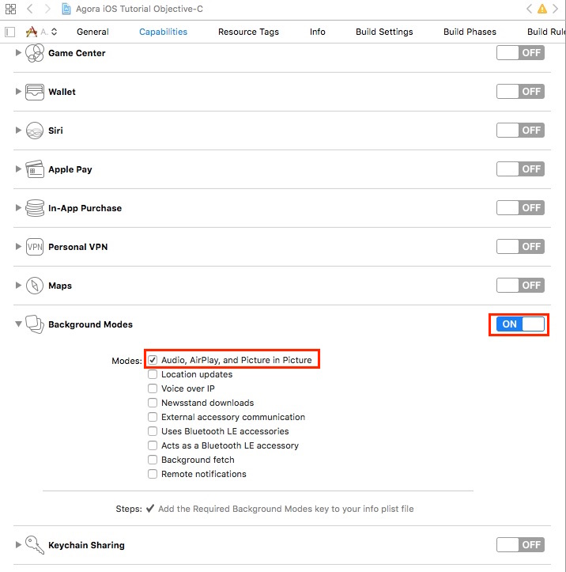
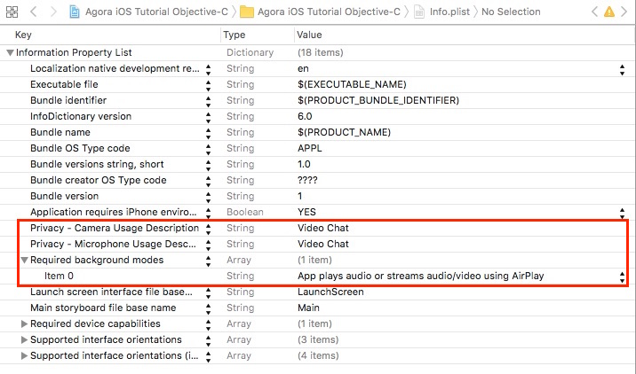
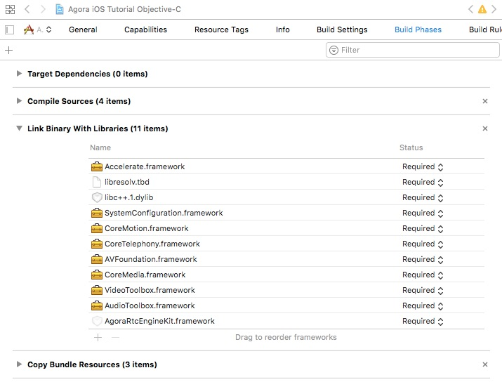
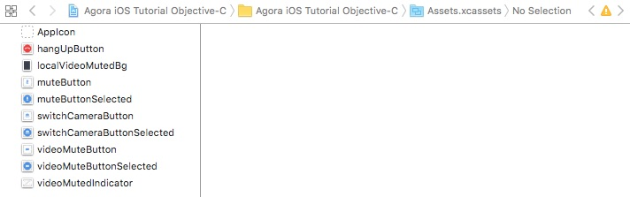
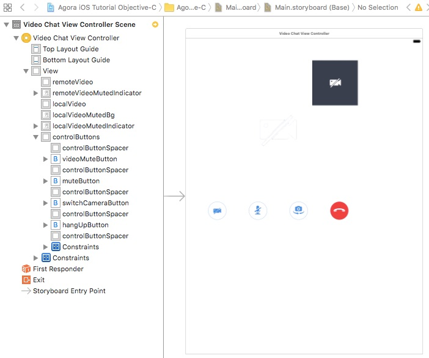

# Agora iOS 1-to-1 Tutorial for Objective-C

This tutorial enables you to quickly get started in your development efforts to create an iOS app using Objective-C and the Agora Video SDK. 

With this sample app you can:

- [Join and leave a channel](#add-join-leave-channel-methods)
- [Mute and unmute audio](#add-event-listeners)
- [Enable and disable video](#add-event-listeners)
- [Switch camera views](#add-event-listeners)

## Prerequisites
- Xcode 8.0+
- Physical iOS device (iPhone or iPad)
	
	**Note:** Use a physical device to run the sample. Some simulators lack the functionality or the performance needed to run the sample.

## Quick Start

This section shows you how to prepare, build, and run the sample application.

- [Create an Account and Obtain an App ID](#create-an-account-and-obtain-an-app-id)
- [Update and Run the Sample Application](#update-and-run-the-sample-application) 


### Create an Account and Obtain an App ID
To build and run the sample application, you must obtain an app ID: 

1. Create a developer account at [agora.io](https://dashboard.agora.io/signin/). Once you finish the sign-up process, you are redirected to the dashboard.
2. Navigate in the dashboard tree on the left to **Projects** > **Project List**.
3. Copy the app ID that you obtained from the dashboard into a text file. You will use this when you launch the app.


### Update and Run the Sample Application 

1. Open `OpenVideoCall.xcodeproj` and edit the `KeyCenter.swift` file. In the `agoraKit` declaration, update `Your App ID` with your app ID.

	``` Swift
	NSString *const appID = @"<#Your App ID#>";
	```

2. Download the [Agora Video SDK](https://www.agora.io/en/download/). Unzip the downloaded SDK package and copy the `libs` folder from the SDK `libs` into the sample application's `Agora-iOS-Tutorial-Objective-C-1to1` folder.
		
3. Connect your iPhone or iPad device and run the project. Ensure a valid provisioning profile is applied or your project will not run.

## Steps to Create the Sample 

- [Set Permissions and Add Frameworks and Libraries](#set-permissions-and-add-frameworks-and-libraries)
- [Design the User Interface](#design-the-user-interface)
- [Create the VideoChatViewController Class](#create-the-videochatviewcontroller-class)


### Set Permissions and Add Frameworks and Libraries

Under the **Capabilities** tab, enable **Audio, AirPlay, and Picture in Picture** mode.



Open the `info.plist` file. Enable the following:

- Camera privacy settings
- Microphone privacy settings
- Airplay audio / video background mode



Under the **Build Phases** tab, add the following frameworks and libraries to your project:

- `Accelerate.framework`
- `libresolv.tbd`
- `libc++.tbd`
- `SystemConfiguration.framework`
- `CoreMotion.framework`
- `CoreTelephony.framework`
- `AVFoundation.framework`
- `CoreMedia.framework`
- `VideoToolbox.framework`
- `AudioToolbox.framework`
- `AgoraRtcEngineKit.framework`



### Design the User Interface

#### Add Assets

Add the following assets to `Assets.xcassets`.

**Note:** Use Xcode to import assets to `Assets.xcassets`. PDF files are used for these assets, which contain images for each iOS screen resolution.



Asset|Description
------|------
`hangUpButton`|An image of a red telephone for the *hang up* button
`localVideoMutedBg`|Black background image
`muteButton` and `muteButtonSelected`|Images of a microphone to mute/unmute audio
`switchCameraButton` and `switchCameraButtonSelected`|An image of a camera and rotational arrows to switch between the two cameras
`videoMuteButton` and `videoMuteButtonSelected`|An image of a camera to start / stop video
`videoMutedIndicator`|An image of a muted camera to indicate the video is off

#### Create the VideoChatViewController UI

Create the layout for the `VideoChatViewController`.



### Create the VideoChatViewController Class

*VideoChatViewController.m* defines and connects application functionality with the [VideoChatViewController UI](#create-the-videochatviewcontroller-ui).

- [Define Global Variables](#define-global-variables)
- [Initialize Application](#initialize-application)
- [Add Agora Engine Methods](#add-agora-engine-methods)
- [Add Video Setup Methods](#add-video-setup-methods)
- [Add Join / Leave Channel Methods](#add-join-leave-channel-methods)
- [Add UI Handler Methods](#add-ui-handler-methods)
- [Add Event Listeners](#add-event-listeners)

#### Define Global Variables

The `VideoChatViewController` class define the global variables within an `@interface` declaration. The `IBOutlet` variables map to the [VideoChatViewController UI](#create-the-videochatviewcontroller-ui) elements.

Variable|Description
----|----
`agoraKit`|`AgoraRtcEngineKit` object for the Agora RTC engine SDK
`localVideo`|`UIView` for the local video
`remoteVideo`|`UIView` for the remote video
`controlButtons`|`UIView` to contain the button controls
`remoteVideoMutedIndicator`|`UIImageView` to indicate if the remote video is muted
`localVideoMutedBg`|`UIImageView` for the local video indicator background
`localVideoMutedIndicator`|`UIImageView` to indicate if the remote video is muted

``` Objective-C
@interface VideoChatViewController ()

@property (strong, nonatomic) AgoraRtcEngineKit *agoraKit;
@property (weak, nonatomic) IBOutlet UIView *localVideo;  
@property (weak, nonatomic) IBOutlet UIView *remoteVideo; 
@property (weak, nonatomic) IBOutlet UIView *controlButtons;
@property (weak, nonatomic) IBOutlet UIImageView *remoteVideoMutedIndicator;
@property (weak, nonatomic) IBOutlet UIImageView *localVideoMutedBg;
@property (weak, nonatomic) IBOutlet UIImageView *localVideoMutedIndicator;

@end
```

#### Initialize Application

Initialize the application using the `viewDidLoad()` method.

1. Initialize the UI layout using the `setupButtons` and `hideVideoMuted` methods
2. Initialize the Agora RTC engine using `initializeAgoraEngine`
3. Setup the video streams using `setupVideo` and `setupLocalVideo`
4. Join the channel using `joinChannel`

``` Objective-C
@implementation VideoChatViewController

- (void)viewDidLoad {
    [super viewDidLoad];
    
    [self setupButtons];            
    [self hideVideoMuted];          
    [self initializeAgoraEngine];   
    [self setupVideo];              
    [self setupLocalVideo];         
    [self joinChannel];             
}

- (void)didReceiveMemoryWarning {
    [super didReceiveMemoryWarning];
    // Dispose of any resources that can be recreated.
}

...

@end
```

#### Add Agora Engine Methods

Initialize the Agora RTC engine using the SDK, by passing `appID` into `sharedEngineWithAppId`.

``` Objective-C
- (void)initializeAgoraEngine {
    self.agoraKit = [AgoraRtcEngineKit sharedEngineWithAppId:appID delegate:self];
}
```

When the engine decodes the first remote video frame from a user, apply the following:

1. If `self.remoteVideo` is `hidden`, display `self.remoteVideo`
2. Initialize a new `AgoraRtcVideoCanvas` object and set the following properties:
	- `uid`: User ID
	- `view`: Where the video will display
	- `renderMode`: How the video will render

3. Pass `videoCanvas` to the SDK using `setupRemoteVideo` to bind the video stream to the UI view
4. If `self.remoteVideo` is `hidden`, display `self.remoteVideo` 


``` Objective-C
- (void)rtcEngine:(AgoraRtcEngineKit *)engine firstRemoteVideoDecodedOfUid:(NSUInteger)uid size: (CGSize)size elapsed:(NSInteger)elapsed {
    if (self.remoteVideo.hidden)
        self.remoteVideo.hidden = false;
    AgoraRtcVideoCanvas *videoCanvas = [[AgoraRtcVideoCanvas alloc] init];
    videoCanvas.uid = uid;
    // Since we are making a simple 1:1 video chat app, for simplicity sake, we are not storing the UIDs. You could use a mechanism such as an array to store the UIDs in a channel.
    
    videoCanvas.view = self.remoteVideo;
    videoCanvas.renderMode = AgoraVideoRenderModeHidden;
    [self.agoraKit setupRemoteVideo:videoCanvas];
    // Bind remote video stream to view
    
    if (self.remoteVideo.hidden)
        self.remoteVideo.hidden = false;
}
```

When a user goes offline, hide `self.remoteVideo` by setting the `hidden` property to `true`.

``` Objective-C
- (void)rtcEngine:(AgoraRtcEngineKit *)engine didOfflineOfUid:(NSUInteger)uid reason:(AgoraUserOfflineReason)reason {
    self.remoteVideo.hidden = true;
}
```

When a user's video is muted / unmuted, hide / unhide `self.remoteVideo` and `self.remoteVideoMutedIndicator` by updating the `hidden` property.

```
- (void)rtcEngine:(AgoraRtcEngineKit *)engine didVideoMuted:(BOOL)muted byUid:(NSUInteger)uid {
    self.remoteVideo.hidden = muted;
    self.remoteVideoMutedIndicator.hidden = !muted;
}
```

#### Add Video Setup Methods

The `setupVideo` method enables video and sets the video encoder configuration for the Agora SDK.

``` Objective-C
- (void)setupVideo {
    [self.agoraKit enableVideo];
    // Default mode is disableVideo
    
    AgoraVideoEncoderConfiguration *encoderConfiguration =
    [[AgoraVideoEncoderConfiguration alloc] initWithSize:AgoraVideoDimension640x360
                                               frameRate:AgoraVideoFrameRateFps15
                                                 bitrate:AgoraVideoBitrateStandard
                                         orientationMode:AgoraVideoOutputOrientationModeAdaptative];
    [self.agoraKit setVideoEncoderConfiguration:encoderConfiguration];
}
```

1. Enable video using `enableVideo`
2. Initialize the `AgoraVideoEncoderConfiguration` object with the following properties:

	Property|Value|Description
---|---|---
`initWithSize`|`AgoraVideoDimension640x360`|Size of the video
`frameRate`|`AgoraVideoFrameRateFps15`|Frame rate for the video
`bitrate`|`AgoraVideoBitrateStandard`|Bit rate for the video
`orientationMode`|`AgoraVideoOutputOrientationModeAdaptative`|Orientation of the video

3. Set the video encoder configuration using `setVideoEncoderConfiguration`


The `setupLocalVideo` method sets the local video for the Agora SDK.

``` Objective-C
- (void)setupLocalVideo {
    AgoraRtcVideoCanvas *videoCanvas = [[AgoraRtcVideoCanvas alloc] init];
    videoCanvas.uid = 0;
    // UID = 0 means we let Agora pick a UID for us
    
    videoCanvas.view = self.localVideo;
    videoCanvas.renderMode = AgoraVideoRenderModeHidden;
    [self.agoraKit setupLocalVideo:videoCanvas];
    // Bind local video stream to view
}
```

1. Initialize an `AgoraRtcVideoCanvas` object
2. Set the following properties for `videoCanvas`:
	- `uid`: User ID
	- `view`: UI view where the video will display
	- `rendermode`: How the video will render
3. Bind the local video stream to the view using `setupLocalVideo`

#### Add Join / Leave Channel Methods

The `joinChannel` method joins the user to the channel using `joinChannelByToken` passing `demoChannel1` as the `channelId` and `0` as the `uid`.

When the channel is joined successfully, enable the speakerphone using `setEnableSpeakerphone` and disable the timer using `idleTimerDisabled`.

``` Objective-C
- (void)joinChannel {
    [self.agoraKit joinChannelByToken:nil channelId:@"demoChannel1" info:nil uid:0 joinSuccess:^(NSString *channel, NSUInteger uid, NSInteger elapsed) {
        // Join channel "demoChannel1"
        [self.agoraKit setEnableSpeakerphone:YES];
        [UIApplication sharedApplication].idleTimerDisabled = YES;
    }];
    // The UID database is maintained by your app to track which users joined which channels. If not assigned (or set to 0), the SDK will allocate one and returns it in joinSuccessBlock callback. The App needs to record and maintain the returned value as the SDK does not maintain it.
}
```

The `hangUpButton` method exits the user from the channel using `leaveChannel`. This method is applied to the hang up button UI created in [Design the User Interface](#design-the-user-interface).

``` Objective-C
- (IBAction)hangUpButton:(UIButton *)sender {
    [self leaveChannel];
}
```

The `leaveChannel` method exits the user from the channel through the Agora SDK using `leaveChannel`. Once the user successfully leaves the channel, apply the following:

1. Hide the control buttons using `hideControlButtons`.
2. Enable the idle timer by setting `idleTimerDisabled` to `NO`.
3. Remove `self.remoteVideo` and `self.localVideo` by using `removeFromSuperview `.
4. Release the Agora SDK by setting `self.agoraKit` to `nil`.

``` Objective-C
- (void)leaveChannel {
    [self.agoraKit leaveChannel:^(AgoraChannelStats *stat) {
        [self hideControlButtons];     
        [UIApplication sharedApplication].idleTimerDisabled = NO;
        [self.remoteVideo removeFromSuperview];
        [self.localVideo removeFromSuperview];
        self.agoraKit = nil;
    }];
}
```

#### Add UI Handler Methods

The `setupButtons` method initializes the UI layout and adds event listeners to the UI objects.

1. Hide the control buttons after a `3` second delay by invoking `hideControlButtons` through `performSelector`.
2. Initialize a `UITapGestureRecognizer` object, which will invoke `remoteVideoTapped`.
3. Apply `tapGestureRecognizer` to `self.view` using `addGestureRecognizer`.
4. Enable user interaction by setting `userInteractionEnabled` to `true`.

``` Objective-C
- (void)setupButtons {
    [self performSelector:@selector(hideControlButtons) withObject:nil afterDelay:3];
    UITapGestureRecognizer *tapGestureRecognizer = [[UITapGestureRecognizer alloc] initWithTarget:self action:@selector(remoteVideoTapped:)];
    [self.view addGestureRecognizer:tapGestureRecognizer];
    self.view.userInteractionEnabled = true;
}
```

The `hideControlButtons` method hides `self.controlButtons` by setting the `hidden` property to `true`.

``` Objective-C
- (void)hideControlButtons {
    self.controlButtons.hidden = true;
}
```

The `remoteVideoTapped` method checks if `self.controlButtons` is hidden.

If it is hidden, show `self.controlButtons` by setting the `hidden` property to `false` and invoke `hideControlButtons` after a `3` second delay using `performSelector`.

``` Objective-C
- (void)remoteVideoTapped:(UITapGestureRecognizer *)recognizer {
    if (self.controlButtons.hidden) {
        self.controlButtons.hidden = false;
        [self performSelector:@selector(hideControlButtons) withObject:nil afterDelay:3];
    }
}
```

The `resetHideButtonsTimer` method clears previous requests on `VideoChatViewController` using `cancelPreviousPerformRequestsWithTarget`.

Invoke `hideControlButtons` after a `3` second delay using `performSelector`.

``` Objective-C
- (void)resetHideButtonsTimer {
    [VideoChatViewController cancelPreviousPerformRequestsWithTarget:self];
    [self performSelector:@selector(hideControlButtons) withObject:nil afterDelay:3];
}
```

#### Add Event Listeners

The `didClickMuteButton` method is applied to the mute button UI created in [Design the User Interface](#design-the-user-interface).

1. Update the button's `selected` state.
2. Mute / unmute the local audio stream using `muteLocalAudioStream`.
3. Reset the timer to hide the buttons using `resetHideButtonsTimer`.

``` Objective-C
- (IBAction)didClickMuteButton:(UIButton *)sender {
    sender.selected = !sender.selected;
    [self.agoraKit muteLocalAudioStream:sender.selected];
    [self resetHideButtonsTimer];
}
```

The `didClickVideoMuteButton` method is applied to the video mute button UI created in [Design the User Interface](#design-the-user-interface).

1. Update the button's `selected` state.
2. Mute / unmute the local audio stream using `muteLocalVideoStream`.
3. Hide / unhide the local video using the `self.localVideo.hidden`.
4. Hide / unhide the local video muted background image using the `self.localVideoMutedBg.hidden`.
5. Hide / unhide the local video muted indicator image using the `self.localVideoMutedIndicator.hidden`.
6. Reset the timer to hide the buttons using `resetHideButtonsTimer`.

``` Objective-C
- (IBAction)didClickVideoMuteButton:(UIButton *)sender {
    sender.selected = !sender.selected;
    [self.agoraKit muteLocalVideoStream:sender.selected];
    self.localVideo.hidden = sender.selected;
    self.localVideoMutedBg.hidden = !sender.selected;
    self.localVideoMutedIndicator.hidden = !sender.selected;
    [self resetHideButtonsTimer];
}
```

The `hideVideoMuted` method hides `self.remoteVideoMutedIndicator`, `self.localVideoMutedBg`, and `self.localVideoMutedIndicator` by setting the `hidden` properties to `true`.

``` Objective-C
- (void) hideVideoMuted {
    self.remoteVideoMutedIndicator.hidden = true;
    self.localVideoMutedBg.hidden = true;
    self.localVideoMutedIndicator.hidden = true;
}
```

The `didClickSwitchCameraButton` method switches the video camera.

1. Update the button's `selected` state
2. Switch the camera using `switchCamera`
3. Reset the timer to hide the buttons using `resetHideButtonsTimer`

``` Objective-C
- (IBAction)didClickSwitchCameraButton:(UIButton *)sender {
    sender.selected = !sender.selected;
    [self.agoraKit switchCamera];
    [self resetHideButtonsTimer];
}
```

## Resources
- Find full API documentation in the [Document Center](https://docs.agora.io/en/)
- File bugs about this demo [here](https://github.com/AgoraIO/Agora-iOS-Tutorial-Objective-C-1to1/issues)


## Learn More
- [1 to 1 Video Tutorial for iOS/Swift](https://github.com/AgoraIO/Agora-iOS-Tutorial-Swift-1to1)
- A more complete demo for iOS (Objective-C) can be found [here](https://github.com/AgoraIO/OpenVideoCall-iOS-Objective-C)
- Agora Video SDK samples are also available for the following platforms:
	- 1 to 1 Video Tutorial for [Android](https://github.com/AgoraIO/Agora-Android-Tutorial-1to1)
	- 1 to 1 Video Tutorial for [Windows](https://github.com/AgoraIO/Agora-Windows-Tutorial-1to1)
	- 1 to 1 Video Tutorial for [MacOS](https://github.com/AgoraIO/Agora-macOS-Tutorial-Objective-C-1to1)

## License
This software is licensed under the MIT License (MIT). [View the license](LICENSE.md).