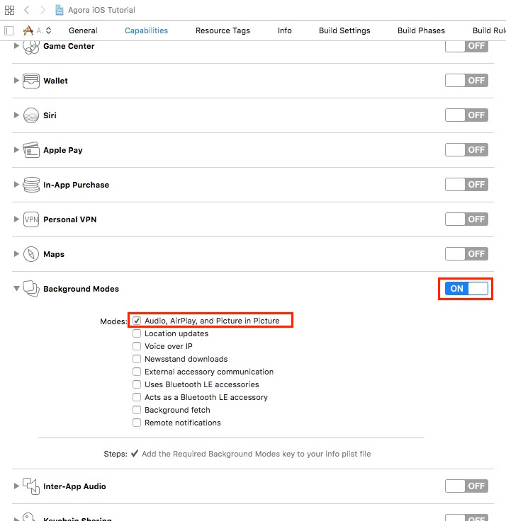
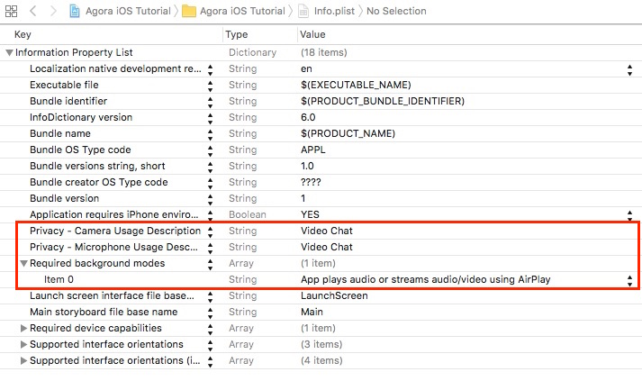
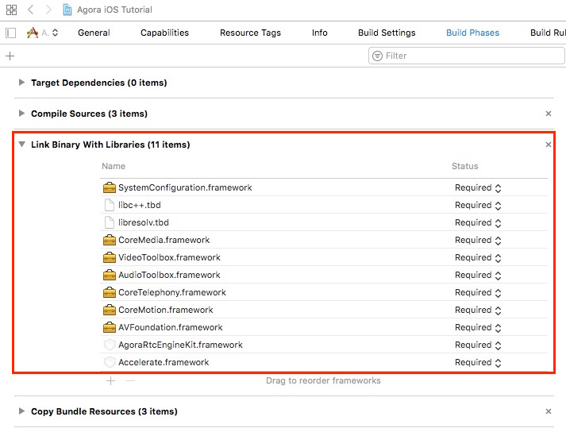
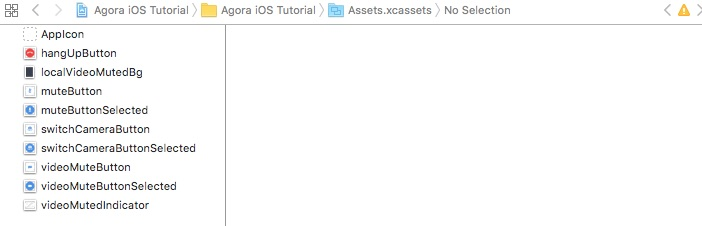
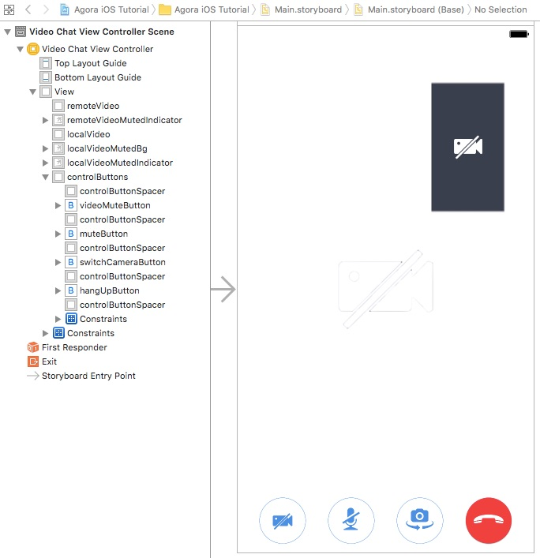

# Agora iOS 1-to-1 Tutorial for Swift

This tutorial enables you to quickly get started in your development efforts to add real-time video calls, voice calls, and interactive broadcasting to an iOS app.

With this sample app you can:

- [Join and leave a channel](#add-join-leave-channel-methods)
- [Mute and unmute audio](#add-ibaction-methods)
- [Start and stop video](#add-ibaction-methods)
- [Enable and disable video](#add-ibaction-methods)
- [Switch camera views](#add-ibaction-methods)


## Prerequisites
- Xcode 8.0+
- Physical iOS device (iPhone or iPad)
	
	**Note:** Use a physical device to run the sample. Some simulators lack the functionality or the performance needed to run the sample.

## Quick Start
This section shows you how to prepare, build, and run the sample application.

- [Create an Account and Obtain an App ID](#create-an-account-and-obtain-an-app-id)
- [Update and Run the Sample Application](#update-and-run-the-sample-application) 

### Create an Account and Obtain an App ID

To build and run the sample application, you must obtain an app ID: 

1. Create a developer account at [agora.io](https://dashboard.agora.io/signin/). Once you finish the sign-up process, you are redirected to the dashboard.
2. Navigate in the dashboard tree on the left to **Projects** > **Project List**.
3. Copy the app ID that you obtained from the dashboard into a text file. You will use this when you launch the app.

### Update and Run the Sample Application 

1. Open `Agora iOS Tutorial.xcodeproj` and edit the `AppID.swift` file. In the `agoraKit` declaration, update `<#Your App ID#>` with your App ID.

	``` Swift
	let AppID: String = <#Your App ID#>                  // Tutorial Step 1
	```

2. Download the [Agora Video SDK](https://www.agora.io/en/download/). Unzip the downloaded SDK package and copy the `libs` folder from the SDK `libs` into the sample application's `Agora iOS Tutorial` folder.
		
3. Connect your iPhone or iPad device and run the project. Ensure a valid provisioning profile is applied or your project will not run.

## Steps to Create the Sample 

This workflow was used to develop the 1-to-1 sample application:

- [Set Permissions and Add Frameworks and Libraries](#set-permissions-and-add-frameworks-and-libraries)
- [Import the Agora SDK](#import-the-agora-sdk)
- [Design the User Interface](#design-the-user-interface)
- [Create the VideoChatViewController Class](#create-the-videochatviewcontroller-class)

### Set Permissions and Add Frameworks and Libraries

Under the **Capabilities** tab, enable **Audio, AirPlay, and Picture in Picture** mode.



Open the `info.plist` file. Enable the following:

- Camera privacy settings
- Microphone privacy settings
- Airplay audio / video background mode



Under the **Build Phases** tab, add the following frameworks and libraries to your project:

- `SystemConfiguration.framework`
- `libresolv.tbd`
- `libc++.tbd`
- `CoreMedia.framework`
- `VideoToolbox.framework`
- `AudioToolbox.framework`
- `CoreTelephony.framework`
- `CoreMotion.framework`
- `AVFoundation.framework`
- `AgoraRtcEngineKit.framework`
- `Accelerate.framework`




### Import the Agora SDK

To integrate the Agora SDK using CocoaPods, initialize the application with a new pod file. In Terminal, navigate to the folder containing `Agora iOS Tutorial.xcodeproj`. Execute the command:

```bash
pod init
```

Open the pod file and add the `AgoraRtcEngine_iOS` pod:

```bash
target 'AgoraVideoQuickstart' do
  use_frameworks!
  pod 'AgoraRtcEngine_iOS'
end
```

In Terminal, install the pod file by executing:

```bash
pod install
```

### Design the User Interface

#### Add Assets

Add the following assets to `Assets.xcassets`.

**Note:** Use Xcode to import assets to `Assets.xcassets`. PDF files are used for these assets, which contain images for each iOS screen resolution.



Asset|Description
------|------
`hangUpButton`|An image of a red telephone for a hang up button
`localVideoMutedBg`|The background image for a video mute button
`muteButton` and `muteButtonSelected`|A picture of a microphone to mute / unmute audio
`switchCameraButton` and `switchCameraButtonSelected`|A picture of a camera with rotational arrows to switch between the two cameras
`videoMuteButton` and `videoMuteButtonSelected`|A picture of a camera to enable / disable video
`videoMuteButtonIndicator`|A picture of a crossed-out camera, to indicate the camera is off

#### Create the VideoChatViewController UI

Create the layout for the `VideoChatViewController`.



Below are the key aspects of the `VideoChatViewController` UI:

Component|Description
---|---
`remoteVideo`|A view for the incoming remote video feed. This is the video the user will see.
`remoteVideoMutedIndicator`|An icon to indicate remote video is enabled / disabled.
`localVideo`|A small view for the local video feed
`localVideoMutedBg`|A gray background image indicating the local video is enabled / disabled.
`localVideoMutedIndicator`|An icon overlay for `localVideoMutedBg`, to indicate local video is disabled.
`controlButtons`|A container for the following four control buttons: **Pause Video**, **Audio Mute**, **Switch Camera**, and **Hang Up**.

### Create the VideoChatViewController Class

The sample app is a *Single View Application*. *VideoChatViewController.swift* defines and connects application functionality with the [VideoChatViewController UI](#create-the-videochatviewcontroller-ui).

- [Define Global Variables](#define-global-variables)
- [Initialize Application](#initialize-application)
- [Add Agora Engine Methods](#add-agora-engine-methods)
- [Add Video Setup Methods](#add-video-setup-methods)
- [Add Join / Leave Channel Methods](#add-join-leave-channel-methods)
- [Add UI Handler Methods](#add-ui-handler-methods)
- [Add Add IBAction Methods](#add-ibaction-methods)

#### Define Global Variables

The `VideoChatViewController` class defines the global `IBOutlet` variables and a global `AgoraRtcEngineKit` variable. The `IBOutlet` variables map to the [VideoChatViewController UI](#create-the-videochatviewcontroller-ui) elements.

Variable|Description
----|----
`localVideo`|`UIView` for the local video
`remoteVideo`|`UIView` for the remote video
`controlButtons`|`UIView` to contain the button controls
`remoteVideoMutedIndicator`|`UIImageView` to indicate if the remote video is muted
`localVideoMutedBg`|`UIImageView` for the local video indicator background
`localVideoMutedIndicator`|`UIImageView` to indicate if the remote video is muted
`agoraKit`|`AgoraRtcEngineKit` object for the Agora RTC engine SDK

``` Swift
import UIKit
import AgoraRtcEngineKit

class VideoChatViewController: UIViewController {
    @IBOutlet weak var localVideo: UIView!
    @IBOutlet weak var remoteVideo: UIView!
    @IBOutlet weak var controlButtons: UIView!
    @IBOutlet weak var remoteVideoMutedIndicator: UIImageView!
    @IBOutlet weak var localVideoMutedBg: UIImageView!
    @IBOutlet weak var localVideoMutedIndicator: UIImageView!

    var agoraKit: AgoraRtcEngineKit!

	...

}
```

#### Initialize Application

Initialize the application using the `viewDidLoad()` method.

1. Initialize the UI layout using the `setupButtons()` and `hideVideoMuted()` methods.
2. Initialize the Agora RTC engine using `initializeAgoraEngine()`.
3. Setup the video streams using `setupVideo()` and `setupLocalVideo()`.
4. Join the channel using `joinChannel()`.

``` Swift
    override func viewDidLoad() {
        super.viewDidLoad()
        // Do any additional setup after loading the view, typically from a nib.
        
        setupButtons() 
        hideVideoMuted()
        initializeAgoraEngine()
        setupVideo()
        setupLocalVideo()
        joinChannel()
    }

    override func didReceiveMemoryWarning() {
        super.didReceiveMemoryWarning()
        // Dispose of any resources that can be recreated.
    }
```

The `hideVideoMuted()` method hides `remoteVideoMutedIndicator`, `localVideoMutedBg`, and `localVideoMutedIndicator` by setting the `isHidden` properties to `true`.

``` Swift
    func hideVideoMuted() {
        remoteVideoMutedIndicator.isHidden = true
        localVideoMutedBg.isHidden = true
        localVideoMutedIndicator.isHidden = true
    }
```

#### Add Agora Engine Methods

THe `initializeAgoraEngine()` method initializes the Agora RTC engine. Pass `appID` into `AgoraRtcEngineKit.sharedEngine()` to initialize the engine using the Agora SDK.

``` Swift
    // Tutorial Step 1
    func initializeAgoraEngine() {
        agoraKit = AgoraRtcEngineKit.sharedEngine(withAppId: AppID, delegate: self)
    }
```

The Agora engine delegate methods are contained within an `AgoraRtcEngineDelegate` extension.

``` Swift
extension VideoChatViewController: AgoraRtcEngineDelegate {
	...
}
```

When the engine decodes the first remote video frame from a user, apply the following:

1. If `remoteVideo` is hidden, display `self.remoteVideo` using `isHidden`.
2. Initialize a new `AgoraRtcVideoCanvas` object and set the following properties:
	- `uid`: User ID. The value of `0` allows Agora to choose a random `uid` for the stream.
	- `view`: Where the video will display. The `remoteVideo` value is the view created in the storyboard
	- `renderMode`: How the video will render. The `adaptive` value ensures the video is resized proportionally to fit the display window.

3. Pass `videoCanvas` to the SDK using `agoraKit.setupRemoteVideo()` to bind the video stream to the UI view.

``` Swift
    func rtcEngine(_ engine: AgoraRtcEngineKit, firstRemoteVideoDecodedOfUid uid:UInt, size:CGSize, elapsed:Int) {
        if (remoteVideo.isHidden) {
            remoteVideo.isHidden = false
        }
        let videoCanvas = AgoraRtcVideoCanvas()
        videoCanvas.uid = uid
        videoCanvas.view = remoteVideo
        videoCanvas.renderMode = .adaptive
        agoraKit.setupRemoteVideo(videoCanvas)
    }
```

When a user goes offline, hide `self.remoteVideo` by setting the `isHidden` property to `true`.

``` Swift
    internal func rtcEngine(_ engine: AgoraRtcEngineKit, didOfflineOfUid uid:UInt, reason:AgoraUserOfflineReason) {
        self.remoteVideo.isHidden = true
    }
```

When a user's video is muted / unmuted, hide / unhide `self.remoteVideo` and `self.remoteVideoMutedIndicator` by updating the `isHidden` property.

``` Swift
    func rtcEngine(_ engine: AgoraRtcEngineKit, didVideoMuted muted:Bool, byUid:UInt) {
        remoteVideo.isHidden = muted
        remoteVideoMutedIndicator.isHidden = !muted
    }
```

#### Add Video Setup Methods

The `setupVideo()` method enables video and sets the video encoder configuration for the Agora SDK.

``` Swift
    func setupVideo() {
        agoraKit.enableVideo()  // Default mode is disableVideo
        agoraKit.setVideoEncoderConfiguration(AgoraVideoEncoderConfiguration(size: AgoraVideoDimension640x360,
                                                                             frameRate: .fps15,
                                                                             bitrate: AgoraVideoBitrateStandard,
                                                                             orientationMode: .adaptative))
    }
```

1. Enable video using `enableVideo()`.
2. Set the video encoding profile using `setVideoEncoderConfiguration()` with a new `AgoraVideoEncoderConfiguration` object with the following properties:

	Property|Value|Description
---|---|---
`size`|`AgoraVideoDimension640x360`|Size of the video
`frameRate`|`.fps15`|Frame rate for the video
`bitrate`|`AgoraVideoBitrateStandard`|Bit rate for the video
`orientationMode`|`.adaptative`|Orientation of the video. Allows the width and height to change when switching from portrait to landscape.

The `setupLocalVideo` method sets the local video for the Agora SDK.

``` Swift
    func setupLocalVideo() {
        let videoCanvas = AgoraRtcVideoCanvas()
        videoCanvas.uid = 0
        videoCanvas.view = localVideo
        videoCanvas.renderMode = .hidden
        agoraKit.setupLocalVideo(videoCanvas)
    }
```

1. Initialize an `AgoraRtcVideoCanvas` object.
2. Set the following properties for `videoCanvas`:
	- `uid`: User ID. A value of `0` allows Agora to chose a random ID for the stream.
	- `view`: UI view where the video will display. The `localVideo` value is the view create in the storyboard.
	- `rendermode`: How the video will render. The `adaptive` value ensures the video is resized proportionally to fit the display window.
3. Bind the local video stream to the view using `setupLocalVideo`.

#### Add Join / Leave Channel Methods

The `joinChannel()` method joins the user to the channel.

**Note:** This configuration takes place prior entering a channel, therefore the end user will initially begin in video mode, not audio mode. 

1. Set the audio to use the speakerphone using `agoraKit.setDefaultAudioRouteToSpeakerphone()`.
2. Use `agoraKit.joinChannel()` passing `demoChannel1` as the `channelId` and `0` as the `uid`.

	**Note:** Using `0` for the `uid` allows Agora to chose a random ID for the channel ID
	
3. When the channel is joined successfully, disable the application's timer by setting `UIApplication.shared.isIdleTimerDisabled` to `true`. This prevents the application from transitioning to idle mode, while the app is running.

**Note**: To allow users to talk to each other, they must be in the same channel and use the same App ID.

``` Swift
    func joinChannel() {
        agoraKit.setDefaultAudioRouteToSpeakerphone(true)
        agoraKit.joinChannel(byToken: nil, channelId: "demoChannel1", info:nil, uid:0) {[weak self] (sid, uid, elapsed) -> Void in
            // Join channel "demoChannel1"
            if let weakSelf = self {
                UIApplication.shared.isIdleTimerDisabled = true
            }
        }
    }    
```

The `didClickHangUpButton()` method exits the user from the channel using `leaveChannel()`. This method is applied to the hang up button UI created in [Design the User Interface](#design-the-user-interface).

``` Swift
    // Tutorial Step 6
    @IBAction func didClickHangUpButton(_ sender: UIButton) {
        leaveChannel()
    }
```

The `leaveChannel()` method exits the user from the channel: 

1. Use the Agora SDK method `agoraKit.leaveChannel()`.
2. Hide the control buttons using `hideControlButtons()`.
3. Enable the idle timer by setting `UIApplication.shared.isIdleTimerDisabled` to `false`.
4. Remove `remoteVideo` and `localVideo` by using `removeFromSuperview()`.

``` Swift
    func leaveChannel() {
        agoraKit.leaveChannel(nil)
        hideControlButtons()   // Tutorial Step 8
        UIApplication.shared.isIdleTimerDisabled = false
        remoteVideo.removeFromSuperview()
        localVideo.removeFromSuperview()
    }
```

#### Add UI Handler Methods

The `setupButtons()` method initializes the UI layout and adds event listeners to the UI objects.

1. Hide the control buttons after an `8` second delay by invoking `hideControlButtons` through `perform()`.
2. Initialize a `UITapGestureRecognizer` object, which will invoke `VideoChatViewController.ViewTapped`.
3. Apply `tapGestureRecognizer` to `view` using `addGestureRecognizer()`.
4. Enable user interaction by setting `view.isUserInteractionEnabled` to `true`.

``` Swift
    func setupButtons() {
        perform(#selector(hideControlButtons), with:nil, afterDelay:8)
        let tapGestureRecognizer = UITapGestureRecognizer(target: self, action: #selector(VideoChatViewController.ViewTapped))
        view.addGestureRecognizer(tapGestureRecognizer)
        view.isUserInteractionEnabled = true
    }
```

The `hideControlButtons()` method hides `controlButtons` by setting the `isHidden` property to `true`.

``` Swift
    @objc func hideControlButtons() {
        controlButtons.isHidden = true
    }
```

The `ViewTapped()` method checks if `controlButtons` is hidden.

If it is hidden, show `controlButtons` by setting the `isHidden` property to `false` and invoke `hideControlButtons` after an `8` second delay using `perform()`.

``` Swift
    @objc func ViewTapped() {
        if (controlButtons.isHidden) {
            controlButtons.isHidden = false;
            perform(#selector(hideControlButtons), with:nil, afterDelay:8)
        }
    }
```

The `resetHideButtonsTimer()` method cancels any view requests and ensures the control buttons are hidden.

1. Clear previous requests on `VideoChatViewController` using `cancelPreviousPerformRequests()`.
2. Invoke `hideControlButtons` after an `8` second delay using `perform()`.


``` Swift
    func resetHideButtonsTimer() {
        VideoChatViewController.cancelPreviousPerformRequests(withTarget: self)
        perform(#selector(hideControlButtons), with:nil, afterDelay:8)
    }
```

#### Add IBAction Methods

The `didClickMuteButton()` method is applied to the mute button UI created in [Design the User Interface](#design-the-user-interface).

1. Update the button's `isSelected` state.
2. Mute / unmute the local audio stream using `muteLocalAudioStream()`.
3. Reset the timer to hide the buttons using `resetHideButtonsTimer()`.

``` Swift
    @IBAction func didClickMuteButton(_ sender: UIButton) {
        sender.isSelected = !sender.isSelected
        agoraKit.muteLocalAudioStream(sender.isSelected)
        resetHideButtonsTimer()
    }
```

The `didClickVideoMuteButton()` method is applied to the video mute button UI created in [Design the User Interface](#design-the-user-interface).

1. Update the button's `isSelected` state.
2. Mute / unmute the local audio stream using `muteLocalVideoStream()`.
3. Hide / unhide the local video using the `localVideo.isHidden`.
4. Hide / unhide the local video muted background image using the `localVideoMutedBg.isHidden`.
5. Hide / unhide the local video muted indicator image using the `localVideoMutedIndicator.isHidden`.
6. Reset the timer to hide the buttons using `resetHideButtonsTimer()`.

``` Swift
    @IBAction func didClickVideoMuteButton(_ sender: UIButton) {
        sender.isSelected = !sender.isSelected
        agoraKit.muteLocalVideoStream(sender.isSelected)
        localVideo.isHidden = sender.isSelected
        localVideoMutedBg.isHidden = !sender.isSelected
        localVideoMutedIndicator.isHidden = !sender.isSelected
        resetHideButtonsTimer()
    }
```

The `didClickSwitchCameraButton()` method switches the video camera.

1. Update the button's `isSelected` state.
2. Switch the camera using `switchCamera()`.
3. Reset the timer to hide the buttons using `resetHideButtonsTimer()`.

``` Swift
    @IBAction func didClickSwitchCameraButton(_ sender: UIButton) {
        sender.isSelected = !sender.isSelected
        agoraKit.switchCamera()
        resetHideButtonsTimer()
    }
}
```

## Resources
- Find full API documentation in the [Document Center](https://docs.agora.io/en/)
- File bugs about this demo [here](https://github.com/AgoraIO/Agora-iOS-Tutorial-Swift-1to1/issues)
- If you have any questions, please feel free to [e-mail Agora support](mailto:support@agora.io).


## Learn More
- [1 to 1 Video Tutorial for iOS/Objective-C](https://github.com/AgoraIO/Agora-iOS-Tutorial-Objective-C-1to1)
- Agora Video SDK samples are also available for the following platforms:
	- 1 to 1 Video Tutorial for [Android](https://github.com/AgoraIO/Agora-Android-Tutorial-1to1)
	- 1 to 1 Video Tutorial for [Windows](https://github.com/AgoraIO/Agora-Windows-Tutorial-1to1)
	- 1 to 1 Video Tutorial for [MacOS](https://github.com/AgoraIO/Agora-macOS-Tutorial-Objective-C-1to1)

## License
This software is licensed under the MIT License (MIT). [View the license](LICENSE.md).