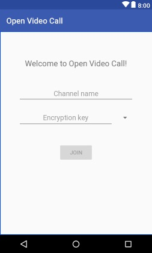
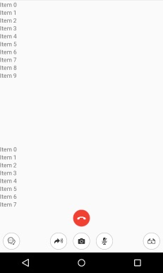
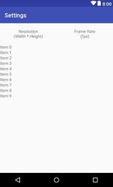

# Open Video Call for Android

This quickstart enables you to quickly get started to add video chat into your Android applications using the Agora Video SDK.

**With this sample app, you can:**

- [Join / leave a channel](#leave-channel-and-end-call)
- [Mute / unmute audio](#mute-unmute-audio)
- [Enable / disable video](#enable-disable-video)
- [Switch camera](#switch-camera-and-audio-routing)
- [Send a message to a channel](#message-functionality)
- [Set up resolution, frame rate, and bit rate display](#user-video-stats-event)
- [Enable encryption](#encryption-mode-chooser)
- [Enable / disable black-and-white filter](#video-pre-processing)

## Prerequisites
- Android Studio 2.0 or above
- Android SDK Platform 25+
- Android SDK Build-Tools 25.0.2+
- Android NDK
- Android device (for example, Nexus 5X)
	
	**Note:** Use a physical device to run the sample. Some simulators lack the functionality or the performance needed to run the sample.

## Quick Start

This section shows you how to prepare, build, and run the sample application.

- [Create an Account and Obtain an App ID](#create-an-account-and-obtain-an-app-id)
- [Integrate the Agora Video SDK](#integrate-the-agora-video-sdk)
- [Download and Build the Sample Application](#obtain-and-build-the-sample-application) 


### Create an Account and Obtain an App ID
To build and run the sample application, first obtain an App ID: 

1. Create a developer account at [agora.io](https://dashboard.agora.io/signin/). Once you finish the signup process, you are redirected to the dashboard.
2. In the dashboard tree on the left, navigate to **Projects** > **Project List**.
3. Locate the file **app/src/main/res/values/strings_config.xml** and replace `<#YOUR APP ID#>` with the App ID from the Agora dashboard.

``` XML
<string name="private_app_id"><#YOUR APP ID#></string>
```


### Integrate the Agora Video SDK

To open and build the sample app, first integrate the SDK into the sample project. There are two methods: The first method uses JCenter to automatically integrate the SDK files, and the second method requires you to manually copy the SDK files to the project.

#### Method 1: Integrate the SDK Automatically Using JCenter (Recommended)

1. Clone this repository.
2. Open **app/build.gradle** and add the following line to the `dependencies` list:

	```
	...
	dependencies {
		...
		compile 'io.agora.rtc:full-sdk:2.2.0'
	}
	```

3. Download the Agora Video SDK from [Agora.io SDK](https://www.agora.io/en/download/).
4. Unzip the downloaded SDK package.
5. Copy the .h files from the **/libs/include** folder of the downloaded SDK package to the **/app/src/main/cpp/agora** folder of the sample application.


#### Method 2: Manually Copy the SDK Files

1. Clone this repository.
2. Download the Agora Video SDK from [Agora.io SDK](https://www.agora.io/en/download/).
3. Unzip the downloaded SDK package.
4. Copy the .jar file from the **libs** folder of the downloaded SDK package to the **/apps/libs** folder of the sample application.
5. Copy the .so files from the **arm64-v8a** folder of the downloaded SDK package to the **/app/src/main/jniLibs/arm64-v8a** folder of the sample application.
6. Copy the .so files from the **armeabi-v7a** folder of the downloaded SDK package to the **/app/src/main/jniLibs/armeabi-v7a** folder of the sample application.
7. Copy the .so files from the **x86** folder of the downloaded SDK package to the **/app/src/main/jniLibs/x86a** folder of the sample application.
8. Copy the .h files from the **include** folder of the downloaded SDK package to the **/app/src/main/cpp/agora** folder of the sample application.
8. Open the **app/build.gradle** file and add the following line to the `dependencies` list:

	```
	...
	dependencies {
		...
		compile fileTree(dir: 'libs', include: ['*.jar'])
	}
	```


### Download and Build the Sample Application 

Ensure USB debugging is enabled on your device under **Settings > Developer options** and connect the device to your computer.

#### Method 1: Using Android Studio (Recommended)

1. Open the sample application in Android Studio.
2. Build and run the sample project. This should display the application on your device.

**Note:** If your application does not compile in Android Studio, you might need to install additional Android SDK support files. Check the **Build Error** window to troubleshoot.

#### Method 2: Using the Command Line

1. In Android Studio, select **View > Tool Windows > Terminal** to open the command line app.

2. Build and run the sample project with the following command, replacing `path/to/your_app` with the app directory path and app name. The application displays on your device.

	``` 
	adb -d install path/to/your_app.apk	
	```

## Steps to Create the Sample 

- [Set Permissions](#set-permissions)
- [Add Activities to Manifest](#add-activities-to-manifest)
- [Create Visual Assets](#create-visual-assets)
- [Design the User Interface](#design-the-user-interface)
- [Create MainActivity Class](#create-mainactivity-class)
- [Create ChatActivity Class](#create-chatactivity-class)
- [Create SettingsActivity Class](#create-settingsactivity-class)

### Set Permissions
The `AndroidManifest.xml` file applies a set of `uses-permissions` settings:

```xml
<manifest xmlns:android="http://schemas.android.com/apk/res/android" package="io.agora.openvcall">

    <uses-permission android:name="android.permission.INTERNET" />
    <uses-permission android:name="android.permission.RECORD_AUDIO" />
    <uses-permission android:name="android.permission.CAMERA" />
    <uses-permission android:name="android.permission.MODIFY_AUDIO_SETTINGS" />
    <uses-permission android:name="android.permission.ACCESS_NETWORK_STATE" />
    <uses-permission android:name="android.permission.WRITE_EXTERNAL_STORAGE" />
    <uses-permission android:name="android.permission.BLUETOOTH" />

...

</manifest>
```

These settings allow the app to access the following Android features:

Permission name|Permission description
----|----
`android.permission.INTERNET`|The internet 
`android.permission.RECORD_AUDIO`|Audio recording
`android.permission.CAMERA `|Camera
`android.permission.MODIFY_AUDIO_SETTINGS`|Modification of audio settings
`android.permission.ACCESS_NETWORK_STATE `|Network state
`android.permission.WRITE_EXTERNAL_STORAGE `|External storage
`android.permission.BLUETOOTH `|Bluetooth

### Add Activities to Manifest

The sample app has three activities `MainActivity`, `ChatActivity`, and `SettingsActivity`. Add the three activity settings to the `AndroidManifest.xml` file under the `application` node:

``` XML
<manifest xmlns:android="http://schemas.android.com/apk/res/android" package="io.agora.openvcall">

	...

    <application
        android:name=".AGApplication"
        android:allowBackup="true"
        android:icon="@drawable/ic_launcher"
        android:label="@string/app_name"
        android:theme="@style/AppTheme">
        
        <activity
            android:name=".ui.MainActivity"
            android:label="@string/app_name"
            android:configChanges="orientation|keyboardHidden|screenSize">
            <intent-filter>
                <action android:name="android.intent.action.MAIN" />
                <category android:name="android.intent.category.LAUNCHER" />
            </intent-filter>
        </activity>
        
        <activity
            android:name=".ui.ChatActivity"
            android:configChanges="orientation|keyboardHidden|screenSize"
            android:parentActivityName=".ui.MainActivity"
            android:theme="@style/FullscreenTheme" />
            
        <activity
            android:name=".ui.SettingsActivity"
            android:configChanges="orientation|keyboardHidden|screenSize"
            android:label="@string/label_settings" />
            
    </application>

</manifest>
```

### Create Visual Assets

Add the icon assets for the user interface to the `/res/drawable-xxxhdpi` folder:

|Asset                   |Description                                                                                        |
|------------------------|---------------------------------------------------------------------------------------------------|
|`btn_confirm_white.png`|An image of a white checkbox for confirmation|
|`btn_end_call.png`|An image of a red telephone for the *hang up* button|
|`btn_filter.png`|An image of glasses for filtering|
|`btn_keyboard_hide.png`|An image of a down arrow for uses to hide the visual keyboard|
|`btn_message.png`|An image of chat bubbles to initiate a call|
|`btn_mute.png` and `icon_muted.png`|An image of a microphone to mute/unmute audio|
|`btn_speaker.png` and `icon_speaker.png`|An image of a speaker to turn audio on/off
|`btn_switch_camera.png`|An image of a camera and rotational arrows to switch between the two cameras|
|`btn_video.png`|An image of a camera to start video|
|`btn_voice.png`|An image of an arrow indicating that audio chat is enabled|
|`ic_settings_white_24dp.png`|An image of a cog to open the settings window|
|`icon_default_avatar.png`|An image of a human silhouette to use as a placeholder for the user image|
|`ic_launcher.png`|A desktop icon for users to invoke the sample application|


### Design the User Interface

- [Create MainActivity UI](#create-mainactivity-ui)
- [Create ChatActivity UI](#create-chatactivity-ui)
- [Create SettingsActivity UI](#create-settingsactivity-ui)

#### Create MainActivity UI

`MainActivity` and its layout are defined in */layout/activity_main.xml*. 

The main aspects of this layout are shown here:



Component|Description
-----|-----
`channel_name`|A text box for the channel name
`encryption_key`|A text box for the encryption key of the channel
`encryption_mode`|A selector to choose the type of encryption
`button_join`|A button to begin the channel join process

#### Create ChatActivity UI

`ChatActivity` and its layout are defined in */layout/activity_chat.xml*. 

The main aspects of this layout are shown here:



Component|Description
-----|-----
`small_video_view_dock`|Displays a small version of the video
`channel_name`|A text area for the channel name
`bottom_action_end_call`|Used to hang up the call
ImageView (unnamed using the `btn_message` image|Used to open the messages window
ImageView (unnamed using the `btn_voice` image|Used to start a voice chat
`customized_function_id`|Used to switch between device cameras
ImageView (unnamed using the `btn_mute` image|Used to mute/unmute the audio
ImageView (unnamed using the `btn_filter` image|Used to filter the call
ImageView (unnamed using the `btn_keyboard_hide` image|Used to hide the virtual keyboard
`msg_content`|Text box to enter text for the message
`msg_list`|Container to display the chat conversation

#### Create SettingsActivity UI

`SettingsActivity ` and its layout are defined in */layout/activity_settings.xml*. 

The main aspects of this layout are shown here:



Component|Description
-----|-----
TextView (unnamed using the `label_title_resolution` string|Header title for resolution
TextView (unnamed using the `label_title_frame_rate` string|Header title for frame rate
`profiles`|List of video profiles (with resolution and frame rate)
 
### Create MainActivity Class

*MainActivity.java* defines and connects application functionality with the [main activity UI](#mainactivity).

- [Add Import Statements](#add-import-statements)
- [Initialize the Layout](#initialize-the-layout)
- [Define the Channel Name Text Box](#channel-name-text-box)
- [Define the Encryption Mode Chooser](#encryption-mode-chooser)
- [Populate the Options Menu](#options-menu)
- [Define the Join Button Actions](#join-button)
- [Define the Settings Button Action](#settings-button)

#### Add Import Statements

The `R` import defines the interface for the app. The `ConstantApp` import defines Agora API video profiles and settings.

``` Java
import io.agora.openvcall.R;
import io.agora.openvcall.model.ConstantApp;

```

<div style="text-align: right"><a href="#create-mainactivity-class">Back to top of section</a></div>

#### Initialize the Layout

Initialize the UI with the `activity_main` layout using the `setContentView()` method:

``` Java
    @Override
    protected void onCreate(Bundle savedInstanceState) {
        super.onCreate(savedInstanceState);
        setContentView(R.layout.activity_main);
    }
``` 

The `initUIandEvent()` method defines the UI elements and associated event listeners:

``` Java
    @Override
    protected void initUIandEvent() {
        ...
    }
```        

<div style="text-align: right"><a href="#create-mainactivity-class">Back to top of section</a></div>

#### Define the Channel Name Text Box

Define the channel text box, where users will specify the channel, as `v_channel` and add the `beforeTextChanged ` and `onTextChanged ` event listeners using the `v_channel.addTextChangedListener()` method:
``` Java
        EditText v_channel = (EditText) findViewById(R.id.channel_name);
        v_channel.addTextChangedListener(new TextWatcher() {
            @Override
            public void beforeTextChanged(CharSequence s, int start, int count, int after) {

            }

            @Override
            public void onTextChanged(CharSequence s, int start, int before, int count) {

            }

            @Override
            public void afterTextChanged(Editable s) {
                boolean isEmpty = TextUtils.isEmpty(s.toString());
                findViewById(R.id.button_join).setEnabled(!isEmpty);
            }
        });
```    

<div style="text-align: right"><a href="#create-mainactivity-class">Back to top of section</a></div>

#### Define the Encryption Mode Chooser

Define the encryption mode chooser, where users select the encryption mode, as a `Spinner` object, applying the encryption mode value `adapter`: 

``` Java
        Spinner encryptionSpinner = (Spinner) findViewById(R.id.encryption_mode);
        ArrayAdapter<CharSequence> adapter = ArrayAdapter.createFromResource(this,
                R.array.encryption_mode_values, android.R.layout.simple_spinner_item);
        adapter.setDropDownViewResource(android.R.layout.simple_spinner_dropdown_item);
        encryptionSpinner.setAdapter(adapter);
```

Add the `onItemSelected` event listener using the `encryptionSpinner.setOnItemSelectedListener()` method. The sample app also includes the optional `onNothingSelected` event listener, which can be used to prompt the user to make a selection.

``` Java
        encryptionSpinner.setOnItemSelectedListener(new AdapterView.OnItemSelectedListener() {
            @Override
            public void onItemSelected(AdapterView<?> parent, View view, int position, long id) {
                vSettings().mEncryptionModeIndex = position;
            }

            @Override
            public void onNothingSelected(AdapterView<?> parent) {

            }
        });
        
``` 

The `encryptionSpinner.setSelection()` method uses the selected encryption mode `vSettings().mEncryptionModeIndex` to set the name and selection of the channel `v_channel` and the encryption key `v_encryption_key`.

``` Java
encryptionSpinner.setSelection(vSettings().mEncryptionModeIndex);

        String lastChannelName = vSettings().mChannelName;
        if (!TextUtils.isEmpty(lastChannelName)) {
            v_channel.setText(lastChannelName);
            v_channel.setSelection(lastChannelName.length());
        }

        EditText v_encryption_key = (EditText) findViewById(R.id.encryption_key);
        String lastEncryptionKey = vSettings().mEncryptionKey;
        if (!TextUtils.isEmpty(lastEncryptionKey)) {
            v_encryption_key.setText(lastEncryptionKey);
        }
    }
```    

<div style="text-align: right"><a href="#create-mainactivity-class">Back to top of section</a></div>

#### Populate the Options Menu

When the options menu is created in the `onCreateOptionsMenu()` method, use `inflater.inflate()` to display the menu: 

``` Java
    @Override
    public boolean onCreateOptionsMenu(final Menu menu) {
        MenuInflater inflater = getMenuInflater();
        inflater.inflate(R.menu.menu_main, menu);
        return true;
    }
```

When a menu option is selected in the `onOptionsItemSelected()` method:

- Open the settings menu if the settings menu option `action_settings` is selected.
- Or apply the default selection functionality for that item using `super.onOptionsItemSelected()`.

``` Java
    @Override
    public boolean onOptionsItemSelected(MenuItem item) {
        // Handle presses on the action bar items
        switch (item.getItemId()) {
            case R.id.action_settings:
                forwardToSettings();
                return true;
            default:
                return super.onOptionsItemSelected(item);
        }
    }
```    

<div style="text-align: right"><a href="#create-mainactivity-class">Back to top of section</a></div>

#### Define the Join Button Actions

When a user clicks the **Join** button, `onClickJoin()` is invoked. This forwards the user to the channel room, populating:

- The channel name using `vSettings().mChannelName`
- The encryption key using `vSettings().mEncryptionKey`

``` Java
    public void onClickJoin(View view) {
        forwardToRoom();
    }

    public void forwardToRoom() {
        EditText v_channel = (EditText) findViewById(R.id.channel_name);
        String channel = v_channel.getText().toString();
        vSettings().mChannelName = channel;

        EditText v_encryption_key = (EditText) findViewById(R.id.encryption_key);
        String encryption = v_encryption_key.getText().toString();
        vSettings().mEncryptionKey = encryption;

```

The `onClickJoin()` method then starts the chat activity `i`, applying:

- The channel name `channel`
- The encryption key `encryption`
- The encryption mode selection `vSettings().mEncryptionModeIndex`

``` Java
        Intent i = new Intent(MainActivity.this, ChatActivity.class);
        i.putExtra(ConstantApp.ACTION_KEY_CHANNEL_NAME, channel);
        i.putExtra(ConstantApp.ACTION_KEY_ENCRYPTION_KEY, encryption);
        i.putExtra(ConstantApp.ACTION_KEY_ENCRYPTION_MODE, getResources().getStringArray(R.array.encryption_mode_values)[vSettings().mEncryptionModeIndex]);

        startActivity(i);
```    

<div style="text-align: right"><a href="#create-mainactivity-class">Back to top of section</a></div>

#### Define the Settings Button Action

The `forwardToSettings()` method is applied to the **Settings** button and begins the settings intent `i`: 

``` Java
    public void forwardToSettings() {
        Intent i = new Intent(this, SettingsActivity.class);
        startActivity(i);
    }
```

<div style="text-align: right"><a href="#create-mainactivity-class">Back to top of section</a></div>

 
### Create ChatActivity Class

*ChatActivity.java* defines and connects application functionality with the [chat activity UI](#chatactivity).

- [Set Up Imports, Variables, Layout](#set-up-imports,-variables,-layout)
- [Add Event Listeners](#add-event-listeners)
- [Set Up Local Video View and Channel Settings](#set-up-local-video-view-and-channel-settings)
- [Message Functionality](#message-functionality)
- [Audio and Video Functionality](#audio-and-video-functionality)
- [UI and Layout Functionality](#ui-and-layout-functionality) 
- [Main Handlers and Callbacks](#main-handlers-and-callbacks)
- [Handle Extra Callbacks](#handle-extra-callbacks)


#### Set Up Imports, Variables, Layout

- [Add Import Statements](#add-import-statements)
- [Define Global Variables](#define-global-variables)
- [Initialize the Layout](#initialize-the-layout)

##### Add Import Statements

`ChatActivity` requires multiple Agora imports.

The `io.agora.openvcall.*` imports define the interface elements and Agora model classes for the app: 

``` Java
import io.agora.openvcall.R;
import io.agora.openvcall.model.AGEventHandler;
import io.agora.openvcall.model.ConstantApp;
import io.agora.openvcall.model.Message;
import io.agora.openvcall.model.User;
```

The `io.agora.propeller.*` imports define the Agora constants and access to Agora data processing:

``` Java
import io.agora.propeller.Constant;
import io.agora.propeller.UserStatusData;
import io.agora.propeller.VideoInfoData;
import io.agora.propeller.preprocessing.VideoPreProcessing;
import io.agora.propeller.ui.RtlLinearLayoutManager;
```

The `io.agora.rtc.*` import provides access to the Agora RTC engines and video canvas:

``` Java
import io.agora.rtc.IRtcEngineEventHandler;
import io.agora.rtc.RtcEngine;
import io.agora.rtc.video.VideoCanvas;
```

<div style="text-align: right"><a href="#create-chatactivity-class">Back to top of section</a></div>

##### Define Global Variables

Define the global variables at the beginning of the class:


``` Java
    public static final int LAYOUT_TYPE_DEFAULT = 0;
    public static final int LAYOUT_TYPE_SMALL = 1;
    private final static Logger log = LoggerFactory.getLogger(ChatActivity.class);
    // should only be modified under UI thread
    private final HashMap<Integer, SurfaceView> mUidsList = new HashMap<>(); // uid = 0 || uid == EngineConfig.mUid
    public int mLayoutType = LAYOUT_TYPE_DEFAULT;
    private GridVideoViewContainer mGridVideoViewContainer;
    private RelativeLayout mSmallVideoViewDock;
    private volatile boolean mVideoMuted = false;
    private volatile boolean mAudioMuted = false;
    private volatile int mAudioRouting = -1; // Default
    private boolean mIsLandscape = false;
    private InChannelMessageListAdapter mMsgAdapter;
    private ArrayList<Message> mMsgList;
    private int mDataStreamId;
    private VideoPreProcessing mVideoPreProcessing;
    private SmallVideoViewAdapter mSmallVideoViewAdapter;
```

Variable name(s)|Description
----|----
`LAYOUT_TYPE_DEFAULT` and `LAYOUT_TYPE_SMALL `|The available layout types for the app
`log`|Used for logging and debugging
`mUidsList`|Manages list of users
`mLayoutType`|The current layout type
`mGridVideoViewContainer`|Container for the video views
`mSmallVideoViewDock`|Container for the small video view
`mVideoMuted`|The current video mute state
`mAudioMuted`|The current audio mute state
`mAudioRouting`|The current audio route
`mIsLandscape`|The current orientation of the device
`InChannelMessageListAdapter`|Container for the channel messages
`mMsgList`|The list of message data
`mDataStreamId`|The channel stream ID
`mVideoPreProcessing`|The video preprocessor
`mSmallVideoViewAdapter`|The adapter for the small video view

<div style="text-align: right"><a href="#create-chatactivity-class">Back to top of section</a></div>

##### Initialize the Layout

Initialize the UI with the `activity_chat` layout using the `setContentView()` method:

``` Java
    @Override
    protected void onCreate(Bundle savedInstanceState) {
        super.onCreate(savedInstanceState);
        setContentView(R.layout.activity_chat);
    }
``` 

#### Add Event Listeners

- [Add Global Event Listener and Set Engine Configuration](#add-global-event-listener-and-set-engine-configuration)
- [Grid Video View Event Listener](#grid-video-view-event-listener)


The `initUIandEvent()` method defines the UI elements and associated event listeners:

``` Java
    @Override
    protected void initUIandEvent() {
        ...
    }
```        

##### Add Global Event Listener and Set Engine Configuration

Add an event listener for the chat activity using `event().addEventHandler`: 

``` Java
        event().addEventHandler(this);
```

Using the the intent `i`, define:

- The channel name `channelName`
- Encryption key `encryptionKey`
- Encryption mode `encryptionMode`

``` Java
        Intent i = getIntent();

        String channelName = i.getStringExtra(ConstantApp.ACTION_KEY_CHANNEL_NAME);

        final String encryptionKey = getIntent().getStringExtra(ConstantApp.ACTION_KEY_ENCRYPTION_KEY);
        final String encryptionMode = getIntent().getStringExtra(ConstantApp.ACTION_KEY_ENCRYPTION_MODE);
```

Add the encryption key and encryption mode to the configuration of the Agora engine using `doConfigEngine()`:

``` Java
        doConfigEngine(encryptionKey, encryptionMode);

```

<div style="text-align: right"><a href="#create-chatactivity-class">Back to top of section</a></div>

##### Grid Video View Event Listener

Add an `onItemDoubleClick` listener to each item in the grid video view container `mGridVideoViewContainer`. This switches the video layout view to the small video view `switchToSmallVideoView()` or the default video view `switchToDefaultVideoView()`.

``` Java
        mGridVideoViewContainer = (GridVideoViewContainer) findViewById(R.id.grid_video_view_container);
        mGridVideoViewContainer.setItemEventHandler(new VideoViewEventListener() {
            @Override
            public void onItemDoubleClick(View v, Object item) {
                log.debug("onItemDoubleClick " + v + " " + item + " " + mLayoutType);

                if (mUidsList.size() < 2) {
                    return;
                }

                UserStatusData user = (UserStatusData) item;
                int uid = (user.mUid == 0) ? config().mUid : user.mUid;

                if (mLayoutType == LAYOUT_TYPE_DEFAULT && mUidsList.size() != 1) {
                    switchToSmallVideoView(uid);
                } else {
                    switchToDefaultVideoView();
                }
            }
        });
```

<div style="text-align: right"><a href="#create-chatactivity-class">Back to top of section</a></div>

#### Set Up Local Video View and Channel Settings

- [Set Up Local Video View](#set-up-local-video-view)
- [Set Channel Name Layout Flags and Parameters](#set-channel-name-layout-flags-and-parameters)

##### Set Up Local Video View

Set the local video view `surfaceV` using the `setupLocalVideo()` method, and initialize the grid video view container using `mGridVideoViewContainer.initViewContainer()` with the user list `mUidsList`:

``` Java
        SurfaceView surfaceV = RtcEngine.CreateRendererView(getApplicationContext());
        rtcEngine().setupLocalVideo(new VideoCanvas(surfaceV, VideoCanvas.RENDER_MODE_HIDDEN, 0));
        surfaceV.setZOrderOnTop(false);
        surfaceV.setZOrderMediaOverlay(false);

        mUidsList.put(0, surfaceV); // get first surface view

        mGridVideoViewContainer.initViewContainer(this, 0, mUidsList, mIsLandscape); // first is now full view
```

Apply `surfaceV` to the preview using `worker().preview()` and join the channel using `worker().joinChannel()`:

``` Java
        worker().preview(true, surfaceV, 0);

        worker().joinChannel(channelName, config().mUid);
```

<div style="text-align: right"><a href="#create-chatactivity-class">Back to top of section</a></div>

##### Set Channel Name Layout Flags and Parameters

Set the channel name `channelName` using `textChannelName.setText()` and set the layout flags and audio stream using `optional()`. Read more about the `optional()` method for this activity [here](#set-layout-flags-and-audio-stream).

``` Java
        TextView textChannelName = (TextView) findViewById(R.id.channel_name);
        textChannelName.setText(channelName);

        optional();
```

At the end of the `initUIandEvent()` method, set the layout parameters of the bottom container `bottomContainer` and initialize the message list using `initMessageList()`. Read more about the `initMessageList()` method for this activity [here](#initialize-the-message-list).

``` Java
        LinearLayout bottomContainer = (LinearLayout) findViewById(R.id.bottom_container);
        FrameLayout.MarginLayoutParams fmp = (FrameLayout.MarginLayoutParams) bottomContainer.getLayoutParams();
        fmp.bottomMargin = virtualKeyHeight() + 16;

        initMessageList();

```

<div style="text-align: right"><a href="#create-chatactivity-class">Back to top of section</a></div>

#### Message Functionality

- [Hide the Message View](#hide-the-message-view)
- [Initialize the Message List](#initialize-the-message-list)
- [Message Change Handler](#message-change-handler)
- [Send Channel Message](#send-channel-message)
- [Display the Edit Message Container](#display-the-edit-message-container)

##### Hide the Message View

The `onClickHideIME()` method hides the view using the `closeIME()` method. It also updates the action button visibility using `setVisibility()`.

``` Java

    public void onClickHideIME(View view) {
        log.debug("onClickHideIME " + view);

        closeIME(findViewById(R.id.msg_content));

        findViewById(R.id.msg_input_container).setVisibility(View.GONE);
        findViewById(R.id.bottom_action_end_call).setVisibility(View.VISIBLE);
        findViewById(R.id.bottom_action_container).setVisibility(View.VISIBLE);
    }

```

<div style="text-align: right"><a href="#create-chatactivity-class">Back to top of section</a></div>

##### Initialize the Message List

Initialize the message list view with the message adapter `mMsgAdapter` and vertical layout `RecyclerView.VERTICAL`. The message list adapter `mMsgAdapter` is initialized with an empty message list array `mMsgList`.

``` Java

    private void initMessageList() {
        mMsgList = new ArrayList<>();
        RecyclerView msgListView = (RecyclerView) findViewById(R.id.msg_list);

        mMsgAdapter = new InChannelMessageListAdapter(this, mMsgList);
        mMsgAdapter.setHasStableIds(true);
        msgListView.setAdapter(mMsgAdapter);
        msgListView.setLayoutManager(new LinearLayoutManager(getApplicationContext(), RecyclerView.VERTICAL, false));
        msgListView.addItemDecoration(new MessageListDecoration());
    }
```

<div style="text-align: right"><a href="#create-chatactivity-class">Back to top of section</a></div>

##### Message Change Handler

When a message is added, the `notifyMessageChanged()` method is invoked. The new message `msg` is added to the message list using `mMsgList.add()`. If the list has more than 16 messages, the first message in the list is removed using `mMsgList.remove()`.

The `notifyMessageChanged()` method completes by notifying the message adapter that the data has changed using `mMsgAdapter.notifyDataSetChanged()`.

``` Java
    private void notifyMessageChanged(Message msg) {
        mMsgList.add(msg);

        int MAX_MESSAGE_COUNT = 16;

        if (mMsgList.size() > MAX_MESSAGE_COUNT) {
            int toRemove = mMsgList.size() - MAX_MESSAGE_COUNT;
            for (int i = 0; i < toRemove; i++) {
                mMsgList.remove(i);
            }
        }

        mMsgAdapter.notifyDataSetChanged();
    }
```

<div style="text-align: right"><a href="#create-chatactivity-class">Back to top of section</a></div>

##### Send Channel Message

The `sendChannelMsg()` method passes the encoded message `encodedMsg` into the Agora SDK engine `rtcEngine` using `rtcEngine.sendStreamMessage()`. 

Before sending the message to the SDK, ensure the stream has been created. To create the stream, call the `rtcEngine.createDataStream()` method. If the stream creation fails, add the error message to the log using `log.warn()` and `showLongToast()`.

``` Java
    private void sendChannelMsg(String msgStr) {
        RtcEngine rtcEngine = rtcEngine();
        if (mDataStreamId <= 0) {
            mDataStreamId = rtcEngine.createDataStream(true, true); // boolean reliable, boolean ordered
        }

        if (mDataStreamId < 0) {
            String errorMsg = "Create data stream error happened " + mDataStreamId;
            log.warn(errorMsg);
            showLongToast(errorMsg);
            return;
        }

        byte[] encodedMsg;
        try {
            encodedMsg = msgStr.getBytes("UTF-8");
        } catch (UnsupportedEncodingException e) {
            encodedMsg = msgStr.getBytes();
        }

        rtcEngine.sendStreamMessage(mDataStreamId, encodedMsg);
    }
```

<div style="text-align: right"><a href="#create-chatactivity-class">Back to top of section</a></div>


##### Display the Edit Message Container

The `onBtn0Clicked` method invokes the `showMessageEditContainer()` method, which opens the message editor window using `openIME()` and adds an event listener using `edit.setOnEditorActionListener()`. The event listener checks for the send message action `EditorInfo.IME_ACTION_SEND`.

If a send message action is received, check if the message is empty using `TextUtils.isEmpty()`. If the message is valid:

- Send the message using `sendChannelMsg()`.
- Clear the current text input box using `v.setText()`.
- Trigger the message changed event `notifyMessageChanged`.

``` Java
    public void onBtn0Clicked(View view) {
        log.info("onBtn0Clicked " + view + " " + mVideoMuted + " " + mAudioMuted);
        showMessageEditContainer();
    }

    private void showMessageEditContainer() {
        findViewById(R.id.bottom_action_container).setVisibility(View.GONE);
        findViewById(R.id.bottom_action_end_call).setVisibility(View.GONE);
        findViewById(R.id.msg_input_container).setVisibility(View.VISIBLE);

        EditText edit = (EditText) findViewById(R.id.msg_content);

        edit.setOnEditorActionListener(new TextView.OnEditorActionListener() {
            @Override
            public boolean onEditorAction(TextView v, int actionId, KeyEvent event) {
                if (actionId == EditorInfo.IME_ACTION_SEND
                        || (event != null && event.getAction() == KeyEvent.ACTION_DOWN && event.getKeyCode() == KeyEvent.KEYCODE_ENTER)) {
                    String msgStr = v.getText().toString();
                    if (TextUtils.isEmpty(msgStr)) {
                        return false;
                    }
                    sendChannelMsg(msgStr);

                    v.setText("");

                    Message msg = new Message(Message.MSG_TYPE_TEXT,
                            new User(config().mUid, String.valueOf(config().mUid)), msgStr);
                    notifyMessageChanged(msg);

                    return true;
                }
                return false;
            }
        });

        openIME(edit);
    }
```

<div style="text-align: right"><a href="#create-chatactivity-class">Back to top of section</a></div>

#### Audio and Video Functionality

- [Set Layout Flags and Audio Stream](#set-layout-flags-and-audio-stream)
- [Return the Video Profile Index](#return-the-video-profile-index)
- [Configure the Agora Engine](#configure-the-agora-engine)
- [Switch Camera and Audio Routing](#switch-camera-and-audio-routing)
- [Leave Channel and End Call](#leave-channel-and-end-call)
- [Video Preprocessing](#video-pre-processing)
- [Enable / Disable Video](#enable-disable-video)
- [Mute / Unmute Audio](#mute-unmute-audio)
- [Render Remote Video UI](#render-remote-video-ui)
- [Request Remote Stream Type](#request-remote-stream-type)

##### Set Layout Flags and Audio Stream

The `optional()` method adds layout flags to the windows using `getWindow().addFlags()` and sets the stream's volume control using `setVolumeControlStream()`:

``` Java
    private void optional() {
        getWindow().addFlags(WindowManager.LayoutParams.FLAG_LAYOUT_IN_SCREEN);
        getWindow().addFlags(WindowManager.LayoutParams.FLAG_LAYOUT_NO_LIMITS);

        setVolumeControlStream(AudioManager.STREAM_VOICE_CALL);
    }
```

<div style="text-align: right"><a href="#create-chatactivity-class">Back to top of section</a></div>

##### Return the Video Profile Index

The `getVideoProfileIndex()` method  returns the profile index `profileIndex` from the preference manager `ConstantApp.PrefManager`.

If the profile index an available video profile provided by the Agora SDK `ConstantApp.VIDEO_PROFILES`, `profileIndex` is set to the default profile index `ConstantApp.DEFAULT_PROFILE_IDX`, and the new value is saved to the preferences using `editor.putInt()`.

``` Java
    private int getVideoProfileIndex() {
        SharedPreferences pref = PreferenceManager.getDefaultSharedPreferences(getApplicationContext());
        int profileIndex = pref.getInt(ConstantApp.PrefManager.PREF_PROPERTY_PROFILE_IDX, ConstantApp.DEFAULT_PROFILE_IDX);
        if (profileIndex > ConstantApp.VIDEO_PROFILES.length - 1) {
            profileIndex = ConstantApp.DEFAULT_PROFILE_IDX;

            // save the new value
            SharedPreferences.Editor editor = pref.edit();
            editor.putInt(ConstantApp.PrefManager.PREF_PROPERTY_PROFILE_IDX, profileIndex);
            editor.apply();
        }
        return profileIndex;
    }
```

<div style="text-align: right"><a href="#create-chatactivity-class">Back to top of section</a></div>

##### Configure the Agora Engine

The `doConfigEngine()` method adds the current video profile `vProfile`, encryption key `encryptionKey`, and encryption mode `encryptionMode` to the Agora engine configuration using `worker().configEngine()`:

``` Java
    private void doConfigEngine(String encryptionKey, String encryptionMode) {
        int vProfile = ConstantApp.VIDEO_PROFILES[getVideoProfileIndex()];

        worker().configEngine(vProfile, encryptionKey, encryptionMode);
    }
```

<div style="text-align: right"><a href="#create-chatactivity-class">Back to top of section</a></div>

##### Switch Camera and Audio Routing

The `onCustomizedFunctionClicked()` method manages the camera and audio routing.

- If the video is muted `mVideoMuted`, the `onSwitchSpeakerClicked()` method is called, to tell the Agora RTC engine to switch the audio route using `rtcEngine.setEnableSpeakerphone()`.

- If the video is not muted, the `onSwitchCameraClicked()` method is called, to tell the Agora RTC engine to switch cameras using `rtcEngine.switchCamera()`.

``` Java
    public void onCustomizedFunctionClicked(View view) {
        log.info("onCustomizedFunctionClicked " + view + " " + mVideoMuted + " " + mAudioMuted + " " + mAudioRouting);
        if (mVideoMuted) {
            onSwitchSpeakerClicked();
        } else {
            onSwitchCameraClicked();
        }
    }

    private void onSwitchCameraClicked() {
        RtcEngine rtcEngine = rtcEngine();
        rtcEngine.switchCamera();
    }

    private void onSwitchSpeakerClicked() {
        RtcEngine rtcEngine = rtcEngine();
        rtcEngine.setEnableSpeakerphone(mAudioRouting != 3);
    }
```

<div style="text-align: right"><a href="#create-chatactivity-class">Back to top of section</a></div>

##### Leave Channel and End Call

Once the ChatActivity view is removed and destroyed `deInitUIandEvent()`:

- Leave the channel `doLeaveChannel()`.
- Clear the user ID list `mUidsList.clear()`.
- Remove the activity event listener `event().removeEventHandler()`.

``` Java
    @Override
    protected void deInitUIandEvent() {
        optionalDestroy();

        doLeaveChannel();
        event().removeEventHandler(this);

        mUidsList.clear();
    }
```

The `doLeaveChannel()` method applies the Agora SDK `worker().leaveChannel()` and `worker().preview()` methods:

``` Java
    private void doLeaveChannel() {
        worker().leaveChannel(config().mChannel);
        worker().preview(false, null, 0);
    }
```

The `onEndCallClicked()` method invokes the activity's `finish()` method to dismiss any objects the activity manages:

``` Java
    public void onEndCallClicked(View view) {
        log.info("onEndCallClicked " + view);

        finish();
    }
```

<div style="text-align: right"><a href="#create-chatactivity-class">Back to top of section</a></div>

##### Video Preprocessing

The `onBtnNClicked()` method enables video preprocessing `mVideoPreProcessing` and applies a tag and filter to the view `iv`.

**If the view has preprocessing enabled:**

- Disable preprocessing by passing `false` into `mVideoPreProcessing.enablePreProcessing()`.
- Set the tag to `null` using `iv.setTag`.
- Clear the color filter using `iv.clearColorFilter`.

**If the view does not have preprocessing enabled:**

- Enable preprocessing by passing `true` into `mVideoPreProcessing.enablePreProcessing()`,
- Set the tag to `true` using `iv.setTag`, and
- Add a color filter using `iv.setColorFilter`.

**Note:** To apply tags and filters, cast the view into an image view `iv` .

``` Java
    public void onBtnNClicked(View view) {
        if (mVideoPreProcessing == null) {
            mVideoPreProcessing = new VideoPreProcessing();
        }

        ImageView iv = (ImageView) view;
        Object showing = view.getTag();
        if (showing != null && (Boolean) showing) {
            mVideoPreProcessing.enablePreProcessing(false);
            iv.setTag(null);
            iv.clearColorFilter();
        } else {
            mVideoPreProcessing.enablePreProcessing(true);
            iv.setTag(true);
            iv.setColorFilter(getResources().getColor(R.color.agora_blue), PorterDuff.Mode.MULTIPLY);
        }
    }
```

<div style="text-align: right"><a href="#create-chatactivity-class">Back to top of section</a></div>

##### Enable / Disable Video

The `onVoiceChatClicked()` method mutes/unmutes the video. It first ensures that the user list is populated using `mUidsList.size()` and the local view `surfaceV` has been added to the stage.

The global mute variable `mVideoMuted` and the mute icon are updated in the UI, using `iv.setImageResource`.

Update the Agora RTC engine and layout according to the mute state:

**If the video is muted:**

- Disable the video using `rtcEngine.disableVideo()`.
- Hide the local view using `hideLocalView`.
- Reset the UI to the disabled video state using `resetToVideoDisabledUI()`.

**If the video is not muted:**

- Enable the video using `rtcEngine.enableVideo()`.
- Hide the local view using `hideLocalView`.
- Reset the UI to the enabled video state using `resetToVideoEnabledUI()`.

``` Java
    public void onVoiceChatClicked(View view) {
        log.info("onVoiceChatClicked " + view + " " + mUidsList.size() + " video_status: " + mVideoMuted + " audio_status: " + mAudioMuted);
        if (mUidsList.size() == 0) {
            return;
        }

        SurfaceView surfaceV = getLocalView();
        ViewParent parent;
        if (surfaceV == null || (parent = surfaceV.getParent()) == null) {
            log.warn("onVoiceChatClicked " + view + " " + surfaceV);
            return;
        }

        RtcEngine rtcEngine = rtcEngine();
        mVideoMuted = !mVideoMuted;

        if (mVideoMuted) {
            rtcEngine.disableVideo();
        } else {
            rtcEngine.enableVideo();
        }

        ImageView iv = (ImageView) view;

        iv.setImageResource(mVideoMuted ? R.drawable.btn_video : R.drawable.btn_voice);

        hideLocalView(mVideoMuted);

        if (mVideoMuted) {
            resetToVideoDisabledUI();
        } else {
            resetToVideoEnabledUI();
        }
    }
```

<div style="text-align: right"><a href="#create-chatactivity-class">Back to top of section</a></div>

##### Mute / Unmute Audio

The `onVoiceMuteClicked()` method first checks if the user list is valid using `mUidsList.size()`. It then tells the Agora RTC engine `rtcEngine.muteLocalAudioStream()` to mute or unmute the audio. 

**Note:** The `mAudioMuted` global variable is updated prior to passing it into the RTC engine.

If the audio is muted, a color filter is set using `iv.setColorFilter()`. If the audio is not muted, the color filter is cleared using `iv.clearColorFilter()`. 

``` Java
    public void onVoiceMuteClicked(View view) {
        log.info("onVoiceMuteClicked " + view + " " + mUidsList.size() + " video_status: " + mVideoMuted + " audio_status: " + mAudioMuted);
        if (mUidsList.size() == 0) {
            return;
        }

        RtcEngine rtcEngine = rtcEngine();
        rtcEngine.muteLocalAudioStream(mAudioMuted = !mAudioMuted);

        ImageView iv = (ImageView) view;

        if (mAudioMuted) {
            iv.setColorFilter(getResources().getColor(R.color.agora_blue), PorterDuff.Mode.MULTIPLY);
        } else {
            iv.clearColorFilter();
        }
    }
```

<div style="text-align: right"><a href="#create-chatactivity-class">Back to top of section</a></div>

##### Render Remote Video UI

The `onFirstRemoteVideoDecoded()` method renders the UI using `doRenderRemoteUi()` after the first remote video decode is complete:

``` Java
    @Override
    public void onFirstRemoteVideoDecoded(int uid, int width, int height, int elapsed) {
        doRenderRemoteUi(uid);
    }
```

The `doRenderRemoteUi()` method first checks if the render is finishing using `isFinishing()` and that the user `uid` exists in the user list using `mUidsList.containsKey()`.

The surface view `surfaceV` is created and bound to the user `uid` using `mUidsList.put()`.

The Agora RTC engine `rtcEngine()` sets up the remove video using `rtcEngine().setupRemoteVideo()`.

The method ends with updating the UI layout, based on `useDefaultLayout`. If the default layout is used, the `switchToDefaultVideoView()` method is called. If the small video view is used, the `switchToSmallVideoView()` method is called.

``` Java
    private void doRenderRemoteUi(final int uid) {
        runOnUiThread(new Runnable() {
            @Override
            public void run() {
                if (isFinishing()) {
                    return;
                }

                if (mUidsList.containsKey(uid)) {
                    return;
                }

                SurfaceView surfaceV = RtcEngine.CreateRendererView(getApplicationContext());
                mUidsList.put(uid, surfaceV);

                boolean useDefaultLayout = mLayoutType == LAYOUT_TYPE_DEFAULT;

                surfaceV.setZOrderOnTop(true);
                surfaceV.setZOrderMediaOverlay(true);

                rtcEngine().setupRemoteVideo(new VideoCanvas(surfaceV, VideoCanvas.RENDER_MODE_HIDDEN, uid));

                if (useDefaultLayout) {
                    log.debug("doRenderRemoteUi LAYOUT_TYPE_DEFAULT " + (uid & 0xFFFFFFFFL));
                    switchToDefaultVideoView();
                } else {
                    int bigBgUid = mSmallVideoViewAdapter == null ? uid : mSmallVideoViewAdapter.getExceptedUid();
                    log.debug("doRenderRemoteUi LAYOUT_TYPE_SMALL " + (uid & 0xFFFFFFFFL) + " " + (bigBgUid & 0xFFFFFFFFL));
                    switchToSmallVideoView(bigBgUid);
                }
            }
        });
    }
```

<div style="text-align: right"><a href="#create-chatactivity-class">Back to top of section</a></div>

##### Request Remote Stream Type

The `requestRemoteStreamType()` method is intended to retrieve the remote stream type. The sample app adds the number of current hosts `currentHostCount` into the debug log.

``` Java
    private void requestRemoteStreamType(final int currentHostCount) {
        log.debug("requestRemoteStreamType " + currentHostCount);
    }
```

<div style="text-align: right"><a href="#create-chatactivity-class">Back to top of section</a></div>


#### UI and Layout Functionality

- [Get, Show, and Hide the Local View](#get,-show,-and-hide-the-local-view)
- [Reset UI for Enabled / Disabled Video](#reset-ui-for-enabled-disabled-video)
- [Remove Remote UI](#remove-remote-ui)
- [Switch to Default Video View](#switchto-default-video-view)
- [Switch to Small Video View](#switch-to-small-video-view)
- [Bind to Small Video View](#bind-to-small-video-view)

##### Get, Show, and Hide the Local View

The `getLocalView()` method returns the current local view for the user `mUid` using `entry.getValue()`. If no local view is found, the method returns `null`.

``` Java
    private SurfaceView getLocalView() {
        for (HashMap.Entry<Integer, SurfaceView> entry : mUidsList.entrySet()) {
            if (entry.getKey() == 0 || entry.getKey() == config().mUid) {
                return entry.getValue();
            }
        }

        return null;
    }
```

The `hideLocalView()` method hides/unhides the target view for the user `uid` using `doHideTargetView()`:

``` Java
    private void hideLocalView(boolean hide) {
        int uid = config().mUid;
        doHideTargetView(uid, hide);
    }
```

The `doHideTargetView()` method updates the status to muted `UserStatusData.VIDEO_MUTED` or the Agora default `UserStatusData.DEFAULT_STATUS` for the user `targetUid` using `status.put()`.

The method triggers the UI changed event for the grid video view container `mGridVideoViewContainer` using `mGridVideoViewContainer.notifyUiChanged()`.

The event uses the specified `targetUid` unless the current layout is using the setting `LAYOUT_TYPE_SMALL` and the first user in the `mGridVideoViewContainer` is not the specified target user `targetUid`.

``` Java
    private void doHideTargetView(int targetUid, boolean hide) {
        HashMap<Integer, Integer> status = new HashMap<>();

        status.put(targetUid, hide ? UserStatusData.VIDEO_MUTED : UserStatusData.DEFAULT_STATUS);
        
        if (mLayoutType == LAYOUT_TYPE_DEFAULT) {
            mGridVideoViewContainer.notifyUiChanged(mUidsList, targetUid, status, null);
        } else if (mLayoutType == LAYOUT_TYPE_SMALL) {
            UserStatusData bigBgUser = mGridVideoViewContainer.getItem(0);
            if (bigBgUser.mUid == targetUid) { // big background is target view
                mGridVideoViewContainer.notifyUiChanged(mUidsList, targetUid, status, null);
            } else { // find target view in small video view list
                log.warn("SmallVideoViewAdapter call notifyUiChanged " + mUidsList + " " + (bigBgUser.mUid & 0xFFFFFFFFL) + " target: " + (targetUid & 0xFFFFFFFFL) + "==" + targetUid + " " + status);
                mSmallVideoViewAdapter.notifyUiChanged(mUidsList, bigBgUser.mUid, status, null);
            }
        }
    }
```

<div style="text-align: right"><a href="#create-chatactivity-class">Back to top of section</a></div>

##### Reset UI for Enabled / Disabled Video

The `resetToVideoEnabledUI()` and `resetToVideoDisabledUI()` methods are almost identical to each other. They both:

- Set the icon for the UI using `iv.setImageResource()`.
- Clear the color filter using `iv.clearColorFilter()`.
- Trigger the headset plug/unplug notification using `notifyHeadsetPlugged()`.

The difference between the methods is the icon used in `iv.setImageResource()`.

- The `resetToVideoEnabledUI()` method uses the `btn_switch_camera` icon, allowing the user to switch between cameras for the video.
- The `resetToVideoDisabledUI()` method uses the `btn_speaker` icon, allowing the user to mute/unmute the audio.

``` Java
    private void resetToVideoEnabledUI() {
        ImageView iv = (ImageView) findViewById(R.id.customized_function_id);
        iv.setImageResource(R.drawable.btn_switch_camera);
        iv.clearColorFilter();

        notifyHeadsetPlugged(mAudioRouting);
    }

    private void resetToVideoDisabledUI() {
        ImageView iv = (ImageView) findViewById(R.id.customized_function_id);
        iv.setImageResource(R.drawable.btn_speaker);
        iv.clearColorFilter();

        notifyHeadsetPlugged(mAudioRouting);
    }
```

<div style="text-align: right"><a href="#create-chatactivity-class">Back to top of section</a></div>

##### Remove Remote UI

The `doRemoveRemoteUi()` method removes a remote user `uid` from the user list `mUidsList` using `mUidsList.remove()` and updates the layout type `mLayoutType`. If the user list is empty after the user is removed, do not update the layout.

``` Java
    private void doRemoveRemoteUi(final int uid) {
        runOnUiThread(new Runnable() {
            @Override
            public void run() {
                if (isFinishing()) {
                    return;
                }

                Object target = mUidsList.remove(uid);
                if (target == null) {
                    return;
                }

                int bigBgUid = -1;
                if (mSmallVideoViewAdapter != null) {
                    bigBgUid = mSmallVideoViewAdapter.getExceptedUid();
                }

                log.debug("doRemoveRemoteUi " + (uid & 0xFFFFFFFFL) + " " + (bigBgUid & 0xFFFFFFFFL) + " " + mLayoutType);

                if (mLayoutType == LAYOUT_TYPE_DEFAULT || uid == bigBgUid) {
                    switchToDefaultVideoView();
                } else {
                    switchToSmallVideoView(bigBgUid);
                }
            }
        });
    }
```

<div style="text-align: right"><a href="#create-chatactivity-class">Back to top of section</a></div>

##### Switch to Default Video View

The `switchToDefaultVideoView()` method updates the layout `mLayoutType` to the default layout type `LAYOUT_TYPE_DEFAULT`. If the small video view dock exists, hide the dock using `mSmallVideoViewDock.setVisibility()`.

Before updating the layout type `mLayoutType`, initialize the grid video view container with the user list `mUidsList` using `mGridVideoViewContainer.initViewContainer()`.

``` Java
    private void switchToDefaultVideoView() {
        if (mSmallVideoViewDock != null) {
            mSmallVideoViewDock.setVisibility(View.GONE);
        }
        mGridVideoViewContainer.initViewContainer(this, config().mUid, mUidsList, mIsLandscape);

        mLayoutType = LAYOUT_TYPE_DEFAULT;
    }
```

<div style="text-align: right"><a href="#create-chatactivity-class">Back to top of section</a></div>

##### Switch to Small Video View

The `switchToSmallVideoView()` method updates the layout `mLayoutType` to the small layout type `LAYOUT_TYPE_SMALL`. If the small video view dock exists, hide the dock using `mSmallVideoViewDock.setVisibility()`.


Before updating the layout type `mLayoutType`:

1. Order the surface views for each user `iterator` in the user list `mUidsList` using `s.setZOrderOnTop()` and `s.setZOrderMediaOverlay()`.
2. Make sure the surface view for the specified user `mUidsList.get(bigBgUid)` is at the very top using `s.setZOrderOnTop()` and `s.setZOrderMediaOverlay()`.
3. Initialize the grid video view container with the user list `slice` using `mGridVideoViewContainer.initViewContainer()`.
 
Complete the method by requesting the remote stream time using `requestRemoteStreamType()`.
    
``` Java
    private void switchToSmallVideoView(int bigBgUid) {
        HashMap<Integer, SurfaceView> slice = new HashMap<>(1);
        slice.put(bigBgUid, mUidsList.get(bigBgUid));
        Iterator<SurfaceView> iterator = mUidsList.values().iterator();
        while (iterator.hasNext()) {
            SurfaceView s = iterator.next();
            s.setZOrderOnTop(true);
            s.setZOrderMediaOverlay(true);
        }

        mUidsList.get(bigBgUid).setZOrderOnTop(false);
        mUidsList.get(bigBgUid).setZOrderMediaOverlay(false);

        mGridVideoViewContainer.initViewContainer(this, bigBgUid, slice, mIsLandscape);

        bindToSmallVideoView(bigBgUid);

        mLayoutType = LAYOUT_TYPE_SMALL;

        requestRemoteStreamType(mUidsList.size());
    }
```

<div style="text-align: right"><a href="#create-chatactivity-class">Back to top of section</a></div>

##### Bind to Small Video View

The `bindToSmallVideoView()` method sets the small video view layout:

``` Java
    private void bindToSmallVideoView(int exceptUid) {
    	...
    }
```

1. Verify that the small video view dock `mSmallVideoViewDock` exists using `mSmallVideoViewDock == null`. If it does not exist, create it using `stub.inflate()`.

	``` Java
        if (mSmallVideoViewDock == null) {
            ViewStub stub = (ViewStub) findViewById(R.id.small_video_view_dock);
            mSmallVideoViewDock = (RelativeLayout) stub.inflate();
        }
	```

2. Verify that the small video view adapter `mSmallVideoViewAdapter` exists using `mSmallVideoViewAdapter == null`. If it does not exist, create it using `new SmallVideoViewAdapter()`.

	Ensure that the double-click event listener `onItemDoubleClick` is added, which allows the user to switch the layout to the default video view using `switchToDefaultVideoView()`.

	**Note:**  Set the small video view container `recycler` to a fixed size using `recycler.setHasFixedSize()`.

	``` Java
        RecyclerView recycler = (RecyclerView) findViewById(R.id.small_video_view_container);

        boolean create = false;

        if (mSmallVideoViewAdapter == null) {
            create = true;
            mSmallVideoViewAdapter = new SmallVideoViewAdapter(this, config().mUid, exceptUid, mUidsList, new VideoViewEventListener() {
                @Override
                public void onItemDoubleClick(View v, Object item) {
                    switchToDefaultVideoView();
                }
            });
            mSmallVideoViewAdapter.setHasStableIds(true);
        }
        recycler.setHasFixedSize(true);
	```

3. Check if the call is a two-way video call and set the layout manager using `recycler.setLayoutManager()`:

	- If true, use the RTL linear layout manager `RtlLinearLayoutManager`.
	- If false, use the linear layout manager `LinearLayoutManager`.

	``` Java
        boolean twoWayVideoCall = mUidsList.size() == 2;
        
        ...

        log.debug("bindToSmallVideoView " + twoWayVideoCall + " " + (exceptUid & 0xFFFFFFFFL));

        if (twoWayVideoCall) {
            recycler.setLayoutManager(new RtlLinearLayoutManager(getApplicationContext(), RtlLinearLayoutManager.HORIZONTAL, false));
        } else {
            recycler.setLayoutManager(new LinearLayoutManager(getApplicationContext(), LinearLayoutManager.HORIZONTAL, false));
        }
	```

4. Apply settings to the view `recycler`:

	- Add the small video view decoration using `SmallVideoViewDecoration()`.
	- Set the small video view adapter using `recycler.setAdapter()`.
	- Enable the drawing cache using `recycler.setDrawingCacheEnabled()`.
	- Set the drawing cache quality to `View.DRAWING_CACHE_QUALITY_AUTO` using `recycler.setDrawingCacheQuality()`.

	``` Java
        recycler.addItemDecoration(new SmallVideoViewDecoration());
        recycler.setAdapter(mSmallVideoViewAdapter);

        recycler.setDrawingCacheEnabled(true);
        recycler.setDrawingCacheQuality(View.DRAWING_CACHE_QUALITY_AUTO);
	```
	
5. Verify that the small video view adapter `mSmallVideoViewAdapter` exists using `!create`. If it does not exist, set the current adapter's local user `config().mUid` using `mSmallVideoViewAdapter.setLocalUid` and trigger the adapter's UI changed event using `mSmallVideoViewAdapter.notifyUiChanged()`.

	``` Java
        if (!create) {
            mSmallVideoViewAdapter.setLocalUid(config().mUid);
            mSmallVideoViewAdapter.notifyUiChanged(mUidsList, exceptUid, null, null);
        }
	```
6. Complete the method by making the view `recycler` and small video view dock `mSmallVideoViewDock` visible:

	- Use `recycler.setVisibility()` to set the view to visible.
	- Use `mSmallVideoViewDock.setVisibility()` to set the dock to visible.

	``` Java
        recycler.setVisibility(View.VISIBLE);
        mSmallVideoViewDock.setVisibility(View.VISIBLE);
	```

<div style="text-align: right"><a href="#create-chatactivity-class">Back to top of section</a></div>

#### Main Handlers and Callbacks
- [Join Channel Success Handler](#join-channel-success-handler)
- [User Offline Handler](#user-offline-handler)
- [Headset Plugged Notification](#headset-plugged-notification)
- [Configuration Changed Event](#configuration-changed-event)

##### Join Channel Success Handler

The `onJoinChannelSuccess()` method first checks if the render is finishing using `isFinishing()` and that the local view `local` exists. The local view is then bound to the user `uid`.

``` Java
    @Override
    public void onJoinChannelSuccess(String channel, final int uid, int elapsed) {
        log.debug("onJoinChannelSuccess " + channel + " " + (uid & 0xFFFFFFFFL) + " " + elapsed);

        runOnUiThread(new Runnable() {
            @Override
            public void run() {
                if (isFinishing()) {
                    return;
                }

                SurfaceView local = mUidsList.remove(0);

                if (local == null) {
                    return;
                }

                mUidsList.put(uid, local);
            }
        });
    }
```

<div style="text-align: right"><a href="#create-chatactivity-class">Back to top of section</a></div>

##### User Offline Handler

The `onUserOffline()` method removes the remote UI for the user `uid` using `doRemoveRemoteUi()`:

``` Java
    @Override
    public void onUserOffline(int uid, int reason) {
        doRemoveRemoteUi(uid);
    }
```

<div style="text-align: right"><a href="#create-chatactivity-class">Back to top of section</a></div>

##### Headset Plugged Notification

The `mSmallVideoViewAdapter()` method updates the audio routing `mAudioRouting`. If the video is not muted, check if the audio route is using the speakerphone using `mAudioRouting == 3`:

- If the speakerphone is used, set the color filter for the image view using `iv.setColorFilter()`. 
- If the speakerphone is not used, clear the color filter for the image view using `iv.clearColorFilter()`.

``` Java
    public void c(final int routing) {
        log.info("notifyHeadsetPlugged " + routing + " " + mVideoMuted);

        mAudioRouting = routing;

        if (!mVideoMuted) {
            return;
        }

        ImageView iv = (ImageView) findViewById(R.id.customized_function_id);
        if (mAudioRouting == 3) { // Speakerphone
            iv.setColorFilter(getResources().getColor(R.color.agora_blue), PorterDuff.Mode.MULTIPLY);
        } else {
            iv.clearColorFilter();
        }
    }
```

<div style="text-align: right"><a href="#create-chatactivity-class">Back to top of section</a></div>

##### Configuration Changed Event

The `onConfigurationChanged()` method adds layout changes to its superclass:

- If the layout type is set to `LAYOUT_TYPE_DEFAULT`, the layout is changed to the default layout type using `switchToDefaultVideoView()`.
- Otherwise, the layout type is set to the small video view using `switchToSmallVideoView()`.
	
	**Note:** Before setting the layout to the small video layout, verify that the small video view adapter `mSmallVideoViewAdapter` exists. 

``` Java
    @Override
    public void onConfigurationChanged(Configuration newConfig) {
        super.onConfigurationChanged(newConfig);
        mIsLandscape = newConfig.orientation == Configuration.ORIENTATION_LANDSCAPE;
        if (mLayoutType == LAYOUT_TYPE_DEFAULT) {
            switchToDefaultVideoView();
        } else if (mSmallVideoViewAdapter != null) {
            switchToSmallVideoView(mSmallVideoViewAdapter.getExceptedUid());
        }
    }
```    

<div style="text-align: right"><a href="#create-chatactivity-class">Back to top of section</a></div>


#### Handle Extra Callbacks

- [Mute / Unmute User Audio Event](#mute-unmute-user-audio-event)
- [User Video Stats Event](#user-video-stats-event)
- [Speaker Stats Event](#speaker-stats-event)
- [App Error Event](#app-error-event)
- [Data Channel Message Event](#data-channel-message-event)
- [Agora Media Error Event](#agora-media-error-event)
- [Audio Route Changed Event](#audio-route-changed-event)

The `onExtraCallback()` method handles the remaining callbacks for `ChatActivity` using `doHandleExtraCallback()`: 

``` Java
    @Override
    public void onExtraCallback(final int type, final Object... data) {

        runOnUiThread(new Runnable() {
            @Override
            public void run() {
                if (isFinishing()) {
                    return;
                }

                doHandleExtraCallback(type, data);
            }
        });
    }
```

The `doHandleExtraCallback()` method checks between the following event types:

Event Name|Description
----|----
[`EVENT_TYPE_ON_USER_AUDIO_MUTED`](#mute-unmute-user-audio-event)|Triggers when a user's audio is muted
[`EVENT_TYPE_ON_USER_VIDEO_MUTED`](#mute-unmute-user-video-event)|Triggers when a user's video is muted
[`EVENT_TYPE_ON_USER_VIDEO_STATS`](#user-video-stats-event)|Triggers when a user's video stats change
[`EVENT_TYPE_ON_SPEAKER_STATS`](#speaker-stats-event)|Triggers when the speaker's stats change
[`EVENT_TYPE_ON_APP_ERROR`](#app-error-event)|Triggers when the app generates an error
[`EVENT_TYPE_ON_DATA_CHANNEL_MSG`](#data-channel-message-event)|Triggers when a channel message is received
[`EVENT_TYPE_ON_AGORA_MEDIA_ERROR`](#agora-media-error-event)|Triggers when there is an Agora media error
[`EVENT_TYPE_ON_AUDIO_ROUTE_CHANGED`](#audio-route-changed-event)|Triggers when the audio route changes


``` Java
    private void doHandleExtraCallback(int type, Object... data) {
        int peerUid;
        boolean muted;

        switch (type) {
            case AGEventHandler.EVENT_TYPE_ON_USER_AUDIO_MUTED:
                ...

            case AGEventHandler.EVENT_TYPE_ON_USER_VIDEO_MUTED:
                ...

            case AGEventHandler.EVENT_TYPE_ON_USER_VIDEO_STATS:
                ...

            case AGEventHandler.EVENT_TYPE_ON_SPEAKER_STATS:
                ...

            case AGEventHandler.EVENT_TYPE_ON_APP_ERROR:

                ...

            case AGEventHandler.EVENT_TYPE_ON_DATA_CHANNEL_MSG:

                ...

            case AGEventHandler.EVENT_TYPE_ON_AGORA_MEDIA_ERROR: 
                ...

            case AGEventHandler.EVENT_TYPE_ON_AUDIO_ROUTE_CHANGED:
                ...

        }
    }
```

##### Mute / Unmute User Audio Event

The event `EVENT_TYPE_ON_USER_AUDIO_MUTED` checks if the stage is using the default layout `LAYOUT_TYPE_DEFAULT`. If it is, the status for the user `peerUid` is set to muted `UserStatusData.AUDIO_MUTED` or a default user status `UserStatusData.DEFAULT_STATUS` using `status.put()`.

The UI changed event for the grid video container `mGridVideoViewContainer` is then triggered using `mGridVideoViewContainer.notifyUiChanged()`.

``` Java
            case AGEventHandler.EVENT_TYPE_ON_USER_AUDIO_MUTED:
                peerUid = (Integer) data[0];
                muted = (boolean) data[1];

                if (mLayoutType == LAYOUT_TYPE_DEFAULT) {
                    HashMap<Integer, Integer> status = new HashMap<>();
                    status.put(peerUid, muted ? UserStatusData.AUDIO_MUTED : UserStatusData.DEFAULT_STATUS);
                    mGridVideoViewContainer.notifyUiChanged(mUidsList, config().mUid, status, null);
                }

                break;
```

###### Mute / Unmute User Video Event

The `EVENT_TYPE_ON_USER_VIDEO_MUTED` event hides the target view for the user `peerUid` using `doHideTargetView`:

``` Java
            case AGEventHandler.EVENT_TYPE_ON_USER_VIDEO_MUTED:
                peerUid = (Integer) data[0];
                muted = (boolean) data[1];

                doHideTargetView(peerUid, muted);

                break;
```

##### User Video Stats Event

The `EVENT_TYPE_ON_USER_VIDEO_STATS` event adds or removes video statistics information:

- If `Constant.SHOW_VIDEO_INFO` is true, and the layout type `mLayoutType` is set to `LAYOUT_TYPE_DEFAULT`, the video statistics are added to the grid video view container `mGridVideoViewContainer` using `addVideoInfo()`. 

- If `Constant.SHOW_VIDEO_INFO` is false, the video statistics are removed using `mGridVideoViewContainer.cleanVideoInfo()`.

``` Java
            case AGEventHandler.EVENT_TYPE_ON_USER_VIDEO_STATS:
                IRtcEngineEventHandler.RemoteVideoStats stats = (IRtcEngineEventHandler.RemoteVideoStats) data[0];

                if (Constant.SHOW_VIDEO_INFO) {
                    if (mLayoutType == LAYOUT_TYPE_DEFAULT) {
                        mGridVideoViewContainer.addVideoInfo(stats.uid, new VideoInfoData(stats.width, stats.height, stats.delay, stats.receivedFrameRate, stats.receivedBitrate));
                        int uid = config().mUid;
                        int profileIndex = getVideoProfileIndex();
                        String resolution = getResources().getStringArray(R.array.string_array_resolutions)[profileIndex];
                        String fps = getResources().getStringArray(R.array.string_array_frame_rate)[profileIndex];
                        String bitrate = getResources().getStringArray(R.array.string_array_bit_rate)[profileIndex];

                        String[] rwh = resolution.split("x");
                        int width = Integer.valueOf(rwh[0]);
                        int height = Integer.valueOf(rwh[1]);

                        mGridVideoViewContainer.addVideoInfo(uid, new VideoInfoData(width > height ? width : height,
                                width > height ? height : width,
                                0, Integer.valueOf(fps), Integer.valueOf(bitrate)));
                    }
                } else {
                    mGridVideoViewContainer.cleanVideoInfo();
                }

                break;
```

##### Speaker Stats Event

The `EVENT_TYPE_ON_SPEAKER_STATS` event updates the speaker statistics information.

Check if the user is local using `infos.length == 1 && infos[0].uid == 0`:

- If the user is local, no updates are made.

- If the user is not local and the layout type `mLayoutType` is the default layout type `LAYOUT_TYPE_DEFAULT`, update the audio volume information for each user `peerUid` using `volume.put()`.

Complete the event update by triggering the UI change event `notifyUiChanged()` for the grid video view container`mGridVideoViewContainer`.

``` Java
            case AGEventHandler.EVENT_TYPE_ON_SPEAKER_STATS:
                IRtcEngineEventHandler.AudioVolumeInfo[] infos = (IRtcEngineEventHandler.AudioVolumeInfo[]) data[0];

                if (infos.length == 1 && infos[0].uid == 0) { // local guy, ignore it
                    break;
                }

                if (mLayoutType == LAYOUT_TYPE_DEFAULT) {
                    HashMap<Integer, Integer> volume = new HashMap<>();

                    for (IRtcEngineEventHandler.AudioVolumeInfo each : infos) {
                        peerUid = each.uid;
                        int peerVolume = each.volume;

                        if (peerUid == 0) {
                            continue;
                        }
                        volume.put(peerUid, peerVolume);
                    }
                    mGridVideoViewContainer.notifyUiChanged(mUidsList, config().mUid, null, volume);
                }

                break;
```

##### App Error Event

The `EVENT_TYPE_ON_APP_ERROR` event checks for app errors. If there is no network connection `ConstantApp.AppError.NO_NETWORK_CONNECTION`, display a connection error message `R.string.msg_no_network_connection`.

``` Java
            case AGEventHandler.EVENT_TYPE_ON_APP_ERROR:
                int subType = (int) data[0];

                if (subType == ConstantApp.AppError.NO_NETWORK_CONNECTION) {
                    showLongToast(getString(R.string.msg_no_network_connection));
                }

                break;
```

##### Data Channel Message Event

The `EVENT_TYPE_ON_DATA_CHANNEL_MSG` event sends a notification that the message changed by the user `peerUid` using `notifyMessageChanged()`:

``` Java
            case AGEventHandler.EVENT_TYPE_ON_DATA_CHANNEL_MSG:

                peerUid = (Integer) data[0];
                final byte[] content = (byte[]) data[1];
                notifyMessageChanged(new Message(new User(peerUid, String.valueOf(peerUid)), new String(content)));

                break;
```

##### Agora Media Error Event

The `EVENT_TYPE_ON_AGORA_MEDIA_ERROR` event sends a notification of the Agora `error` and `description` using `notifyMessageChanged()`:

``` Java
            case AGEventHandler.EVENT_TYPE_ON_AGORA_MEDIA_ERROR: 
                int error = (int) data[0];
                String description = (String) data[1];

                notifyMessageChanged(new Message(new User(0, null), error + " " + description));

                break;
```

##### Audio Route Changed Event

The `EVENT_TYPE_ON_AUDIO_ROUTE_CHANGED` event sends a notification that the headset is unplugged using `notifyHeadsetPlugged()`:

``` Java
            case AGEventHandler.EVENT_TYPE_ON_AUDIO_ROUTE_CHANGED:
                notifyHeadsetPlugged((int) data[0]);

                break;

        }
```

<div style="text-align: right"><a href="#create-chatactivity-class">Back to top of section</a></div>

### Create SettingsActivity

*SettingsActivity.java* defines and connects application functionality with the [settings activity UI](#settingsactivity).

- [Add Import Statements](#add-import-statements)
- [Initialize the Layout](#initialize-the-layout)
- [Create Settings Menu and Event Listener](#create-settings-menu-and-event-listener)
- [Save Profile](#save-profile)


#### Add Import Statements

The `R` import defines the interface for the app. The `ConstantApp` import defines Agora API video profiles and settings: 

``` Java
import io.agora.openvcall.R;
import io.agora.openvcall.model.ConstantApp;
```
<div style="text-align: right"><a href="#create-settingsactivity-class">Back to top of section</a></div>

#### Initialize the Layout

Initialize the UI with the `activity_settings` layout using the `setContentView()` method and begin the `initUI()` process:

``` Java
    @Override
    protected void onCreate(Bundle savedInstanceState) {
        super.onCreate(savedInstanceState);
        setContentView(R.layout.activity_settings);

        initUi();
    }
``` 

The `initUi()` method sets the preferences `pref`, video profiles `v_profiles`.

The video profiles:

- Are set to a fixed size using `v_profiles.setHasFixedSize()`.
- Set the video profile adapter `mVideoProfileAdapter` with stable IDs using `mVideoProfileAdapter.setHasStableIds()` and `v_profiles.setAdapter()`.
- Set a layout manager with a vertical orientation `LinearLayoutManager.VERTICAL` using `v_profiles.setLayoutManager()`.

``` Java
    private VideoProfileAdapter mVideoProfileAdapter;

    private void initUi() {
        RecyclerView v_profiles = (RecyclerView) findViewById(R.id.profiles);
        v_profiles.setHasFixedSize(true);

        SharedPreferences pref = PreferenceManager.getDefaultSharedPreferences(this);
        int prefIndex = pref.getInt(ConstantApp.PrefManager.PREF_PROPERTY_PROFILE_IDX, ConstantApp.DEFAULT_PROFILE_IDX);

        mVideoProfileAdapter = new VideoProfileAdapter(this, prefIndex);
        mVideoProfileAdapter.setHasStableIds(true);

        RecyclerView.LayoutManager layoutManager = new LinearLayoutManager(this, LinearLayoutManager.VERTICAL, false);
        v_profiles.setLayoutManager(layoutManager);

        v_profiles.setAdapter(mVideoProfileAdapter);
    }
```
<div style="text-align: right"><a href="#create-settingsactivity-class">Back to top of section</a></div>

#### Create Settings Menu and Event Listener

The `onCreateOptionsMenu()` method applies the settings UI elements `R.menu.menu_settings` to the activity using `inflater.inflate()`:

``` Java
    @Override
    public boolean onCreateOptionsMenu(Menu menu) {
        MenuInflater inflater = getMenuInflater();
        inflater.inflate(R.menu.menu_settings, menu);
        return true;
    }
```

The `onOptionsItemSelected()` method handles the selection event for the settings menu:

- If the confirm button `R.id.confirm` is selected, save the profile using `doSaveProfile()` and invoke the back button pressed event using `onBackPressed()`.
- If the confirm button is not selected, invoke the menu item's default functionality using `super.onOptionsItemSelected()`.

``` Java
    @Override
    public boolean onOptionsItemSelected(MenuItem item) {
        // Handle item selection
        switch (item.getItemId()) {
            case R.id.confirm:
                doSaveProfile();

                onBackPressed();

                return true;
            default:
                return super.onOptionsItemSelected(item);
        }
    }
```
<div style="text-align: right"><a href="#create-settingsactivity-class">Back to top of section</a></div>

#### Save Profile

The `doSaveProfile()` method saves the app preferences into the preferences editor. 

The profile index `profileIndex` is the information that needs to be saved:

- Retrieve the profile index from the video profile adapter using `mVideoProfileAdapter.getSelected()`.
- Apply the profile index into the preferences editor using `editor.putInt()` and `editor.apply()`.

``` Java
    private void doSaveProfile() {
        int profileIndex = mVideoProfileAdapter.getSelected();

        SharedPreferences pref = PreferenceManager.getDefaultSharedPreferences(this);
        SharedPreferences.Editor editor = pref.edit();
        editor.putInt(ConstantApp.PrefManager.PREF_PROPERTY_PROFILE_IDX, profileIndex);
        editor.apply();
    }
}
```

<div style="text-align: right"><a href="#create-settingsactivity-class">Back to top of section</a></div>

## Resources
- Full API documentation in the [Document Center](https://docs.agora.io/en/)
- File bugs about this sample [here](https://github.com/AgoraIO/OpenVideoCall-Android/issues)

## Learn More
- [1 to 1 Video Tutorial for Android](https://github.com/AgoraIO/Agora-Android-Tutorial-1to1)
- Agora Video SDK samples are also available for the following platforms:
	- OpenVideoCall for [iOS](https://github.com/AgoraIO/OpenVideoCall-iOS)
	- OpenVideoCall for [Windows](https://github.com/AgoraIO/OpenVideoCall-Windows)
	- OpenVideoCall for [MacOS](https://github.com/AgoraIO/OpenVideoCall-macOS)

## License
This software is licensed under the MIT License (MIT). [View the license](LICENSE.md).

