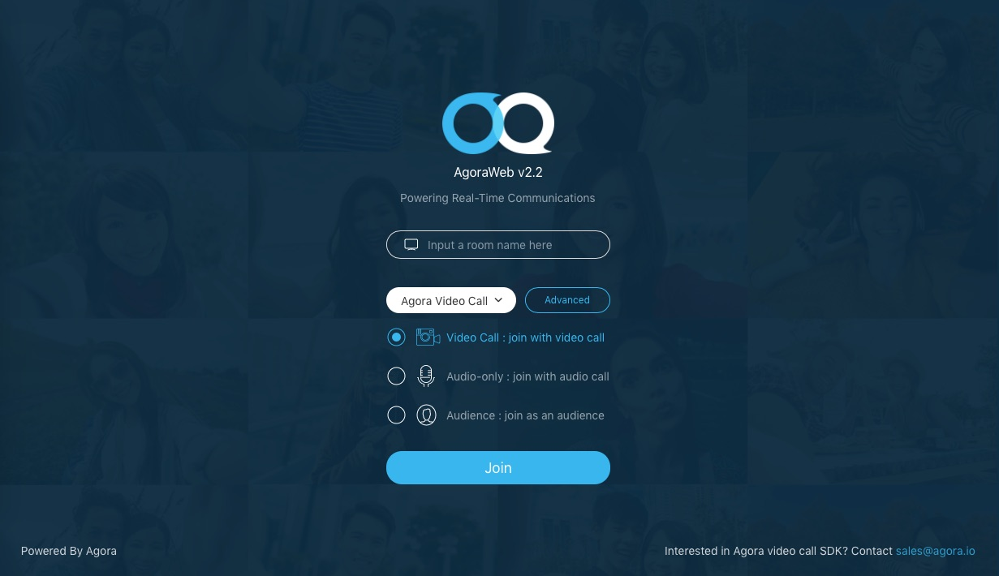
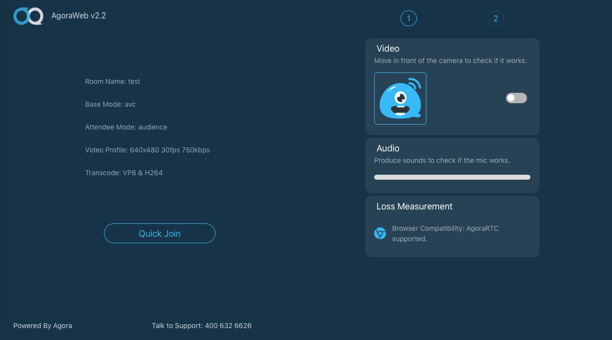
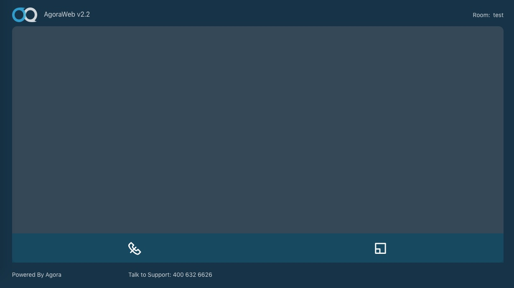

## Steps to Create the Sample

The key code for the sample application is in the `src` folder:

Folder name|Description
---|---
`assets`|Contains stylesheets, fonts, and visual assets
`pages`|Contains layout UI code and JS code
`utils`|Contains helper JS classes and styles

- [Create Visual Assets](#create-visual-assets)
- [Create the Index Page UI](#create-the-index-page-ui)
- [Create the Index JS Code](#create-the-index-js-code)
- [Create the Pre-call Login Page UI](#create-the-pre-call-login-page-ui)
- [Create the Pre-call Login JS Code](#create-the-pre-call-login-js-code)
- [Create the Meeting Page UI](#create-the-meeting-page-ui)
- [Create the Meeting JS Code](#create-the-meeting-js-code)

### Create Visual Assets

Add the following icon assets for the user interface to the `src/assets/images` folder:

Asset|Description                                                                                        
---|---
`ag-audience-active.png` and `ag-audience.png`|Images of a person to indicate if a user is active
`ag-browser.png`|Image used as an icon for browser testing
`ag-index-background.png`|Background image for the index page of the sample application
`ag-login.png`|Image of a monitor used to represent the channel
`ag-logo.png`|Agora logo
`ag-mic-active-s.png` and `ag-mic-s.png`|Images of a microphone to mute/unmute audio
`ag-oval-active.png` and `ag-oval.png`|Oval image used for radio dial selection
`ag-video-active-s.png` and `ag-video-s.png`|Images of a video camera to turn video on/off
`avatar.png`|Default avatar for a user


### Create the Index Page UI

The index page UI is contained in the [`src/pages/index/index.html`](src/pages/index/index.html) file.

The index page serves as the landing and login page for the sample application.



- [Create the Page Architecture](#create-the-page-architecture)
- [Create the Login Header and Footer](#create-the-login-header-and-footer)
- [Create the Channel Room Text Input](#create-the-channel-room-text-input)
- [Create the Login Type Menu](#create-the-login-type-menu)
- [Create the Login Mode Selectors](#create-the-login-mode-selectors)

#### Create the Page Architecture

The main section of this page is within a `<section>` element whose class is `login-wrapper`.

Create the page footer:

- Add text, `Powered By Agora`, that links to the [Agora website](https://www.agora.io).
- Add a reference to Agora's [sales support email](mailto:sales@agora.io).

``` HTML
  <div class="wrapper" id="page-index">
    <div class="ag-header"></div>

    <div class="ag-main">

      <section class="login-wrapper">

			...
		
      </section>
    </div>     

    <div class="ag-footer">
      <a class="ag-href" target="_blank" href="https://www.agora.io">
        <span>Powered By Agora</span>
      </a>
      <div>
        <span>Interested in Agora video call SDK? Contact </span>
        <span class="ag-contact">sales@agora.io</span>
      </div>
    </div>
  </div>
```

#### Create the Login Header and Footer

The main section of the login is within a `<div>` element whose class is `login-body`.

Create the header of the login area by adding:
- A reference to the Agora Logo, `../../assets/images/ag-logo.png`
- The application title, `AgoraWeb v2.2`
- The application subtitle application, `Powering Real-Time Communications`

Create a page footer that contains a **Join** button that has `joinBtn` as its id. This button logs the user into a room using details from by the `login-body` area.

``` HTML
        <div class="login-header">
          
          <p class="login-title">AgoraWeb v2.2</p>
          <p class="login-subtitle">Powering Real-Time Communications</p>
        </div>
        <div class="login-body">
        
	        ...
        
        </div>
        <div class="login-footer">
          <a id="joinBtn" class="ag-rounded button is-info">Join</a>
        </div>
```

#### Create the Channel Room Text Input

Create the first part of the login section:

- Add a text `<input>` element with the id `channel` for the room name of the channel.
- Add an image reference to `ag-login.png`, within the `input` box. This image is for stylistic purposes only.
- Add a `<span>` element whose class is `validate-icon`. This element displays an icon if the room name validation has issues.
- Add a `<span>` element whose class is `validate-msg`. This element displays a message if the room name validation has issues.

``` HTML
          <div class="columns">
            <div class="column is-12">
              <div id="channel-wrapper" class="control has-icons-left">
                <input id="channel" class="ag-rounded input" type="text" placeholder="Input a room name here">
                <span class="icon is-small is-left">
                  
                </span>
                <span class="validate-icon">

                </span>
                <div class="validate-msg"></div>
              </div>
            </div>
          </div>
```

#### Create the Login Type Menu

The Login type menu is comprised of two main sections:
* A basic login type menu within a `<div>` element whose ID is `baseModeDropdown`.
* An advanced login type menu within a `<div>` element whose ID is `advanceProfileDropdown`.


``` HTML
          <div id="dropdown-container">
            <div class="dropdown" id="baseModeDropdown">
            
	            ...
	            
            </div>
            
            <div class="dropdown" id="advanceProfileDropdown">
            
	            ...
	            
            </div>
            
          </div>
```

##### Create the Basic Login Type Menu

The basic login type dropdown menu is comprised of:

- A menu selector within a `div` element whose class is `dropdown-trigger`.
- Menu options within a `div` element whose class is `dropdown-menu` and whose ID is `baseModeOptions`.

``` HTML
              <div class="dropdown-trigger">
                
                ...
                
              </div>

              <div class="dropdown-menu" id="baseModeOptions" role="menu">
                
                ...
                
              </div>
```

###### Login Type Menu Selector

Create a menu selector using an `<a>` link element whose ID is `basemode` and set the following properties.

Link Properties|Value|Description
---|---|---
`data-value`|`avc`|Determines the login type when logging in.
`class`|`ag-rounded button`|Styles the menu.
`aria-haspopup`|`true`|Indicates the menu selector has a popup menu to display.
`aria-controls`|`baseModeOptions`|Indicates the ID of the popup menu to display.

- Add the default selection option, `Agora Video Call`, using a `<span>` element whose ID is `baseModeLabel`. This element updates when the selection option changes.
- Add an arrow down icon using a `<span>` element whose class is `icon is-small`. The `<i>` element defines the icon within this `<span>` element.

``` HTML
                <a id="baseMode" data-value="avc" class="ag-rounded button" aria-haspopup="true" aria-controls="baseModeOptions">
                  <span id="baseModeLabel">Agora Video Call</span>
                  <span class="icon is-small">
                    <i class="ag-icon icon-arrow-down" aria-hidden="true"></i>
                  </span>
                </a>
```

###### Login Type Menu Options

Create the menu options by placing the items within a set of nested `<div>` elements. In the `<div>` element whose class is `dropdown-item`, add the available selection options within `<p>` elements:

- `Agora Video Call`
- `One to one and group calls`

The `<div>` element whose class is `dropdown-item` has the following properties:

Property|Value|Description
---|---|---
`data-value`|`avc`|Determines the login type when logging in.
`data-msg`|`Agora Video Call`|Replaces the text in the base menu selector.

``` HTML
                <div class="dropdown-content">
                  <div class="dropdown-item" data-value="avc" data-msg="Agora Video Call">
                    <p>Agora Video Call</p>
                    <hr>
                    <p>One to one and group calls</p>
                  </div>
                </div>
```

##### Create the Advanced Login Type Menu

The advanced login type dropdown menu is comprised of:

- The menu selector defined within the `div` element whose class is `dropdown-trigger`.
- The menu options defined within the `div` element whose class is `dropdown-menu` and whose ID is `advancedOptions`.

``` HTML
              <div class="dropdown-trigger">
                
                ...
                
              </div>

              <div class="dropdown-menu" id="advancedOptions" role="menu">
                
                ...
                
              </div>
```

###### Advanced Login Type Menu Selector

Create a menu selector using an `<a>` link element whose ID is `advancedProfile`, and set the following properties.

Link Properties|Value|Description
---|---|---
`class`|`ag-rounded button`|Styles the menu.
`aria-haspopup`|`true`|Indicates the menu selector has a popup menu to display.
`aria-controls`|`advancedOptions`|Indicates the ID of the popup menu to display.

Add the default selection option, `Advanced`, within a `<span>` element.

``` HTML
                <a id="advancedProfile" class="ag-rounded button" aria-haspopup="true" aria-controls="advancedOptions">
                  <span>Advanced</span>
                </a>
```

###### Advanced Login Type Menu Options

Create the menu options by placing the items within a `<div>` element whose class is `dropdown-content`. Each of the three rows of the advanced menu is contained within a `<div>` element whose class is `dropdown-item`.

``` HTML
                <div class="dropdown-content">
                
                  <div class="dropdown-item">
                  
                		...
                		
                  </div>
                  
                  <div class="dropdown-item">
                  
                		...
                		
                  </div>
                  
                  <div class="dropdown-item">
                  
                		...
                		
                  </div>
                                  		
                </div>
```

*Create the Radio Options*

Add a `<div>` element whose class is `control`. For each available selection option, add a `<label>` element whose class is `radio`. The `<label>` element of each menu option contains:

- A radio `<input>` element named `transcode` which is used as the selector.
- A `<span>` element that describes the selection.

The available options are:

Input Value|Option Name|Description
---|---|---
`interop`|`VP8 &amp; H264`|Encoding with VP8 and decoding with H264
`h264_interop`|`H264-only`|Encoding and decoding with H264

``` HTML
                    <div class="control">
                      <label class="radio">
                        <input value="interop" type="radio" checked name="transcode">
                        <span>VP8 &amp; H264</span>
                      </label>
                      <label class="radio">
                        <input value="h264_interop" type="radio" name="transcode">
                        <span>H264-only</span>
                      </label>
                    </div>
```

*Create the High Stream Menu*

Add a `<span>` element with the text `High Stream` for the dropdown menu label.

Wrap the `<select>` menu element within a `<div>` element whose class is `select is-rounded`. The `<select>` element has the classes `ag-rounded` and `is-clipped` and an ID of `videoProfile`. The ID is used to populate the available high stream video profiles for the sample application.

``` HTML
                    <span>High Stream</span>
                    &nbsp;
                    <div class="select is-rounded">
                      <select id="videoProfile" class="ag-rounded is-clipped">

                      </select>
                    </div>
```

*Create the Low Stream Menu*

Add a `<span>` element with the text `Low Stream` for the dropdown menu label.

Wrap the `<select>` menu element within a `<div>` element whose class is `select is-rounded`. The `<select>` element has the classes `ag-rounded` and `is-clipped` and an ID of `videoProfileLow`. The ID is used to populate the available low stream video profiles for the sample application.

``` HTML
                    <span>Low Stream</span>
                    &nbsp;
                    <div class="select is-rounded">
                      <select id="videoProfileLow" class="ag-rounded is-clipped">

                      </select>
                    </div>
```

#### Create the Login Mode Selectors

Add a set of nested `<div>` elements for the login mode selectors.

In the `<div>` element whose ID is `attendeeMode` and whose class is `control`, add a `<label>` element for each available selection option. The class of each `<label>` element is `radio`.

Each menu option `<label>` element contains a radio `<input>` element whose name is `attendee`. Each `<label>` element contains:

- A `<span>` element whose class is `radio-btn` that styles the radio button.
- A `<span>` element whose class is `radio-img` that displays an icon for the radio option.
- A `<span>` element whose class is `radio-msg` that displays the radio option name.

The available radio options are:

Option Value|Option Name|Description
---|---|---
`video`|`Video Call : join with video call`|Joins the user with video capabilities.
`audio-only`|`Audio-only : join with audio call`|Joins the user with only audio capabilities.
`audience`|`Audience : join as an audience`|Joins the user as an audience member with no audio or video capabilities.

``` HTML
          <div class="columns">
            <div class="column">
              <div id="attendeeMode" class="control">
                <label class="radio video">
                  <input value="video" type="radio" name="attendee" checked>
                  <span class="radio-btn">
                  </span>
                  <span class="radio-img video">
                  </span>
                  <span class="radio-msg">Video Call : join with video call</span>
                </label>
                <br>
                <label class="radio audio-only">
                  <input value="audio-only" type="radio" name="attendee">
                  <span class="radio-btn">
                  </span>
                  <span class="radio-img audio">
                  </span>
                  <span class="radio-msg">Audio-only : join with audio call</span>
                </label>
                <br>
                <label class="radio audience">
                  <input value="audience" type="radio" name="attendee">
                  <span class="radio-btn">
                  </span>
                  <span class="radio-img audience">
                  </span>
                  <span class="radio-msg">Audience : join as an audience</span>
                </label>
              </div>
            </div>
          </div>
```

### Create the Index JS Code

The index functionality code is contained in the [`src/pages/index/index.js`](src/pages/index/index.js) file.

- [Define the `getParameterByName` Constant](#define-the-getparameterbyname-constant)
- [Define the `uiInit` Constant](#define-the-uiinit-constant)
- [Define the `validate` Constant](#define-the-validate-constant)
- [Define the `subscribeMouseEvent` Constant](#define-the-subscribemouseevent-constant)
- [Initialize the page](#initialize-the-page)

#### Define the `getParameterByName` Constant

The `getParameterByName` constant processes the parameters `name` and `url` and returns a string from the helper method `decodeURIComponent()`.

1. Check if the `url` is valid. If not, set `window.location.href` as the value.
2. Modify `name` using `name.replace()`.
3. Use `name` to create a new regular expression `regex` using `new RegExp()`.
4. Create a new local variable from `url` with `regex.exec()`.

Return the result:

- If `results` is not valid, return `null`.
- If `results[2]` is not valid, return an empty string.
- Otherwise, modify `results[2]` using `results[2].replace()` and apply the resulting value to the `decodeURIComponent()` helper method return its result.


``` JavaScript
const getParameterByName = (name, url) => {
  if (!url) {
    url = window.location.href;
  }
  name = name.replace(/[[\]]/g, '\\$&');
  let regex = new RegExp('[?&]' + name + '(=([^&#]*)|&|#|$)');
  let results = regex.exec(url);
  if (!results) return null;
  if (!results[2]) return '';
  return decodeURIComponent(results[2].replace(/\+/g, ' '));
};
```

#### Define the `uiInit` Constant

The `uiInit` constant initializes the sample application.

Set the `profileContainer`, `profileLowContainer`, and `lowResolutionArr` local variables.

Variable|Value|Description
---|---|---
`profileContainer`|`$('#videoProfile')`|Reference to the high stream video profile UI element.
`profileLowContainer`|`$('#videoProfileLow')`|Reference to the low stream video profile UI element.
`lowResolutionArr`|`Object.entries(RESOLUTION_ARR).slice(0,7)`|Array of available low resolution options.

``` JavaScript
const uiInit = () => {
  let profileContainer = $('#videoProfile');
  let profileLowContainer = $('#videoProfileLow');
  let lowResolutionArr = Object.entries(RESOLUTION_ARR).slice(0, 7);
  
  ...
  
};
```

Build the high stream video profile `<options>` elements by mapping the items in `Object.entries(RESOLUTION_ARR)`. The `<option>` element properties are:

Property|Value|Description
`selected`|`selected` or empty|If `item[0]` is equal to `480p_4` set the `selected` property to set 480p as the default resolution.
`value`|`item[0]`|Sets the value property to the Agora resolution code.
Text label|`item[1][0] + 'x' + item[1][1] + ', ' + item[1][2] + 'fps, ' + item[1][3] + 'kbps</option>'`|Sets the text label to display the aspect ratio and frame rate.

Append `html` to `profileContainer` using `profileContainer.append()` and return its result.

``` JavaScript
  Object.entries(RESOLUTION_ARR).map(item => {
    let html =
      '<option ' +
      (item[0] === '480p_4' ? 'selected' : '') +
      ' value="' +
      item[0] +
      '">' +
      item[1][0] +
      'x' +
      item[1][1] +
      ', ' +
      item[1][2] +
      'fps, ' +
      item[1][3] +
      'kbps</option>';
    return profileContainer.append(html);
  });
```

Build the low stream video profile `<options>` elements by mapping the items in `lowResolutionArr`. The `<option>` element properties are:

Property|Value|Description
---|---|---
`selected`|`selected` or empty|If `item[0]` is equal to `180p_4`, set the `selected` property to 180p as the default resolution.
`value`|`item[0]`|Sets the `value` property to the Agora resolution code.
Text label|`item[1][0] + 'x' + item[1][1] + ', ' + item[1][2] + 'fps, ' + item[1][3] + 'kbps</option>'`|Sets the text label to display the aspect ratio and frame rate.

Append `html` to `profileContainer` using `profileContainer.append()` and return its result.

``` JavaScript
  lowResolutionArr.map(item => {
    let html =
      '<option ' +
      (item[0] === '180p_4' ? 'selected' : '') +
      ' value="' +
      item[0] +
      '">' +
      item[1][0] +
      'x' +
      item[1][1] +
      ', ' +
      item[1][2] +
      'fps, ' +
      item[1][3] +
      'kbps</option>';
    return profileLowContainer.append(html);
  });
```

Declare a new local variable, `audienceOnly`. Set the value to `true` if `getParameterByName('audienceOnly')` is true. Otherwise, set the value to `false`.

If `audienceOnly` is `true`:

- Hide the other attendance radio button options using `$('#attendeeMode label.audience').siblings().hide()`.
- Select the audience radio button using `$('#attendeeMode label.audience input').prop('checked', true)`.

``` JavaScript
  let audienceOnly = getParameterByName('audienceOnly') === 'true';
  if (audienceOnly) {
    $('#attendeeMode label.audience')
      .siblings()
      .hide();
    $('#attendeeMode label.audience input').prop('checked', true);
  }
```

#### Define the `validate` Constant

The `validate` constant processes the parameter `channelName` and returns a string.

Use the helper class `Validator` to determine what string value to return.

- Use `Validator.isNonEmpty()` to check if `channelName` is empty. If true, return the string `Cannot be empty!`.
- Use `Validator.minLength()` to check if `channelName` is less than 1 character. If true, return the string `No shorter than 1!`.
- Use `Validator.maxLength()` to check if `channelName` is longer than 16 characters. If true, return the string `No longer than 16!`.
- Use `Validator.validChar()` to check if `channelName` contains valid characters. If true, return the string `Only capital or lower-case letter, number and "_" are permitted!`.

``` JavaScript
const validate = channelName => {
  if (Validator.isNonEmpty(channelName)) {
    return 'Cannot be empty!';
  }
  if (Validator.minLength(channelName, 1)) {
    return 'No shorter than 1!';
  }
  if (Validator.maxLength(channelName, 16)) {
    return 'No longer than 16!';
  }
  if (Validator.validChar(channelName)) {
    return 'Only capital or lower-case letter, number and "_" are permitted!';
  }

  return '';
};
```

#### Define the `subscribeMouseEvent` Constant

The `subscribeMouseEvent` constant adds event listeners to the UI elements.

``` JavaScript
const subscribeMouseEvent = () => {
  
  ...
  
};
```

- [Add the Join Button Event Listener and Callback](#add-the-join-button-event-listener-and-callback)
- [Add the Window Keypress Event Listener and Callback](#add-the-window-keypress-event-listener-and-callback)
- [Add the Channel Text Input Event Listener and Callback](#add-the-channel-text-input-event-listener-and-callback)
- [Add the Base Login Mode Dropdown Event Listeners and Callbacks](#add-the-base-login-mode-dropdown-event-listeners-and-callbacks)
- [Add the Advanced Options Event Listeners and Callbacks](#add-the-advanced-options-event-listeners-and-callbacks)
- [Add Dropdown Close Event Listener](#add-dropdown-close-event-listener)

##### Add the Join Button Event Listener and Callback

Add a `click` event listener to the **Join** UI button.

``` JavaScript
  // Click Join and go to the meeting room
  $('#joinBtn').on('click', () => {
    
    ...
    
  });
```

1. Validate the text in the `channel` name text input using `validate()`.
2. Retrieve the `validate-icon` UI element and clear out all its child nodes using `validateIcon.empty()`.

``` JavaScript
    let validateRst = validate(
      $('#channel')
        .val()
        .trim()
    );
    let validateIcon = $('.validate-icon');
    validateIcon.empty();
```

If `validateRst` is valid:

1. Create a string `msg` for the error.
2. Apply the class `is-danger` to the `channel` text input box.
3. Append a validation icon `<i>` element whose class is `icon-wrong` using `validateIcon.append()`.
4. Display the validation message in the validation message area using `$('.validate-msg').html(msg).show()`.
5. Return `0`.

Otherwise, continue processing the remaining code.

``` JavaScript
    if (validateRst) {
      let msg = `Input Error: ${validateRst}`;
      $('#channel').addClass('is-danger');
      validateIcon.append(`<i class="ag-icon icon-wrong"></i>`);
      $('.validate-msg')
        .html(msg)
        .show();
      return 0;
    }
```

Apply the class `is-success` to the `channel` text input box and use `validateIcon.append()` to append a validation icon `<i>` element whose class is `icon-correct`.

``` JavaScript
    $('#channel').addClass('is-success');
    validateIcon.append(`<i class="ag-icon icon-correct"></i>`);
```

Create a `postData` object with the following values:

Name|Value|Description
---|---|---
`baseMode`|`document.querySelector('#baseMode').dataset.value`|Base mode value.
`transcode`|`$('input[name="transcode"]:checked').val()`|Transcoding value.
`attendeeMode`|`$('input[name="attendee"]:checked').val()`|Attendee mode value.
`videoProfile`|`$('#videoProfile').val()`|High stream video profile value.
`channel`|`$('#channel').val().trim()`|Channel name value.
`videoProfileLow`|`$('#videoProfileLow').val()`|Low stream video profile value.

Loop through the items in `postData` using `Object.entries(postData).map()` and set cookies for each item using `Cookies.set()`.

``` JavaScript
    let postData = {
      baseMode: document.querySelector('#baseMode').dataset.value,
      transcode: $('input[name="transcode"]:checked').val(),
      attendeeMode: $('input[name="attendee"]:checked').val(),
      videoProfile: $('#videoProfile').val(),
      channel: $('#channel')
        .val()
        .trim(),
      videoProfileLow: $('#videoProfileLow').val()
    };
    Object.entries(postData).map(item => {
      return Cookies.set(item[0], item[1]);
    });
```

Complete the callback by redirecting the user to the Pre-call page using `window.location.href`.

``` JavaScript
    window.location.href = 'precall.html';
```

##### Add the Window Keypress Event Listener and Callback

Add an event listener for when the user presses **Enter** on their keyboard. The `keyCode` for the **Enter** key is `13`. If the **Enter** key is pressed, trigger the **Join** button `click` event listener using `$('#joinBtn').trigger()`.

``` JavaScript
  // Press Enter to trigger Join
  window.addEventListener('keypress', e => {
    e.keyCode === 13 && $('#joinBtn').trigger('click');
  });
```

##### Add the Channel Text Input Event Listener and Callback

Add an event listener to validate the name for the `channel` text input box while the user types.

``` JavaScript
  // Add input check for room name
  $('#channel').on('input', () => {
  		
  		...
  		
  });
```

1. Remove the classes `is-danger` and `is-success` from the `channel` text input box.
2. Hide the validation UI message using `$('.validate-msg').hide()`.
3. Validate the text in the `channel` name text input using `validate()`.
4. Retrieve the `validate-icon` UI element and clear out all its child nodes using `validateIcon.empty()`.

``` JavaScript
    $('#channel').removeClass('is-danger');
    $('#channel').removeClass('is-success');
    $('.validate-msg').hide();
    let validateRst = validate(
      $('#channel')
        .val()
        .trim()
    );
    let validateIcon = $('.validate-icon');
    validateIcon.empty();
```

If `validateRst` is valid:

1. Create a string `msg` for the error.
2. Apply the class `is-danger` to the `channel` text input box.
3. Append a validation icon `<i>` element whose class is `icon-wrong` using `validateIcon.append()`.
4. Display the validation message in the validation message area using `$('.validate-msg').html(msg).show()`.
5. Return `0`.

Otherwise, continue processing the remaining code.

``` JavaScript
    if (validateRst) {
      let msg = `Input Error: ${validateRst}`;
      $('#channel').addClass('is-danger');
      validateIcon.append(`<i class="ag-icon icon-wrong"></i>`);
      $('.validate-msg')
        .html(msg)
        .show();
      return 0;
    }
```

Apply the class `is-success` to the `channel` text input box and use `validateIcon.append()` to append a validation icon `<i>` element whose class is `icon-correct`.

``` JavaScript
    $('#channel').addClass('is-success');
    validateIcon.append(`<i class="ag-icon icon-correct"></i>`);
```

##### Add the Base Login Mode Dropdown Event Listeners and Callbacks

Add a `click` event listener to the `baseMode` UI element.

1. Stop the bubbling of the `click` event to parent elements using `e.stopPropagation()`.
2. Remove the `is-active` class from all elements with the `dropdown` class and toggle the `baseModeDropdown` element to the `is-active` class.

``` JavaScript
  // BaseMode dropdown control
  $('#baseMode').click(e => {
    e.stopPropagation();
    $('.dropdown').removeClass('is-active');
    $('#baseModeDropdown').toggleClass('is-active');
  });
```

Add a `click` event listener to the `baseModeOptions` UI element.

1. Stop the bubbling of the `click` event to parent elements using `e.stopPropagation()`.
2. Remove the `is-active` class from all elements with the `dropdown` class and toggle the `baseModeDropdown` element to the `is-active` class.
3. Apply the value for the selected option to the `baseMode` UI element using `$('#baseMode').data()`.
3. Apply the text for the selected option to the `baseModeLabel` UI element using `$('#baseModeLabel').html()`.

``` JavaScript
  $('#baseModeOptions .dropdown-item').click(e => {
    e.stopPropagation();
    let [val, label] = [e.currentTarget.dataset.value, e.currentTarget.dataset.msg];
    $('#baseMode').data('value', val);
    $('#baseModeDropdown').removeClass('is-active');
    $('#baseModeLabel').html(label);
  });
```

##### Add the Advanced Options Event Listeners and Callbacks

Add a `click` event listener to the `advancedProfile` UI element.

1. Stop the bubbling of the `click` event to parent elements using `e.stopPropagation()`.
2. Remove the `is-active` class from all elements with the `dropdown` class and toggle the `advanceProfileDropdown` element to the `is-active` class.

``` JavaScript
  // AdvancedProfile dropdown control
  $('#advancedProfile').click(e => {
    e.stopPropagation();
    $('.dropdown').removeClass('is-active');
    $('#advanceProfileDropdown').toggleClass('is-active');
  });
```

Add a `click` event listener to the `advancedOptions` UI element.

Stop the bubbling of the `click` event to parent elements using `e.stopPropagation()`.

``` JavaScript
  $('#advancedOptions').click(e => {
    e.stopPropagation();
  });
```

##### Add Dropdown Close Event Listener

Add a `click` event listener to the `window` using `$(window).click()`.

Close any open dropdown menus by removing the `is-active` class using `$('.dropdown').removeClass()`.

``` JavaScript
  // global click will close dropdown
  $(window).click(_ => {
    $('.dropdown').removeClass('is-active');
  });
```

#### Initialize the page

To initialize the page, use `uiInit()` to initialize the UI elements and use `subscribeMouseEvent()` to add event listeners and callbacks to the UI elements.

``` JavaScript
uiInit();
subscribeMouseEvent();
```


### Create the Pre-call Login Page UI

The pre-call login page UI is contained in the [`src/pages/precall/precall.html`](src/pages/precall/precall.html) file.

Logging in displays a pre-call page where the user can test their audio and video before joining the call.



- [Create the Page Architecture](#create-the-page-architecture)
- [Create the Room Details Column](#create-the-room-details-column)
- [Create the Device Testing Column](#create-the-device-testing-column)

#### Create the Page Architecture

The main section of this page is within the `<section>` element whose class is `login-wrapper`.

Create the page footer:

- Add the text `Powered By Agora` linking to the [Agora website](https://www.agora.io).
- Add a reference to Agora's [sales support email](mailto:sales@agora.io).


The main section of this page is within the `<div>` element whose class is `ag-container`.

Create the page header by adding a reference to the Agora Logo, `../../assets/images/ag-logo.png`, and the application title, `AgoraWeb v2.2`.

`Create the page footer:`

- Add the text `Powered By Agora` linking to the [Agora website](https://www.agora.io).
- Add a reference to Agora's support phone number `400 632 6626`.

Include the Agora SDK file from the source `https://cdn.agora.io/sdk/web/AgoraRTCSDK-2.3.1.js`.

``` HTML
  <div class="wrapper" id="page-precall">
    <div class="ag-header">
      <div class="ag-header-lead">
        
        <span>AgoraWeb v2.2</span>
      </div>
    </div>
    <div class="ag-main">
      <div class="columns ag-container">
      
	      ...

      </div>
    </div>
    <div class="ag-footer">
      <a class="ag-href" target="_blank" href="https://www.agora.io">
        <span>Powered By Agora</span>
      </a>
      <span>Talk to Support: 400 632 6626</span>
    </div>

    <!-- modal/messages/notifications -->

  </div>
  <script src="https://cdn.agora.io/sdk/web/AgoraRTCSDK-2.3.1.js"></script>
  <!-- inject -->
```

#### Create the Room Details Column

The left column displays the setting details for the room. Create the following `<p>` elements for each setting. These UI elements are used to display the settings from the index page.

Label|`<span>` ID|Description
---|---|---
`Room Name:`|`channel`|Room name for the channel
`Base Mode:`|`baseMode`|Base mode
`Attendee Mode:`|`attendeeMode`|Attendee mode
`Video Profile:`|`videoProfile`|Video profile (resolution and frame rate)
`Transcode:`|`transcode`|Transcoding method

At the bottom of the left column, add a `Quick Join` UI button with the ID `quickJoinBtn`. This button will log the user into the channel room, and load the meeting area.

``` HTML        
        <div class="column">
          <div class="ag-info">
            <p>Room Name:
              <span id="channel"></span>
            </p>
            <p>Base Mode:
              <span id="baseMode"></span>
            </p>
            <p>Attendee Mode:
              <span id="attendeeMode"></span>
            </p>
            <p>Video Profile:
              <span id="videoProfile"></span>
            </p>
            <p>Transcode:
              <span id="transcode"></span>
            </p>
            <div class="ag-info-footer">
              <a id="quickJoinBtn" class="ag-rounded button">
                <span>Quick Join</span>
              </a>
            </div>
          </div>

        </div>
```

#### Create the Device Testing Column

The right column allows for device testing before entering the channel room.

- [Create the Device Testing Architecture](#create-the-device-testing-architecture)
- [Create the Video Testing Section](#create-the-video-testing-section)
- [Create the Audio Testing Section](#create-the-audio-testing-section)
- [Create the Loss Measurement Section](#create-the-loss-measurement-section)


##### Create the Device Testing Architecture

Create the step header in a `<div>` element whose class is `ag-steps`.

Add two steps as `<div>` elements whose class is `step` and the IDs `stepOne` and `stepTwo`. Highlight step 1 by including the class `active` on its `<div>` element.

The video, audio, and loss measurement testing sections are contained within `<section>` elements whose class is `ag-card` and IDs `videoCard`, `audioCard`, and `connectCard`.

``` HTML        
        <div class="column">
          <div class="ag-cards">
            <section class="ag-cards-title">
              <div class="ag-steps">
                <div id="stepOne" class="step active">1</div>
                <div id="stepTwo" class="step">2</div>
              </div>
            </section>
            
            <section class="ag-card" id="videoCard">
	            
	            ...
	            
            </section>
            
            <section class="ag-card" id="audioCard">
	            
	            ...
	            
            </section>

            <section class="ag-card" id="connectCard">
	            
	            ...
	            
            </section>
            
          </div>

        </div>
```

##### Create the Video Testing Section

Create the header by adding `<span>` elements to the `<div>` element whose class is `ag-card-header`:

1. In the first `<span>` element, add an `<i>` element whose classes are `ag-icon` and `ag-icon-video-24`>. This element displays the video icon.
2. In the second `<span>` element, add the text `Video` to label the section.

Add a `<div>` element whose class is `ag-card-tip` to provide instructions on how to conduct the video camera test.

``` HTML        
              <div class="ag-card-header">
                <span>
                  <i class="ag-icon ag-icon-video-24"></i>
                </span>
                <span>Video</span>
              </div>
              <div class="ag-card-tip">
                Move in front of the camera to check if it works.
              </div>
```

Create the main video device testing area by adding two `<div>` classes to the `<div>` element whose class is `ag-card-body`.

- The `<div>` whose class is `initial` contains the UI elements for the video device testing controls.
- The `<div>` whose class is `result` contains the UI element that will display the testing video results.

In the `<div>` whose class is `initial`, add a select dropdown menu whose classes are `is-clipped` and `ag-rounded` and whose ID is `videoDevice`. This element is nested in another `<div>` element whose classes are `select` and `ag-select` and whose ID is `videoDevice`. This `<select>` element will populate with the available video devices.

In the `<div>` whose class is `ag-video-test`, add a `<div>` element whose class is `ag-video-test` that contains the `<div>` elements with IDs `videoItem` and `enableVideoSwitch`.

- The `videoItem` element will display the video preview for testing.
- The `enableVideoSwitch` contains a checkbox `<input>` element with the ID and name `enableVideo` and a `<label>` element.
	
	**Note:** The checkbox element applies the classes `switch` and `is-rounded` to display the control as a switch rather than a checkbox. It is initialized as "on" with the class `is-success`.


``` HTML        
              <div class="ag-card-body">
                <div class="initial">
                  <div class="select ag-select">
                    <select class="is-clipped ag-rounded" id="videoDevice">

                    </select>
                  </div>
                  <div class="ag-video-test">
                    <div id="videoItem">
                    </div>
                    <div class="field" id="enableVideoSwitch">
                      <input id="enableVideo" type="checkbox" name="enableVideo" class="switch is-rounded is-success">
                      <label for="enableVideo"></label>
                    </div>
                  </div>
                </div>
                <div class="result"></div>

              </div>
```

##### Create the Audio Testing Section

Create the header by adding `<span>` classes to the `<div>` element whose class is `ag-card-header`:

1. In the first `<span>` element, add an `<i>` element whose classes are `ag-icon` and `ag-icon-audio-24`>. This element displays the audio icon.
2. In the second `<span>` element, add the text `Audio` to label the section.

Add a `<div>` element whose class is `ag-card-tip` to provide instructions on how to conduct the video camera test.

``` HTML        
              <div class="ag-card-header">
                <span>
                  <i class="ag-icon ag-icon-audio-24"></i>
                </span>
                <span>Audio</span>
              </div>
              <div class="ag-card-tip">
                Produce sounds to check if the mic works.
              </div>
```

Create the main audio device testing area by adding two `<div>` classes to the `<div>` element whose class is `ag-card-body`.

- The `<div>` whose class is `initial` contains the UI elements for the video device testing controls.
- The `<div>` whose class is `result` contains the UI element that will display the testing video results.

In the `<div>` whose class is `initial`, add a select dropdown menu whose classes are `is-clipped` and `ag-rounded` and whose ID is `audioDevice`. This element is nested in another `<div>` element whose classes are `select` and `ag-select` and whose ID is `audioDevice`. This `<select>` element will populate with the available audio devices.

In the `<div>` whose class is `ag-audio-test`:

1. Add an `<i>` element whose classes are `ag-icon` and `ag-icon-audio-24`, nested within a `<span>` element. This displays an audio icon.
2. Add a `<progress>` element with the ID `volume` and classes `progress`, `is-small`, and `is-info`. This serves as the volume indicator for the audio device and is initialized to a value of `0` and a `max` value limit of `100`.
	
``` HTML        
              <div class="ag-card-body">
                <div class="initial">
                  <div class="select ag-select">
                    <select class="is-clipped ag-rounded" id="audioDevice">

                    </select>
                  </div>
                  <div class="ag-audio-test">
                    <span>
                      <i class="ag-icon ag-icon-audio-24"></i>
                    </span>
                    <progress id="volume" class="progress is-small is-info" value="0" max="100"></progress>
                  </div>
                </div>
                <div class="result"></div>

              </div>
```

##### Create the Loss Measurement Section

Create the header by adding `<span>` classes to the `<div>` element whose class is `ag-card-header`:

1. In the first `<span>` element, add an `<i>` element whose classes are `ag-icon` and `ag-icon-connect-24`> which is used to display the connection icon.
2. In the second `<span>` element, add the text `Loss Measurement` to label the section.

``` HTML        
              <div class="ag-card-header">
                <span>
                  <i class="ag-icon ag-icon-connect-24"></i>
                </span>
                <span>Loss Measurement</span>
              </div>
```

Create the main lost measurement testing area by adding a `<div>` whose class is `ag-browser-test` to the `<div>` element whose classes are `ag-card-body` and `ag-connect-test`.

In the `<div>` whose class is `ag-browser-test`:

1. Add an `` element that displays the `ag-browser.png` image asset.
2. Add a `<p>` element with the ID `compatibility`. This element will display the compatibility with the Agora SDK.
	
``` HTML        
              <div class="ag-card-body ag-connect-test">
                <div class="ag-browser-test">
                  
                  <p>Browser Compatibility:
                    <span id="compatibility"></span>
                  </p>
                </div>
              </div>
```

### Create the Pre-call Login JS Code

The settings functionality code is contained in the [`src/pages/precall/precall.js`](src/pages/precall/precall.js) file.

- [Define Global Variables](#define-global variables)
- [Define the `uiInit` Constant](#define-the-uiinit-constant)
- [Define the `Schedule` Constant](#define-the-schedule-constant)
- [Define the `clientInit` Constant](#define-the-clientinit-constant)
- [Define the `receiverInit` Constant](#define-the-receiverinit-constant)
- [Define the `setDevice` Constant](#define-the-setdevice-constant)
- [Define the `subscribeEvents` Constant](#define-the-subscribeevents-constant)
- [Initialize the Page](#initialize-the page)

#### Define Global Variables

Define the global variables for the pre-call page.

Variable|Description
---|---
`stream`|The channel stream
`recvStream`|The received channel stream
`client`|The Agora client
`receiver`|The receiver for the `client`
`key`|The Agora App ID key
`_testChannel`|The channel name for testing. The value is set to a random number so users can test without conflicting with live channel rooms.

``` JavaScript
let stream;
let recvStream;
let client;
let receiver;
let key;
let _testChannel = String(
  Number.parseInt(new Date().getTime(), 10) + Math.floor(Math.random() * 1000)
);
```

#### Define the `uiInit` Constant

The `uiInit` constant is used to initialize the pre-call page of the sample application.

Set the `profile` and `transcodeValue` local variables based on the browser cookies using `Cookies.get()`.

- `profile` is the retrieved cookie index of `RESOLUTION_ARR`.
- If the `transcode` cookie is not valid, the `transcodeValue` is `interop`.

The remaining code for this section is contained within the `Promise` return.

``` JavaScript
// Init ui
const uiInit = () => {
  return new Promise((resolve, reject) => {
    // Init info card
    let profile = RESOLUTION_ARR[Cookies.get('videoProfile')];
    let transcodeValue = Cookies.get('transcode') || 'interop';
    
    ...
    
  })
};
```

Create a `transcode` variable which returns a string based on `transcodeValue`.

`transcodeValue` Value|`transcode` Value|Description
---|---|---
Empty string|`VP8-only`|Encoding and decoding with VP8
`interop`|`VP8 &amp; H264`|Encoding with VP8 and decoding with H264
`h264_interop`|`H264-only`|Encoding and decoding with H264 options

``` JavaScript
    let transcode = (() => {
      switch (transcodeValue) {
        case '':
          return 'VP8-only';
        default:
        case 'interop':
          return 'VP8 &amp; H264';
        case 'h264_interop':
          return 'H264-only';
      }
    })();
```

Create an `info` object with the following information.

Name|Value|Description
---|---|---
`videoProfile`|`${profile[0]}x${profile[1]} ${profile[2]}fps ${profile[3]}kbps`|High stream video profile value.
`channel`|`Cookies.get('channel') || 'test'`|Channel name value from browser cookie data. If the `channel` cookie data is not valid, the value is set to `test`.
`transcode`|Empty value|Transcoding value.
`attendeeMode`|`Cookies.get('attendeeMode') || 'video'`|Attendee mode value from browser cookie data. If the `attendeeMode` cookie data is not valid, the value is set to `video`.
`baseMode`|`Cookies.get('baseMode') || 'avc'`|Base mode value from browser cookie data. If the `baseMode` cookie data is not valid, the value is set to `avc`.

``` JavaScript
    let info = {
      videoProfile: `${profile[0]}x${profile[1]} ${profile[2]}fps ${profile[3]}kbps`,
      channel: Cookies.get('channel') || 'test',
      transcode,
      attendeeMode: Cookies.get('attendeeMode') || 'video',
      baseMode: Cookies.get('baseMode') || 'avc'
    };
```

If the base mode is `avc`, set `key` to `APP_ID`.

``` JavaScript
    // Init key
    if (info.baseMode === 'avc') {
      key = APP_ID;
    }
```

Loop through the `info` object and update its associated UI element using `$('#' + item[0]).html()`.

If `info.attendeeMode` is equal to `video`, check the `enableVideo` UI element using `$('#enableVideo').prop()`.

``` JavaScript
    Object.entries(info).map(item => {
      // Find dom and insert info
      return $('#' + item[0]).html(item[1]);
    });

    // Video-attendee's switch
    if (info.attendeeMode === 'video') {
      $('#enableVideo').prop('checked', true);
    }
```

Check the system requirements for the Agora SDK.

If the system requirements are valid, set the `compatibility` element text to `AgoraRTC supported.` using `$('#compatibility').html()`. Otherwise, set the text to `AgoraRTC not fully supported and some functions may be lost.`

``` JavaScript
    // Init compatibility result
    // eslint-disable-next-line
    if (AgoraRTC.checkSystemRequirements()) {
      $('#compatibility').html('AgoraRTC supported.');
    } else {
      $('#compatibility').html(
        'AgoraRTC not fully supported and some functions may be lost.'
      );
    }
```

Initialize the device options based on the browser used using `isSafari()`.

- If the browser is Safari, remove the default audio devices using `$('#audioDevice').parent().remove()`, remove any video devices using `$('#videoDevice').parent().remove()`, and invoke the `resolve()` method.
- If another browser is used, populate the `videoDevice` and `audioDevice` UI elements using `$('#videoDevice').html()` and `$('#audioDevice').html()`, and invoke the `resolve()` method.

	**Note:** Retrieve the HTML for the video and audio options by looping through the `item` object and appending `<option>` elements whose values are composed of `item.deviceId` and `item.label`. Audio devices are defined by the `item.kind` value `audioinput`. Video devices are defined by the `item.kind` value `videoinput`.

``` JavaScript
    // Init device options
    if (isSafari()) {
      // If safari, disable set device since deviceId changes all the time
      $('#audioDevice')
        .parent()
        .remove();
      $('#videoDevice')
        .parent()
        .remove();
      resolve()
    } else {
      // eslint-disable-next-line
      AgoraRTC.getDevices(function(devices) {
        let videoHtml = '';
        let audioHtml = '';
        devices.forEach(function(item) {
          if (item.kind === 'audioinput') {
            audioHtml += '<option value=' + item.deviceId + '>' + item.label + '</option>';
          }
          if (item.kind === 'videoinput') {
            videoHtml += '<option value=' + item.deviceId + '>' + item.label + '</option>';
          }
        });
        $('#videoDevice').html(videoHtml);
        $('#audioDevice').html(audioHtml);
        resolve()
      });
    }
```

#### Define the `Schedule` Constant

The `Schedule` constant is used to check for changes in the device testing results.

Set the following object parameters:

Parameter|Value|Description
---|---|---
`DURATION`|`10`|Number of seconds for refresh
`volume`|`0`|Volume
`volumeBar`|`$('#volume')`|Volume UI element
`targetStream`|Empty object|Target stream object
`getVolume(stream)`|See [`getVolume()` Method](#add-the-getvolume-method)
`scheduleVolumeDetect`|Empty object|Volume detection schedule information
`scheduleEnd`|Empty object|End schedule information
`start()`|See [`start()` Method](#add-the-start-method)
`reset()`|See [`reset()` Method](#add-the-reset-method)
`init(stream, duration)`|See [`init()` Method](#add-the-init-method)

- [Add the `getVolume()` Method](#add-the-getvolume-method)
- [Add the `start()` Method](#add-the-start-method)
- [Add the `reset()` Method](#add-the-reset-method)
- [Add the `init()` Method](#add-the-init-method)

``` JavaScript
const Schedule = {
  DURATION: 10,
  volume: 0,
  volumeBar: $('#volume'),
  targetStream: {},
  getVolume(stream) {
  	
  	...
  	
  },
  scheduleVolumeDetect: {},
  scheduleEnd: {},
  start() {
  	
  	...
  	
  },
  reset() {
  
    ...
    
  },
  init(stream, duration) {
  
    ...
    
  }
};
```

##### Add the `getVolume()` Method

The `getVolume()` method retrieves the stream's audio level using `stream.getAudioLevel()` and returns its value times `100`. If `vol` is not valid, return `0`.

**Note:** The volume value is rounded to the nearest integer using `Math.round` for easier UI display.

``` JavaScript
    let vol = Math.round(stream.getAudioLevel() * 100);
    if (isNaN(vol)) {
      return 0;
    }
    return vol;
```

##### Add the `start()` Method

The `start()` checks if the target stream is valid before executing the remaining code. If `this.targetStream` is not valid, log an error in the console using `console.error()`.

``` JavaScript
    let that = this;
    if (!this.targetStream) {
      console.error('Please init Schedule with a targetStream!');
      return;
    }
```

Prepend a `<div>` element with the ID `testDuration` to `ag-connect-test` UI elements.

Initialize the volume detector with a time interval of `100` milliseconds. The volume detector retrieves the volume of `that.targetStream` using `that.getVolume()` and updates the volume bar UI value using `that.volumeBar.val()`.

``` JavaScript
    $('.ag-connect-test').prepend('<div id="testDuration"></div>');
    
    // Init volume detector
    this.scheduleVolumeDetect = setInterval(function() {
      that.volume = that.getVolume(that.targetStream);
      that.volumeBar.val(that.volume);
    }, 100);
```

Initialize the schedule end detector with a time interval of `this.DURATION` seconds. The duration is multiplied by `1000` because the method requires time to be set in milliseconds.

The schedule end detector:

1. Sets the `style` attribute of the `testDuration` UI element to `animation-play-state:paused;background-color:#7ED321` using `$('#testDuration').attr()`.
2. Clears the schedule volume detector using `clearInterval()`.
3. Invokes `that.targetStream.getStats()`.
4. Updates the step selection to step 2 using `$('#stepTwo').addClass()` and `$('#stepOne').removeClass()`.

The remaining code in this section pertains to the callback for `that.targetStream.getStats()`.

``` JavaScript
    // Init timer for detect
    this.scheduleEnd = setTimeout(function() {
      $('#testDuration').attr(
        'style',
        'animation-play-state:paused;background-color:#7ED321'
      );
      clearInterval(that.scheduleVolumeDetect);
      that.targetStream.getStats(function(e) {
      
	      ...

      });
      // Update to step 2
      $('#stepTwo').addClass('active');
      $('#stepOne').removeClass('active');
      
    }, this.DURATION * 1000);
```

Create an array with the following testing information:

Variable|Value|Description
---|---|---
`videoBytes`|`e.videoReceiveBytes`|Number of video bytes received
`audioBytes`|`e.audioReceiveBytes`|Number of audio bytes received
`videoPackets`|`e.videoReceivePackets`|Number of video packets received
`audioPackets`|`e.audioReceivePackets`|Number of audio packets received
`videoPacketsLost`|`e.videoReceivePacketsLost`|Number of video packets lost
`audioPacketsLost`|`e.audioReceivePacketsLost`|Number of audio packets lost

``` JavaScript
        let [
          videoBytes,
          audioBytes,
          videoPackets,
          audioPackets,
          videoPacketsLost,
          audioPacketsLost
        ] = [
          e.videoReceiveBytes,
          e.audioReceiveBytes,
          e.videoReceivePackets,
          e.audioReceivePackets,
          e.videoReceivePacketsLost,
          e.audioReceivePacketsLost
        ];
```

Define the following local variables:

Variable|Value|Description
---|---|---
`videoBitrate`|`(videoBytes / 1000 / that.DURATION).toFixed(2) + 'KB/s'`|Video bit rate calculation
`audioBitrate`|`(audioBytes / 1000 / that.DURATION).toFixed(2) + 'KB/s'`|Audio bit rate calculation
`vPacketLoss`|`(videoPacketsLost / videoPackets * 100).toFixed(2) + '%'`|Video packet loss percentage calculation
`aPacketLoss`|`(audioPacketsLost / audioPackets * 100).toFixed(2) + '%'`|Audio packet loss percentage calculation
`sumPacketLoss`|`(videoPacketsLost / videoPackets * 100 + audioPacketsLost / audioPackets * 100).toFixed(2)`|Total packet loss percentage calculation


``` JavaScript
        // Do calculate
        let videoBitrate = (videoBytes / 1000 / that.DURATION).toFixed(2) + 'KB/s';
        let audioBitrate = (audioBytes / 1000 / that.DURATION).toFixed(2) + 'KB/s';
        let vPacketLoss = (videoPacketsLost / videoPackets * 100).toFixed(2) + '%';
        let aPacketLoss = (audioPacketsLost / audioPackets * 100).toFixed(2) + '%';
        let sumPacketLoss = (
          videoPacketsLost / videoPackets * 100 +
          audioPacketsLost / audioPackets * 100
        ).toFixed(2);
```

Render the result of the bitrate and loss to the UI.

Set the `videoCard` and `audioCard` variables to reference those UI elements quickly.

Create `videoCardHtml` and `audioCardHtml` local variables, applying a `<div>` element whose class is `ag-test-result`. In the `<div>` element, add two `<p>` elements for the bit rate values `${videoBitrate}` and `${audioBitrate}` and the packet loss values `${vPacketLoss}` and `${aPacketLoss}`.

``` JavaScript
        // Render result
        let videoCard = $('#videoCard .ag-card-body');
        let audioCard = $('#audioCard .ag-card-body');

        let videoCardHtml = `
          <div class="ag-test-result">
            <p>Video Bitrate: ${videoBitrate}</p>
            <p>Packet Loss: ${vPacketLoss}</p>
          </div>
        `;
        let audioCardHtml = `
          <div class="ag-test-result">
            <p>Audio Bitrate: ${audioBitrate}</p>
            <p>Packet Loss: ${aPacketLoss}</p>
          </div>
        `;
```

Set `qualityHtml` based on the value of `sumPacketLoss`:

`sumPacketLoss` Value|`qualityHtml` Value
---|---
`< 1`|`Excellent`
`< 5`|`Good`
`< 10`|`Poor`
`< 100`|`Bad`
Any other value|`Get media failed.`


``` JavaScript
        let qualityHtml;
        if (sumPacketLoss < 1) {
          qualityHtml = 'Excellent';
        } else if (sumPacketLoss < 5) {
          qualityHtml = 'Good';
        } else if (sumPacketLoss < 10) {
          qualityHtml = 'Poor';
        } else if (sumPacketLoss < 100) {
          qualityHtml = 'Bad';
        } else {
          qualityHtml = 'Get media failed.';
        }
```

Update the child elements for `videoCard` and `audioCard`:

- Hide all elements whose class is `initial` using `hide()`.
- Update the inner HTML for all elements with the class `result` using `html()` with `videoCardHtml` and `audioCardHtml`.

Use `empty()` to remove the child nodes of the `testDuration` element. Use  `after()` to append the `qualityHtml` value within a `<span>` element.

``` JavaScript
        videoCard.find('.initial').hide();
        videoCard.find('.result').html(videoCardHtml);
        audioCard.find('.initial').hide();
        audioCard.find('.result').html(audioCardHtml);
        $('#testDuration')
          .empty()
          .after(`<span style="">${qualityHtml}</span>`);
```

    
##### Add the `reset()` Method

The `reset()` method resets the test settings and UI.

- Remove the `testDuration` UI element using `remove()`.
- Set `volume` to `0`.
- Set the value of  the volume bar to `0` using `this.volumeBar.val()`.
- If `this.scheduleVolumeDetect` exists, clear the interval using `clearInterval()`.
- If `this.scheduleEnd` exists, clear the timeout using `clearTimeout()`.
- Set `this.targetStream` to `null`.

``` JavaScript
    $('#testDuration').remove();
    this.volume = 0;
    this.volumeBar.val(0);
    if (this.scheduleVolumeDetect) {
      clearInterval(this.scheduleVolumeDetect);
    }
    if (this.scheduleEnd) {
      clearTimeout(this.scheduleEnd);
    }
    this.targetStream = null;
```
    
##### Add the `init()` Method

The `init()` method initializes the object parameters.

- Set `this.targetStream` to `stream`.
- Set `this.DURATION` to `duration`.

``` JavaScript
    this.targetStream = stream;
    this.DURATION = duration;
```

#### Define the `clientInit` Constant

The `clientInit()` constant is used to initialize the Agora client for the sample application.

Create the Agora client using `AgoraRTC.createClient()`. The `transcode` mode is retrieved from the browser cookies using `Cookies.get()`. If the `transcode` is not valid, use `interop`.

Initialize the Agora client using `client.init()` and invoke `client.join()`. The remaining code in this section pertains to the `client.join()` callback.

``` JavaScript
// Init client
const clientInit = () => {
  return new Promise((resolve, reject) => {
    // eslint-disable-next-line
    client = AgoraRTC.createClient({
      mode: Cookies.get('transcode') || 'interop'
    });

    client.init(key, () => {
      client.join(key, _testChannel, undefined, uid => {    	
	    	...
    	
      });
    });
  });
};
```

Create a `defaultConfig` object with the following information:

Config Name|Value|Description
---|---|---
`streamID`|`uid`|Stream ID. Uses the User ID as default.
`audio`|`true`|Enable audio indicator.
`video`|`true`|Enable video indicator.
`screen`|`false`|Share screen indicator.
`cameraId`|`$('#videoDevice').val()`|Device ID for video.
`microphoneId`|`$('#audioDevice').val()`|Device ID for audio.

``` JavaScript
        // Init stream
        let defaultConfig = {
          streamID: uid,
          audio: true,
          video: true,
          screen: false,
          cameraId: $('#videoDevice').val(),
          microphoneId: $('#audioDevice').val()
        };
        // eslint-disable-next-line
        stream = AgoraRTC.createStream(defaultConfig);
```

Set the video profile from the `videoProfile` browser cookie using `Cookies.get()`. If the `videoProfile` is invalid, use `480p_4`.

Initialize the stream using `stream.init()`.

If successful:

1. Use `client.publish()` to publish the stream.
2. If the `enableVideo` UI element is not checked, disable the video using `stream.disableVideo()`.
3. Invoke the `resolve` method.

If the stream initialization has an error, log it into the console using `console.log()` and invoke `reject()`.

``` JavaScript
stream.setVideoProfile(Cookies.get('videoProfile').split(',')[0] || '480p_4');
        
        stream.init(
          () => {
            client.publish(stream);
            if (!$('#enableVideo').prop('checked')) {
              stream.disableVideo();
            }
            resolve();
          },
          err => {
            console.log('getUserMedia failed', err);
            reject(err);
          }
        );
```

#### Define the `receiverInit` Constant

The `receiverInit()` constant is used to initialize the Agora `client`.

To create the receiver, create an Agora client object using `AgoraRTC.createClient()`. For the `mode` value, use `Cookies.get()` to retrieve the `transcode` value from the browser cookies. If the `transcode` cookie is invalid, use `interop`.

The remaining code for this section is contained within the `Promise` callback, which initializes the and adds stream event listeners.

``` JavaScript
// Init receiver
const receiverInit = () => {
  return new Promise((resolve, reject) => {
    // eslint-disable-next-line
    receiver = AgoraRTC.createClient({
      mode: Cookies.get('transcode') || 'interop'
    });
    
    ...
    
  });
};
```

Add the `stream-added` event listener. 

This event is triggered when a stream is added and subscribes the stream to the client using `receiver.subscribe()`. If subscribing the stream fails, log the error to the console using `console.log()`.

``` JavaScript
    receiver.on('stream-added', function(evt) {
      let stream = evt.stream;
      receiver.subscribe(stream, function(err) {
        console.log('Subscribe stream failed', err);
      });
    });
```

Add the `stream-subscribed` event listener. This event is triggered when a stream is subscribed to the client.

1. If `recvStream` exists, invoke `recvStream.stop()`.
2. Reset the Schedule helper class using `Schedule.reset()`.
3. Set `recvStream` to `evt.stream`.
4. Use `Schedule.init()` to initialize the Schedule helper class with `recvStream` and an interval of `10`.
5. Play the stream in the `videoItem` UI element using `recvStream.play()`.
6. Start the Schedule helper class using `Schedule.start()`.

``` JavaScript
    receiver.on('stream-subscribed', function(evt) {
      if (recvStream) {
        recvStream.stop();
      }
      Schedule.reset();
      recvStream = evt.stream;
      Schedule.init(recvStream, 10);
      recvStream.play('videoItem');
      Schedule.start();
    });
```

Add the `peer-leave` event listener. This event is triggered when a peer leaves and empties the child nodes of the `videoItem` UI element using `empty()`.

``` JavaScript
    receiver.on('peer-leave', function(_) {
      $('#videoItem').empty();
    });
```

Add the `stream-removed` event listener. This event is triggered when a stream is removed and uses `empty()` to remove the child nodes of the `videoItem` UI element.

``` JavaScript
    receiver.on('stream-removed', function(_) {
      $('#videoItem').empty();
    });
```

Initialize the client using `receiver.init()`, which invokes `receiver.join()`. The parameters for the `join()` method are:

Parameter|Description
---|---
`key`|Agora App ID
`_testChannel`|Channel name for the device tests
`undefined`|Unique channel name for the session (not needed)
`uid`|User ID callback invokes `resolve()`
`err`|Error callback invokes `reject()`

``` JavaScript
    receiver.init(key, () => {
      receiver.join(
        key,
        _testChannel,
        undefined,
        uid => {
          resolve(uid);
        },
        err => {
          reject(err);
        }
      );
    });
```

#### Define the `setDevice` Constant

The `setDevice` constant is used to initialize the devices for the sample app.

Ensure `stream` is valid or throw an `Error`.

The remaining code in this section is contained within the `Promise()` callback.

``` JavaScript
// Set Device
const setDevice = () => {
  if (!stream) {
    throw Error('Stream not existed!');
  }
  return new Promise((resolve, reject) => {
  
  	...
  		
  });
};
```

1. Set the stream `id` using the value `stream.getId()`.
2. Unpublish the `stream` from the client using `client.unpublish()`.
3. Stop the `stream` using `stop()`.
4. Close the `stream` using `close()`.

``` JavaScript
    let id = stream.getId();
    client.unpublish(stream);
    stream.stop();
    stream.close();
```

Create the `defaultConfig` object and apply it to create the stream using `AgoraRTC.createStream()`. The configuration properties are:

Config Name|Value|Description
---|---|---
`streamID`|`id`|Stream ID
`audio`|`true`|Enable audio indicator
`video`|`true`|Enable video indicator
`screen`|`false`|Share screen indicator
`cameraId`|`$('#videoDevice').val()`|Device ID for video
`microphoneId`|`$('#audioDevice').val()`|Device ID for audio

``` JavaScript
    // Reinit stream
    let defaultConfig = {
      streamID: id,
      audio: true,
      video: true,
      screen: false,
      cameraId: $('#videoDevice').val(),
      microphoneId: $('#audioDevice').val()
    };
    // eslint-disable-next-line
    stream = AgoraRTC.createStream(defaultConfig);
```

Use `stream.setVideoProfile()` to set the video profile with the `videoProfile` saved in the browser cookies. If the `videoProfile` browser cookie is invalid, use `480p_4`.

Initialize the stream using `stream.init()`.

If successful:

1. If the `enableVideo` UI element is not checked, disable video using `stream.disableVideo()` .
2. Publish the stream using `client.publish()`.
3. Invoke the `resolve` method.

If the stream initialization has an error, log it into the console using `console.log()` and invoke `reject()`.

``` JavaScript
    stream.setVideoProfile(Cookies.get('videoProfile').split(',')[0] || '480p_4');
    
    stream.init(
      () => {
        if (!$('#enableVideo').prop('checked')) {
          stream.disableVideo();
        }
        client.publish(stream);
        resolve();
      },
      err => {
        console.log('getUserMedia failed', err);
        reject(err);
      }
    );
```

#### Define the `subscribeEvents` Constant

The `subscribeEvents` constant is used to add event listeners to the UI elements.

``` JavaScript
// Subscribe events
const subscribeEvents = () => {
  
  ...
  
};
```

- [Add the Join Click Event Listener and Callback](#add-the-join-click-event-listener-and-callback)
- [Add the Video Device Change Event Listener and Callback](#add-the-video-device-change-event-listener-and-callback)
- [Add the Audio Device Change Event Listener and Callback](#add-the-audio-device-change-event-listener-and-callback)
- [Add the Enable Video Change Event Listener and Callback](#add-the-enable-video-change-event-listener-and-callback)

##### Add the Join Click Event Listener and Callback

Add a `click` event listener to the `quickJoinBtn` UI element.

Set the `cameraId` and `microphoneId` browser cookie values using `Cookies.set()` with `$('#videoDevice').val()` and `$('#audioDevice').val()`.

Execute the following before redirecting to the meeting page using `window.location.href`:

- If `client` exists and unpublishing the stream using `client.unpublish(stream)` is successful.
- If `stream` exists and closing the stream using `stream.close()` is successful.
- If `client` exists and leaving the client using `client.leave() `is successful.

``` JavaScript
  $('#quickJoinBtn').on('click', function() {
    Cookies.set('cameraId', $('#videoDevice').val());
    Cookies.set('microphoneId', $('#audioDevice').val());
    try {
      client && client.unpublish(stream);
      stream && stream.close();
      client &&
        client.leave(
          () => {
            console.log('Client succeed to leave.');
          },
          () => {
            console.log('Client failed to leave.');
          }
        );
    } finally {
      // Redirect to index
      window.location.href = 'meeting.html';
    }
  });
```

##### Add the Video Device Change Event Listener and Callback

Add a `change` event listener to the `videoDevice` UI element. The listener uses `Schedule.reset()` to reset the Schedule helper class and uses `setDevice()` to set the device list.

``` JavaScript
  $('#videoDevice').change(function(_) {
    Schedule.reset();
    setDevice();
  });
```

##### Add the Audio Device Change Event Listener and Callback

Add a `change` event listener to the `audioDevice` UI element. The listener uses `Schedule.reset()` to reset the Schedule helper class and uses `setDevice()` to set the device list.

``` JavaScript
  $('#audioDevice').change(function(_) {
    Schedule.reset();
    setDevice();
  });
```

##### Add the Enable Video Change Event Listener and Callback

Add a `change` event listener to the `enableVideo` UI element.

- If the `enableVideo` UI element is checked, `stream.enableVideo()` enables the stream's video.
- If the `enableVideo` UI element is not checked, `stream.disableVideo()` disables the stream's video.

``` JavaScript
  $('#enableVideo').change(function(_) {
    if ($('#enableVideo').prop('checked')) {
      stream.enableVideo();
    } else {
      stream.disableVideo();
    }
  });
```

#### Initialize the Page

Initialize the UI using `uiInit()`. When initialization completes:

- Subscribe the event listeners using `subscribeEvents()`,
- Initialize the client using `clientInit()`,
- Initialize the receiver using `receiverInit()`,

``` JavaScript
// ---------------  start ----------------
uiInit().then(() => {
  subscribeEvents();
  clientInit();
  receiverInit();
});
```

### Create the Meeting Page UI

The meeting page UI is contained in the [`src/pages/meeting/meeting.html`](src/pages/meeting/meeting.html) file.

The user enters the meeting page after logging in from the pre-call login page. This page serves as the audio/video call page for the sample application.




#### Create the Page Architecture

The `<div>` element with the ID `ag-canvas` is where the video will display and contains a list of button controls for the sample application. The controls for this page is within the `<div>` element whose class is `ag-btn-group`. 

**Create the page header:**

- Add a reference to the Agora Logo, `../../assets/images/ag-logo.png`, and the application title, `AgoraWeb v2.2`.
- Add a placeholder for the room name text within a `<span>` element of id `room-name`. This element will be used to display the actual room name after the user logs in from the pre-call page.

**Create the page footer page:**

- Add the text `Powered By Agora` linking to the [Agora website](https://www.agora.io).
- Add a reference to Agora's support phone number.

Add a JavaScript reference to the Agora SDK `https://cdn.agora.io/sdk/web/AgoraRTCSDK-2.3.1.js`.

``` HTML
  <div class="wrapper" id="page-meeting">
    <div class="ag-header">
      <div class="ag-header-lead">
        
        <span>AgoraWeb v2.2</span>
      </div>
      <div class="ag-header-msg">
        Room:&nbsp;
        <span id="room-name">--</span>
      </div>
    </div>
    
    <div class="ag-main">
      <div class="ag-container" id="ag-canvas">
        <!-- btn group -->
        <div class="ag-btn-group">
	    
		    ...
	    
        </div>
      </div>
    </div>
    
    <div class="ag-footer">
      <a class="ag-href" target="_blank" href="https://www.agora.io">
        <span>Powered By Agora</span>
      </a>
      <span>Talk to Support: 400 632 6626</span>
    </div>

    <!-- modal/messages/notifications -->
  </div>
  <script src="https://cdn.agora.io/sdk/web/AgoraRTCSDK-2.3.1.js"></script>
  <!-- inject -->    
```

#### Create the Video Display and Control Area

Add a set of controls for the meeting page, specified by `<i>` elements wrapped within a `<span>` element:

Button `<span>` Class|Title|`<i>` Class|Description
---|---|---|---
`exitBtn`|`Exit`|`icon-call-ends`|Exit button
`videoControlBtn`|`Enable/Disable Video`|`icon-camera` and `icon-camera-off`|Enable/Disable Video button.
`audioControlBtn`|`Enable/Disable Audio`|`icon-mic` and `icon-mic-off`|Enable/Disable Audio button.
`shareScreenBtn`|`Share Screen`|`icon-screen-share`|Share screen button.
`displayModeBtn`|`Switch Display Mode`|`icon-switch-layout`|Switch display mode button.

``` HTML    
          <span class="ag-btn exitBtn" title="Exit">
            <i class="ag-icon icon-call-ends"></i>
          </span>
          <span class="ag-btn videoControlBtn" title="Enable/Disable Video">
            <i class="ag-icon icon-camera"></i>
            <i class="ag-icon icon-camera-off"></i>
          </span>
          <span class="ag-btn audioControlBtn" title="Enable/Disable Audio">
            <i class="ag-icon icon-mic"></i>
            <i class="ag-icon icon-mic-off"></i>
          </span>
          <span class="ag-btn shareScreenBtn" title="Share Screen">
            <i class="ag-icon icon-screen-share"></i>
          </span>
          <span class="ag-btn displayModeBtn" title="Switch Display Mode">
            <i class="ag-icon icon-switch-layout"></i>
          </span>
```

### Create the Meeting JS Code

The meeting functionality code is contained the [`src/pages/meeting/meeting.js`](src/pages/meeting/meeting.js) file.

- [Define Global Variables](#define-global-variables)
- [Define the `optionsInit` Constant](#define-the-optionsinit-constant)
- [Define the `uiInit` Constant](#define-the-uiinit-constant)
- [Define the `clientInit` Constant](#define-the-clientinit-constant)
- [Define the `streamInit` Constant](#define-the-streaminit-constant)
- [Define the `shareEnd` Constant](#define-the-shareend-constant)
- [Define the `shareStart` Constant](#define-the-sharestart-constant)
- [Add Window Event Listeners and Callbacks](#add-window-event-listeners-and-callbacks)
- [Define the `removeStream` Constant](#define-the-removestream-constant)
- [Define the `addStream` Constant](#define-the-addstream-constant)
- [Define the `getStreamById` Constant](#define-the-getstreambyid-constant)
- [Define the `enableDualStream` Constant](#define-the-enabledualstream-constant)
- [Define the `setHighStream` Constant](#define-the-sethighstream-constant)
- [Define the `subscribeStreamEvents` Constant](#define-the-subscribestreamevents-constant)
- [Define the `subscribeMouseEvents` Constant](#define-the-subscribemouseevents-constant)
- [Define the `infoDetectSchedule` Constant](#define-the-infodetectschedule-constant)
- [Initialize the Page](#initialize-the-page)

#### Define Global Variables

Define the following local variables:

Variable|Value|Description
---|---|---
`DUAL_STREAM_DEBUG`|`false`|Enables/disables dual stream debugging 
`options`|Empty object|Agora client settings
`client`|Empty object|Agora client
`localStream`|Empty object|Local stream
`streamList`|Empty array|List of streams
`shareClient`|`null`|Agora client for sharing
`shareStream`|`null`|Stream for sharing
`mainId`|N/A|ID for the main stream
`mainStream`|N/A|The main stream
`globalLog`|`logger.init('global', 'blue')`|Global logging object
`shareLog`|`logger.init('share', 'yellow')`|Share logging object
`localLog`|`logger.init('local', 'green')`|Local logging object


``` JavaScript
// If display a window to show video info
const DUAL_STREAM_DEBUG = false;
let options = {};
let client = {};
let localStream = {};
let streamList = [];
let shareClient = null;
let shareStream = null;
let mainId;
let mainStream;

const globalLog = logger.init('global', 'blue');
const shareLog = logger.init('share', 'yellow');
const localLog = logger.init('local', 'green');
```

#### Define the `optionsInit` Constant

The `optionsInit` constant defines the settings for the Agora client and returns `options`.

``` JavaScript
const optionsInit = () => {

  ...
  
  return options;
};
```

Create an `options` object with the following information.

Name|Value|Description
---|---|---
`videoProfile`|`Cookies.get('videoProfile').split(',')[0] || '480p_4'`|High stream video profile value from browser cookie data. If the `videoProfile` cookie data is not valid, the value is set to `480p_4`.
`videoProfileLow`|`Cookies.get('videoProfileLow')`|Low stream video profile value from browser cookie data.
`cameraId`|`Cookies.get('cameraId')`|Video device ID from browser cookie data.
`microphoneId`|`Cookies.get('microphoneId')`|Audio device ID from browser cookie data.
`channel`|`Cookies.get('channel') || 'test'`|Channel name value from browser cookie data. If the `channel` cookie data is not valid, the value is set to `test`.
`transcode`|`Cookies.get('transcode')|| 'interop'`|Transcoding value from browser cookie data. If the `transcode` cookie data is not valid, the value is set to `interop`.
`attendeeMode`|`Cookies.get('attendeeMode') || 'video'`|Attendee mode value from browser cookie data. If the `attendeeMode` cookie data is not valid, the value is set to `video`.
`baseMode`|`Cookies.get('baseMode') || 'avc'`|Base mode value from browser cookie data. If the `baseMode` cookie data is not valid, the value is set to `avc`.
`displayMode`|`1`|Display mode of the meeting. `0` to tile the video, `1` to display as PIP, `2` to screen share.
`uid`|`undefined`|User ID set to `undefined` because it is dynamically generated.

``` JavaScript
  let options = {
    videoProfile: Cookies.get('videoProfile').split(',')[0] || '480p_4',
    videoProfileLow: Cookies.get('videoProfileLow'),
    cameraId: Cookies.get('cameraId'),
    microphoneId: Cookies.get('microphoneId'),
    channel: Cookies.get('channel') || 'test',
    transcode: Cookies.get('transcode') || 'interop',
    attendeeMode: Cookies.get('attendeeMode') || 'video',
    baseMode: Cookies.get('baseMode') || 'avc',
    displayMode: 1, // 0 Tile, 1 PIP, 2 screen share
    uid: undefined, // In default it is dynamically generated
    resolution: undefined
  };
```

Retrieve the temporary profile by using the `videoProfile` browser cookie as the index for the `RESOLUTION_ARR` array.

Calculate and set `options.resolution` using `tempProfile`.

If `options.baseMode` is equal to `avc`, set `options.key` to the App ID.

``` JavaScript
  let tempProfile = RESOLUTION_ARR[Cookies.get('videoProfile')];
  options.resolution = tempProfile[0] / tempProfile[1] || 4 / 3;

  if (options.baseMode === 'avc') {
    options.key = APP_ID;
  }
```

#### Define the `uiInit` Constant

The `uiInit` constant is used to initialize the meeting page of the sample application.

1. Initialize the renderer with `ag-canvas` using `Renderer.init()`
2. If the browser is mobile sized, invoke `Renderer.enterFullScreen()`
3. If the browser is not Firefox or Chrome, disable the share screen button using `ButtonControl.disable()`
4. Set the room name in the `room-name` UI element with the value `options.channel` using `$('#room-name').html()`
5. Hide the UI button controls depending on the value of `options.attendeeMode` using `ButtonControl.hide()`

`attendeeMode` Value|Button classes to hide
---|---
`audio-only`|`videoControlBtn` and `shareScreenBtn`
`audience`|`videoControlBtn`, `audioControlBtn`, and `shareScreenBtn`
 `video` (default)|N/A

``` JavaScript
const uiInit = options => {
  Renderer.init('ag-canvas', 9 / 16, 8 / 5);
  // Mobile page should remove title and footer
  if (isMobileSize()) {
    Renderer.enterFullScreen();
  }
  // Only firefox and chrome support screen sharing
  if (!isFirefox() && !isChrome()) {
    ButtonControl.disable('.shareScreenBtn');
  }

  $('#room-name').html(options.channel);
  switch (options.attendeeMode) {
    case 'audio-only':
      ButtonControl.hide(['.videoControlBtn', '.shareScreenBtn']);
      break;
    case 'audience':
      ButtonControl.hide(['.videoControlBtn', '.audioControlBtn', '.shareScreenBtn']);
      break;
    default:
    case 'video':
      break;
  }
};
```

#### Define the `clientInit` Constant

The `clientInit()` constant is used to initialize the Agora client for the meeting page.

Initialize the Agora client using `client.init()` and execute the following:

1. Add a global log using `globalLog()`
2. Set a local variable `lowStreamParam` applying `options.videoProfileLow` as the index of the `RESOLUTION_ARR` array
3. Invoke `client.join()`

The remaining code in this section pertains to the `client.join()` callback.

``` JavaScript
const clientInit = (client, options) => {
  return new Promise((resolve, reject) => {
    client.init(options.key, () => {
      globalLog('AgoraRTC client initialized');
      let lowStreamParam = RESOLUTION_ARR[options.videoProfileLow];
      
      client.join(
	      
	      ...
	      
      );      
    });
  });
};
```

The `client.join()` method passes in the following parameters:

Parameter|Description
---|---|---
`options.key`|Agora App ID
`options.channel`|Channel name for the device tests
`options.uid`|Unique channel name for the session, uses `uid` as a default
`uid`|User ID callback logs the `uid`, sets the low stream parameter using `client.setLowStreamParameter()`, and invokes `resolve()`
`err`|Error callback invokes `reject()`

``` JavaScript
        options.key,
        options.channel,
        options.uid,
        uid => {
          log(uid, 'brown', `User ${uid} join channel successfully`);
          log(uid, 'brown', new Date().toLocaleTimeString());
          client.setLowStreamParameter({
            width: lowStreamParam[0],
            height: lowStreamParam[1],
            framerate: lowStreamParam[2],
            bitrate: lowStreamParam[3]
          });
          // Create localstream
          resolve(uid);
        },
        err => {
          reject(err);
        }
```

#### Define the `streamInit` Constant

The `streamInit()` constant initializes the stream.

``` JavaScript
/**
 *
 * @param {*} uid
 * @param {*} options global option
 * @param {*} config stream config
 */
const streamInit = (uid, options, config) => {
  	
  	...
  	
};
```

Create a `defaultConfig` object with the following information:

Config Name|Value|Description
---|---|---
`streamID`|`uid`|Stream ID. Uses the User ID as default.
`audio`|`true`|Enable audio indicator.
`video`|`true`|Enable video indicator.
`screen`|`false`|Share screen indicator.

``` JavaScript
  let defaultConfig = {
    streamID: uid,
    audio: true,
    video: true,
    screen: false
  };
```

Set the `video` and `audio` properties for `defaultConfig` to `false` depending on the value of `options.attendeeMode`

`attendeeMode`|Properties set to `false`
---|---
`audio-only`|`video`
`audience`|`video` and `audio`
`video` (default)|N/A

``` JavaScript
  switch (options.attendeeMode) {
    case 'audio-only':
      defaultConfig.video = false;
      break;
    case 'audience':
      defaultConfig.video = false;
      defaultConfig.audio = false;
      break;
    default:
    case 'video':
      break;
  }
```

Create the stream using `AgoraRTC.createStream()` with the merged `defaultConfig` and `config` and return the resulting `stream`.

``` JavaScript
  // eslint-disable-next-line
  let stream = AgoraRTC.createStream(merge(defaultConfig, config));
  stream.setVideoProfile(options.videoProfile);
  return stream;
```

#### Define the `shareEnd` Constant

The `shareEnd()` constant ends sharing for the stream.

Execute the following before setting `shareClient` and `shareStream` to `null`:

- If `shareClient` exists and unpublishing the shared stream using `client.unpublish(shareStream)` is successful.
- If `shareStream` exists and closing the stream using `shareStream.close()` is successful.
- If `shareClient` exists and leaving the client using `shareClient.leave() `is successful.

``` JavaScript
const shareEnd = () => {
  try {
    shareClient && shareClient.unpublish(shareStream);
    shareStream && shareStream.close();
    shareClient &&
      shareClient.leave(
        () => {
          shareLog('Share client succeed to leave.');
        },
        () => {
          shareLog('Share client failed to leave.');
        }
      );
  } finally {
    shareClient = null;
    shareStream = null;
  }
};
```


#### Define the `shareStart` Constant

The `shareStart()` constant starts sharing for the stream.

1. Disable the `shareScreenBtn` elements using `ButtonControl.disable()`.
2. Create the share client using `AgoraRTC.createClient()` with the `options.transcode` mode.
3. Create a local variable `shareOptions` with the merged value of `options` and `{uid: SHARE_ID}` using `merge()`.

Initialize the client using `clientInit()`. The remaining code in this section are contained within the completion of `clientInit()` using `then()`.

``` JavaScript
const shareStart = () => {
  ButtonControl.disable('.shareScreenBtn');
  // eslint-disable-next-line
  shareClient = AgoraRTC.createClient({
    mode: options.transcode
  });
  let shareOptions = merge(options, {
    uid: SHARE_ID
  });
  clientInit(shareClient, shareOptions).then(uid => {
  
  		...
  		
  });
};
```

Create a `config` object and apply it to the stream creation using `streamInit()`. The `config` properties contain the following information:

Config Name|Value|Description
---|---|---
`screen`|`true`|Enable share screen indicator.
`audio`|`true`|Enable audio indicator.
`video`|`true`|Enable video indicator.
`extensionId`|`minllpmhdgpndnkomcoccfekfegnlikg`|The extension ID for the sample application.
`mediaSource`|`application`|The media source for the sample application.

``` JavaScript
    let config = {
      screen: true,
      video: false,
      audio: false,
      extensionId: 'minllpmhdgpndnkomcoccfekfegnlikg',
      mediaSource: 'application'
    };
    shareStream = streamInit(uid, shareOptions, config);
```

Initialize the stream creation using `shareStream.init()`.

If successful:

1. Enable the `shareScreenBtn` UI element using `ButtonControl.enable()`.
2. Add a `stopScreenSharing` event listener to `shareStream`. The listener invokes `shareEnd()` and sets a share log using `shareLog()`.
3. Publish the stream using `shareClient.publish()` and add any errors to the share log using `shareLog()`.

If unsuccessful:

1. Enable the `shareScreenBtn` UI element using `ButtonControl.enable()`.
2. Add a share log for the error using `shareLog()`.
3. Invoke `shareEnd()`.
4. If the browser is a Chrome browser, notify the user to install the required Chrome extension.

``` JavaScript
    shareStream.init(
      () => {
        ButtonControl.enable('.shareScreenBtn');
        shareStream.on('stopScreenSharing', () => {
          shareEnd();
          shareLog('Stop Screen Sharing at' + new Date());
        });
        shareClient.publish(shareStream, err => {
          shareLog('Publish share stream error: ' + err);
          shareLog('getUserMedia failed', err);
        });
      },
      err => {
        ButtonControl.enable('.shareScreenBtn');
        shareLog('getUserMedia failed', err);
        shareEnd();
        if (isChrome()) {
          let msg = `Please install chrome extension before using sharing screen. 
            <hr />
            <a id="addExtensionBtn" class="button is-link" onclick="chrome.webstore.install('https://chrome.google.com/webstore/detail/minllpmhdgpndnkomcoccfekfegnlikg', installSuccess, installError)">Add chrome extension</a>
          `;
          Notify.danger(msg, 5000);
        }
      }
    );
```

#### Add Window Event Listeners and Callbacks

Add event listeners to the browser window.

If the extension install is successful, set a global log using `globalLog()`.

``` JavaScript
window.installSuccess = (...args) => {
  globalLog(...args);
};
```

If the extension install is not successful, set a global log using `globalLog()` and notify the user of the failed installation using `Notify.danger()`.

``` JavaScript
window.installError = (...args) => {
  globalLog(...args);
  Notify.danger(
    'Failed to install the extension, please check the network and console.',
    3000
  );
};
```

#### Define the `removeStream` Constant

The `removeStream()` constant removes the stream. 

Iterate through the `streamList` array and update the UI. If the stream is the current stream:

1. Close the stream using `streamList[index].close()`.
2. Remove the video item using `$('#video-item-' + id).remove()`.
3. Remove the stream from the `streamList` array using `streamList.splice()`.
4. Return `1`.

If the length of `streamList` is less than or equal to `4` and `options.displayMode` is not equal to `2`, enable the `displayModeBtn` UI elements.

Render the `streamList` using `Renderer.customRender()`.

``` JavaScript
const removeStream = id => {
  streamList.map((item, index) => {
    if (item.getId() === id) {
      streamList[index].close();
      $('#video-item-' + id).remove();
      streamList.splice(index, 1);
      return 1;
    }
    return 0;
  });
  if (streamList.length <= 4 && options.displayMode !== 2) {
    ButtonControl.enable('.displayModeBtn');
  }
  Renderer.customRender(streamList, options.displayMode, mainId);
};
```

#### Define the `addStream` Constant

The `addStream()` constant adds the stream. 

1. Set the stream `id` using the value `stream.getId()`.
2. Check for `redundant` streams using `streamList.some()`.
3. If a `redundant` stream is found invoke `return`.
4. Push the `stream` to `streamList` using `streamList.push()` and resort the list using `streamList.unshift()`.
5. If the length of `streamList` is greater than or equal to `4` and `options.displayMode` is equal to `1`, set `options.displayMode` to `0`.
6. Render the `streamList` using `Renderer.customRender()`.

``` JavaScript
const addStream = (stream, push = false) => {
  let id = stream.getId();
  // Check for redundant
  let redundant = streamList.some(item => {
    return item.getId() === id;
  });
  if (redundant) {
    return;
  }
  // Do push for localStream and unshift for other streams
  push ? streamList.push(stream) : streamList.unshift(stream);
  if (streamList.length > 4) {
    options.displayMode = options.displayMode === 1 ? 0 : options.displayMode;
    ButtonControl.disable(['.displayModeBtn', '.disableRemoteBtn']);
  }
  Renderer.customRender(streamList, options.displayMode, mainId);
};
```

#### Define the `getStreamById` Constant

The `getStreamById()` constant retrieves the stream based on its stream `id` by returning the result of `streamList.filter()`.

``` JavaScript
const getStreamById = id => {
  return streamList.filter(item => {
    return item.getId() === id;
  })[0];
};
```

#### Define the `enableDualStream` Constant

The `enableDualStream()` constant enables dual stream mode using `client.enableDualStream()` and sets a local log using `localLog()` upon success or failure.

``` JavaScript
const enableDualStream = () => {
  client.enableDualStream(
    function() {
      localLog('Enable dual stream success!');
    },
    function(e) {
      localLog(e);
    }
  );
};
```


#### Define the `setHighStream` Constant

The `setHighStream()` constant sets updates the previous and next stream resolution settings.

If the previous stream is the same as the `next` stream, invoke `return`.

Iterate through `streamList`:

- If the current stream's `id` is equal to `prev`, set `prevStream` to `stream`
- If the current stream's `id` is equal to `next`, set `nextStream` to `stream`

If `prevStream` is valid, set the remote video stream type to `1` using `client.setRemoteVideoStreamType()`.

If `nextStream` is valid, set the remote video stream type to `0` using `client.setRemoteVideoStreamType()`.

``` JavaScript
const setHighStream = (prev, next) => {
  if (prev === next) {
    return;
  }
  let prevStream;
  let nextStream;
  // Get stream by id
  for (let stream of streamList) {
    let id = stream.getId();
    if (id === prev) {
      prevStream = stream;
    } else if (id === next) {
      nextStream = stream;
    } else {
      // Do nothing
    }
  }
  // Set prev stream to low
  prevStream && client.setRemoteVideoStreamType(prevStream, 1);
  // Set next stream to high
  nextStream && client.setRemoteVideoStreamType(nextStream, 0);
};
```

#### Define the `subscribeStreamEvents` Constant

The `subscribeStreamEvents` constant adds event listeners to the stream.

``` JavaScript
/**
 * Add callback for client event to control streams
 * @param {*} client
 * @param {*} streamList
 */
const subscribeStreamEvents = () => {
  
  ...
  
};  
```

- [Add a Stream Add Event Listener and Callback](#add-a-stream-add-event-listener-and-callback)
- [Add a Peer Leave Event Listener and Callback](#add-a-peer-leave-event-listener-and-callback)
- [Add a Stream Subscribed Event Listener and Callback](#add-a-stream-subscribed-event-listener-and-callback)
- [Add a Stream Removed Event Listener and Callback](#add-a-stream-removed-event-listener-and-callback)

##### Add a Stream Add Event Listener and Callback

Add a `stream-added` event listener to the `client`.

1. Set a local `stream` variable with the value `evt.stream`
2. Set a local `id` variable with the value `stream.getId()`
3. Add a local log for the `id` using `localLog()`
4. Add a local log for the date/time using `localLog()`
5. Add a local log for the stream using `localLog()`
6. If `id` is equal to `SHARE_ID`
	- Set `options.displayMode` to `2`
	- Set `mainId` to `id`
	- Set `mainStream` to `stream`
	- Disable the `shareScreenBtn` UI elements if `shareClient` is invalid using `ButtonControl.disable()`
	- Disable the UI elements whose classes are `displayModeBtn` and `disableRemoteBtn` using `ButtonControl.disable()`
7. If `id` is equal to `mainId`
	- If `options.displayMode` is equal to `2`, set the remote video stream type for `stream` using `client.setRemoteVideoStreamType()`
	- Otherwise, ensure `mainStream` is valid and set the remote video stream type for `mainStream` using `client.setRemoteVideoStreamType()` and update `mainStream` to `stream` and `mainId` to `id`
8. Subscribe the stream to the `client` using `client.subscribe()`

``` JavaScript
  client.on('stream-added', function(evt) {
    let stream = evt.stream;
    let id = stream.getId();
    localLog('New stream added: ' + id);
    localLog(new Date().toLocaleTimeString());
    localLog('Subscribe ', stream);
    if (id === SHARE_ID) {
      options.displayMode = 2;
      mainId = id;
      mainStream = stream;
      if (!shareClient) {
        ButtonControl.disable('.shareScreenBtn');
      }
      ButtonControl.disable(['.displayModeBtn', '.disableRemoteBtn']);
    }
    if (id !== mainId) {
      if (options.displayMode === 2) {
        client.setRemoteVideoStreamType(stream, 1);
      } else {  
        mainStream && client.setRemoteVideoStreamType(mainStream, 1);
        mainStream = stream;
        mainId = id;
      }
    }
    client.subscribe(stream, function(err) {
      localLog('Subscribe stream failed', err);
    });
  });
```

##### Add a Peer Leave Event Listener and Callback

Add a `peer-leave` event listener to the `client`.

1. Set a local `id` variable with the value `evt.uid`
2. Set a local log for the `id` using `localLog()`
3. Set a local log for the date/time using `localLog()`
4. If `id` is equal to `SHARE_ID`
	- Set `options.displayMode` to `0`
	- Set `mainId` to `id`
	- Enable the `shareScreenBtn` UI elements if `options.attendeeMode` is equal to `video` using `ButtonControl.enable()`
	- Enable the UI elements whose classes are `displayModeBtn` and `disableRemoteBtn` using `ButtonControl.enable()`
5. If `id` is equal to `mainId`
	- If `options.displayMode` is equal to `2`, set `next` to `SHARE_ID`
	- Otherwise, set the value to `localStream.getId()`
	- Set `mainId` to `next`
	- Set `mainStream` the with value of `getStreamById()`
6. Remove the stream using `removeStream()`

``` JavaScript
  client.on('peer-leave', function(evt) {
    let id = evt.uid;
    localLog('Peer has left: ' + id);
    localLog(new Date().toLocaleTimeString());
    if (id === SHARE_ID) {
      options.displayMode = 0;
      if (options.attendeeMode === 'video') {
        ButtonControl.enable('.shareScreenBtn');
      }
      ButtonControl.enable(['.displayModeBtn', '.disableRemoteBtn']);
      shareEnd();
    }
    if (id === mainId) {
      let next = options.displayMode === 2 ? SHARE_ID : localStream.getId();
      setHighStream(mainId, next);
      mainId = next;
      mainStream = getStreamById(mainId);
    }
    removeStream(evt.uid);
  });
```

##### Add a Stream Subscribed Event Listener and Callback

Add a `stream-subscribed` event listener to the `client`.

1. Set the a local variable `stream` to `evt.stream`
2. Set local logs for the event listener and date/time using `localLog()`
3. Add the `stream` using `addStream()`

``` JavaScript
  client.on('stream-subscribed', function(evt) {
    let stream = evt.stream;
    localLog('Got stream-subscribed event');
    localLog(new Date().toLocaleTimeString());
    localLog('Subscribe remote stream successfully: ' + stream.getId());
    addStream(stream);
  });
```


##### Add a Stream Removed Event Listener and Callback

Add a `stream-removed` event listener to the `client`.

1. Set the a local variable `stream` to `evt.stream`.
2. Set the a local variable `id` to `stream.getId()`.
3. Set local logs for the `id` and date/time using `localLog()`.
4. If `id` is equal to `SHARE_ID`, do the following:
	- Set `options.displayMode` to `0`.
	- If `options.attendeeMode` is equal to `video`, enable the `shareScreenBtn` UI elements using `ButtonControl.enable()`.
	- Use `ButtonControl.enable()` to enable UI elements whose classes are `displayModeBtn` and `disableRemoteBtn`.
	- Invoke `shareEnd()`.
5. If `id` is equal to `mainId`, do the following:
	- If `options.displayMode` is equal to `2`, set `next` to `SHARE_ID`. Otherwise, set the value to `localStream.getId()`.
	- Invoke `setHighStream()` with `mainId` and `next`.
	- Set `mainId` to `next`.
	- Set `mainStream` the with value of `getStreamById()`.
6. Remove the stream using `removeStream()`.

``` JavaScript
  client.on('stream-removed', function(evt) {
    let stream = evt.stream;
    let id = stream.getId();
    localLog('Stream removed: ' + id);
    localLog(new Date().toLocaleTimeString());
    if (id === SHARE_ID) {
      options.displayMode = 0;
      if (options.attendeeMode === 'video') {
        ButtonControl.enable('.shareScreenBtn');
      }
      ButtonControl.enable(['.displayModeBtn', '.disableRemoteBtn']);
      shareEnd();
    }
    if (id === mainId) {
      let next = options.displayMode === 2 ? SHARE_ID : localStream.getId();
      setHighStream(mainId, next);
      mainId = next;
      mainStream = getStreamById(mainId);
    }
    removeStream(stream.getId());
  });
```

#### Define the `subscribeMouseEvents` Constant

The `subscribeMouseEvents` constant adds event listeners to the UI elements.

``` JavaScript
const subscribeMouseEvents = () => {
  
  ...
  
};
```

- [Add a `displayModeBtn` Click Event Listener and Callback](#add-a-displaymodebtn-click-event-listener-and-callback)
- [Add an `exitBtn` Click Event Listener and Callback](#add-an-exitbtn-click-event-listener-and-callback)
- [Add an `ag-videoControlBtn` Click Event Listener and Callback](#add-an-ag-videocontrolbtn-click-event-listener-and-callback)
- [Add an `ag-shareScreenBtn` Click Event Listener and Callback](#add-an-ag-sharescreenbtn-click-event-listener-and-callback)
- [Add an `ag-disableRemoteBtn` Click Event Listener and Callback](#add-an-ag-disableremotebtn-click-event-listener-and-callback)
- [Add a Resize Window Event Listener and Callback](#add-a-resize-window-event-listener-and-callback)
- [Add an `ag-container` Double Click Event Listener and Callback](#add-an-ag-container-double-click-event-listener-and-callback)
- [Add a Document Mouse Move Event Listener and Callback](#add-a-document-mouse-move-event-listener-and-callback)


##### Add a `displayModeBtn` Click Event Listener and Callback

Add a `click` event listener to the `displayModeBtn` element.

1. If the `currentTarget` contains the `disabled` class or the length of `streamList` is `1`, invoke `return`.
2. If `options.displayMode` is equal to `1`, set `options.displayMode` to `0` and disable the `disableRemoteBtn` elements using `ButtonControl.disable()`.
3. If `options.displayMode` is equal to `0`, set `options.displayMode` to `1` and enable the `disableRemoteBtn` elements using `ButtonControl.enable()`.
4. Invoke `Renderer.customRender()` with `streamList`, `options.displayMode`, and `mainId`.

``` JavaScript
  $('.displayModeBtn').on('click', function(e) {
    if (e.currentTarget.classList.contains('disabled') || streamList.length <= 1) {
      return;
    }
    // 1 refer to pip mode
    if (options.displayMode === 1) {
      options.displayMode = 0;
      ButtonControl.disable('.disableRemoteBtn');
    } else if (options.displayMode === 0) {
      options.displayMode = 1;
      ButtonControl.enable('.disableRemoteBtn');
    } else {
      // Do nothing when in screen share mode
    }
    Renderer.customRender(streamList, options.displayMode, mainId);
  });
```

##### Add an `exitBtn` Click Event Listener and Callback

Add a `click` event listener to the `exitBtn` element. Execute the following before redirecting to the **index.html** page.

1. If the `shareClient` is valid invoke `shareEnd()`.
2. If `client` is valid, unpublish `localStream` `client.unpublish()`.
3. If `client` is valid, leave the channel using `client.leave()`.

``` JavaScript
  $('.exitBtn').on('click', function() {
    try {
      shareClient && shareEnd();
      client && client.unpublish(localStream);
      localStream && localStream.close();
      client &&
        client.leave(
          () => {
            localLog('Client succeed to leave.');
          },
          () => {
            localLog('Client failed to leave.');
          }
        );
    } finally {
      // Redirect to index
      window.location.href = 'index.html';
    }
  });
```

##### Add an `ag-videoControlBtn` Click Event Listener and Callback

Add a `click` event listener to the `videoControlBtn` and `audioControlBtn` elements.

1. Toggle the button class to `off` using `toggleClass()`.
2. If video or audio is on, disable/enable video or audio using `localStream.disableVideo()` and `localStream.enableVideo()` or `localStream.disableAudio()` and `localStream.enableAudio()`.

``` JavaScript
  $('.videoControlBtn').on('click', function() {
    $('.videoControlBtn').toggleClass('off');
    localStream.isVideoOn() ? localStream.disableVideo() : localStream.enableVideo();
  });

  $('.audioControlBtn').on('click', function() {
    $('.audioControlBtn').toggleClass('off');
    localStream.isAudioOn() ? localStream.disableAudio() : localStream.enableAudio();
  });
```

##### Add an `ag-shareScreenBtn` Click Event Listener and Callback

Add a `click` event listener to the `shareScreenBtn` element.

1. If the `currentTarget` contains the `disabled` class, invoke `return`.
2. If `shareClient` is valid, invoke `shareEnd()`. Otherwise, invoke `shareStart()`.

``` JavaScript
  $('.shareScreenBtn').on('click', function(e) {
    if (e.currentTarget.classList.contains('disabled')) {
      return;
    }
    if (shareClient) {
      shareEnd();
    } else {
      shareStart();
    }
  });
```

##### Add an `ag-disableRemoteBtn` Click Event Listener and Callback

Add a `click` event listener to the `disableRemoteBtn` element.

1. If the `currentTarget` contains the `disabled` class or the length of `streamList` is `1`, invoke `return`.
2. Toggle the `disableRemoteBtn` UI element class to `off` using `$('.disableRemoteBtn').toggleClass()`.
3. Set a local `id` variable to `localStream.getId()`.
4. Retrieve the `list` of `video-item` elements.
5. Iterate through the `list`.
	- If `item.style.display` is equal to `none`, set the display style to `block` and return `1`.
	- Set `item.style.display` to `none`.
	- Return `0`.
 
``` JavaScript
  $('.disableRemoteBtn').on('click', function(e) {
    if (e.currentTarget.classList.contains('disabled') || streamList.length <= 1) {
      return;
    }
    $('.disableRemoteBtn').toggleClass('off');
    let list;
    let id = localStream.getId();
    list = Array.from(document.querySelectorAll(`.video-item:not(#video-item-${id})`));
    list.map(item => {
      if (item.style.display === 'none') {
        item.style.display = 'block';
        return 1;
      }
      item.style.display = 'none';
      return 0;
    });
  });
```

##### Add a Resize Window Event Listener and Callback

Add a `resize` event listener to the `window`.

If the browser is mobile sized, invoke `Renderer.enterFullScreen()`. Otherwise, invoke `Renderer.exitFullScreen()`.

Render the `streamList` with the `options.displayMode` configuration for `mainId` using `Renderer.customRender()`.

``` JavaScript
  $(window).resize(function(_) {
    if (isMobileSize()) {
      Renderer.enterFullScreen();
    } else {
      Renderer.exitFullScreen();
    }
    Renderer.customRender(streamList, options.displayMode, mainId);
  });
```

##### Add an `ag-container` Double Click Event Listener and Callback

Add a `dblclick` event listener to the `container` element.

1. Set a `dom` local variable to `e.target`.
2. Iterate through the `dom` class list and search for the class `video-item`. If found, set `dom` to `dom.parentNode`. If the `dom` class list has the class `ag-main`, invoke `return`.
3. Calculate and set `id` using `dom`.
4. If `id` is equal to `mainId`, do the following:
	- If `options.displayMode` is equal to `2`, set `next` to `SHARE_ID`. Otherwise, set the value to `id`.
	- Invoke `setHighStream()` for `mainId`.
	- Set `mainId` to `next`.
	- Set `mainStream` to the result of `getStreamById()`.
5. Invoke `Renderer.customRender()` for `streamList` with the configuration `options.displayMode` for `mainId`.

``` JavaScript
  // Dbl click to switch high/low stream
  $('.ag-container').dblclick(function(e) {
    let dom = e.target;
    while (!dom.classList.contains('video-item')) {
      dom = dom.parentNode;
      if (dom.classList.contains('ag-main')) {
        return;
      }
    }
    let id = parseInt(dom.id.split('-')[2], 10);
    if (id !== mainId) {
      let next = options.displayMode === 2 ? SHARE_ID : id;
      // Force to swtich
      setHighStream(mainId, next);
      mainId = next;
      mainStream = getStreamById(mainId);
    }
    Renderer.customRender(streamList, options.displayMode, mainId);
  });
```

##### Add a Document Mouse Move Event Listener and Callback

Add a `mousemove` event listener to the `document`.

1. If `global._toolbarToggle` is `true`, clear the `global._toolbarToggle` using `clearTimeout()`.
2. Add the `active` class to the `ag-btn-group` UI element.
3. Set `global._toolbarToggle` with `setTimeout()` applying the `active` class to the `ag-btn-group` UI element and a timeout of `2500` milliseconds.

``` JavaScript
  $(document).mousemove(function(_) {
    if (global._toolbarToggle) {
      clearTimeout(global._toolbarToggle);
    }
    $('.ag-btn-group').addClass('active');
    global._toolbarToggle = setTimeout(function() {
      $('.ag-btn-group').removeClass('active');
    }, 2500);
  });
```


#### Define the `infoDetectSchedule` Constant

The `infoDetectSchedule` updates the statistics for the sample application.

Set a local `no` variable to `streamList.length`.

Iterate through the stream list. The remaining code in this section is contained within the `for` loop.

``` JavaScript
const infoDetectSchedule = () => {
  let no = streamList.length;
  for (let i = 0; i < no; i++) {
  	...
  }
};
```

Set the following local variables:

Variable|Value|Description
---|---|---
`item`|`streamList[i]`|Stream list item
`id`|`item.getId()`|Item ID
`box`|`$('#video-item-${id} .video-item-box')`|Video item UI element
`width`|N/A|Width of the video resolution
`height`|N/A|Height of the video resolution
`frameRate`|N/A|Frame rate of the video
`HighOrLow`|N/A|Indicates high or low stream


``` JavaScript
    let item = streamList[i];
    let id = item.getId();
    let box = $('#video-item-${id} .video-item-box');
    let width;
    let height;
    let frameRate;
    let HighOrLow;
```

- If the `id` is equal to `mainId`, set `HighOrLow` to `High`. Otherwise, set `HighOrLow` to `Low`.
- If `i` is equal to `no - 1`, set `HighOrLow` to `local`.

``` JavaScript
    // Whether high or low stream
    if (id === mainId) {
      HighOrLow = 'High';
    } else {
      HighOrLow = 'Low';
    }
    if (i === no - 1) {
      HighOrLow = 'local';
    }
```

Invoke `item.getStats()`. After the callback, execute the following:

- If `i` is equal to `no-1`, use the sent video resolution:
	- Set `width` to `e.videoSendResolutionWidth`.
	- Set `height` to `e.videoSendResolutionHeight`.
	- Set `frameRate` to `e.videoSendFrameRate`.
- Otherwise, use the received video resolution:
	- Set `width` to `e.videoReceivedResolutionWidth`.
	- Set `height` to `e.videoReceivedResolutionHeight `.
	- Set `frameRate` to `e.videoReceiveFrameRate`.
- Set a local `str` variable with the `id`, `width`, `height`, `frameRate`, and `HighOrLow` information using `<p>` UI elements.
- Set the inner HTML of `box` to `str`.

``` JavaScript
    item.getStats(function(e) {
      if (i === no - 1) {
        width = e.videoSendResolutionWidth;
        height = e.videoSendResolutionHeight;
        frameRate = e.videoSendFrameRate;
      } else {
        width = e.videoReceivedResolutionWidth;
        height = e.videoReceivedResolutionHeight;
        frameRate = e.videoReceiveFrameRate;
      }
      let str = `
        <p>uid: ${id}</p>
        <p>${width}*${height} ${frameRate}fps</p>
        <p>${HighOrLow}</p>
      `;
      box.html(str);
    });
```

#### Initialize the Page

Initialize the meeting page.

1. Set `options` to the result of `optionsInit()`.
2. Invoke `uiInit()` to apply the `options` to the UI.
3. Create the Agora client using `AgoraRTC.createClient()` with the `options.transcode` mode.
4. Invoke `subscribeMouseEvents()`to register mouse event listeners.
5. Invoke `subscribeStreamEvents()`to register stream event listeners.
6. Invoke `clientInit()` with `client` and `options`.
7. If `DUAL_STREAM_DEBUG` is `true`, set an interval schedule for `infoDetectSchedule` using `setInterval` every `1000` milliseconds.

The remaining code in this section is contained within the `clientInit()` callback method `then()`.

``` JavaScript
// ------------- start --------------
// ----------------------------------
options = optionsInit();
uiInit(options);
// eslint-disable-next-line
client = AgoraRTC.createClient({
  mode: options.transcode
});
subscribeMouseEvents();
subscribeStreamEvents();

clientInit(client, options).then(uid => {
	
	...
	
});

if (DUAL_STREAM_DEBUG) {
  setInterval(infoDetectSchedule, 1000);
}
```

Set a local `config` variable.

- If the browser is Safari, use an empty object.
- If the browser is not Safari, set `config` to an object with `cameraId` of value `options.cameraId` and `microphoneId` of value `options.microphoneId`.

Set the `localStream` using `streamInit()` with `uid`, `options`, and `config`.

``` JavaScript
  // Use selected device
  let config = isSafari()
    ? {}
    : {
        cameraId: options.cameraId,
        microphoneId: options.microphoneId
      };
  localStream = streamInit(uid, options, config);
```

If `options.attendeeMode` is not equal to `audience`, set `mainId` to `uid` and `mainStream` to `localStream`.

Invoke `enableDualStream()` to enable dual stream mode.

``` JavaScript
  // Enable dual stream
  if (options.attendeeMode !== 'audience') { 
      // MainId default to be localStream's ID
      mainId = uid;
      mainStream = localStream;
  }
  enableDualStream();
```

Initialize the local stream using `localStream.init()`.

If successful, check that `options.attendeeMode` does not equal `audience`.

- Add the stream using `addStream()`.
- Publish it to the client using `client.publish()`.

``` JavaScript
  localStream.init(
    () => {
      if (options.attendeeMode !== 'audience') {
        addStream(localStream, true);
        client.publish(localStream, err => {
          localLog('Publish local stream error: ' + err);
        });
      }
    },
    err => {
      localLog('getUserMedia failed', err);
    }
  );
```