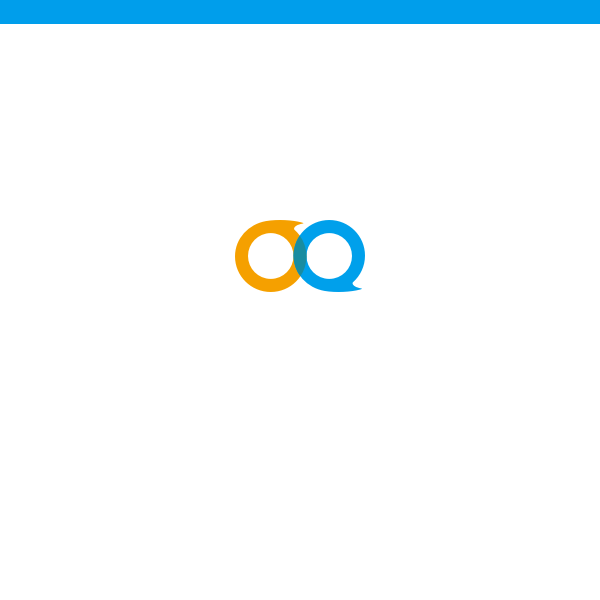

# Open Video Call Windows

This tutorial describes how to add video chat to your Windows applications using the Agora Video SDK.

With this sample app, you can:

- [Join/leave a channel](#add-the-channel-and-call-methods)
- [Mute/unmute audio](#add-the-audio-methods)
- [Enable/disable video](#add-the-video-and-screen-capture-methods)
- [Switch camera views](#add-the-video-device-control-methods)
- [Setup resolution, frame rate and bit rate](#add-the-video-and-screen-capture-methods)
- [Enable encryption](#add-the-encryption-render-and-whiteboard-methods)

## Prerequisites

**Note:** This demo is written in C++

* Visual C++ 2013+
* Windows OS 7+

## Quick Start

This section shows you how to prepare, build, and run the sample application.

- [Create an Account and Obtain an App ID](#create-an-account-and-obtain-an-app-id)
- [Update and Run the Sample Application](#update-and-run-the-sample-application) 


### Create an Account and Obtain an App ID
To build and run the sample application, you must obtain an app ID: 

1. Create a developer account at [agora.io](https://dashboard.agora.io/signin/). Once you finish the sign-up process, you are redirected to the dashboard.
2. Navigate in the dashboard tree on the left to **Projects** > **Project List**.
3. Copy the app ID that you obtained from the dashboard into a text file. You will use this when you launch the app.


### Update and Run the Sample Application 

1. Edit the `AgoraObject.h` file. In the `APP_ID` declaration, update `Your App ID` with your app ID.

``` C++
#define APP_ID _T("Your App ID")
```

2. Download the [Agora Video SDK](https://www.agora.io/en/download/). Unzip the downloaded SDK package and copy the `sdk` folder into the sample application's `OpenVideoCall` folder.

	**Note:** If the `sdk` folder already exists, you can overwrite it.
		
3. Open `OpenVideoCall.sln`. Build and run the project.

## Steps to Create the Sample 

- [Add Assets](#add-assets)
- [Create Main Application Classes](#create-main-application-classes)
- [Create Agora Handler Classes](#create-agora-handler-classes)

### Add Assets

The sample application uses assets located in the [`OpenVideoCall/res`](OpenVideoCall/res) folder.

The `ID_TEST_AUDIO.wav` asset is used for testing the user's audio device.

- [Add General Application Images](#add-general-application-images)
- [Add Menu Images](#add-menu-images)
- [Add Button Images](#add-button-images)

#### Add General Application Images

Asset|Image|Description
---|---|---
`IDB_DLG_LOGO.bmp`||Main application background image with the application logo.
`IDB_DLG_MAIN.bmp`||Blank main application background image.
`IDB_LOGO.bmp`||Logo image for the application.
OpenVideoCall.ico||Icon image for the application.
`IDB_BACKGROUND_VIDEO.bmp`||Image of a person icon in a circle, to represent a user.
`IDB_DESKTOPSHARE_VIDEO.bmp`||Image of a horizontal dual-pointed arrow within a monitor to represent desktop sharing.

#### Add Menu Images

Asset|Image|Description
---|---|---
`IDB_MENU_DEVICE.bmp`||Image of sliders for changing devices.
`IDB_MENU_FILTER.bmp`||Image of glasses for filtering.
`IDB_MENU_INFO.bmp`||Image of an i enclosed in a circle, for obtaining more information.
`IDB_MENU_MORE.bmp`||Images for information, device choosing, and filtering.
`IDB_NETWORK_QUALITY.bmp`||Images of network bars, to indicate network quality.
`IDB_CMBBTN.bmp`||Images of arrows for combobox dropdown menus.
`IDB_CMBSEL.bmp`||Image of a checkbox to indicate combobox menu selection.

#### Add Button Images

Asset|Image|Description
---|---|---
`IDB_BTNCLOSE.bmp`||Images of an X for a close button.
`IDB_BTNFULLSCR_VIDEO.bmp` and `IDB_BTNNORSCR_VIDEO.bmp`|| Images of diagonal arrows pointed out and pointed in, to enter/exit fullscreen mode.
`IDB_BTNMAX.bmp`||Images of a square, to maximize a window.
`IDB_BTNMIN.bmp`||Images of a horizontal line, to minimize a window.
`IDB_BTNRESTORE.bmp`||Images of concentric squares, to restore a window.
`IDB_BTNENDCALL_VIDEO.bmp`||Images of a red hangup phone to end calls.
`IDB_BTNAUDIO_VIDEO.bmp`||Images of a curved arrow and audio waves for controlling audio.
`IDB_BTNMAUDIO_VIDEO.bmp`||Images of a microphone with a cross over it, to mute the microphone.
`IDB_BTNVIDEO_VIDEO.bmp`||Images of a video camera to control video.
`IDB_BTNSCRCAP_VIDEO.bmp`||Images of a curved arrow in a display box, for screen capturing.
`IDB_BTNMSG_VIDEO.bmp`||Images of a chat button for messaging.
`IDB_BTNSETUP_VIDEO.bmp`||Images of sliders, to control video setup.
`IDB_BTNTIP_VIDEO.bmp`||Images of an i in a circle, to retrieve more information.
`IDB_BTNMORE_VIDEO.bmp`||Images of a horizontal line with 3 dots, to get more information.
`IDB_SLD_HOVER.bmp`||Images of an orange circle to indicate a hovered state.
`IDB_SLD_NORMAL.bmp`||Images of a blue circle to indicate a normal state.

### Create Main Application Classes

The main application classes are the key files that control the general construction and configuration of the application.

- [Create the OpenVideoCall Class](#create-the-openvideocall-class)
- [Create the AGEngineEventHandler Class](#create-the-agengineeventhandler-class)

#### Create the OpenVideoCall Class

The `OpenVideoCall` class defines overall application behavior methods.

- [Set App Settings and Declare Global App Variable](#set-app-settings-and-declare-global-app-variable)
- [Initialize the Application](#initialize-the-application)

##### Set App Settings and Declare Global App Variable

In the `COpenVideoCallApp`constructor, set the flag `m_dwRestartManagerSupportFlags` to support the Restart Manager using the value `AFX_RESTART_MANAGER_SUPPORT_RESTART`.

``` C++
// CAgoraVideoCallApp construction

COpenVideoCallApp::COpenVideoCallApp()
{
	// support Restart Manager
	m_dwRestartManagerSupportFlags = AFX_RESTART_MANAGER_SUPPORT_RESTART;
}
```

Declare a `COpenVideoCallApp` object. 

**Note:** `theApp` is the only `COpenVideoCallApp` object used throughout the application.

``` C++
// The one and only CAgoraVideoCallApp object

COpenVideoCallApp theApp;
```

##### Initialize the Application

Initialize the application using `InitInstance()`. The remaining code in this section are contained within this method declaration.

``` C++
// CAgoraVideoCallApp initialization

BOOL COpenVideoCallApp::InitInstance()
{
	...
}
```

1. Declare a common controls `INITCOMMONCONTROLSEX` object and set the `dwSize` property using `sizeof()`.
2. Set the `dwICC` property to `ICC_WIN95_CLASSES`.
3. Initialize the common controls using `InitCommonControlsEx()`.
4. Initialize the application using `InitInstance()`.

``` C++
	// InitCommonControlsEx() is required on Windows XP if an application
	// manifest specifies use of ComCtl32.dll version 6 or later to enable
	// visual styles.  Otherwise, any window creation will fail.
	INITCOMMONCONTROLSEX InitCtrls;
	InitCtrls.dwSize = sizeof(InitCtrls);
	// Set this to include all the common control classes you want to use
	// in your application.
	InitCtrls.dwICC = ICC_WIN95_CLASSES;
	InitCommonControlsEx(&InitCtrls);

	CWinApp::InitInstance();
```

Enable the control container using `AfxEnableControlContainer()` and create a shell manager `CShellManager` object.

Set the visual manager to use "Windows Native" by passing `CMFCVisualManagerWindows` into `SetDefaultManager()`.

``` C++
	AfxEnableControlContainer();

	// Create the shell manager, in case the dialog contains
	// any shell tree view or shell list view controls.
	CShellManager *pShellManager = new CShellManager;

	// Activate "Windows Native" visual manager for enabling themes in MFC controls
	CMFCVisualManager::SetDefaultManager(RUNTIME_CLASS(CMFCVisualManagerWindows));
```

Set the registry key to `Local AppWizard-Generated Applications` using `SetRegistryKey`.

**Note:** You can set the registry key to the name of your company or organization.

Enable the Agora whiteboard using `EnableWhiteboardVer()` and `EnableWhiteboardFeq()`.

``` C++
	// Standard initialization
	// If you are not using these features and wish to reduce the size
	// of your final executable, you should remove from the following
	// the specific initialization routines you do not need
	// Change the registry key under which our settings are stored
	// TODO: You should modify this string to be something appropriate
	// such as the name of your company or organization
	SetRegistryKey(_T("Local AppWizard-Generated Applications"));
	CAgoraObject::EnableWhiteboardVer(TRUE);
	CAgoraObject::EnableWhiteboardFeq(TRUE);
```

1. Initialize `nResponse` to `0` and declare a logo dialog window object `CLogoDlg`.
2. Load the `Logo` modal using `Logo.DoModal()` and declare an open video call dialog window object `COpenVideoCallDlg`.
3. Set `&avcDlg` to the main window and load the `avcDlg` modal using `avcDlg.DoModal()`.
4. Process the following based on the value of `nResponse`:

Value|Description|Process
---|---|---
`IDOK`|Dialog is dismissed with OK|Optional code handling.
`IDCANCEL`|Dialog is dismissed with Cancel|Optional code handling.
`-1`|Dialog creation error|Display app warnings for the dialog using `TRACE`.

``` C++
	INT_PTR nResponse = 0;
	CLogoDlg Logo;

	nResponse = Logo.DoModal();
	COpenVideoCallDlg	avcDlg;

	m_pMainWnd = &avcDlg;
	nResponse = avcDlg.DoModal();

	if (nResponse == IDOK)
	{
		// TODO: Place code here to handle when the dialog is
		//  dismissed with OK
	}
	else if (nResponse == IDCANCEL)
	{
		// TODO: Place code here to handle when the dialog is
		//  dismissed with Cancel
	}
	else if (nResponse == -1)
	{
		TRACE(traceAppMsg, 0, "Warning: dialog creation failed, so application is terminating unexpectedly.\n");
		TRACE(traceAppMsg, 0, "Warning: if you are using MFC controls on the dialog, you cannot #define _AFX_NO_MFC_CONTROLS_IN_DIALOGS.\n");
	}
```

If `pShellManager` is not `NULL`, delete `pShellManager`.

The dialog is closed, so return `FALSE` to exit the application.

``` C++
	// Delete the shell manager created above.
	if (pShellManager != NULL)
	{
		delete pShellManager;
	}

	// Since the dialog has been closed, return FALSE so that we exit the
	//  application, rather than start the application's message pump.
	return FALSE;

```

#### Create the AGEngineEventHandler Class

The `AGEngineEventHandler` class handles the event listeners for the Agora RTC engine.

- [Create General Engine Event Listeners](#create-general-engine-event-listeners)
- [Create Warning and Error Event Listeners](#create-warning-and-error-event-listeners)
- [Create Join / Leave Channel Event Listeners](#create-join-leave-channel-event-listeners)
- [Create Audio Event Listeners](#create-audio-event-listeners)
- [Create Video Event Listeners](#create-video-event-listeners)
- [Create Recording Event Listeners](#create-recording-event-listeners)
- [Create Device Event Listeners](#create-device-event-listeners)
- [Create User Event Listeners](#create-user-event-listeners)
- [Create Connection Event Listeners](#create-connection-event-listeners)
- [Create Statistics and Quality Event Listeners](#create-statistics-and-quality-event-listeners)


##### Create General Engine Event Listeners

The `onMediaEngineEvent` listener triggers when there is a key event on the Agora engine.

Create a new `LPAGE_MEDIA_ENGINE_EVENT` object and initialize `lpData->evt` to `evt`.

If the main window is not `NULL`, post the event details `lpData` using `PostMessage()`.

``` C++
void CAGEngineEventHandler::onMediaEngineEvent(int evt)
{
	LPAGE_MEDIA_ENGINE_EVENT lpData = new AGE_MEDIA_ENGINE_EVENT;

	lpData->evt = evt;

	if (m_hMainWnd != NULL)
		::PostMessage(m_hMainWnd, WM_MSGID(EID_MEDIA_ENGINE_EVENT), (WPARAM)lpData, 0);

}
```

The `onApiCallExecuted` listener triggers when an API call is executed.

Create a new `LPAGE_APICALL_EXECUTED` object and initialize `lpData-> error` to `error`.

If the main window is not `NULL`, post the event details `lpData` using `PostMessage()`.


``` C++
void CAGEngineEventHandler::onApiCallExecuted(const char* api, int error)
{
	LPAGE_APICALL_EXECUTED lpData = new AGE_APICALL_EXECUTED;

	strcpy_s(lpData->api, 128, api);
	lpData->error = error;

	if (m_hMainWnd != NULL)
		::PostMessage(m_hMainWnd, WM_MSGID(EID_APICALL_EXECUTED), (WPARAM)lpData, 0);
}
```

##### Create Warning and Error Event Listeners

The `onWarning` listener triggers when a warning occurs on the engine.

Create a string `onWarning`. You may optional add code to log details of the warning.

``` C++
void CAGEngineEventHandler::onWarning(int warn, const char* msg)
{
	CString str;

	str = _T("onWarning");
}
```

The `onError` listener triggers when an error occurs on the engine.

Create a new `LPAGE_ERROR` object and initialize `nMsgLen` to `0`.

If the `msg` is not `NULL`:

1. Set `nMsgLen` to the length of `msg` plus `1`.
2. Set `lpData-> error`.
3. Copy `msg` to `lpData->msg` using `strcpy_s()`.

If the `msg` is `NULL`, set `lpData->msg` to `NULL`.

Set `lpData->err` to `err`

Ensure `m_hMainWnd` is valid and post the event details `lpData` using `PostMessage()`.

``` C++
void CAGEngineEventHandler::onError(int err, const char* msg)
{
	LPAGE_ERROR lpData = new AGE_ERROR;

	int nMsgLen = 0;

	// attention: the pointer of msg maybe NULL!!!
	if(msg != NULL) {
		nMsgLen = strlen(msg) + 1;
		lpData->msg = new char[nMsgLen];
		strcpy_s(lpData->msg, nMsgLen, msg);
	}
	else
		lpData->msg = NULL;
	
	lpData->err = err;

	

	if(m_hMainWnd != NULL)
		::PostMessage(m_hMainWnd, WM_MSGID(EID_ERROR), (WPARAM)lpData, 0);

}
```

##### Create Join /  Leave Channel Event Listeners

The `onJoinChannelSuccess` listener triggers when a user successfully joins a channel.

1. Create a new `LPAGE_JOINCHANNEL_SUCCESS` object and initialize `nChannelLen` to the length of `channel` plus `1`.
2. Set the `channel`, `uid`, and `elapsed` properties of `lpData`.
3. Copy `channel` to `lpData->channel` using `strcpy_s()`.
4. Ensure `m_hMainWnd` is valid and post the event details `lpData` using `PostMessage()`.

``` C++
void CAGEngineEventHandler::onJoinChannelSuccess(const char* channel, uid_t uid, int elapsed)
{
	LPAGE_JOINCHANNEL_SUCCESS lpData = new AGE_JOINCHANNEL_SUCCESS;

	int nChannelLen = strlen(channel) + 1;
	lpData->channel = new char[nChannelLen];
	lpData->uid = uid;
	lpData->elapsed = elapsed;

	strcpy_s(lpData->channel, nChannelLen, channel);

	if(m_hMainWnd != NULL)
		::PostMessage(m_hMainWnd, WM_MSGID(EID_JOINCHANNEL_SUCCESS), (WPARAM)lpData, 0);
}
```

The `onRejoinChannelSuccess` listener triggers when a user successfully re-joins a channel.

1. Create a new `LPAGE_REJOINCHANNEL_SUCCESS` object and initialize `nChannelLen` to the length of `channel` plus `1`.
2. Set the `channel`, `uid`, and `elapsed` properties of `lpData`.
3. Copy `channel` to `lpData->channel` using `strcpy_s()`.
4. Ensure `m_hMainWnd` is valid and post the event details `lpData` using `PostMessage()`.

``` C++
void CAGEngineEventHandler::onRejoinChannelSuccess(const char* channel, uid_t uid, int elapsed)
{
	LPAGE_REJOINCHANNEL_SUCCESS lpData = new AGE_REJOINCHANNEL_SUCCESS;

	int nChannelLen = strlen(channel) + 1;
	lpData->channel = new char[nChannelLen];
	lpData->uid = uid;
	lpData->elapsed = elapsed;

	strcpy_s(lpData->channel, nChannelLen, channel);

	if(m_hMainWnd != NULL)
		::PostMessage(m_hMainWnd, WM_MSGID(EID_REJOINCHANNEL_SUCCESS), (WPARAM)lpData, 0);

}
```

The `onLeaveChannel` listener triggers when a user successfully leaves a channel.

1. Create a new `LPAGE_LEAVE_CHANNEL` object.
2. Copy `stat` to `lpData->rtcStat` using `memcpy()`.
3. Ensure `m_hMainWnd` is valid and post the event details `lpData` using `PostMessage()`.

``` C++
void CAGEngineEventHandler::onLeaveChannel(const RtcStats& stat)
{
	LPAGE_LEAVE_CHANNEL lpData = new AGE_LEAVE_CHANNEL;

	memcpy(&lpData->rtcStat, &stat, sizeof(RtcStats));

	if(m_hMainWnd != NULL)
		::PostMessage(m_hMainWnd, WM_MSGID(EID_LEAVE_CHANNEL), (WPARAM)lpData, 0);
}
```

##### Create Audio Event Listeners

The `onAudioQuality` listener triggers when the audio quality changes.

1. Create a new `LPAGE_AUDIO_QUALITY` object.
2. Set the `uid`, `quality`, `delay`, and `lost` properties of `lpData`.
3. Ensure `m_hMainWnd` is valid and post the event details `lpData` using `PostMessage()`.

``` C++
void CAGEngineEventHandler::onAudioQuality(uid_t uid, int quality, unsigned short delay, unsigned short lost)
{
	LPAGE_AUDIO_QUALITY lpData = new AGE_AUDIO_QUALITY;

	lpData->uid = uid;
	lpData->quality = quality;
	lpData->delay = delay;
	lpData->lost = lost;

	if(m_hMainWnd != NULL)
		::PostMessage(m_hMainWnd, WM_MSGID(EID_AUDIO_QUALITY), (WPARAM)lpData, 0);
}
```

The `onAudioVolumeIndication` listener triggers when the volume indicator changes.

1. Create a new `LPAGE_AUDIO_VOLUME_INDICATION` object.
2. Initialize the `speakers` property of `lpData`.
3. Copy `speakers` to `lpData->speakers` using `memcpy()`.
4. Set the `speakerNumber` and `totalVolume` properties of `lpData`.
3. Ensure `m_hMainWnd` is valid and post the event details `lpData` using `PostMessage()`.

``` C++
void CAGEngineEventHandler::onAudioVolumeIndication(const AudioVolumeInfo* speakers, unsigned int speakerNumber, int totalVolume)
{
	LPAGE_AUDIO_VOLUME_INDICATION lpData = new AGE_AUDIO_VOLUME_INDICATION;

	lpData->speakers = new AudioVolumeInfo[speakerNumber];
	memcpy(lpData->speakers, speakers, speakerNumber*sizeof(AudioVolumeInfo));
	lpData->speakerNumber = speakerNumber;
	lpData->totalVolume = totalVolume;

	if (m_hMainWnd != NULL)
		::PostMessage(m_hMainWnd, WM_MSGID(EID_AUDIO_VOLUME_INDICATION), (WPARAM)lpData, 0);

}
```

##### Create Video Event Listeners

The `onFirstLocalVideoFrame` listener triggers when the first local video frame is received.

1. Create a new `LPAGE_FIRST_LOCAL_VIDEO_FRAME` object.
2. Set the `width`, `height`, and `elapsed` properties of `lpData`.
3. Ensure `m_hMainWnd` is valid and post the event details `lpData` using `PostMessage()`.

``` C++
void CAGEngineEventHandler::onFirstLocalVideoFrame(int width, int height, int elapsed)
{
	LPAGE_FIRST_LOCAL_VIDEO_FRAME lpData = new AGE_FIRST_LOCAL_VIDEO_FRAME;

	lpData->width = width;
	lpData->height = height;
	lpData->elapsed = elapsed;

	if(m_hMainWnd != NULL)
		::PostMessage(m_hMainWnd, WM_MSGID(EID_FIRST_LOCAL_VIDEO_FRAME), (WPARAM)lpData, 0);

}
```

The `onFirstRemoteVideoDecoded` listener triggers when the first remote video frame is decoded.

1. Create a new `LPAGE_FIRST_REMOTE_VIDEO_DECODED` object.
2. Set the `width`, `height`, and `elapsed` properties of `lpData`.
3. Ensure `m_hMainWnd` is valid and post the event details `lpData` using `PostMessage()`.

``` C++
void CAGEngineEventHandler::onFirstRemoteVideoDecoded(uid_t uid, int width, int height, int elapsed)
{
	LPAGE_FIRST_REMOTE_VIDEO_DECODED lpData = new AGE_FIRST_REMOTE_VIDEO_DECODED;

	lpData->uid = uid;
	lpData->width = width;
	lpData->height = height;
	lpData->elapsed = elapsed;

	if(m_hMainWnd != NULL)
		::PostMessage(m_hMainWnd, WM_MSGID(EID_FIRST_REMOTE_VIDEO_DECODED), (WPARAM)lpData, 0);

}
```

The `onFirstRemoteVideoFrame` listener triggers when the first remote video frame is received.

1. Create a new `LPAGE_FIRST_REMOTE_VIDEO_FRAME` object.
2. Set the `uid`, `width`, `height`, and `elapsed` properties of `lpData`.
3. Ensure `m_hMainWnd` is valid and post the event details `lpData` using `PostMessage()`.


``` C++
void CAGEngineEventHandler::onFirstRemoteVideoFrame(uid_t uid, int width, int height, int elapsed)
{
	LPAGE_FIRST_REMOTE_VIDEO_FRAME lpData = new AGE_FIRST_REMOTE_VIDEO_FRAME;

	lpData->uid = uid;
	lpData->width = width;
	lpData->height = height;
	lpData->elapsed = elapsed;

	if(m_hMainWnd != NULL)
		::PostMessage(m_hMainWnd, WM_MSGID(EID_FIRST_REMOTE_VIDEO_FRAME), (WPARAM)lpData, 0);

}
```

The `onVideoStopped` listener triggers when the video stops.

Ensure `m_hMainWnd` is valid and post the video stop notice using `PostMessage()`.

``` C++
void CAGEngineEventHandler::onVideoStopped()
{
	if (m_hMainWnd != NULL)
		::PostMessage(m_hMainWnd, WM_MSGID(EID_VIDEO_STOPPED), 0, 0);
}
```

##### Create Recording Event Listeners

The `onStartRecordingService` listener triggers when recording starts.

Ensure `m_hMainWnd` is valid and post the video start notice using `PostMessage()`.

``` C++
void CAGEngineEventHandler::onStartRecordingService(int error)
{
	if (m_hMainWnd != NULL)
		::PostMessage(m_hMainWnd, WM_MSGID(EID_START_RCDSRV), 0, 0);

}
```

The `onStopRecordingService` listener triggers when recording stops.

Ensure `m_hMainWnd` is valid and post the recording stop notice using `PostMessage()`.

``` C++
void CAGEngineEventHandler::onStopRecordingService(int error)
{
	if (m_hMainWnd != NULL)
		::PostMessage(m_hMainWnd, WM_MSGID(EID_STOP_RCDSRV), 0, 0);

}
```

The `onRefreshRecordingServiceStatus` listener triggers when the recording status refreshes.

1. Create a new `LPAGE_RCDSRV_STATUS` object.
2. Set the `status` property of `lpData`.
3. Ensure `m_hMainWnd` is valid and post the event details `lpData` using `PostMessage()`.

``` C++
void CAGEngineEventHandler::onRefreshRecordingServiceStatus(int status)
{
	LPAGE_RCDSRV_STATUS lpData = new AGE_RCDSRV_STATUS;

	lpData->status = status;

	if (m_hMainWnd != NULL)
		::PostMessage(m_hMainWnd, WM_MSGID(EID_REFREASH_RCDSRV), (WPARAM)lpData, 0);
}
```

##### Create Device Event Listeners

The `onAudioDeviceStateChanged` listener triggers when the audio device state changes.

1. Create a new `LPAGE_AUDIO_DEVICE_STATE_CHANGED` object.
2. Initialize `nDeviceIDLen` with a length of `deviceId` plus `1`. 
3. Set the `deviceId` property of `lpData`.
4. Copy `deviceId` into `lpData->deviceId` using `strcpy_s()`
5. Set the `deviceType` and `deviceState` properties of `lpData`.
3. Ensure `m_hMainWnd` is valid and post the event details `lpData` using `PostMessage()`.

``` C++
void CAGEngineEventHandler::onAudioDeviceStateChanged(const char* deviceId, int deviceType, int deviceState)
{
	LPAGE_AUDIO_DEVICE_STATE_CHANGED lpData = new AGE_AUDIO_DEVICE_STATE_CHANGED;

	int nDeviceIDLen = strlen(deviceId) + 1;

	lpData->deviceId = new char[nDeviceIDLen];

	strcpy_s(lpData->deviceId, nDeviceIDLen, deviceId);
	lpData->deviceType = deviceType;
	lpData->deviceState = deviceState;

	if (m_hMainWnd != NULL)
		::PostMessage(m_hMainWnd, WM_MSGID(EID_AUDIO_DEVICE_STATE_CHANGED), (WPARAM)lpData, 0);

}
```

The `onVideoDeviceStateChanged` listener triggers when the video device state changes.

1. Create a new `LPAGE_VIDEO_DEVICE_STATE_CHANGED` object.
2. Initialize `nDeviceIDLen` with a length of `deviceId` plus `1`. 
3. Set the `deviceId` property of `lpData`.
4. Copy `deviceId` into `lpData->deviceId` using `strcpy_s()`
5. Set the `deviceType` and `deviceState` properties of `lpData`.
6. Ensure `m_hMainWnd` is valid and post the event details `lpData` using `PostMessage()`.

``` C++
void CAGEngineEventHandler::onVideoDeviceStateChanged(const char* deviceId, int deviceType, int deviceState)
{
	LPAGE_VIDEO_DEVICE_STATE_CHANGED lpData = new AGE_VIDEO_DEVICE_STATE_CHANGED;

	int nDeviceIDLen = strlen(deviceId) + 1;

	lpData->deviceId = new char[nDeviceIDLen];

	strcpy_s(lpData->deviceId, nDeviceIDLen, deviceId);
	lpData->deviceType = deviceType;
	lpData->deviceState = deviceState;

	if (m_hMainWnd != NULL)
		::PostMessage(m_hMainWnd, WM_MSGID(EID_VIDEO_DEVICE_STATE_CHANGED), (WPARAM)lpData, 0);

}
```

The `onCameraReady` listener triggers when the camera is ready.

Ensure `m_hMainWnd` is valid and post the event notice using `PostMessage()`.

``` C++
void CAGEngineEventHandler::onCameraReady()
{
	if(m_hMainWnd != NULL)
		::PostMessage(m_hMainWnd, WM_MSGID(EID_CAMERA_READY), 0, 0);

}
```

##### Create User Event Listeners

The `onUserJoined` listener triggers when a user joins the channel.

1. Create a new `LPAGE_USER_JOINED` object.
2. Set the `uid` and `elapsed` properties of `lpData`.
3. Ensure `m_hMainWnd` is valid and post the event details `lpData` using `PostMessage()`.

``` C++
void CAGEngineEventHandler::onUserJoined(uid_t uid, int elapsed)
{
	LPAGE_USER_JOINED lpData = new AGE_USER_JOINED;

	lpData->uid = uid;
	lpData->elapsed = elapsed;

	if(m_hMainWnd != NULL)
		::PostMessage(m_hMainWnd, WM_MSGID(EID_USER_JOINED), (WPARAM)lpData, 0);
}
```

The `onUserOffline` listener triggers when a user goes offline.

1. Create a new `LPAGE_USER_OFFLINE` object.
2. Set the `uid` and `reason` properties of `lpData`.
3. Ensure `m_hMainWnd` is valid and post the event details `lpData` using `PostMessage()`.

``` C++
void CAGEngineEventHandler::onUserOffline(uid_t uid, USER_OFFLINE_REASON_TYPE reason)
{
	LPAGE_USER_OFFLINE lpData = new AGE_USER_OFFLINE;

	lpData->uid = uid;
	lpData->reason = reason;

	if(m_hMainWnd != NULL)
		::PostMessage(m_hMainWnd, WM_MSGID(EID_USER_OFFLINE), (WPARAM)lpData, 0);
}
```

The `onUserMuteAudio` listener triggers when a user mutes/unmutes their audio.

1. Create a new `LPAGE_USER_MUTE_AUDIO` object.
2. Set the `uid` and `muted` properties of `lpData`.
3. Ensure `m_hMainWnd` is valid and post the event details `lpData` using `PostMessage()`.

``` C++
void CAGEngineEventHandler::onUserMuteAudio(uid_t uid, bool muted)
{
	LPAGE_USER_MUTE_AUDIO lpData = new AGE_USER_MUTE_AUDIO;

	lpData->uid = uid;
	lpData->muted = muted;

	if(m_hMainWnd != NULL)
		::PostMessage(m_hMainWnd, WM_MSGID(EID_USER_MUTE_AUDIO), (WPARAM)lpData, 0);

}
```

The `onUserMuteVideo` listener triggers when a user starts/stops their video.

1. Create a new `LPAGE_USER_MUTE_VIDEO` object.
2. Set the `uid` and `muted` properties of `lpData`.
3. Ensure `m_hMainWnd` is valid and post the event details `lpData` using `PostMessage()`.

``` C++
void CAGEngineEventHandler::onUserMuteVideo(uid_t uid, bool muted)
{
	LPAGE_USER_MUTE_VIDEO lpData = new AGE_USER_MUTE_VIDEO;

	lpData->uid = uid;
	lpData->muted = muted;

	if(m_hMainWnd != NULL)
		::PostMessage(m_hMainWnd, WM_MSGID(EID_USER_MUTE_VIDEO), (WPARAM)lpData, 0);

}
```

The `onUserMuteVideo` listener triggers when a user starts/stops their video.

1. Create a new `LPAGE_STREAM_MESSAGE` object.
2. Set the `uid`, `streamId`,`data`, and `length` properties of `lpData`.
3. Ensure `m_hMainWnd` is valid and post the event details `lpData` using `PostMessage()`.

``` C++
void CAGEngineEventHandler::onStreamMessage(uid_t uid, int streamId, const char* data, size_t length)
{
    LPAGE_STREAM_MESSAGE lpData = new AGE_STREAM_MESSAGE;

    lpData->uid = uid;
    lpData->streamId = streamId;
    lpData->data = new char[length];
    lpData->length = length;

    memcpy_s(lpData->data, length, data, length);

    if (m_hMainWnd != NULL)
        ::PostMessage(m_hMainWnd, WM_MSGID(EID_STREAM_MESSAGE), (WPARAM)lpData, 0);

}
```

The `onUserEnableVideo` listener triggers when a user enables video.

No executable code is required, but you can use this listener to post messages about the event.

``` C++
void CAGEngineEventHandler::onUserEnableVideo(uid_t uid, bool enabled)
{
//	if (m_hMainWnd != NULL)
//		::PostMessage(m_hMainWnd, WM_MSGID(EID_CONNECTION_LOST), 0, 0);

}
```

##### Create Connection Event Listeners

The `onConnectionLost` listener triggers when a connection is lost.

Ensure `m_hMainWnd` is valid and post the event notice using `PostMessage()`.

``` C++
void CAGEngineEventHandler::onConnectionLost()
{
	if(m_hMainWnd != NULL)
		::PostMessage(m_hMainWnd, WM_MSGID(EID_CONNECTION_LOST), 0, 0);
}
```

The `onConnectionInterrupted` listener triggers when a connection is interrupted.

Declare a string with the value `onConnectionInterrupted`.

``` C++
void CAGEngineEventHandler::onConnectionInterrupted()
{
	CString str;

	str = _T("onConnectionInterrupted");
}
```

##### Create Statistics and Quality Event Listeners

The `onRtcStats` listener triggers when the RTC statistics change.

Declare a string with the value `stat`.

``` C++
void CAGEngineEventHandler::onRtcStats(const RtcStats& stat)
{
	CString str;

	str = _T("stat");
}
```

The `onLastmileQuality` listener triggers when the last mile quality changes.

1. Create a new `LPAGE_LASTMILE_QUALITY` object.
2. Set the `quality` property of `lpData`.
3. Ensure `m_hMainWnd` is valid and post the event details `lpData` using `PostMessage()`.

``` C++
void CAGEngineEventHandler::onLastmileQuality(int quality)
{
    LPAGE_LASTMILE_QUALITY lpData = new AGE_LASTMILE_QUALITY;

	lpData->quality = quality;

	if(m_hMainWnd != NULL)
        ::PostMessage(m_hMainWnd, WM_MSGID(EID_LASTMILE_QUALITY), (WPARAM)lpData, 0);

}
```

The `onLocalVideoStats` listener triggers when the local video statistics change.

1. Create a new `LPAGE_LOCAL_VIDEO_STAT` object.
2. Set the `sentBitrate` and `sentFrameRate` properties of `lpData`.
3. Ensure `m_hMainWnd` is valid and post the event details `lpData` using `PostMessage()`.

``` C++
void CAGEngineEventHandler::onLocalVideoStats(const LocalVideoStats& stats)
{
	LPAGE_LOCAL_VIDEO_STAT lpData = new AGE_LOCAL_VIDEO_STAT;

	lpData->sentBitrate = stats.sentBitrate;
	lpData->sentFrameRate = stats.sentFrameRate;

	if(m_hMainWnd != NULL)
		::PostMessage(m_hMainWnd, WM_MSGID(EID_LOCAL_VIDEO_STAT), (WPARAM)lpData, 0);

}
```

The `onRemoteVideoStats` listener triggers when the remote video statistics change.

1. Create a new `LPAGE_REMOTE_VIDEO_STAT` object.
2. Set the `uid`, `delay`, `width`, `height`, `receivedFrameRate`, `receivedBitrate`, and `receivedFrameRate` properties of `lpData`.
3. Ensure `m_hMainWnd` is valid and post the event details `lpData` using `PostMessage()`.

``` C++
void CAGEngineEventHandler::onRemoteVideoStats(const RemoteVideoStats& stats)
{
	LPAGE_REMOTE_VIDEO_STAT lpData = new AGE_REMOTE_VIDEO_STAT;

	lpData->uid = stats.uid;
	lpData->delay = stats.delay;
	lpData->width = stats.width;
	lpData->height = stats.height;
	lpData->receivedFrameRate = stats.receivedFrameRate;
	lpData->receivedBitrate = stats.receivedBitrate;
	lpData->receivedFrameRate = stats.receivedFrameRate;

	if(m_hMainWnd != NULL)
		::PostMessage(m_hMainWnd, WM_MSGID(EID_REMOTE_VIDEO_STAT), (WPARAM)lpData, 0);
}
```

### Create Agora Handler Classes

The classes in this section manage communication between the application and the Agora SDK.

- [Create the AgoraAudInputManager Class](#create-the-agoraaudinputmanager-class)
- [Create the AgoraCameraManager Class](#create-the-agoracameramanager-class)
- [Create the AgoraPlayoutManager Class](#create-the-agoraplayoutManager-class)
- [Create the AgoraObject Class](#create-the-agoraobject-class)

#### Create the AgoraAudInputManager Class

The `AgoraAudInputManager` class manages the audio input devices for the application.

- [Initialize the AgoraAudInputManager Class](#initialize-the-agoraaudinputmanager-class)
- [Add the AgoraAudInputManager Create / Close Methods](#add-the-agoraaudinputmanager-create-close-methods)
- [Add the Volume Control Methods](#add-the-volume-control-methods)
- [Add the Audio Device Info Methods](#add-the-audio-device-info-methods)
- [Add the Audio Device Control Methods](#add-the-audio-device-control-methods)

##### Initialize the AgoraAudInputManager Class

When `CAgoraAudInputManager` starts, initialize the `m_ptrDeviceManager`, `m_lpCollection`, and `m_bTestingOn` variables.

``` C++
CAgoraAudInputManager::CAgoraAudInputManager()
	: m_ptrDeviceManager(NULL)
	, m_lpCollection(NULL)
	, m_bTestingOn(FALSE)
{
}
```

When `CAgoraAudInputManager` closes, invoke the `Close()` method.

``` C++
CAgoraAudInputManager::~CAgoraAudInputManager()
{
	Close();
}
```

##### Add the AgoraAudInputManager Create / Close Methods

The `Create()` method updates the available devices.

1. Set `m_ptrDeviceManager` to a `AAudioDeviceManager` object with the Agora engine `lpRtcEngine`.
2. If `m_ptrDeviceManager` is not valid or `m_ptrDeviceManager->get()` is `NULL` return `FALSE` to indicate failed creation.
3. Retrieve the list of recording devices using `(*m_ptrDeviceManager)->enumerateRecordingDevices()`.
4. If `m_lpCollection` is `NULL`, delete `m_ptrDeviceManager` and set it to `NULL`.
5. Return `TRUE` if `m_lpCollection` is valid; otherwise return `FALSE`.

``` C++
BOOL CAgoraAudInputManager::Create(IRtcEngine *lpRtcEngine)
{
	m_ptrDeviceManager = new AAudioDeviceManager(lpRtcEngine);
	if (m_ptrDeviceManager == NULL || m_ptrDeviceManager->get() == NULL)
		return FALSE;

	m_lpCollection = (*m_ptrDeviceManager)->enumerateRecordingDevices();
	if (m_lpCollection == NULL) {
		delete m_ptrDeviceManager;
		m_ptrDeviceManager = NULL;
	}

	
	return m_lpCollection != NULL ? TRUE : FALSE;
}
```

The `Close()` method removes and clears the device management variables.

- If `m_lpCollection` is not `NULL`, release the variable using `release()` and set it to `NULL`.
- If `m_ptrDeviceManager` is not `NULL`, release the variable using `release()` and set it to `NULL`.

``` C++
void CAgoraAudInputManager::Close()
{
	if (m_lpCollection != NULL){
		m_lpCollection->release();
		m_lpCollection = NULL;
	}

	if (m_ptrDeviceManager != NULL) {
		delete m_ptrDeviceManager;
		m_ptrDeviceManager = NULL;
	}
}
```

##### Add the Volume Control Methods

The `GetVolume()` method retrieves the current volume.

1. Initialize `nVol` to `0`.
2. If `m_ptrDeviceManager` or `m_ptrDeviceManager->get()` is `NULL`, return `0`.
3. Set `nVol` with the recording device volume using `(*m_ptrDeviceManager)->getRecordingDeviceVolume()`.
4. Return `nVol`.

``` C++
UINT CAgoraAudInputManager::GetVolume()
{
	int nVol = 0;

	if (m_ptrDeviceManager == NULL || m_ptrDeviceManager->get() == NULL)
		return 0;

	(*m_ptrDeviceManager)->getRecordingDeviceVolume(&nVol);

	return (UINT)nVol;
}
```

The `SetVolume()` method sets the current volume.

1. If `m_ptrDeviceManager` or `m_ptrDeviceManager->get()` is `NULL`, return `FALSE`.
2. Set the volume with `nVol` using `(*m_ptrDeviceManager)->getRecordingDeviceVolume()` and initialize `nRet` with the result.
3. Return `TRUE` if `nRet` is equal to `0`; otherwise return `FALSE`.


``` C++
BOOL CAgoraAudInputManager::SetVolume(UINT nVol)
{
	if (m_ptrDeviceManager == NULL || m_ptrDeviceManager->get() == NULL)
		return FALSE;

	int nRet = (*m_ptrDeviceManager)->setRecordingDeviceVolume((int)nVol);

	return nRet == 0 ? TRUE : FALSE;
}
```

##### Add the Audio Device Info Methods

The `GetDeviceCount()` method retrieves the number of devices.

If `m_lpCollection` is not `NULL`, return the device count using `m_lpCollection->getCount()`; otherwise return `0`.

``` C++
UINT CAgoraAudInputManager::GetDeviceCount()
{
	if (m_lpCollection != NULL)
		return (UINT)m_lpCollection->getCount();

	return 0;
}
```

The `GetDevice()` method retrieves the specified device.

1. Initialize `szDeviceName` and `szDeviceID` with `MAX_DEVICE_ID_LENGTH`.
2. Ensure `nIndex` in less than the number of devices.
3. If `nIndex` is greater than or equal to the number of devices or `m_lpCollection` is `NULL`, return `FALSE`.
4. Retrieve the device for `nIndex` using `m_lpCollection->getDevice()`. If the result is not equal to `0`, return `FALSE`.
5. If using `UNICODE`, convert `szDeviceName` and `szDeviceID` using `MultiByteToWideChar()` and release the buffers using `ReleaseBuffer()`. Otherwise, set the values of `strDeviceName` and `strDeviceID`.
6. Return `TRUE` to close the method.

``` C++
BOOL CAgoraAudInputManager::GetDevice(UINT nIndex, CString &rDeviceName, CString &rDeviceID)
{
	CHAR szDeviceName[MAX_DEVICE_ID_LENGTH];
	CHAR szDeviceID[MAX_DEVICE_ID_LENGTH];

	ASSERT(nIndex < GetDeviceCount());

	if (nIndex >= GetDeviceCount())
		return FALSE;

	if (m_lpCollection == NULL)
		return FALSE;

	int nRet = m_lpCollection->getDevice(nIndex, szDeviceName, szDeviceID);
	if (nRet != 0)
		return FALSE;

#ifdef UNICODE
	::MultiByteToWideChar(CP_UTF8, 0, szDeviceName, -1, rDeviceName.GetBuffer(MAX_DEVICE_ID_LENGTH), MAX_DEVICE_ID_LENGTH);
	::MultiByteToWideChar(CP_UTF8, 0, szDeviceID, -1, rDeviceID.GetBuffer(MAX_DEVICE_ID_LENGTH), MAX_DEVICE_ID_LENGTH);

	rDeviceName.ReleaseBuffer();
	rDeviceID.ReleaseBuffer();
#else
	strDeviceName = szDeviceName;
	strDeviceID = szDeviceID;
#endif

	return TRUE;
}
```

The `GetCurDeviceID()` method retrieves the current device.

1. Declare `str` and initialize `szDeviceID` with `MAX_DEVICE_ID_LENGTH`.
2. If `m_ptrDeviceManager` or `m_ptrDeviceManager->get()` is `NULL`, return `str`.
3. Retrieve the recording device for `szDeviceID` using `(*m_ptrDeviceManager)->getRecordingDevice()`.
4. If using `UNICODE`, convert `szDeviceName` using `MultiByteToWideChar()` and release the buffer using `ReleaseBuffer()`. Otherwise, set the value of `strDeviceName` to `szDeviceID`.
5. Return `str` to close the method.

``` C++
CString CAgoraAudInputManager::GetCurDeviceID()
{
	CString		str;
	CHAR		szDeviceID[MAX_DEVICE_ID_LENGTH];
	
	if (m_ptrDeviceManager == NULL || m_ptrDeviceManager->get() == NULL)
		return str;

	(*m_ptrDeviceManager)->getRecordingDevice(szDeviceID);

#ifdef UNICODE
	::MultiByteToWideChar(CP_UTF8, 0, szDeviceID, -1, str.GetBuffer(MAX_DEVICE_ID_LENGTH), MAX_DEVICE_ID_LENGTH);
	str.ReleaseBuffer();
#else
	strDeviceName = szDeviceID;
#endif

	return str;
}
```

##### Add the Audio Device Control Methods

The `SetCurDevice()` method sets the current device.

If `m_ptrDeviceManager` or `m_ptrDeviceManager->get()` is `NULL`, return `FALSE`.

If using `UNICODE`:
- Initialize `szDeviceID`.
- Convert `lpDeviceID` and `szDeviceID` using `MultiByteToWideChar()`.
- Set the recording device with `szDeviceID` using `(*m_ptrDeviceManager)->setRecordingDevice()` and set `nRet` with the result.

Otherwise, set the recording device with `lpDeviceID` using `(*m_ptrDeviceManager)->setRecordingDevice()` and set `nRet` with the result.

Close the method by returning `TRUE` if `nRet` is equal to `0` or `FALSE` if otherwise.

``` C++
BOOL CAgoraAudInputManager::SetCurDevice(LPCTSTR lpDeviceID)
{
	if (m_ptrDeviceManager == NULL || m_ptrDeviceManager->get() == NULL)
		return FALSE;

#ifdef UNICODE
	CHAR szDeviceID[128];
	::WideCharToMultiByte(CP_ACP, 0, lpDeviceID, -1, szDeviceID, 128, NULL, NULL);
	int nRet = (*m_ptrDeviceManager)->setRecordingDevice(szDeviceID);
#else
	int nRet = (*m_ptrDeviceManager)->setRecordingDevice(lpDeviceID);
#endif

	return nRet == 0 ? TRUE : FALSE;
}
```

The `TestAudInputDevice()` method tests the audio input device.

If `m_ptrDeviceManager` or `m_ptrDeviceManager->get()` is `NULL`, set a `return` to stop method execution.

If `bTestOn` is valid and `m_bTestingOn` is invalid:

- Retrieve the message handler using `GetAgoraObject()->GetMsgHandlerWnd()`.
- Set the message with `hMsgWnd` using `GetAgoraObject()->SetMsgHandlerWnd`.
- Create a new `IRtcEngine` object using `GetEngine()`.
- Declare a `RtcEngineParameters` object and enable the audio volume indicator using `rep.enableAudioVolumeIndication()`.
- Start the recording device test using `(*m_ptrDeviceManager)->startRecordingDeviceTest()`.

If `bTestOn` is invalid and `m_bTestingOn` is valid:

- Retrieve the message handler using `GetAgoraObject()->GetMsgHandlerWnd()`.
- Stop the recording device test using `(*m_ptrDeviceManager)-> stopRecordingDeviceTest()`.

Complete the method by updating `m_bTestingOn`.

``` C++
void CAgoraAudInputManager::TestAudInputDevice(HWND hMsgWnd, BOOL bTestOn)
{
	if (m_ptrDeviceManager == NULL || m_ptrDeviceManager->get() == NULL)
		return;

	if (bTestOn && !m_bTestingOn) {
		m_hOldMsgWnd = CAgoraObject::GetAgoraObject()->GetMsgHandlerWnd();
		CAgoraObject::GetAgoraObject()->SetMsgHandlerWnd(hMsgWnd);

		IRtcEngine *lpRtcEngine = CAgoraObject::GetEngine();
		RtcEngineParameters rep(*lpRtcEngine);
		rep.enableAudioVolumeIndication(1000, 10);
		(*m_ptrDeviceManager)->startRecordingDeviceTest(1000);
	}
	else if (!bTestOn && m_bTestingOn){
		CAgoraObject::GetAgoraObject()->SetMsgHandlerWnd(m_hOldMsgWnd);
		(*m_ptrDeviceManager)->stopRecordingDeviceTest();
	}

	m_bTestingOn = bTestOn;

}
```

#### Create the AgoraCameraManager Class

The `AgoraCameraManager` class manages the camera devices for the application.


- [Initialize the CAgoraCameraManager Class](#initialize-the-cagoracameramanager-class)
- [Add the CAgoraCameraManager Create / Close Methods](#add-the-cagoracameramanager-create-close-methods)
- [Add the Video Device Info Methods](#add-the-video-device-info-methods)
- [Add the Video Device Control Methods](#add-the-video-device-control-methods)

##### Initialize the CAgoraCameraManager Class

When `CAgoraCameraManager` starts, initialize the `m_ptrDeviceManager` and `m_lpCollection` variables.

``` C++
CAgoraCameraManager::CAgoraCameraManager()
	: m_ptrDeviceManager(NULL)
	, m_lpCollection(NULL)
{
}
```

When the `CAgoraAudInputManager` closes, invoke the `Close()` method.

``` C++
CAgoraCameraManager::~CAgoraCameraManager()
{
	Close();
}
```

##### Add the CAgoraCameraManager Create / Close Methods

The `Create()` method updates the available video devices.

1. Set `m_ptrDeviceManager` to a `AAudioDeviceManager` object with the Agora engine `lpRtcEngine`.
2. If `m_ptrDeviceManager` is not valid or `m_ptrDeviceManager->get()` is `NULL` return `FALSE` indicate failed creation.
3. Retrieve the list of video devices using `(*m_ptrDeviceManager)->enumerateVideoDevices()`.
4. If `m_lpCollection` is `NULL`, delete `m_ptrDeviceManager` and set it to `NULL`.
5. Return `TRUE` if `m_lpCollection` is valid; otherwise return `FALSE`.

``` C++
BOOL CAgoraCameraManager::Create(IRtcEngine *lpRtcEngine)
{
//	lpRtcEngine->enableVideo();

	m_ptrDeviceManager = new AVideoDeviceManager(lpRtcEngine);
	if (m_ptrDeviceManager == NULL || m_ptrDeviceManager->get() == NULL)
		return FALSE;

	m_lpCollection = (*m_ptrDeviceManager)->enumerateVideoDevices();
	if (m_lpCollection == NULL) {
		delete m_ptrDeviceManager;
		m_ptrDeviceManager = NULL;
	}

	return m_lpCollection != NULL ? TRUE : FALSE;
}
```

The `Close()` method removes and clears the device management variables.

- If `m_lpCollection` is not `NULL`, release the variable using `release()` and set it to `NULL`.
- If `m_ptrDeviceManager` is not `NULL`, release the variable using `release()` and set it to `NULL`.

``` C++
void CAgoraCameraManager::Close()
{
	if (m_lpCollection != NULL){
		m_lpCollection->release();
		m_lpCollection = NULL;
	}

	if (m_ptrDeviceManager != NULL) {
		delete m_ptrDeviceManager;
		m_ptrDeviceManager = NULL;
	}
}
```

##### Add the Video Device Info Methods

The `GetDeviceCount()` method retrieves the number of devices.

If `m_lpCollection` is not `NULL`, return the device count using `m_lpCollection->getCount()`; otherwise return `0`.

``` C++
UINT CAgoraCameraManager::GetDeviceCount()
{
	if (m_lpCollection == NULL)
		return 0;

	return (UINT)m_lpCollection->getCount();
}
```

The `GetCurDeviceID()` method retrieves the current device.

1. Declare `str` and initialize `szDeviceID` with `MAX_DEVICE_ID_LENGTH`.
2. If `m_ptrDeviceManager` or `m_ptrDeviceManager->get()` is `NULL`, return `str`.
3. Allocate memory for `szDeviceID` using `memset`.
3. Retrieve the device for `szDeviceID` using `(*m_ptrDeviceManager)->getDevice()`.
4. If using `UNICODE`, convert `szDeviceName` using `MultiByteToWideChar()` and release the buffer using `ReleaseBuffer()`. Otherwise, set the value of `strDeviceName` to `szDeviceID`.
5. Return `str` to close the method.

``` C++
CString CAgoraCameraManager::GetCurDeviceID()
{
	CString		str;
	CHAR		szDeviceID[MAX_DEVICE_ID_LENGTH];

	if (m_ptrDeviceManager == NULL || m_ptrDeviceManager->get() == NULL)
		return str;

	memset(szDeviceID, 0x00, MAX_DEVICE_ID_LENGTH);
	if (m_ptrDeviceManager != NULL && m_ptrDeviceManager->get() != NULL)
		(*m_ptrDeviceManager)->getDevice(szDeviceID);

#ifdef UNICODE
	::MultiByteToWideChar(CP_UTF8, 0, szDeviceID, -1, str.GetBuffer(MAX_DEVICE_ID_LENGTH), MAX_DEVICE_ID_LENGTH);
	str.ReleaseBuffer();
#else
	strDeviceName = szDeviceID;
#endif

	return str;
}
```

The `GetDevice()` method retrieves the specified device.

1. Initialize `szDeviceName` and `szDeviceID` with `MAX_DEVICE_ID_LENGTH`.
2. Ensure `nIndex` in less than the number of devices.
3. If `nIndex` is greater than or equal to the number of devices or `m_lpCollection` is `NULL`, return `FALSE`.
4. Retrieve the device for `nIndex` using `m_lpCollection->getDevice()`. If the result is not equal to `0`, return `FALSE`.
5. If using `UNICODE`, convert `szDeviceName` and `szDeviceID` using `MultiByteToWideChar()` and release the buffers using `ReleaseBuffer()`. Otherwise, set the values of `strDeviceName` and `strDeviceID`.
6. Return `TRUE` to close the method.

``` C++
BOOL CAgoraCameraManager::GetDevice(UINT nIndex, CString &rDeviceName, CString &rDeviceID)
{
	CHAR szDeviceName[MAX_DEVICE_ID_LENGTH];
	CHAR szDeviceID[MAX_DEVICE_ID_LENGTH];

	ASSERT(nIndex < GetDeviceCount());
	if (nIndex >= GetDeviceCount())
		return FALSE;

	if(m_lpCollection == NULL)
		return FALSE;

	int nRet = m_lpCollection->getDevice(nIndex, szDeviceName, szDeviceID);
	if (nRet != 0)
		return FALSE;

#ifdef UNICODE
	::MultiByteToWideChar(CP_UTF8, 0, szDeviceName, -1, rDeviceName.GetBuffer(MAX_DEVICE_ID_LENGTH), MAX_DEVICE_ID_LENGTH);
	::MultiByteToWideChar(CP_UTF8, 0, szDeviceID, -1, rDeviceID.GetBuffer(MAX_DEVICE_ID_LENGTH), MAX_DEVICE_ID_LENGTH);

	rDeviceName.ReleaseBuffer();
	rDeviceID.ReleaseBuffer();
#else
	strDeviceName = szDeviceName;
	strDeviceID = szDeviceID;
#endif

	return TRUE;
}
```

##### Add the Video Device Control Methods

The `SetCurDevice()` method sets the current device.

If `m_ptrDeviceManager` is `NULL`, return `FALSE`.

If using `UNICODE`, set the device with `szDeviceID` using `(*m_ptrDeviceManager)->setDevice()` and set `nRet` with the result.

Otherwise, set the recording device with `lpDeviceID` using `(*m_ptrDeviceManager)->setDevice()` and set `nRet` with the result.

Close the method by returning `TRUE` if `nRet` is equal to `0` or `FALSE` if otherwise.

``` C++
BOOL CAgoraCameraManager::SetCurDevice(LPCTSTR lpDeviceID)
{
	if (m_ptrDeviceManager == NULL || *m_ptrDeviceManager == NULL)
		return FALSE;

#ifdef UNICODE
	CHAR szDeviceID[128];
	::WideCharToMultiByte(CP_UTF8, 0, lpDeviceID, -1, szDeviceID, 128, NULL, NULL);
	int nRet = (*m_ptrDeviceManager)->setDevice(szDeviceID);
#else
	int nRet = (*m_ptrDeviceManager)->setDevice(lpDeviceID);
#endif

	return nRet == 0 ? TRUE : FALSE;
}
```

The `TestCameraDevice()` method tests the camera device.

If `m_ptrDeviceManager` or `m_ptrDeviceManager->get()` is `NULL`, set a `return` to stop method execution.

If `bTestOn` is valid and `m_bTestingOn` is invalid, ensure `hVideoWnd` is not `NULL` and turn on the local video preview by passing `TRUE` into `GetAgoraObject()->LocalVideoPreview()`.

If `bTestOn` is invalid and `m_bTestingOn` is valid, turn off the local video preview by passing `FALSE` into `GetAgoraObject()->LocalVideoPreview()`.

Complete the method by updating `m_bTestingOn`.

``` C++
void CAgoraCameraManager::TestCameraDevice(HWND hVideoWnd, BOOL bTestOn)
{
	if (bTestOn && !m_bTestingOn) {
		ASSERT(hVideoWnd != NULL);
		CAgoraObject::GetAgoraObject()->LocalVideoPreview(hVideoWnd, TRUE);
	}
	else if(!bTestOn && m_bTestingOn){
		CAgoraObject::GetAgoraObject()->LocalVideoPreview(NULL, FALSE);
	}

	m_bTestingOn = bTestOn;
}
```

#### Create the AgoraPlayoutManager Class

The `AgoraPlayoutManager` class manages the audio output devices for the application.

- [Initialize the AgoraPlayoutManager Class](#initialize-the-agoraplayoutmanager-class)
- [Add the AgoraPlayoutManager Create / Close Methods](#add-the-agoraplayoutmanager-create-close-methods)
- [Add the Playout Volume Control Methods](#add-the-playout-volume-control-methods)
- [Add the Playout Device Info Methods](#add-the-playout-device-info-methods)
- [Add the Playout Device Control Methods](#add-the-playout-device-control-methods)


##### Initialize the AgoraPlayoutManager Class

When `CAgoraAudInputManager` starts, initialize the `m_ptrDeviceManager`, `m_lpCollection`, and `m_bTestingOn` variables.

``` C++
CAgoraPlayoutManager::CAgoraPlayoutManager()
	: m_ptrDeviceManager(NULL)
	, m_lpCollection(NULL)
	, m_bTestingOn(FALSE)
{
}
```

When `CAgoraPlayoutManager` closes, invoke the `Close()` method.

``` C++
CAgoraPlayoutManager::~CAgoraPlayoutManager()
{
	Close();
}
```

##### Add the AgoraPlayoutManager Create / Close Methods

The `Create()` method updates the available devices.

1. Set `m_ptrDeviceManager` to a `AAudioDeviceManager` object with the Agora engine `lpRtcEngine`.
2. If `m_ptrDeviceManager` is not valid or `m_ptrDeviceManager->get()` is `NULL` return `FALSE` indicate failed creation.
3. Retrieve the list of playback devices using `(*m_ptrDeviceManager)->enumeratePlaybackDevices()`.
4. If `m_lpCollection` is `NULL`, delete `m_ptrDeviceManager` and set it to `NULL`.
5. Return `TRUE` if `m_lpCollection` is valid; otherwise return `FALSE`.

``` C++
BOOL CAgoraPlayoutManager::Create(IRtcEngine *lpRtcEngine)
{
	m_ptrDeviceManager = new AAudioDeviceManager(lpRtcEngine);
	if (m_ptrDeviceManager == NULL || m_ptrDeviceManager->get() == NULL)
		return FALSE;

	m_lpCollection = (*m_ptrDeviceManager)->enumeratePlaybackDevices();
	if (m_lpCollection == NULL) {
		delete m_ptrDeviceManager;
		m_ptrDeviceManager = NULL;
	}

	return m_lpCollection != NULL ? TRUE : FALSE;
}
```

The `Close()` method removes and clears the device management variables.

- If `m_lpCollection` is not `NULL`, release the variable using `release()` and set it to `NULL`.
- If `m_ptrDeviceManager` is not `NULL`, release the variable using `release()` and set it to `NULL`.

``` C++
void CAgoraPlayoutManager::Close()
{
	if (m_lpCollection != NULL){
		m_lpCollection->release();
		m_lpCollection = NULL;
	}

	if (m_ptrDeviceManager != NULL) {
		delete m_ptrDeviceManager;
		m_ptrDeviceManager = NULL;
	}
}
```

##### Add the Playout Volume Control Methods

The `GetVolume()` method retrieves the current volume.

1. Initialize `nVol` to `0`.
2. If `m_ptrDeviceManager` or `m_ptrDeviceManager->get()` is `NULL`, return `0`.
3. Set `nVol` with the playback device volume using `(*m_ptrDeviceManager)->getPlaybackDeviceVolume()`.
4. Return `nVol`.

``` C++
UINT CAgoraPlayoutManager::GetVolume()
{
	int nVol = 0;

	if (m_ptrDeviceManager == NULL || m_ptrDeviceManager->get() == NULL)
		return 0;

	(*m_ptrDeviceManager)->getPlaybackDeviceVolume(&nVol);

	return (UINT)nVol;
}
```

The `SetVolume()` method sets the current volume.

1. If `m_ptrDeviceManager` or `m_ptrDeviceManager->get()` is `NULL`, return `0`.
2. Set the volume with `nVol` using `(*m_ptrDeviceManager)-> setPlaybackDeviceVolume()` and initialize `nRet` with the result.
3. Return `TRUE` if `nRet` is equal to `0`; otherwise return `FALSE`.

``` C++
BOOL CAgoraPlayoutManager::SetVolume(UINT nVol)
{
	if (m_ptrDeviceManager == NULL || m_ptrDeviceManager->get() == NULL)
		return 0;

	int nRet = (*m_ptrDeviceManager)->setPlaybackDeviceVolume((int)nVol);

	return nRet == 0 ? TRUE : FALSE;
}
```

##### Add the Playout Device Info Methods

The `GetDeviceCount()` method retrieves the number of devices.

If `m_lpCollection` is not `NULL`, return the device count using `m_lpCollection->getCount()`; otherwise return `0`.

``` C++
UINT CAgoraPlayoutManager::GetDeviceCount()
{
	if (m_lpCollection == NULL)
		return 0;

	return (UINT)m_lpCollection->getCount();
}
```

The `GetDevice()` method retrieves the specified device.

1. Initialize `szDeviceName` and `szDeviceID` with `MAX_DEVICE_ID_LENGTH`.
2. Ensure `nIndex` in less than the number of devices.
3. If `nIndex` is greater than or equal to the number of devices or `m_lpCollection` is `NULL`, return `FALSE`.
4. Retrieve the device for `nIndex` using `m_lpCollection->getDevice()`. If the result is not equal to `0`, return `FALSE`.
5. If using `UNICODE`, convert `szDeviceName` and `szDeviceID` using `MultiByteToWideChar()` and release the buffers using `ReleaseBuffer()`. Otherwise, set the values of `strDeviceName` and `strDeviceID`.
6. Return `TRUE` to close the method.

``` C++
BOOL CAgoraPlayoutManager::GetDevice(UINT nIndex, CString &rDeviceName, CString &rDeviceID)
{
	CHAR szDeviceName[MAX_DEVICE_ID_LENGTH];
	CHAR szDeviceID[MAX_DEVICE_ID_LENGTH];

	ASSERT(nIndex < GetDeviceCount());
	if (nIndex >= GetDeviceCount())
		return FALSE;

	int nRet = m_lpCollection->getDevice(nIndex, szDeviceName, szDeviceID);
	if (nRet != 0)
		return FALSE;

#ifdef UNICODE
	::MultiByteToWideChar(CP_UTF8, 0, szDeviceName, -1, rDeviceName.GetBuffer(MAX_DEVICE_ID_LENGTH), MAX_DEVICE_ID_LENGTH);
	::MultiByteToWideChar(CP_UTF8, 0, szDeviceID, -1, rDeviceID.GetBuffer(MAX_DEVICE_ID_LENGTH), MAX_DEVICE_ID_LENGTH);

	rDeviceName.ReleaseBuffer();
	rDeviceID.ReleaseBuffer();
#else
	strDeviceName = szDeviceName;
	strDeviceID = szDeviceID;
#endif

	return TRUE;
}
```

The `GetCurDeviceID()` method retrieves the current device.

1. Declare `str` and initialize `szDeviceID` with `MAX_DEVICE_ID_LENGTH`.
2. If `m_ptrDeviceManager` or `m_ptrDeviceManager->get()` is `NULL`, return `str`.
3. Retrieve the playback device for `szDeviceID` using `(*m_ptrDeviceManager)->getPlaybackDevice()`.
4. If using `UNICODE`, convert `szDeviceName` using `MultiByteToWideChar()` and release the buffer using `ReleaseBuffer()`. Otherwise, set the value of `strDeviceName` to `szDeviceID`.
5. Return `str` to close the method.

``` C++
CString CAgoraPlayoutManager::GetCurDeviceID()
{
	CString		str;
	CHAR		szDeviceID[MAX_DEVICE_ID_LENGTH];
	
	if (m_ptrDeviceManager == NULL || m_ptrDeviceManager->get() == NULL)
		return str;

	(*m_ptrDeviceManager)->getPlaybackDevice(szDeviceID);

#ifdef UNICODE
	::MultiByteToWideChar(CP_UTF8, 0, szDeviceID, -1, str.GetBuffer(MAX_DEVICE_ID_LENGTH), MAX_DEVICE_ID_LENGTH);
	str.ReleaseBuffer();
#else
	strDeviceName = szDeviceID;
#endif

	return str;
}
```

##### Add the Playout Device Control Methods

The `SetCurDevice()` method sets the current device.

1. If `m_ptrDeviceManager` or `m_ptrDeviceManager->get()` is `NULL`, return `FALSE`.
2. If using `UNICODE`:
	- Initialize `szDeviceID`.
	- Convert `szDeviceID` using `MultiByteToWideChar()`.
	- Set the playback device with `szDeviceID` using `(*m_ptrDeviceManager)-> setPlaybackDevice()`.
3. Otherwise, set the playback device with `lpDeviceID ` using `(*m_ptrDeviceManager)-> setPlaybackDevice()`.

Close the method by returning `TRUE` if `nRet` is equal to `0`; otherwise return `FALSE`.

``` C++
BOOL CAgoraPlayoutManager::SetCurDevice(LPCTSTR lpDeviceID)
{
	if (m_ptrDeviceManager == NULL || m_ptrDeviceManager->get() == NULL)
		return FALSE;

#ifdef UNICODE
	CHAR szDeviceID[128];
	::WideCharToMultiByte(CP_ACP, 0, lpDeviceID, -1, szDeviceID, 128, NULL, NULL);
	int nRet = (*m_ptrDeviceManager)->setPlaybackDevice(szDeviceID);
#else
	int nRet = (*m_ptrDeviceManager)->setPlaybackDevice(lpDeviceID);
#endif

	return nRet == 0 ? TRUE : FALSE;
}
```

The `TestPlaybackDevice()` method tests the playback device.

Initialize `szWavPath`.

If `m_ptrDeviceManager` or `m_ptrDeviceManager->get()` is `NULL`, return `FALSE`.

Retrieve the audio file name using `GetModuleFileName()`.

If `bTestOn` is valid and `m_bTestingOn` is invalid, save the audio file using `SaveResourceToFile`.

- If using `UNICODE`:
	- Initialize `szWavPathA`.
	- Convert `szWavPath` using `MultiByteToWideChar()`.
	- Start the playback test using `(*m_ptrDeviceManager)->startPlaybackDeviceTest()`.
- Otherwise, start the playback test using `(*m_ptrDeviceManager)->startPlaybackDeviceTest()`.

If `bTestOn` is invalid and `m_bTestingOn` is valid, stop the playback test using `(*m_ptrDeviceManager)->stopPlaybackDeviceTest()`.

Close the method by updating `m_bTestingOn`.

``` C++
void CAgoraPlayoutManager::TestPlaybackDevice(UINT nWavID, BOOL bTestOn)
{
	TCHAR	szWavPath[MAX_PATH];

	if (m_ptrDeviceManager == NULL || m_ptrDeviceManager->get() == NULL)
		return;

	::GetModuleFileName(NULL, szWavPath, MAX_PATH);
	LPTSTR lpLastSlash = (LPTSTR)_tcsrchr(szWavPath, _T('\\')) + 1;
	_tcscpy_s(lpLastSlash, 16, _T("test.wav"));

	if (bTestOn && !m_bTestingOn) {
		CAGResourceVisitor::SaveResourceToFile(_T("WAVE"), nWavID, szWavPath);

#ifdef UNICODE
		CHAR szWavPathA[MAX_PATH];

		::WideCharToMultiByte(CP_ACP, 0, szWavPath, -1,szWavPathA , MAX_PATH, NULL, NULL);
		(*m_ptrDeviceManager)->startPlaybackDeviceTest(szWavPathA);
#else
		(*m_ptrDeviceManager)->startPlaybackDeviceTest(szWavPathA);
#endif
	}
	else if (!bTestOn && m_bTestingOn)
		(*m_ptrDeviceManager)->stopPlaybackDeviceTest();

	m_bTestingOn = bTestOn;

}
```

#### Create the AgoraObject Class

AgoraObject

- [Add the App and SDK Identifier Methods](#add-the-app-and-sdk-identifier-methods)
- [Add the Engine and AgoraObject Methods](#add-the-engine-and-agoraobject-methods)
- [Add the Message Methods](#add-the-message-methods)
- [Add the Channel and Call Methods](#add-the-channel-and-call-methods)
- [Add the Video and Screen-capture Methods](#add-the-video-and-screen-capture-methods)
- [Add the Audio Methods](#add-the-audio-methods)
- [Add the Encryption, Render, and Whiteboard Methods](#add-the-encryption-render-and-whiteboard-methods)
- [Add the Network and Echo Test Methods](#add-the-network-and-echo-test-methods)
- [Add the Speakerphone and Microphone Test Methods](#add-the-speakerphone-and-microphone-test-methods)
- [Add the Video Test Methods](#add-the-video-test-methods)
- [Add the Log Methods](#add-the-log-methods)

##### Initialize the AgoraObject Class

When `AgoraObject` starts, initialize `m_dwEngineFlag`, `m_bVideoEnable`, `m_bLocalAudioMuted`, `m_bScreenCapture`, `m_bEchoTest`, and `m_nSelfUID`.

Empty `m_strChannelName` using `Empty()` and set `m_bLocalVideoMuted` to `FALSE`.

``` C++
CAgoraObject *CAgoraObject::m_lpAgoraObject = NULL;
IRtcEngine *CAgoraObject::m_lpAgoraEngine = NULL;
CAGEngineEventHandler CAgoraObject::m_EngineEventHandler;
CString   CAgoraObject::m_strVendorKey;

CAgoraObject::CAgoraObject(void)
	: m_dwEngineFlag(0)
	, m_bVideoEnable(FALSE)
	, m_bLocalAudioMuted(FALSE)
	, m_bScreenCapture(FALSE)
	, m_bEchoTest(FALSE)
	, m_nSelfUID(0)
{
	m_strChannelName.Empty();
	m_bLocalVideoMuted = FALSE;
}

CAgoraObject::~CAgoraObject(void)
{
}
```

##### Add the App and SDK Identifier Methods

The `LoadAppID()` method loads the Agora App ID.

1. Initialize `szFilePath` and `strAppID`.
2. Retrieve the file `szFilePath` using `GetModuleFileName`.
3. If `lpLastSlash` is `NULL`, return `strAppID`.
4. Set `nNameLen` from the contents of `AppID.ini` using `_tcscpy_s()`.
5. If the file has invalid attributes, return `strAppID`.
6. Declare `strResolution` and retrieve the App ID from `szFilePath` using `GetPrivateProfileString()`.
7. Release the buffer for `strAppID` using `ReleaseBuffer()` and return `strAppID`.

``` C++
CString CAgoraObject::LoadAppID()
{
	TCHAR szFilePath[MAX_PATH];
	CString strAppID(APP_ID);

	::GetModuleFileName(NULL, szFilePath, MAX_PATH);
	LPTSTR lpLastSlash = _tcsrchr(szFilePath, _T('\\'));

	if (lpLastSlash == NULL)
		return strAppID;

	SIZE_T nNameLen = MAX_PATH - (lpLastSlash - szFilePath + 1);
	_tcscpy_s(lpLastSlash + 1, nNameLen, _T("AppID.ini"));

	if (::GetFileAttributes(szFilePath) == INVALID_FILE_ATTRIBUTES)
		return strAppID;

	CString strResolution;

	::GetPrivateProfileString(_T("AppID"), _T("AppID"), NULL, strAppID.GetBuffer(MAX_PATH), MAX_PATH, szFilePath);

	strAppID.ReleaseBuffer();

	return strAppID;
}
```

``` C++
CString CAgoraObject::GetSDKVersion()
{
	int nBuildNumber = 0;
	const char *lpszEngineVer = getAgoraRtcEngineVersion(&nBuildNumber);

	CString strEngineVer;

#ifdef UNICODE
	::MultiByteToWideChar(CP_ACP, MB_PRECOMPOSED, lpszEngineVer, -1, strEngineVer.GetBuffer(256), 256);
	strEngineVer.ReleaseBuffer();
#endif

	return strEngineVer;
}
```

The `GetSDKVersionEx()` method retrieves the current Agora SDK version.

1. Initialize `nBuildNumber` to `0`.
2. Retrieve the SDK version using `getAgoraRtcEngineVersion()`.
3. Declare `strEngineVer`, `strVerEx`, and `sysTime`.
4. If using `UNICODE`, convert `lpszEngineVer` and release the buffer for `strEngineVer` using `ReleaseBuffer()`. Otherwise, set `strEngineVer` to `lpszEngineVer `.
5. Retrieve the local system time using `GetLocalTime()` and format the time using `strVerEx.Format()`.
6. Return `strVerEx`.

``` C++
CString CAgoraObject::GetSDKVersionEx()
{
	int nBuildNumber = 0;
	const char *lpszEngineVer = getAgoraRtcEngineVersion(&nBuildNumber);

	CString strEngineVer;
	CString strVerEx;
	SYSTEMTIME sysTime;

#ifdef UNICODE
	::MultiByteToWideChar(CP_ACP, MB_PRECOMPOSED, lpszEngineVer, -1, strEngineVer.GetBuffer(256), 256);
	strEngineVer.ReleaseBuffer();
#else
	strEngineVer = lpszEngineVer;
#endif

	::GetLocalTime(&sysTime);
	strVerEx.Format(_T("V%s, Build%d, %d/%d/%d, V%s"), strEngineVer, nBuildNumber, sysTime.wYear, sysTime.wMonth, sysTime.wDay, strEngineVer);

	return strVerEx;
}
```

##### Add the Engine and AgoraObject Methods

The `GetEngine()` method retrieves the Agora RTC engine.

If `m_lpAgoraEngine` is `NULL`, create a new Agora RTC engine using `createAgoraRtcEngine()`.

Return `m_lpAgoraEngine`.

``` C++
IRtcEngine *CAgoraObject::GetEngine()
{
	if(m_lpAgoraEngine == NULL)
		m_lpAgoraEngine = (IRtcEngine *)createAgoraRtcEngine();

	return m_lpAgoraEngine;
}
```

The `GetAgoraObject()` method retrieves a `CAgoraObject`.

1. If `m_lpAgoraEngine` is `NULL` create a new `CAgoraObject`.
2. If `m_lpAgoraEngine` is `NULL`, create a new Agora RTC engine using `createAgoraRtcEngine()`.
3. If `lpVendorKey` is `NULL`, return `m_lpAgoraObject`.
4. Declare a new `RtcEngineContext` object and set the `eventHandler` property.
5. If using `UNICODE`, initialize `szVendorKey`, convert `lpVendorKey`, and set `ctx.appId` to `szVendorKey`. Otherwise, set `ctx.appId` to `lpVendorKey`.
6. Initialize the engine using `m_lpAgoraEngine->initialize()`.
7. If `lpVendorKey` is not `NULL`, set `m_strVendorKey` to `lpVendorKey`.
8. Close the method by returning `m_lpAgoraObject`.

``` C++
CAgoraObject *CAgoraObject::GetAgoraObject(LPCTSTR lpVendorKey)
{
	if(m_lpAgoraObject == NULL)
		m_lpAgoraObject = new CAgoraObject();

	if(m_lpAgoraEngine == NULL)
		m_lpAgoraEngine = (IRtcEngine *)createAgoraRtcEngine();

	// »Áπ˚VendorKeyŒ™ø’‘Ú÷±Ω”∑µªÿ∂‘œÛ
	if (lpVendorKey == NULL)
		return m_lpAgoraObject;

	RtcEngineContext ctx;

	ctx.eventHandler = &m_EngineEventHandler;

#ifdef UNICODE
	char szVendorKey[128];

	::WideCharToMultiByte(CP_ACP, 0, lpVendorKey, -1, szVendorKey, 128, NULL, NULL);
	ctx.appId = szVendorKey;
#else
	ctx.appId = lpVendorKey;
#endif

	m_lpAgoraEngine->initialize(ctx);
	if (lpVendorKey != NULL)
		m_strVendorKey = lpVendorKey;

	return m_lpAgoraObject;
}
```

The `CloseAgoraObject()` method clears and releases the Agora RTC engine and Agora Object.

1. If `m_lpAgoraEngine` is not `NULL`, release it using `m_lpAgoraEngine->release()`.
2. If `m_lpAgoraObject` is not `NULL`, `delete` it.
3. Set `m_lpAgoraEngine` and `m_lpAgoraObject` to `NULL`.

``` C++
void CAgoraObject::CloseAgoraObject()
{
	if(m_lpAgoraEngine != NULL)
		m_lpAgoraEngine->release();

	if(m_lpAgoraObject != NULL)
		delete m_lpAgoraObject;

	m_lpAgoraEngine = NULL;
	m_lpAgoraObject = NULL;
}
```

##### Add the Message Methods

The `SetMsgHandlerWnd()` method sets the message receiver window using `m_EngineEventHandler.SetMsgReceiver()`.

``` C++
void CAgoraObject::SetMsgHandlerWnd(HWND hWnd)
{
	m_EngineEventHandler.SetMsgReceiver(hWnd);
}
```

The `GetMsgHandlerWnd()` method retrieves the message receiver window using `m_EngineEventHandler.GetMsgReceiver()`.

``` C++
HWND CAgoraObject::GetMsgHandlerWnd()
{
	return m_EngineEventHandler.GetMsgReceiver();
}
```

The `CreateMessageStream()` method creates the message data stream.

1. Initialize `nDataStream`.
2. Create the data stream using `m_lpAgoraEngine->createDataStream()`.
3. Return `nDataStream`.

``` C++
int CAgoraObject::CreateMessageStream()
{
    int nDataStream = 0;
    m_lpAgoraEngine->createDataStream(&nDataStream, true, true);

    return nDataStream;
}
```

The `SendChatMessage()` method sends a chat message.

1. Ensure `nStreamID` does not equal `0` and initialize `nMessageLen`.
2. Ensure `nMessageLen` is less than `128` and initialize `szUTF8`.
3. If using `UNICODE`, convert `lpChatMessage` using `WideCharToMultiByte()`. Otherwise, convert `lpChatMessage` using `MultiByteToWideChar()`.
4. Send the stream message using `m_lpAgoraEngine->sendStreamMessage()`.
5. Return `TRUE` if `nRet` is equal to `0`; otherwise return `FALSE`.

``` C++
BOOL CAgoraObject::SendChatMessage(int nStreamID, LPCTSTR lpChatMessage)
{
    _ASSERT(nStreamID != 0);
    int nMessageLen = _tcslen(lpChatMessage);
    _ASSERT(nMessageLen < 128);

    CHAR szUTF8[256];

#ifdef UNICODE
    int nUTF8Len = ::WideCharToMultiByte(CP_UTF8, 0, lpChatMessage, nMessageLen, szUTF8, 256, NULL, NULL);
#else
    int nUTF8Len = ::MultiByteToWideChar(CP_UTF8, lpChatMessage, nMessageLen, szUTF8, 256);
#endif

    int nRet = m_lpAgoraEngine->sendStreamMessage(nStreamID, szUTF8, nUTF8Len);

    return nRet == 0 ? TRUE : FALSE;
}
```

##### Add the Channel and Call Methods

The `JoinChannel()` method joins the user `nUID` to the channel `lpChannelName`.

1. Initialize `nRet` to `0` and declare `szChannelName`.
2. If using `UNICODE`, convert `lpChatMessage` using `WideCharToMultiByte()` and join the channel with `szChannelName` using `m_lpAgoraEngine->joinChannel()`. Otherwise, join the channel with `lpChannelName` using `m_lpAgoraEngine->joinChannel()`.
4. If `nRet` is equal to `0`, update set `m_strChannelName` to `lpChannelName`.
5. Return `TRUE` if `nRet` is equal to `0`; otherwise return `FALSE`.

``` C++
BOOL CAgoraObject::JoinChannel(LPCTSTR lpChannelName, UINT nUID)
{
	int nRet = 0;

//	m_lpAgoraEngine->setVideoProfile(VIDEO_PROFILE_720P);
#ifdef UNICODE
	CHAR szChannelName[128];

	::WideCharToMultiByte(CP_ACP, 0, lpChannelName, -1, szChannelName, 128, NULL, NULL);
	nRet = m_lpAgoraEngine->joinChannel(NULL, szChannelName, NULL, nUID);
#else
	nRet = m_lpAgoraEngine->joinChannel(NULL, lpChannelName, NULL, nUID);
#endif

	if (nRet == 0)
		m_strChannelName = lpChannelName;
	
	return nRet == 0 ? TRUE : FALSE;
}
```

The `LeaveCahnnel()` method exists the user from the channel.

1. Stop the preview using `m_lpAgoraEngine->stopPreview()`.
2. Leave the channel using `m_lpAgoraEngine->leaveChannel()`.
5. Return `TRUE` if `nRet` is equal to `0`; otherwise return `FALSE`.

``` C++
BOOL CAgoraObject::LeaveCahnnel()
{
	m_lpAgoraEngine->stopPreview();
	int nRet = m_lpAgoraEngine->leaveChannel();

	return nRet == 0 ? TRUE : FALSE;
}
```

The `GetChanelName()` method retrieves the channel name by returning `m_strChannelName`.

``` C++
CString CAgoraObject::GetChanelName()
{
	return m_strChannelName;
}
```

The `GetCallID()` method retrieves the call ID.

1. Declare `uid` and `strUID`.
2. Retrieve the call ID for the user `uid` using `m_lpAgoraEngine->getCallId()`
3. If using `UNICODE`, convert `uid->c_str()` using `MultiByteToWideChar()` and release the buffer using `strUID.ReleaseBuffer()`. Otherwise, set `strUID` to `uid->c_str()`.
4. Return `strUID`.

``` C++
CString CAgoraObject::GetCallID()
{
	agora::util::AString uid;
	CString strUID;

	m_lpAgoraEngine->getCallId(uid);

#ifdef UNICODE
	::MultiByteToWideChar(CP_ACP, 0, uid->c_str(), -1, strUID.GetBuffer(128), 128);
	strUID.ReleaseBuffer();
#else
	strUID = uid->c_str();
#endif

	return strUID;
}
```

##### Add the Video and Screencapture Methods

The `EnableVideo()` method enables video.

1. Initialize `nRet` to `0`.
2. If `bEnable` is true, enable video using `m_lpAgoraEngine->enableVideo()`. Otherwise, disable video using `m_lpAgoraEngine->disableVideo()`.
3. If `nRet` is equal to `0`, update `m_bVideoEnable`.
4. Return `TRUE` if `nRet` is equal to `0`; otherwise return `FALSE`.

``` C++
BOOL CAgoraObject::EnableVideo(BOOL bEnable)
{
	int nRet = 0;

	if (bEnable)
		nRet = m_lpAgoraEngine->enableVideo();
	else
		nRet = m_lpAgoraEngine->disableVideo();

	if (nRet == 0)
		m_bVideoEnable = bEnable;

	return nRet == 0 ? TRUE : FALSE;
}
```

The `IsVideoEnabled()` method indicates if video is enabled by returning `m_bVideoEnable`.

``` C++
BOOL CAgoraObject::IsVideoEnabled()
{
	return m_bVideoEnable;
}
```

The `MuteLocalVideo()` method stops video.

1. Ensure `m_lpAgoraEngine` is not `NULL`.
2. Declare a `RtcEngineParameters` object.
2. Stop the local video using `rep.muteLocalVideoStream()`.
3. If `nRet` is equal to `0`, update `m_bLocalVideoMuted`.
4. Return `TRUE` if `nRet` is equal to `0`; otherwise return `FALSE`.

``` C++
BOOL CAgoraObject::MuteLocalVideo(BOOL bMuted)
{
	ASSERT(m_lpAgoraEngine != NULL);

	RtcEngineParameters rep(*m_lpAgoraEngine);

	int ret = rep.muteLocalVideoStream((bool)bMuted);
	if (ret == 0)
		m_bLocalVideoMuted = bMuted;

	return ret == 0 ? TRUE : FALSE;
}
```

The `IsLocalVideoMuted()` method indicates if video is stopped by returning `m_bLocalVideoMuted`.

``` C++
BOOL CAgoraObject::IsLocalVideoMuted()
{
	return m_bLocalVideoMuted;
}
```

The `LocalVideoPreview()` method sets the window for the local video preview.

1. Initialize `nRet` to `0`.
2. If `bPreviewOn` is true:
	1. Declare a `VideoCanvas` object.
	2. Set the `uid`, `view`, and `renderMode` properties for `vc`.
	3. Setup the local video using `m_lpAgoraEngine->setupLocalVideo()`.
	4. Start the preview using `m_lpAgoraEngine->startPreview()`.
2. If `bPreviewOn` is false, stop the preview using `m_lpAgoraEngine->stopPreview()`.
3. Return `TRUE` if `nRet` is equal to `0`; otherwise return `FALSE`.

``` C++
BOOL CAgoraObject::LocalVideoPreview(HWND hVideoWnd, BOOL bPreviewOn)
{
	int nRet = 0;

	if (bPreviewOn) {
		VideoCanvas vc;

		vc.uid = 0;
		vc.view = hVideoWnd;
		vc.renderMode = RENDER_MODE_TYPE::RENDER_MODE_HIDDEN;

		m_lpAgoraEngine->setupLocalVideo(vc);
		nRet = m_lpAgoraEngine->startPreview();
	}
	else
		nRet = m_lpAgoraEngine->stopPreview();

	return nRet == 0 ? TRUE : FALSE;
}
```

The `EnableScreenCapture()` method captures the screen for the selected the window.

Ensure `m_lpAgoraEngine` is not `NULL`.

Initialize `ret` to `0` and declare new `RtcEngineParameters` and `Rect` objects.

- If `bEnable` is true:
	- If `lpCapRect` is `NULL`, create the screencapture for `hWnd` using `m_lpAgoraEngine->startScreenCapture()`.
	- Otherwise, Set the `left`, `right`, `top`, and `bottom` properties for `rcCap` and pass `rcCap` into the screencapture method for `hWnd` using `m_lpAgoraEngine->startScreenCapture()`.
- Otherwise, stop the screencapture using `m_lpAgoraEngine->stopScreenCapture()`.

Return `TRUE` if `ret` is equal to `0`; otherwise return `FALSE`.

``` C++
BOOL CAgoraObject::EnableScreenCapture(HWND hWnd, int nCapFPS, LPCRECT lpCapRect, BOOL bEnable, int nBitrate)
{
	ASSERT(m_lpAgoraEngine != NULL);

	int ret = 0;
	RtcEngineParameters rep(*m_lpAgoraEngine);

	Rect rcCap;

	if (bEnable) {
		if (lpCapRect == NULL)
			ret = m_lpAgoraEngine->startScreenCapture(hWnd, nCapFPS, NULL, nBitrate);
		else {
			rcCap.left = lpCapRect->left;
			rcCap.right = lpCapRect->right;
			rcCap.top = lpCapRect->top;
			rcCap.bottom = lpCapRect->bottom;

			ret = m_lpAgoraEngine->startScreenCapture(hWnd, nCapFPS, &rcCap, nBitrate);
		}
	}
	else
		ret = m_lpAgoraEngine->stopScreenCapture();

	if (ret == 0)
		m_bScreenCapture = bEnable;

	return ret == 0 ? TRUE : FALSE;
}
```

The `IsScreenCaptureEnabled()` method indicates if the screencapture feature is enabled by returning `m_bScreenCapture`.

``` C++
BOOL CAgoraObject::IsScreenCaptureEnabled()
{
	return m_bScreenCapture;
}
```

##### Add the Audio Methods

The `MuteLocalAudio()` method mutes/unmutes local audio.

1. Ensure `m_lpAgoraEngine` is not `NULL`.
2. Declare a new `RtcEngineParameters` object.
3. Mute/unmute the local audio stream `rep.muteLocalAudioStream()`.
4. If `ret` is equal to `0`, the mute/unmute execution is successful. Set `m_bLocalAudioMuted` to `bMuted`.
5. Return `TRUE` if `ret` is equal to `0`; otherwise return `FALSE`.

``` C++
BOOL CAgoraObject::MuteLocalAudio(BOOL bMuted)
{
	ASSERT(m_lpAgoraEngine != NULL);

	RtcEngineParameters rep(*m_lpAgoraEngine);

	int ret = rep.muteLocalAudioStream((bool)bMuted);
	if (ret == 0)
		m_bLocalAudioMuted = bMuted;

	return ret == 0 ? TRUE : FALSE;
}
```

The `IsLocalAudioMuted()` method indicates if local audio is enabled by returning `m_bLocalAudioMuted`.

``` C++
BOOL CAgoraObject::IsLocalAudioMuted()
{
	return m_bLocalAudioMuted;
}
```

The `EnableAudioRecording()` method starts/stops audio recording.

Declare a new `RtcEngineParameters` object.

If `bEnable` is true:

- If using `UNICODE`, convert `szFilePath` and start audio recording by passing `szFilePath` into `rep.startAudioRecording()`.
- If not using `UNICODE`, start audio recording by passing `lpFilePath` into `rep.startAudioRecording()`.

If `bEnable` is false, stop audio recording using `rep.stopAudioRecording()`.

Return `TRUE` if `ret` is equal to `0`; otherwise return `FALSE`.

``` C++
BOOL CAgoraObject::EnableAudioRecording(BOOL bEnable, LPCTSTR lpFilePath)
{
	int ret = 0;

	RtcEngineParameters rep(*m_lpAgoraEngine);

	if (bEnable) {
#ifdef UNICODE
		CHAR szFilePath[MAX_PATH];
		::WideCharToMultiByte(CP_ACP, 0, lpFilePath, -1, szFilePath, MAX_PATH, NULL, NULL);
		ret = rep.startAudioRecording(szFilePath, AUDIO_RECORDING_QUALITY_HIGH);
#else
		ret = rep.startAudioRecording(lpFilePath);
#endif
	}
	else
		ret = rep.stopAudioRecording();

	return ret == 0 ? TRUE : FALSE;
}
```

##### Add the Encryption, Render, and Whiteboard Methods

The `SetEncryptionSecret()` method sets the encryption.

- If using `UNICODE`, convert `lpKey` using `WideCharToMultiByte()`.
- If not using `UNICODE`, convert `lpKey` using `MultiByteToWideChar()` and `szAnsi` using `WideCharToMultiByte()`.

Set the appropriate encryption mode based on `nEncryptType` using `m_lpAgoraEngine->setEncryptionMode()`.

Set the encryption secret key using `m_lpAgoraEngine->setEncryptionSecret()`.

Return `TRUE` if `nRet` is equal to `0`; otherwise return `FALSE`.

``` C++
BOOL CAgoraObject::SetEncryptionSecret(LPCTSTR lpKey, int nEncryptType)
{
	CHAR szUTF8[MAX_PATH];

#ifdef UNICODE
	::WideCharToMultiByte(CP_UTF8, 0, lpKey, -1, szUTF8, MAX_PATH, NULL, NULL);
#else
	WCHAR szAnsi[MAX_PATH];
	::MultiByteToWideChar(CP_ACP, 0, lpKey, -1, szAnsi, MAX_PATH);
	::WideCharToMultiByte(CP_UTF8, 0, szAnsi, -1, szUTF8, MAX_PATH, NULL, NULL);
#endif
    switch (nEncryptType)
    {
    case 0:
        m_lpAgoraEngine->setEncryptionMode("aes-128-xts");
    	break;
    case 1:
        m_lpAgoraEngine->setEncryptionMode("aes-256-xts");
        break;
    default:
        m_lpAgoraEngine->setEncryptionMode("aes-128-xts");
        break;
    }
	int nRet = m_lpAgoraEngine->setEncryptionSecret(szUTF8);

	return nRet == 0 ? TRUE : FALSE;
}
```

The `EnableLocalRender()` method enables/disables local rendering.

Initialize `nRet` to `0` and return `TRUE` if `nRet` is equal to `0`; otherwise return `FALSE`.

**Note:** This method can be used to optionally set local rendering parameters.

``` C++
BOOL CAgoraObject::EnableLocalRender(BOOL bEnable)
{
    int nRet = 0;

/*    if (bEnable)
        nRet = m_lpAgoraEngine->setParameters("{\"che.video.local.render\":true}");
    else
        nRet = m_lpAgoraEngine->setParameters("{\"che.video.local.render\":false}");
*/
    return nRet == 0 ? TRUE : FALSE;
}
```

The `EnableWhiteboardVer()` method enables/disables the whiteboard version.

1. Initialize `hKey` to `NULL`.
2. Initialize `lStatus` using `RegCreateKeyEx()`.
3. If `lStatus` does not equal `ERROR_SUCCESS`, the key creation failed, so return `FALSE`.
4. Initialize `dwIEVer` to `11001`.
5. If `bEnable` is true, set `lStatus` using `RegSetValueEx()`, otherwise use `RegDeleteKeyValue()`.
6. Close the key using `RegCloseKey()`.
7. Return `TRUE` if `lStatus` is equal to `ERROR_SUCCESS`; otherwise return `FALSE`.

``` C++
BOOL CAgoraObject::EnableWhiteboardVer(BOOL bEnable)
{
	// HKEY_LOCAL_MACHINE\SOFTWARE\Wow6432Node\Microsoft\Internet Explorer\MAIN\FeatureControl\FEATURE_BROWSER_EMULATION
	HKEY hKey = NULL;

	LSTATUS lStatus = ::RegCreateKeyEx(HKEY_CURRENT_USER, _T("SOFTWARE\\Wow6432Node\\Microsoft\\Internet Explorer\\MAIN\\FeatureControl\\FEATURE_BROWSER_EMULATION"), 0, REG_OPTION_NON_VOLATILE
		, REG_OPTION_NON_VOLATILE, KEY_WRITE, NULL, &hKey, NULL);

	if (lStatus != ERROR_SUCCESS)
		return FALSE;

	DWORD dwIEVer = 11001;

	if (bEnable)
		lStatus = ::RegSetValueEx(hKey, _T("AgoraVideoCall.exe"), 0, REG_DWORD, (const BYTE*)&dwIEVer, sizeof(DWORD));
	else
		lStatus = ::RegDeleteKeyValue(hKey, NULL, _T("AgoraVideoCall.exe"));

	::RegCloseKey(hKey);

	return lStatus == ERROR_SUCCESS ? TRUE : FALSE;
}
```

The `EnableWhiteboardFeq()` method enables/disables the whiteboard feq.

1. Initialize `hKey` to `NULL`.
2. Initialize `lStatus` using `RegCreateKeyEx()`.
3. If `lStatus` does not equal `ERROR_SUCCESS`, the key creation failed, so return `FALSE`.
4. Initialize `dwValue` to `1`.
5. If `bEnable` is true, set `lStatus` using `RegSetValueEx()`, otherwise use `RegDeleteKeyValue()`.
6. Close the key using `RegCloseKey()`.
7. Return `TRUE` if `lStatus` is equal to `ERROR_SUCCESS`; otherwise return `FALSE`.

``` C++
BOOL CAgoraObject::EnableWhiteboardFeq(BOOL bEnable)
{
	// HKEY_LOCAL_MACHINE\SOFTWARE\Wow6432Node\Microsoft\Internet Explorer\MAIN\FeatureControl\FEATURE_BROWSER_EMULATION
	HKEY hKey = NULL;
	
	LSTATUS lStatus = ::RegCreateKeyEx(HKEY_CURRENT_USER, _T("SOFTWARE\\Wow6432Node\\Microsoft\\Internet Explorer\\MAIN\\FeatureControl\\FEATURE_MANAGE_SCRIPT_CIRCULAR_REFS"), 0, REG_OPTION_NON_VOLATILE
		, REG_OPTION_NON_VOLATILE, KEY_WRITE, NULL, &hKey, NULL);

	if (lStatus != ERROR_SUCCESS)
		return FALSE;

	DWORD dwValue = 1;

	if (bEnable)
		lStatus = ::RegSetValueEx(hKey, _T("AgoraVideoCall.exe"), 0, REG_DWORD, (const BYTE*)&dwValue, sizeof(DWORD));
	else
		lStatus = ::RegDeleteKeyValue(hKey, NULL, _T("AgoraVideoCall.exe"));

	::RegCloseKey(hKey);

	return lStatus == ERROR_SUCCESS ? TRUE : FALSE;
}
```

##### Add the Network and Echo Test Methods

The `SetNetworkTestFlag()` method sets the network test flag.

If `bEnable` is true, set `m_dwEngineFlag` with `AG_ENGFLAG_ENNETTEST`, otherwise use `~AG_ENGFLAG_ENNETTEST`.

``` C++
void CAgoraObject::SetNetworkTestFlag(BOOL bEnable)
{
	if(bEnable)
		m_dwEngineFlag |= AG_ENGFLAG_ENNETTEST;
	else
		m_dwEngineFlag &= (~AG_ENGFLAG_ENNETTEST);
}
```

The `GetNetworkTestFlag()` method retrieves the network test flag.

If `m_dwEngineFlag` and `AG_ENGFLAG_ENNETTEST` both equal `0` return true; otherwise return false.

``` C++
BOOL CAgoraObject::GetNetworkTestFlag()
{
	return (m_dwEngineFlag & AG_ENGFLAG_ENNETTEST) != 0;
}
```

The `SetEchoTestFlag()` method sets the echo test flag.

If `bEnable` is true, set `m_dwEngineFlag` with `AG_ENGFLAG_ECHOTEST`, otherwise use `~AG_ENGFLAG_ECHOTEST`.

``` C++
void CAgoraObject::SetEchoTestFlag(BOOL bEnable)
{
	if(bEnable)
		m_dwEngineFlag |= AG_ENGFLAG_ECHOTEST;
	else
		m_dwEngineFlag &= (~AG_ENGFLAG_ECHOTEST);
}
```

The `GetEchoTestFlag()` method retrieves the echo test flag.

If `m_dwEngineFlag` and `AG_ENGFLAG_ECHOTEST` both equal `0` return true; otherwise return false.

``` C++
BOOL CAgoraObject::GetEchoTestFlag()
{
	return (m_dwEngineFlag & AG_ENGFLAG_ECHOTEST) != 0;
}
```

The `EnableNetworkTest()` method enables the last mile test.

1. Initialize `ret` to `0`.
2. If `bEnable` is true, enable the last mile test using `m_lpAgoraEngine->enableLastmileTest()`. Otherwise disable the last mile test using `m_lpAgoraEngine->disableLastmileTest()`.
3. If `ret` is equal to `0`, return `TRUE`. Otherwise return `FALSE`.


``` C++
BOOL CAgoraObject::EnableNetworkTest(BOOL bEnable)
{
	int ret = 0;

	
	if (bEnable)
		ret = m_lpAgoraEngine->enableLastmileTest();
	else
		ret = m_lpAgoraEngine->disableLastmileTest();

	return ret == 0 ? TRUE : FALSE;
}
```

The `EnableEchoTest()` method enables the echo test.

1. Initialize `ret` to `0`.
2. If `bEnable` is true, enable the echo test using `m_lpAgoraEngine->startEchoTest()`. Otherwise disable the echo test using `m_lpAgoraEngine-> stopEchoTest()`.
3. If `ret` is equal to `0`, return `TRUE`. Otherwise return `FALSE`.

``` C++
BOOL CAgoraObject::EnableEchoTest(BOOL bEnable)
{
	int ret = 0;

	if (bEnable)
		ret = m_lpAgoraEngine->startEchoTest();
	else
		ret = m_lpAgoraEngine->stopEchoTest();

	if (ret == 0)
		m_bEchoTest = bEnable;

	return ret == 0 ? TRUE : FALSE;
}
```

##### Add the Speakerphone and Microphone Test Methods

The `SetSpeakerphoneTestFlag()` method sets the speakerphone test flag.

If `bEnable` is true, set `m_dwEngineFlag` with `AG_ENGFLAG_SPKPHTEST`, otherwise use `~AG_ENGFLAG_SPKPHTEST`.

``` C++
void CAgoraObject::SetSpeakerphoneTestFlag(BOOL bEnable)
{
	if(bEnable)
		m_dwEngineFlag |= AG_ENGFLAG_SPKPHTEST;
	else
		m_dwEngineFlag &= (~AG_ENGFLAG_SPKPHTEST);
}
```

The `GetSpeakerphoneTestFlag()` method retrieves the speakerphone test flag.

If `m_dwEngineFlag` and `AG_ENGFLAG_SPKPHTEST` both equal `0` return true; otherwise return false.

``` C++
BOOL CAgoraObject::GetSpeakerphoneTestFlag()
{
	return (m_dwEngineFlag & AG_ENGFLAG_SPKPHTEST) != 0;
}
```

The `SetMicrophoneTestFlag()` method sets the microphone test flag.

If `bEnable` is true, set `m_dwEngineFlag` with `AG_ENGFLAG_MICPHTEST`, otherwise use `~AG_ENGFLAG_MICPHTEST`.

``` C++
void CAgoraObject::SetMicrophoneTestFlag(BOOL bEnable)
{
	if(bEnable)
		m_dwEngineFlag |= AG_ENGFLAG_MICPHTEST;
	else
		m_dwEngineFlag &= (~AG_ENGFLAG_MICPHTEST);
}
```

The `GetMicrophoneTestFlag()` method retrieves the microphone test flag.

If `m_dwEngineFlag` and `AG_ENGFLAG_MICPHTEST` both equal `0` return true; otherwise return false.

``` C++
BOOL CAgoraObject::GetMicrophoneTestFlag()
{
	return (m_dwEngineFlag & AG_ENGFLAG_MICPHTEST) != 0;
}
```

##### Add the Video Test Methods

The `SetVideoTestFlag()` method sets the video test flag.

If `bEnable` is true, set `m_dwEngineFlag` with `AG_ENGFLAG_VIDEOTEST`, otherwise use `~AG_ENGFLAG_VIDEOTEST`.

``` C++
void CAgoraObject::SetVideoTestFlag(BOOL bEnable)
{
	if (bEnable)
		m_dwEngineFlag |= AG_ENGFLAG_VIDEOTEST;
	else
		m_dwEngineFlag &= (~AG_ENGFLAG_VIDEOTEST);
}
```

The `GetVideoTestFlag()` method retrieves the video test flag.

If `m_dwEngineFlag` and `AG_ENGFLAG_VIDEOTEST` both equal `0` return true; otherwise return false.

``` C++
BOOL CAgoraObject::GetVideoTestFlag()
{
	return (m_dwEngineFlag & AG_ENGFLAG_VIDEOTEST) != 0;
}
```

##### Add the Log Methods

The `SetLogFilePath()` method sets the file path for logging.

1. Ensure `m_lpAgoraEngine` is not `NULL`.
2. Initialize `szLogPathA`, `szLogPathTrans`, and `ret`.
3. Declare a new `RtcEngineParameters` object.
4. If the file attributes of `lpLogPath` are invalid, use the default log file path for `AgoraSDK.log`. Otherwise, convert `lpLogPath`:
	- If using `UNICODE`, use `WideCharToMultiByte()`.
	- Otherwise use `MultiByteToWideChar()`.
5. Translate the path `szLogPathA` using `TransWinPathA()`.
6. Set the log file with `szLogPathTrans` using `rep.setLogFile()`.
7. Return `TRUE` if `ret` is equal to `0`. Otherwise, return `FALSE`.

``` C++
BOOL CAgoraObject::SetLogFilePath(LPCTSTR lpLogPath)
{
	ASSERT(m_lpAgoraEngine != NULL);

	CHAR szLogPathA[MAX_PATH];
	CHAR szLogPathTrans[MAX_PATH];

	int ret = 0;
	RtcEngineParameters rep(*m_lpAgoraEngine);

	if (::GetFileAttributes(lpLogPath) == INVALID_FILE_ATTRIBUTES) {
		::GetModuleFileNameA(NULL, szLogPathA, MAX_PATH);
		LPSTR lpLastSlash = strrchr(szLogPathA, '\\')+1;
		strcpy_s(lpLastSlash, 64, "AgoraSDK.log");
	}
	else {
#ifdef UNICODE
		::WideCharToMultiByte(CP_UTF8, 0, lpLogPath, -1, szLogPathA, MAX_PATH, NULL, NULL);
#else
		::MultiByteToWideChar(CP_UTF8, 0, lpLogPath, -1, (WCHAR *)szLogPathA, MAX_PATH, NULL, NULL);
#endif
	}

	CAGResourceVisitor::TransWinPathA(szLogPathA, szLogPathTrans, MAX_PATH);

	ret = rep.setLogFile(szLogPathTrans);

	return ret == 0 ? TRUE : FALSE;
}
```

The `SetLogFilter()` method sets a filter for logging.

1. Initialize `nRet` to `0`.
2. Declare a new `RtcEngineParameters` object.
3. Set the log filter using `rep.setLogFilter()`.
4. Set the log file using `rep.setLogFile()`:
	- If using `UNICODE`, convert `lpLogPath` using `WideCharToMultiByte()` and use `szFilePath` as the log path.
	- Otherwise use `lpLogPath` as the log path.
5. Return `TRUE` if `nRet` is equal to `0`. Otherwise, return `FALSE`.

``` C++
BOOL CAgoraObject::SetLogFilter(UINT logFilterType, LPCTSTR lpLogPath)
{
	int nRet = 0;
	RtcEngineParameters rep(*m_lpAgoraEngine);

	nRet = rep.setLogFilter(logFilterType);

#ifdef UNICODE
	CHAR szFilePath[MAX_PATH];
	::WideCharToMultiByte(CP_ACP, 0, lpLogPath, -1, szFilePath, MAX_PATH, NULL, NULL);
	nRet |= rep.setLogFile(szFilePath);
#else
	nRet |= rep.setLogFile(lpLogPath);
#endif

	return nRet == 0 ? TRUE : FALSE;
}
```

## Resources
- Find full API documentation in the [Document Center](https://docs.agora.io/en/).
- [File bugs about this sample](https://github.com/AgoraIO/OpenVideoCall-Windows/issues).

## Learn More
- [1 to 1 tutorial demo for Windows](https://github.com/AgoraIO/Agora-Windows-Tutorial-1to1)
- Agora Video SDK samples are also available for the following platforms:
	- OpenVideoCall for [Android](https://github.com/AgoraIO/OpenVideoCall-Android)
	- OpenVideoCall for [iOS](https://github.com/AgoraIO/OpenVideoCall-iOS)
	- OpenVideoCall for [MacOS](https://github.com/AgoraIO/OpenVideoCall-macOS)

## License
This software is licensed under the MIT License (MIT). [View the license](LICENSE.md).