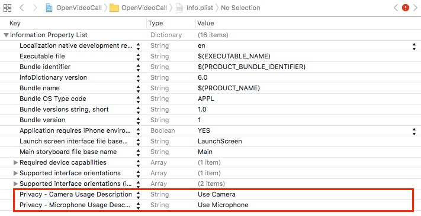
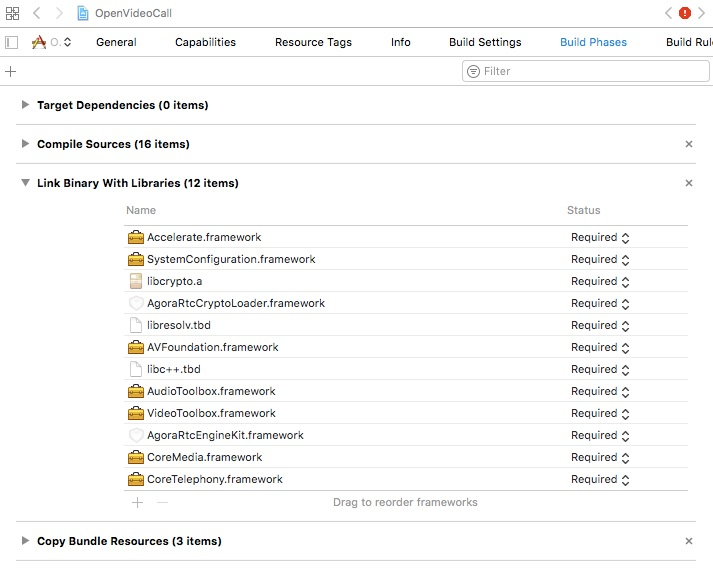
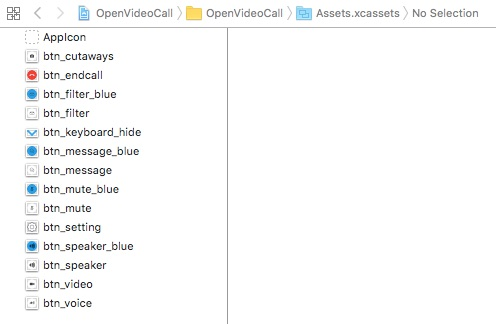
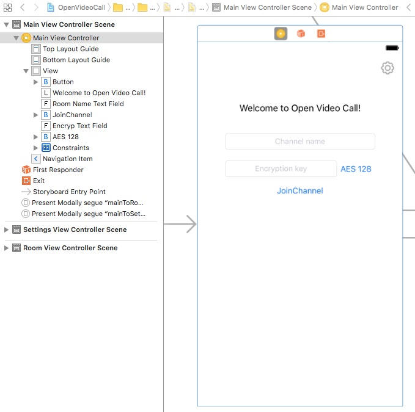
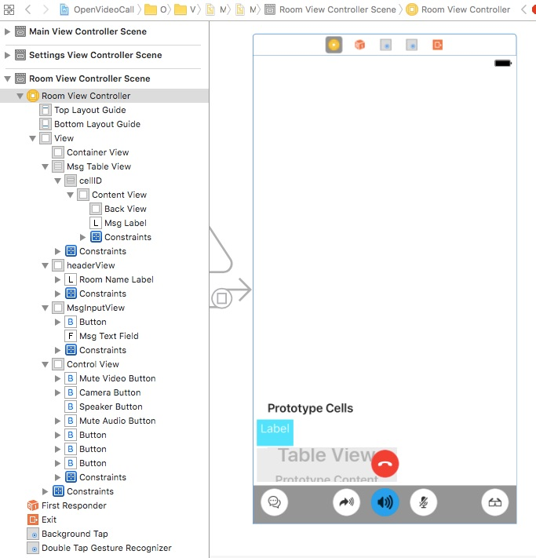
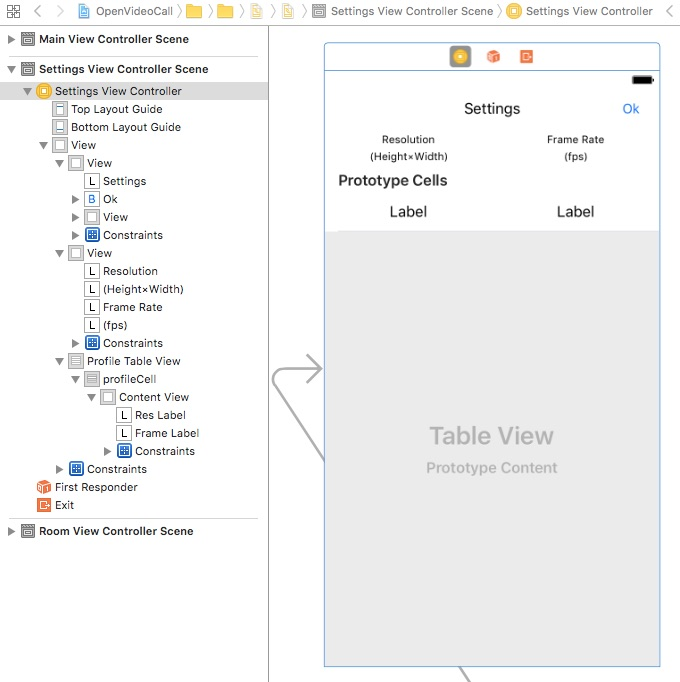

# Open Video Call iOS for Objective-C

This tutorial describes how to add video chat to your iOS applications using Objective-C and the Agora Video SDK.

With this sample app, you can:

- [Join/leave a channel](#create-the-dojoinpressed-ibaction-method)
- [Mute/unmute audio](#video-and-audio-methods)
- [Enable/disable video](#video-and-audio-methods)
- [Switch camera views](#camera-speaker-filter-and-close-methods)
- [Set up the resolution, the frame rate, and the bit rate display](#create-the-remotevideostats-event-listener)


## Prerequisites
- Xcode 8.0+
- Physical iOS device (iPhone or iPad)
	
	**Note:** Use a physical device to run the sample. Some simulators lack the functionality or the performance needed to run the sample.

## Quick Start

This section shows you how to prepare, build, and run the sample application.

- [Create an Account and Obtain an App ID](#create-an-account-and-obtain-an-app-id)
- [Update and Run the Sample Application](#update-and-run-the-sample-application) 


### Create an Account and Obtain an App ID
To build and run the sample application, you must obtain an app ID: 

1. Create a developer account at [agora.io](https://dashboard.agora.io/signin/). Once you finish the sign-up process, you are redirected to the dashboard.
2. Navigate in the dashboard tree on the left to **Projects** > **Project List**.
3. Copy the app ID that you obtained from the dashboard into a text file. You will use this when you launch the app.


### Update and Run the Sample Application 

1. Open `OpenVideoCall.xcodeproj` and edit the `KeyCenter.m` file. In the `AppId` declaration, update `<#YOUR APPID#>` with your app ID.

``` Objective-C
+ (NSString *)AppId {
    return <#YOUR APPID#>;
}
```

2. Download the [Agora Video SDK](https://www.agora.io/en/download/). Unzip the downloaded SDK package and copy the `AgoraRtcEngineKit.framework` file from the SDK `libs` folder into the sample application's `OpenVideoCall` folder.
		
3. Connect your iPhone or iPad device and run the project. Ensure a valid provisioning profile is applied or your project will not run.

## Steps to Create the Sample 

- [Set Permissions and Add Frameworks and Libraries](#set-permissions-and-add-frameworks-and-libraries)
- [Design the User Interface](#design-the-user-interface)
- [Create the MainViewController Class](#create-the-mainviewcontroller-class)
- [Create the MainViewController Class Delegates](#create-mainviewcontroller-delegates)
- [Create the RoomViewController](#create-the-roomviewcontroller)
- [Create RoomViewController Agora Methods and Delegates](#create-roomviewcontroller-agora-methods-and-delegates)
- [Create the SettingsViewController](#create-the-settingsviewcontroller)


### Set Permissions and Add Frameworks and Libraries

Open the `info.plist` file. Enable the camera and microphone privacy settings for the application.



Under the **Build Phases** tab, add the following frameworks and libraries to your project:

- `Accelerate.framework`
- `SystemConfiguration.framework`
- `libcrypto.a`
- `AgoraRtcCryptoLoader.framework`
- `libresolv.tbd`
- `AVFoundation.framework`
- `libc++.tbd`
- `AudioToolbox.framework`
- `VideoToolbox.framework`
- `AgoraRtcEngineKit.framework`
- `CoreMedia.framework`
- `CoreTelephony.framework`




### Design the User Interface

- [Add Assets](#add-assets)
- [Create the MainViewController UI](#create-the-mainviewcontroller-ui)
- [Create the RoomViewController UI](#create-the-roomviewcontroller-ui)
- [Create the SettingsViewController UI](#create-the-settingsviewcontroller-ui)

#### Add Assets

Add the following assets to `Assets.xcassets`.

**Note:** Use Xcode to import assets to `Assets.xcassets`. PDF files are used for these assets, which contain images for each iOS screen resolution.



|Asset|Description                                                                                        |
|------|------|
|`btn_cutaways`|An image of a camera and rotational arrows to switch between the two cameras|
|`btn_endcall`|An image of a red telephone for the *hang up* button|
|`btn_filter` and `btn_filter_blue`|Images of glasses for filtering|
|`btn_keyboard_hide`|An image of a down arrow used to hide/show the visual keyboard|
|`btn_message` and `btn_message_blue`|Images of chat bubbles to initiate a call|
|`btn_mute` and `btn_mute_blue`|Images of a microphone to mute/unmute audio|
|`btn_setting`|An image of a cog to open the settings window|
|`btn_speaker` and `btn_speaker_blue`|Images of speakers to turn audio on/off
|`btn_video`|An image of a camera to start video|
|`btn_voice`|An image of an arrow indicating that audio chat is enabled|

#### Create the MainViewController UI

Create the layout for the `MainViewController`.

**Note:** This layout includes navigation `segues` to move from screen to screen.



#### Create the RoomViewController UI

Create the layout for the `RoomViewController`.

**Note:** The `RoomViewController` layout includes tap and double-tap gesture recognizers for handling user interaction.



#### Create the SettingsViewController UI

Create the layout for the `SettingsViewController`.



### Create the MainViewController Class

*MainViewController.m* defines and connects application functionality with the [MainViewController UI](#create-the-mainviewcontroller-ui).

- [Define and Initialize Global Variables](#define-and-initialize-global-variables)
- [Override the prepareForSegue Method](#override-the-prepareforsegue-method)
- [Create the doEncrypPressed IBAction Method](#create-the-doEncrypPressed-ibaction-method)
- [Create the doJoinPressed IBAction Method](#create-the-dojoinpressed-ibaction-method)
- [Create the enterRoom Method](#create-the-enterroom-method)


#### Define and Initialize Global Variables

The `MainViewController` class has two `IBOutlet` variables. These map to the [MainViewController UI](#create-the-mainviewcontroller-ui) elements.

Variable|Description
----|----
`roomNameTextField`|Maps to the **Channel name** `UITextField` in the `MainViewController` layout
`encrypTextField`|Maps to the **Encryption key** `UITextField` in the `MainViewController` layout
`videoProfile`|Indicates the video profile for the Agora SDK
`videoProfile`|Indicates the encryption type for the Agora SDK

``` Objective-C
#import "MainViewController.h"
#import "SettingsViewController.h"
#import "RoomViewController.h"
#import "EncryptionType.h"

@interface MainViewController () <SettingsVCDelegate, RoomVCDelegate, UITextFieldDelegate>
@property (weak, nonatomic) IBOutlet UITextField *roomNameTextField;
@property (weak, nonatomic) IBOutlet UITextField *encrypTextField;
@property (assign, nonatomic) AgoraVideoProfile videoProfile;
@property (assign, nonatomic) EncrypType encrypType;
@end
```

The `viewDidLoad` method initializes `self.videoProfile` to `AgoraVideoProfileLandscape360P` and `self.encrypType` to the first `EncryptionType` option.

``` Objective-C    
@implementation MainViewController

- (void)viewDidLoad {
    [super viewDidLoad];
    self.videoProfile = AgoraVideoProfileLandscape360P;
    self.encrypType = [[EncryptionType encrypTypeArray][0] intValue];
}

...

@end
```

#### Override the prepareForSegue Segue Method

Override the `prepareForSegue` segue method to manage the application navigation. 

If the `segueId` is `mainToSettings`, prepare the settings view through the segue destination `SettingsViewController`:

- Set `settingsVC.videoProfile` to `self.videoProfile`.
- Set `settingsVC.delegate` to `self`.

If the `segueId` is `mainToRoom`, prepare the room view through the segue destination `RoomViewController`:

- Set `roomVC.roomName` to `sender`.
- Set `roomVC.videoProfile` to `self.videoProfile`.
- Set `roomVC.encrypType` to `self.encrypType`.
- Set `roomVC.encrypSecret` to the text entered in the `self.encrypTextField`.
- Set `roomVC.delegate` to `self`.

``` Objective-C    
- (void)prepareForSegue:(UIStoryboardSegue *)segue sender:(id)sender {
    NSString *segueId = segue.identifier;
    
    if ([segueId isEqualToString:@"mainToSettings"]) {
        SettingsViewController *settingsVC = segue.destinationViewController;
        settingsVC.videoProfile = self.videoProfile;
        settingsVC.delegate = self;
    } else if ([segueId isEqualToString:@"mainToRoom"]) {
        RoomViewController *roomVC = segue.destinationViewController;
        roomVC.roomName = sender;
        roomVC.videoProfile = self.videoProfile;
        roomVC.encrypType = self.encrypType;
        roomVC.encrypSecret = self.encrypTextField.text;
        roomVC.delegate = self;
    }
}
```

#### Create the doEncrypPressed IBAction Method

The `doEncrypPressed` `IBAction` method is invoked by the encryption button. When the `UIButton` is pressed, create a popover UI object using `UIAlertController`:

1. Create a `UIAlertAction` object for each encryption type and add it to `alertController` using `addAction`.

2. Create a `Cancel` `UIAlertAction` object and add it to `alertController` using `addAction`.

3. Apply the popover to  the encryption button by setting `alertController.popoverPresentationController.sourceView` to `sender`.

4. Display the popover using `presentViewController`.


``` Objective-C    
- (IBAction)doEncrypPressed:(UIButton *)sender {
    UIAlertController *alertController = [UIAlertController alertControllerWithTitle:nil message:nil preferredStyle:UIAlertControllerStyleActionSheet];
    NSArray *encrypTypeArray = [EncryptionType encrypTypeArray];
    __weak typeof(self) weakself = self;
    
    for (int i = 0; i < encrypTypeArray.count; i++) {
        EncrypType type = [encrypTypeArray[i] intValue];
        UIAlertAction *action = [UIAlertAction actionWithTitle:[EncryptionType descriptionWithEncrypType:type] style:UIAlertActionStyleDefault handler:^(UIAlertAction * _Nonnull action) {
            weakself.encrypType = type;
            [sender setTitle:[EncryptionType descriptionWithEncrypType:type] forState:UIControlStateNormal];
        }];
        [alertController addAction:action];
    }
    
    [alertController addAction:[UIAlertAction actionWithTitle:@"Cancel" style:UIAlertActionStyleCancel handler:nil]];
    alertController.popoverPresentationController.sourceView = sender;
    [self presentViewController:alertController animated:YES completion:nil];
}
```

#### Create the doJoinPressed IBAction Method

The **JoinChannel** UI Button in the `MainViewController` layout invokes the `doJoinPressed` `IBAction` method. This method enters the user into the room using `enterRoom`.

``` Objective-C    
- (IBAction)doJoinPressed:(UIButton *)sender {
    [self enterRoom];
}
```

#### Create the enterRoom Method

The `enterRoom` method ensures the room name and encryption text field is valid before navigating to the room view using `performSegueWithIdentifier`.

``` Objective-C    
- (void)enterRoom {
    if (!self.roomNameTextField.text.length || !self.encrypTextField.text.length) {
        return;
    }
    
    [self performSegueWithIdentifier:@"mainToRoom" sender:self.roomNameTextField.text];
}
```

### Create MainViewController Delegates

The `settingsVC` method is a delegate method for the `SettingsViewController`. This method is invoked when the video profile for the `SettingsViewController` changes. It updates the `videoProfile`, and dismisses the view using `dismissViewControllerAnimated`.

``` Objective-C    
//MARK: - delegates
- (void)settingsVC:(SettingsViewController *)settingsVC didSelectProfile:(AgoraVideoProfile)profile {
    self.videoProfile = profile;
    [self dismissViewControllerAnimated:YES completion:nil];
}
```

The `roomVCNeedClose` method is a delegate method for the `RoomVCDelegate`. This method is invoked when the user leaves the room, and dismisses the view using `dismissViewControllerAnimated`.

``` Objective-C    
- (void)roomVCNeedClose:(RoomViewController *)roomVC {
    [self dismissViewControllerAnimated:YES completion:nil];
}
```

The `textFieldShouldReturn` method is a delegate method for the `UITextField` objects in `MainViewController`. This method is invoked when the user presses the keyboard return.

Enter the user into the specified room using `enter` and return `YES`.

``` Objective-C    
- (BOOL)textFieldShouldReturn:(UITextField *)textField {
    [self enterRoom];
    return YES;
}
``` 
 
### Create the RoomViewController

*RoomViewController.m* defines and connects application functionality with the [RoomViewController UI](#create-the-roomviewcontroller-ui).

- [Define IBOutlet Variables](#define-iboutlet-variables)
- [Define Global Variables](#define-global-variables)
- [Define Variable Update Methods](#define-variable-update-methods)
- [Create Delegate and Superclass Methods](#create-delegate-and-superclass-methods)
- [Create IBAction Methods](#create-ibaction-methods)
- [Create Private Methods](#create-private-methods)

#### Define IBOutlet Variables

The `RoomViewController` class has `IBOutlet` variables to manage buttons, view containers, and handle other UI elements. The variables map to the [RoomViewController UI](#create-the-roomviewcontroller-ui) elements.

Variable|Description
----|----
`containerView`|Container for the videos in the room
`flowViews`|Set of key UI elements that need to be visually managed by the controller
`roomNameLabel`|Label for the room name in the header of the layout
`controlView`|Container for the room control buttons
`muteVideoButton`|Button to mute/unmute the video
`muteAudioButton`|Button to mute/unmute the audio
`cameraButton`|Button for the camera
`speakerButton`|Button for the speakerphone
`backgroundTap`|Single-tap gesture recognizer
`backgroundDoubleTap`|Double-tap gesture recognizer
`msgInputViewBottom`|Layout constraint for the message creation container
`msgTextField`|Text field for the message creation
`msgTableView`|List of messages
`msgInputView`|Container for message creation

``` Objective-C
#import "RoomViewController.h"
#import "VideoSession.h"
#import "VideoViewLayouter.h"
#import "KeyCenter.h"
#import <AgoraRtcCryptoLoader/AgoraRtcCryptoLoader.h>
#import "MsgTableView.h"
#import "AGVideoPreProcessing.h"

@interface RoomViewController () <AgoraRtcEngineDelegate>
@property (weak, nonatomic) IBOutlet UIView *containerView;
@property (strong, nonatomic) IBOutletCollection(UIView) NSArray *flowViews;
@property (weak, nonatomic) IBOutlet UILabel *roomNameLabel;

@property (weak, nonatomic) IBOutlet UIView *controlView;

@property (weak, nonatomic) IBOutlet UIButton *muteVideoButton;
@property (weak, nonatomic) IBOutlet UIButton *muteAudioButton;

@property (weak, nonatomic) IBOutlet UIButton *cameraButton;
@property (weak, nonatomic) IBOutlet UIButton *speakerButton;

@property (weak, nonatomic) IBOutlet UITapGestureRecognizer *backgroundTap;
@property (weak, nonatomic) IBOutlet UITapGestureRecognizer *backgroundDoubleTap;
@property (weak, nonatomic) IBOutlet NSLayoutConstraint *msgInputViewBottom;
@property (weak, nonatomic) IBOutlet UITextField *msgTextField;
@property (weak, nonatomic) IBOutlet MsgTableView *msgTableView;
@property (weak, nonatomic) IBOutlet UIView *msgInputView;

...

@end
```

#### Define Global Variables

The `RoomViewController` class has five public variables. These variables manage the `RoomViewController` settings.

Variable|Description
----|----
`agoraKit`|The Agora RTC Engine SDK object.
`videoSessions`|Array of `VideoSession` objects.
`doubleClickFullSession`|Identifier for the `VideoSession` that was double-clicked and should be displayed in a larger view.
`videoViewLayouter`|`VideoViewLayouter` object to handle the layout of the videos.
`shouldHideFlowViews`|Boolean value to determine if flow views should be hidden.
`audioMuted`|Boolean value to determine if audio is muted.
`videoMuted`|Boolean value to determine if video is disabled.
`speakerEnabled`|Boolean value to determine if the speakerphone is enabled.
`agoraLoader`|`AgoraRtcCryptoLoader` object for handling Agora encryption.

``` Objective-C    
@property (strong, nonatomic) AgoraRtcEngineKit *agoraKit;
@property (strong, nonatomic) NSMutableArray<VideoSession *> *videoSessions;
@property (strong, nonatomic) VideoSession *doubleClickFullSession;
@property (strong, nonatomic) VideoViewLayouter *videoViewLayouter;

@property (assign, nonatomic) BOOL shouldHideFlowViews;
@property (assign, nonatomic) BOOL audioMuted;
@property (assign, nonatomic) BOOL videoMuted;
@property (assign, nonatomic) BOOL speakerEnabled;

@property (strong, nonatomic) AgoraRtcCryptoLoader *agoraLoader;
```

#### Define Variable Update Methods

- [UI Management Variables](#ui-management-variables)
- [Video Session Variables](#video-session-variables)
- [Audio and Video Control Variables](#audio-and-video-control-variables)

##### UI Management Variables

The `setShouldHideFlowViews` method updates `shouldHideFlowViews` and flow view display. When this variable changes, the views in `self.flowViews` are hidden/not hidden.

``` Objective-C    
- (void)setShouldHideFlowViews:(BOOL)shouldHideFlowViews {
    _shouldHideFlowViews = shouldHideFlowViews;
    if (self.flowViews.count) {
        for (UIView *view in self.flowViews) {
            view.hidden = shouldHideFlowViews;
        }
    }
}
```

The `videoViewLayouter` method initializes the variable if it does not exist, and handles the layout for the video views.

``` Objective-C    
- (VideoViewLayouter *)videoViewLayouter {
    if (!_videoViewLayouter) {
        _videoViewLayouter = [[VideoViewLayouter alloc] init];
    }
    return _videoViewLayouter;
}    
```

##### Video Session Variables

The `setDoubleClickFullSession` method handles when a `VideoSession` object is double-clicked. This method updates `doubleClickFullSession` and the interface for the video sessions using `updateInterfaceWithSessions`.


``` Objective-C   
- (void)setDoubleClickFullSession:(VideoSession *)doubleClickFullSession {
    _doubleClickFullSession = doubleClickFullSession;
    if (self.videoSessions.count >= 3) {
        [self updateInterfaceWithSessions:self.videoSessions targetSize:self.containerView.frame.size animation:YES];
    }
}
```

##### Audio and Video Control Variables

The `setAudioMuted` and `setVideoMuted` methods manage the audio and video streams, respectively.

When `audioMuted` is set, the `self.muteAudioButton` image is updated, and the audio stream is muted/unmuted using `muteLocalAudioStream`.

``` Objective-C
- (void)setAudioMuted:(BOOL)audioMuted {
    _audioMuted = audioMuted;
    [self.muteAudioButton setImage:[UIImage imageNamed:(audioMuted ? @"btn_mute_blue" : @"btn_mute")] forState:UIControlStateNormal];
    [self.agoraKit muteLocalAudioStream:audioMuted];
}
```

When `videoMuted` is set:

- The `self.muteVideoButton` image is updated.
- The `self.cameraButton` and `self.speakerButton` are set to hidden/not hidden. 
- The video stream is stopped/started using `muteLocalVideoStream` and `setVideoMuted`.
- The video view of the current user is set to hidden/not hidden using `updateSelfViewVisiable`.


``` Objective-C
- (void)setVideoMuted:(BOOL)videoMuted {
    _videoMuted = videoMuted;
    [self.muteVideoButton setImage:[UIImage imageNamed:(videoMuted ? @"btn_video" : @"btn_voice")] forState:UIControlStateNormal];
    self.cameraButton.hidden = videoMuted;
    self.speakerButton.hidden = !videoMuted;
    
    [self.agoraKit muteLocalVideoStream:videoMuted];
    
    [self setVideoMuted:videoMuted forUid:0];
    [self updateSelfViewVisiable];
}
```

The `setSpeakerEnabled` method updates the `self.speakerButton` images and the speakerphone is enabled/disabled using `setEnableSpeakerphone`. 

``` Objective-C
- (void)setSpeakerEnabled:(BOOL)speakerEnabled {
    _speakerEnabled = speakerEnabled;
    [self.speakerButton setImage:[UIImage imageNamed:(speakerEnabled ? @"btn_speaker_blue" : @"btn_speaker")] forState:UIControlStateNormal];
    [self.speakerButton setImage:[UIImage imageNamed:(speakerEnabled ? @"btn_speaker" : @"btn_speaker_blue")] forState:UIControlStateHighlighted];
    
    [self.agoraKit setEnableSpeakerphone:speakerEnabled];
}
```

#### Create Delegate and Superclass Methods

The `viewDidLoad` method initializes the `RoomViewController`: 

1. Initialize `self.videoSessions` and `self.agoraLoader`.
2. Set the `roomNameLabel` text.
3. Hide `self.msgInputView` by setting its `alpha` value to `0`.
4. Set the `backgroundTap` gesture recognizer to fail on double-tap using `requireGestureRecognizerToFail`.
5. Load the Agora RTC engine SDK using `loadAgoraKit`.
6. Add the keyboard event listener using `addKeyboardObserver`.

``` Objective-C
@implementation RoomViewController

static NSInteger streamID = 0;

...

#pragma mark - View did load
- (void)viewDidLoad {
    [super viewDidLoad];
    self.videoSessions = [[NSMutableArray alloc] init];
    self.agoraLoader = [[AgoraRtcCryptoLoader alloc] init];
    self.roomNameLabel.text = self.roomName;
    self.msgInputView.alpha = 0;
    [self.backgroundTap requireGestureRecognizerToFail:self.backgroundDoubleTap];
    
    [self loadAgoraKit];
    [self addKeyboardObserver];
}

...

@end
```

The `textFieldShouldReturn` delegate method applies to all `UITextField` elements in the `RoomViewController` layout. This method is invoked when the keyboard return is pressed while editing the text fields.

If the text field is not empty, invoke the `sendDataWithString` method, and clear the text in the text field.

``` Objective-C
- (BOOL)textFieldShouldReturn:(UITextField *)textField {
    [self sendDataWithString:textField.text];
    textField.text = @"";
    return YES;
}
```

#### Create Private Methods

- [Create the addKeyboardObserver Method](#create-the-addkeyboardobserver-method)
- [Create the updateInterfaceWithSessions Methods](#create-the-updateinterfacewithsessions-methods)
- [Create Session Methods](#create-session-methods)
- [Create the UI Control Methods](#create-the-ui-control-methods)

##### Create the addKeyboardObserver Method

The `addKeyboardObserver` method adds event listeners for the `UIKeyboardWillChangeFrameNotification` keyboard event using `addObserver`. When this event is triggered, the `keyboardFrameChange` method is invoked.

``` Objective-C
#pragma mark - Send Data Stream
- (void)addKeyboardObserver {
    [[NSNotificationCenter defaultCenter] addObserver:self selector:@selector(keyboardFrameChange:) name:UIKeyboardWillChangeFrameNotification object:nil];
}
```

The `keyboardFrameChange` event is triggered when the keyboard frame changes.

The `keyboardEndFrame` value is retrieved from the notifications `userInfo`.

- Set `ty` to the difference between the height of the screen and the y location of `keyboardEndFrame`.
- Set `duration` to the `UIKeyboardAnimationDurationUserInfoKey` value from `userInfo`.

Show/hide the message area by setting the appropriate value to `constant` and animate the view using `animateWithDuration`:

- If the `ty` is greater than `0`, set `constant` to `ty` and display `self.msgInputView` by setting the `alpha` value to `1`

- Otherwise, set `constant` to `0` and hide `self.msgInputView` by setting the `alpha` value to `0`.

``` Objective-C
- (void)keyboardFrameChange:(NSNotification *)info {
    
    CGRect keyboardEndFrame = [info.userInfo[UIKeyboardFrameEndUserInfoKey] CGRectValue];
    CGFloat ty = [UIScreen mainScreen].bounds.size.height - keyboardEndFrame.origin.y;
    double duration = [info.userInfo[UIKeyboardAnimationDurationUserInfoKey] doubleValue];
    
    CGFloat constant;
    
    if (ty > 0) {
        constant = ty;
        self.msgInputView.alpha = 1;
    }
    else {
        constant = 0;
        self.msgInputView.alpha = 0;
    }
    
    [UIView animateWithDuration:duration animations:^{
        self.msgInputViewBottom.constant = constant;
        [self.view layoutIfNeeded];
    }];
    
}
```

#### Create IBAction Methods

These `IBAction` methods map to the UI elements for the `RoomViewController`:

- [Message Methods](#message-methods)
- [Video and Audio Methods](#video-and-audio-methods)
- [Camera, Speaker, Filter, and Close Methods](#camera-speaker-filter-and-close-methods)
- [Gesture Recognizer Methods](#gesture-recognizer-methods)

##### Message Methods

The `doMesPressed` method is invoked by the message UI button and adds focus to the text input field `self.msgTextField` by using `becomeFirstResponder`.

The `doHideKeyboardPressed` method is invoked by the message UI button removes the focus from the text input field `self.msgTextField` by using `resignFirstResponder`.
    
``` Objective-C
- (IBAction)doMesPressed:(UIButton *)sender {
    [self.msgTextField becomeFirstResponder];
}

- (IBAction)doHideKeyboardPressed:(UIButton *)sender {
    [self.msgTextField resignFirstResponder];
}
```

##### Video and Audio Methods

The `doMuteVideoPressed` method is invoked by the `muteVideoButton` UI button and updates `self.videoMuted`.

The `doMuteAudioPressed` method is invoked by the `muteAudioButton` UI button and updates `self.audioMuted`.


``` Objective-C
- (IBAction)doMuteVideoPressed:(UIButton *)sender {
    self.videoMuted = !self.videoMuted;
}

- (IBAction)doMuteAudioPressed:(UIButton *)sender {
    self.audioMuted = !self.audioMuted;
}
```

##### Camera, Speaker, Filter, and Close Methods

The `doFilterPressed` method is invoked by the filter UI button action and updates the button's `selected` state.

If the button is selected, start video pre-processing using `registerVideoPreprocessing`. Otherwise, stop video pre-processing using `deregisterVideoPreprocessing`.

``` Objective-C
- (IBAction)doFilterPressed:(UIButton *)sender {
    sender.selected = !sender.selected;
    
    if (sender.selected) {
        [AGVideoPreProcessing registerVideoPreprocessing:self.agoraKit];
    }
    else {
        [AGVideoPreProcessing deregisterVideoPreprocessing:self.agoraKit];
    }
}
```

The `doCameraPressed` method is invoked by the `cameraButton` UI button action and switches the camera view using `switchCamera`.

The `doSpeakerPressed` method is invoked by the `speakerButton` UI button action and updates `self.speakerEnabled`.    

The `doClosePressed` method is invoked by the red hangup UI button action and invokes the `leaveChannel` method.

``` Objective-C
- (IBAction)doCameraPressed:(UIButton *)sender {
    [self.agoraKit switchCamera];
}

- (IBAction)doSpeakerPressed:(UIButton *)sender {
    self.speakerEnabled = !self.speakerEnabled;
}

- (IBAction)doClosePressed:(UIButton *)sender {
    [self leaveChannel];
}
```

##### Gesture Recognizer Methods

The `doBackTapped` method is invoked by the background tap gesture recognizer and updates `self.shouldHideFlowViews`.

The `doBackDoubleTapped` method is invoked by background double-tap gesture recognizer.

If `self.doubleClickFullSession` is not valid, detect the video session index using `responseIndexOfLocation`, and set `self.doubleClickFullSession` to the selected video session. Otherwise, set `self.doubleClickFullSession` to nil.

``` Objective-C
- (IBAction)doBackTapped:(UITapGestureRecognizer *)sender {
    self.shouldHideFlowViews = !self.shouldHideFlowViews;
}

- (IBAction)doBackDoubleTapped:(UITapGestureRecognizer *)sender {
    if (!self.doubleClickFullSession) {
        NSInteger tappedIndex = [self.videoViewLayouter responseIndexOfLocation:[sender locationInView:self.containerView]];
        if (tappedIndex >= 0 && tappedIndex < self.videoSessions.count) {
            self.doubleClickFullSession = self.videoSessions[tappedIndex];
        }
    } else {
        self.doubleClickFullSession = nil;
    }
}
```

#### Create the updateInterfaceWithSessions Methods

The `updateInterfaceWithSessions` methods handle layout updates for the video session.

The `updateInterfaceWithSessions` method with `animation` checks if animation is used for the update, and animates the update within `0.3` seconds using `animateWithDuration`.

``` Objective-C
#pragma mark - Video View Layout
- (void)updateInterfaceWithSessions:(NSArray *)sessions targetSize:(CGSize)targetSize animation:(BOOL)animation {
    if (animation) {
        [UIView animateWithDuration:0.3 animations:^{
            [self updateInterfaceWithSessions:sessions targetSize:targetSize];
            [self.view layoutIfNeeded];
        }];
    } else {
        [self updateInterfaceWithSessions:sessions targetSize:targetSize];
    }
}
```

The `updateInterfaceWithSessions` method without animation sets the location for `self.videoViewLayouter` and video views.

Loop through `sessions` to retrieve each `hostingView` and append the view to `peerVideoViews` using `addObject`.

- Apply `peerVideoViews` to the video layout manager using `self.videoViewLayouter.videoViews`.
- Set the large video view `self.videoViewLayouter.fullView` to `self.doubleClickFullSession.hostingView`.
- Set `self.containerView` as the containing view for the videos.
- Update the layout using `layoutVideoViews`.
- Invoke `updateSelfViewVisiable`.

**Note:** The `backgroundDoubleTap` gesture recognizer is enabled only for `3` or more video sessions. This gesture recognizer enables the ability to change the layout.

``` Objective-C
- (void)updateInterfaceWithSessions:(NSArray *)sessions targetSize:(CGSize)targetSize {
    if (!sessions.count) {
        return;
    }
    
    VideoSession *selfSession = sessions.firstObject;
    self.videoViewLayouter.selfView = selfSession.hostingView;
    self.videoViewLayouter.selfSize = selfSession.size;
    self.videoViewLayouter.targetSize = targetSize;
    
    NSMutableArray *peerVideoViews = [[NSMutableArray alloc] init];
    for (NSInteger i = 1; i < sessions.count; ++i) {
        VideoSession *session = sessions[i];
        [peerVideoViews addObject:session.hostingView];
    }
    self.videoViewLayouter.videoViews = peerVideoViews;
    self.videoViewLayouter.fullView = self.doubleClickFullSession.hostingView;
    self.videoViewLayouter.containerView = self.containerView;
    
    [self.videoViewLayouter layoutVideoViews];
    [self updateSelfViewVisiable];
    
    if (sessions.count >= 3) {
        self.backgroundDoubleTap.enabled = YES;
    } else {
        self.backgroundDoubleTap.enabled = NO;
        self.doubleClickFullSession = nil;
    }
}
```

##### Create Session Methods

The `setIdleTimerActive` method updates the idle timer of the sample application to be either active or inactive.

``` Objective-C
- (void)setIdleTimerActive:(BOOL)active {
    [UIApplication sharedApplication].idleTimerDisabled = !active;
}
```

The `fetchSessionOfUid` method returns the `VideoSession` for a specified user. Loop through `self.videoSessions` until the `session.uid` matches the `uid`.

``` Objective-C    
- (VideoSession *)fetchSessionOfUid:(NSUInteger)uid {
    for (VideoSession *session in self.videoSessions) {
        if (session.uid == uid) {
            return session;
        }
    }
    return nil;
}
```

The `videoSessionOfUid` method returns the `VideoSession` for the user. The difference between this method and the `fetchSessionOfUid` method is that if no `fetchSessionOfUid` exists a new `VideoSession` object is created and appended to `self.videoSessions`.

``` Objective-C    
- (VideoSession *)videoSessionOfUid:(NSUInteger)uid {
    VideoSession *fetchedSession = [self fetchSessionOfUid:uid];
    if (fetchedSession) {
        return fetchedSession;
    } else {
        VideoSession *newSession = [[VideoSession alloc] initWithUid:uid];
        [self.videoSessions addObject:newSession];
        [self updateInterfaceWithSessions:self.videoSessions targetSize:self.containerView.frame.size animation:YES];
        return newSession;
    }
}
```

The `setVideoMuted` method starts/stops the video for a specified user. The `VideoSession` is retrieved using `fetchSessionOfUid` to apply `muted` to the `fetchedSession.isVideoMuted` property.

``` Objective-C    
- (void)setVideoMuted:(BOOL)muted forUid:(NSUInteger)uid {
    VideoSession *fetchedSession = [self fetchSessionOfUid:uid];
    fetchedSession.isVideoMuted = muted;
}
```

##### Create the UI Control Methods

The `updateSelfViewVisiable` method sets the user view to hidden/not hidden. If the number of `videoSessions` is `2`, determine if the view is hidden using `self.videoMuted`. Otherwise set `selfView.hidden` to `false`.

``` Objective-C
- (void)updateSelfViewVisiable {
    UIView *selfView = self.videoSessions.firstObject.hostingView;
    if (self.videoSessions.count == 2) {
        selfView.hidden = self.videoMuted;
    } else {
        selfView.hidden = false;
    }
}
```

The `alertString` method displays an alert message to the user.

1. Ensure the `string` value exists.
2. Initialize the alert as a `UIAlertController` object.
3. Add an `Ok` button to `alert` using `addAction`.
4. Display the alert message using `presentViewController`.

``` Objective-C
- (void)alertString:(NSString *)string {
    if (!string.length) {
        return;
    }
    
    UIAlertController *alert = [UIAlertController alertControllerWithTitle:nil message:string preferredStyle:UIAlertControllerStyleAlert];
    [alert addAction:[UIAlertAction actionWithTitle:@"Ok" style:UIAlertActionStyleCancel handler:nil]];
    [self presentViewController:alert animated:YES completion:nil];
}
```

### Create RoomViewController Agora Methods and Delegates

- [Create the loadAgoraKit Method](#create-the-loadagorakit-method)
- [Create the addLocalSession Method](#create-the-addlocalsession-method)
- [Create the leaveChannel Method](#create-the-leavechannel-method)
- [Create the sendDataWithString Method](#create-the-senddatawithstring-method)
- [Create the AgoraRtcEngineDelegate](#create-the-agorartcenginedelegate)


#### Create the loadAgoraKit Method

The `loadAgoraKit` method initializes the Agora RTC engine using `sharedEngineWithAppId`.

``` Objective-C
#pragma mark - Agora Media SDK
- (void)loadAgoraKit {	
    self.agoraKit = [AgoraRtcEngineKit sharedEngineWithAppId:[KeyCenter AppId] delegate:self];

	...
	
}
```

1. Set the channel profile to `AgoraChannelProfileCommunication` using `setChannelProfile`.
2. Enable video using `enableVideo`.
3. Set the `videoProfile` using `setVideoProfile`.

``` Objective-C
    [self.agoraKit setChannelProfile:AgoraChannelProfileCommunication];
    [self.agoraKit enableVideo];
    [self.agoraKit setVideoProfile:self.videoProfile swapWidthAndHeight:NO];
```

4. Set the encryption mode and type using `setEncryptionMode` and `setEncryptionSecret`.
5. Create the data stream using `createDataStream`.
6. Invoke `addLocalSession` and start the preview using `agoraKit.startPreview()`.


``` Objective-C
    [self.agoraKit setEncryptionMode:[EncryptionType modeStringWithEncrypType:self.encrypType]];
    [self.agoraKit setEncryptionSecret:self.encrypSecret];
    
    [self.agoraKit createDataStream:&streamID reliable:YES ordered:YES];
    
    [self addLocalSession];
    [self.agoraKit startPreview];
```

7. Join the channel specified by `self.roomName` using `joinChannelByToken`:

- If the `code` is equal to `0`, the channel join is successful. Disable the idle timer using `setIdleTimerActive`.
- If the channel join is not successful, display an error message alert using `alertString`.

``` Objective-C
    int code = [self.agoraKit joinChannelByToken:nil channelId:self.roomName info:nil uid:0 joinSuccess:nil];
    if (code == 0) {
        [self setIdleTimerActive:NO];
    } else {
        dispatch_async(dispatch_get_main_queue(), ^{
            [self alertString:[NSString stringWithFormat:@"Join channel failed: %d", code]];
        });
    }
```

#### Create the addLocalSession Method

The `addLocalSession` method appends the local video session to `self.videoSessions` and sets up the local video view using `setupLocalVideo`.

Update the interface for the videos using `updateInterfaceWithSessions`.

``` Objective-C
- (void)addLocalSession {
    VideoSession *localSession = [VideoSession localSession];
    [self.videoSessions addObject:localSession];
    [self.agoraKit setupLocalVideo:localSession.canvas];
    [self updateInterfaceWithSessions:self.videoSessions targetSize:self.containerView.frame.size animation:YES];
}
```

#### Create the leaveChannel Method

The `leaveChannel` method enables the user to leave the video session.

1. Clear the local video and leave the channel by applying `nil` as the parameter for `asetupLocalVideo` and `leaveChannel`.
2. Stop the video preview using `stopPreview`.
3. Loop through `videoSessions` and remove its `hostingView` from the superview using `removeFromSuperview`. 
4. Clear the video sessions array using `removeAllObjects`.
5. Set the idle timer to active using `setIdleTimerActive`.
6. Complete the method by invoking the room to close using `roomVCNeedClose`.

``` Objective-C
- (void)leaveChannel {
    [self.agoraKit setupLocalVideo:nil];
    [self.agoraKit leaveChannel:nil];
    [self.agoraKit stopPreview];
    
    for (VideoSession *session in self.videoSessions) {
        [session.hostingView removeFromSuperview];
    }
    [self.videoSessions removeAllObjects];
    
    [self setIdleTimerActive:YES];
    
    if ([self.delegate respondsToSelector:@selector(roomVCNeedClose:)]) {
        [self.delegate roomVCNeedClose:self];
    }
}
```

#### Create the sendDataWithString Method

The `sendDataWithString` method appends the message to the chat message view using `appendMsgToTableViewWithMsg` and sends a new message to the stream using `sendStreamMessage`.


``` Objective-C
- (void)sendDataWithString:(NSString *)message {
    NSData *data = [message dataUsingEncoding:NSUTF8StringEncoding];
    [self.msgTableView appendMsgToTableViewWithMsg:message msgType:MsgTypeChat];
    [self.agoraKit sendStreamMessage:streamID data:data];
}
```

#### Create the AgoraRtcEngineDelegate

- [Create the firstRemoteVideoDecodedOfUid Event Listener](#create-the-firstremotevideodecodedofuid-event-listener)
- [Create the firstLocalVideoFrameWithSize Event Listener](#create-the-firstlocalvideoframewithsize-event-listener)
- [Create the didOfflineOfUid Event Listener](#create-the-didofflineofuid-event-listener)
- [Create the didVideoMuted Event Listener](#create-the-didvideomuted-event-listener)
- [Create the receiveStreamMessageFromUid Event Listener](#create-the-receivestreammessagefromuid-event-listener)
- [Create the rtcEngine Connection Methods](#create-the-rtcengine-connection-methods)

##### Create the firstRemoteVideoDecodedOfUid Event Listener

The `firstRemoteVideoDecodedOfUid` event listener is triggered when the first remote video is decoded.

1. Retrieve the video session of the user using `videoSessionOfUid`.

2. Set the session dimensions using `userSession.size`.

3. Complete the method by setting up the remote video using `setupRemoteVideo`.

``` Objective-C
#pragma mark - <AgoraRtcEngineDelegate>
- (void)rtcEngine:(AgoraRtcEngineKit *)engine firstRemoteVideoDecodedOfUid:(NSUInteger)uid size:(CGSize)size elapsed:(NSInteger)elapsed {
    VideoSession *userSession = [self videoSessionOfUid:uid];
    userSession.size = size;
    [self.agoraKit setupRemoteVideo:userSession.canvas];
}
```

##### Create the firstLocalVideoFrameWithSize Event Listener

The `firstLocalVideoFrameWithSize` event listener is triggered when the first local video frame has `elapsed`.

Set the dimensions of the video session using `selfSession.size` and update the video interface using `updateInterfaceWithSessions`.

``` Objective-C
- (void)rtcEngine:(AgoraRtcEngineKit *)engine firstLocalVideoFrameWithSize:(CGSize)size elapsed:(NSInteger)elapsed {
    if (self.videoSessions.count) {
        VideoSession *selfSession = self.videoSessions.firstObject;
        selfSession.size = size;
        [self updateInterfaceWithSessions:self.videoSessions targetSize:self.containerView.frame.size animation:NO];
    }
}
```

##### Create the didOfflineOfUid Event Listener

The `didOfflineOfUid` event listener is triggered when a user goes offline.

Loop through `videoSessions` to retrieve the video session of the offline user:

If the video session is found: 

1. Remove the session from `self.videoSessions` using `removeObject`.
2. Remove `deleteSession.hostingView` from the superview using `removeFromSuperview`.
3. Update the sessions using `updateInterfaceWithSessions`.
4. If the removed session is the full-sized video view, set `self.doubleClickFullSession` to `nil`.

``` Objective-C
- (void)rtcEngine:(AgoraRtcEngineKit *)engine didOfflineOfUid:(NSUInteger)uid reason:(AgoraUserOfflineReason)reason {
    VideoSession *deleteSession;
    for (VideoSession *session in self.videoSessions) {
        if (session.uid == uid) {
            deleteSession = session;
        }
    }
    
    if (deleteSession) {
        [self.videoSessions removeObject:deleteSession];
        [deleteSession.hostingView removeFromSuperview];
        [self updateInterfaceWithSessions:self.videoSessions targetSize:self.containerView.frame.size animation:YES];
        
        if (deleteSession == self.doubleClickFullSession) {
            self.doubleClickFullSession = nil;
        }
    }
}
```

##### Create the didVideoMuted Event Listener

The `didVideoMuted` event listener is triggered when a user turns off video.

Set the video to off using `setVideoMuted`.

``` Objective-C
- (void)rtcEngine:(AgoraRtcEngineKit *)engine didVideoMuted:(BOOL)muted byUid:(NSUInteger)uid {
    [self setVideoMuted:muted forUid:uid];
}
```

##### Create the receiveStreamMessageFromUid Event Listener

The `receiveStreamMessageFromUid` event listener is triggered when a message is received from a user.

Append the message to the table view using `appendMsgToTableViewWithMsg`.

``` Objective-C
-(void)rtcEngine:(AgoraRtcEngineKit *)engine receiveStreamMessageFromUid:(NSUInteger)uid streamId:(NSInteger)streamId data:(NSData *)data {
    NSString *message = [[NSString alloc] initWithData:data encoding:NSUTF8StringEncoding];
    [self.msgTableView appendMsgToTableViewWithMsg:message msgType:MsgTypeChat];
}
```

##### Create the rtcEngine Connection Methods

The `rtcEngineConnectionDidInterrupted` method appends a `Connection Did Interrupted` message to the table view using `appendMsgToTableViewWithMsg`.

The `rtcEngineConnectionDidLost` method appends a `Connection Did Lost` message to the table view using `appendMsgToTableViewWithMsg`.

``` Objective-C
- (void)rtcEngineConnectionDidInterrupted:(AgoraRtcEngineKit *)engine {
    [self.msgTableView appendMsgToTableViewWithMsg:@"Connection Did Interrupted" msgType:MsgTypeError];
}

- (void)rtcEngineConnectionDidLost:(AgoraRtcEngineKit *)engine {
    [self.msgTableView appendMsgToTableViewWithMsg:@"Connection Did Lost" msgType:MsgTypeError];
}
```

### Create the SettingsViewController

*SettingsViewController.m* defines and connects application functionality with the [SettingsViewController UI](#create-the-settingsviewcontroller-ui).

- [Create Variables and IBAction Methods](#create-variables-and-ibaction-methods)
- [Create Delegate and DataSource Methods](#create-delegate-and-datasource-methods)

#### Create Variables and IBAction Methods

The `profileTableView` `IBOutlet` variable maps to the profile table created in the [SettingsViewController UI](#create-the-settingsviewcontroller-ui).

The `profiles` variable is an array to contain Agora Video profiles.

``` Objective-C
#import "SettingsViewController.h"
#import "ProfileCell.h"
#import <AgoraRtcEngineKit/AgoraRtcEngineKit.h>

@interface SettingsViewController () <UITableViewDataSource, UITableViewDelegate>
@property (weak, nonatomic) IBOutlet UITableView *profileTableView;
@property (strong, nonatomic) NSArray *profiles;
@end
```

The `profiles` method sets the `profiles` variable and initializes it with a set of Agora video profiles.

``` Objective-C
@implementation SettingsViewController
- (NSArray *)profiles {
    if (!_profiles) {
        _profiles = @[@(AgoraVideoProfileLandscape120P),
                      @(AgoraVideoProfileLandscape180P),
                      @(AgoraVideoProfileLandscape240P),
                      @(AgoraVideoProfileLandscape360P),
                      @(AgoraVideoProfileLandscape480P),
                      @(AgoraVideoProfileLandscape720P)];
    }
    return _profiles;
}

...

@end
```

The `setVideoProfile` method sets the `videoProfile` variable and updates `self.profileTableView` using `reloadData`. 

``` Objective-C
- (void)setVideoProfile:(AgoraVideoProfile)videoProfile {
    _videoProfile = videoProfile;
    [self.profileTableView reloadData];
}
```

The `doConfirmPressed` `IBAction` method is invoked by the **OK** button in the UI layout. This method updates the video profile to the selected profile `self.videoProfile` using `settingsVC`.

``` Objective-C
- (IBAction)doConfirmPressed:(UIButton *)sender {
    if ([self.delegate respondsToSelector:@selector(settingsVC:didSelectProfile:)]) {
        [self.delegate settingsVC:self didSelectProfile:self.videoProfile];
    }
}
```

#### Create Delegate and DataSource Methods

The `tableView` data source methods determine the data used for the UITableView. 

The `numberOfRowsInSection` method returns `self.profiles.count` as the number of rows in the table section.

``` Objective-C
- (NSInteger)tableView:(UITableView *)tableView numberOfRowsInSection:(NSInteger)section {
    return self.profiles.count;
}
```

The `cellForRowAtIndexPath` method returns the cell for the specified index path of the table.

1. Create the table cell using `dequeueReusableCellWithIdentifier`.

2. Set the cell's `selectedProfile` using `updateWithProfile` and return the resulting cell.

``` Objective-C
- (UITableViewCell *)tableView:(UITableView *)tableView cellForRowAtIndexPath:(NSIndexPath *)indexPath {
    ProfileCell *cell = [tableView dequeueReusableCellWithIdentifier:@"profileCell" forIndexPath:indexPath];
    AgoraVideoProfile selectedProfile = [self.profiles[indexPath.row] integerValue];
    [cell updateWithProfile:selectedProfile isSelected:(selectedProfile == self.videoProfile)];
    
    return cell;
}
```

The `didSelectRowAtIndexPath` delegate method is invoked when the specified table row is selected. 

Set `videoProfile` to the `selectedProfile` from the table.

``` Objective-C
- (void)tableView:(UITableView *)tableView didSelectRowAtIndexPath:(NSIndexPath *)indexPath {
    AgoraVideoProfile selectedProfile = [self.profiles[indexPath.row] integerValue];
    self.videoProfile = selectedProfile;
}
```

## Resources
- Find full API documentation in the [Document Center](https://docs.agora.io/en/)
- [File bugs about this sample](https://github.com/AgoraIO/OpenVideoCall-iOS-Objective-C/issues)

## Learn More
- [Open Video Call Tutorial for iOS/Swift](https://github.com/AgoraIO/OpenVideoCall-iOS)
- [1 to 1 tutorial demo for iOS/Objective-C](https://github.com/AgoraIO/Agora-iOS-Tutorial-Objective-C-1to1)
- Agora Video SDK samples are also available for the following platforms:
	- OpenVideoCall for [Android](https://github.com/AgoraIO/OpenVideoCall-Android)
	- OpenVideoCall for [Windows](https://github.com/AgoraIO/OpenVideoCall-Windows)
	- OpenVideoCall for [MacOS](https://github.com/AgoraIO/OpenVideoCall-macOS)

## License
This software is licensed under the MIT License (MIT). [View the license](LICENSE.md).