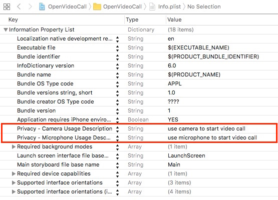
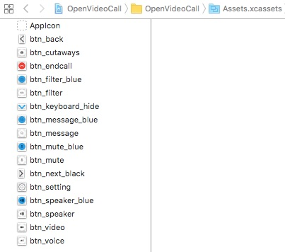
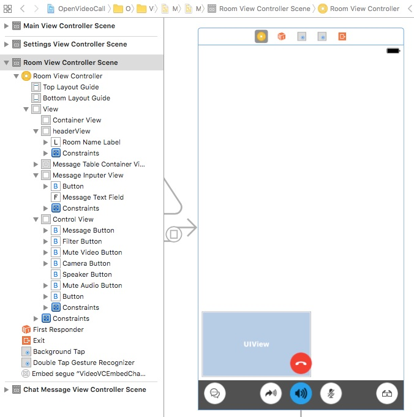
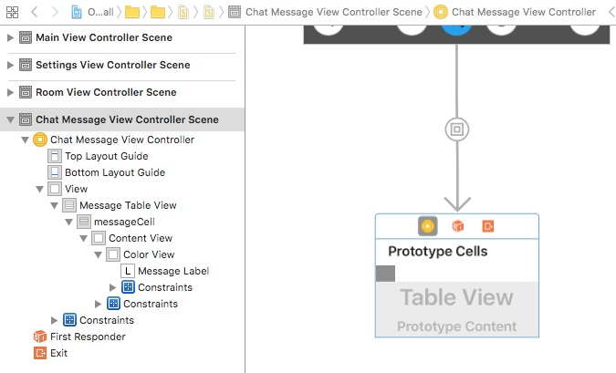

## Steps to Create the Sample 

- [Set Permissions and Add Frameworks and Libraries](#set-permissions-and-add-frameworks-and-libraries)
- [Design the User Interface](#design-the-user-interface)
- [Create the MainViewController Class](#create-the-mainviewcontroller-class)
- [Create the MainViewController Class Delegates](#create-mainviewcontroller-delegates)
- [Create the RoomViewController](#create-the-roomviewcontroller)
- [Create RoomViewController Agora Methods and Delegates](#create-roomviewcontroller-agora-methods-and-delegates)
- [Create the ChatMessageViewController](#create-the-chatmessageviewcontroller)
- [Create the SettingsViewController](#create-the-settingsviewcontroller)


### Set Permissions and Add Frameworks and Libraries

Under the **Capabilities** tab, enable **Audio, AirPlay, and Picture in Picture** mode.


Open the `info.plist` file. Enable the camera and microphone privacy settings for the application.



Under the **Build Phases** tab, add the following frameworks and libraries to your project:

- `SystemConfiguration.framework`
- `libresolv.tbd`
- `AgoraRtcEngineKit.framework`
- `CoreTelephony.framework`
- `CoreMedia.framework`
- `VideoToolbox.framework`
- `AudioToolbox.framework`
- `libc++.tbd`
- `AgoraRtcCryptoLoader.framework`
- `AVFoundation.framework`
- `libcrypto.a`


### Design the User Interface

- [Add Assets](#add-assets)
- [Create the MainViewController UI](#create-the-mainviewcontroller-ui)
- [Create the RoomViewController UI and the ChatMessageViewController UI](#create-the-roomviewcontroller-ui-and-chatmessageviewcontroller-ui)
- [Create the SettingsViewController UI](#create-the-settingsviewcontroller-ui)

#### Add Assets

Add the following assets to `Assets.xcassets`.

**Note:** Use Xcode to import assets to `Assets.xcassets`. PDF files are used for these assets, which contain images for each iOS screen resolution.



|Asset|Description                                                                                        |
|------|------|
|`btn_back` and `btn_next_black`|Image of a left and right arrow for navigation|
|`btn_cutaways`|An image of a camera and rotational arrows to switch between the two cameras|
|`btn_endcall`|An image of a red telephone for the *hang up* button|
|`btn_filter` and `btn_filter_blue`|Images of glasses for filtering|
|`btn_keyboard_hide`|An image of a down arrow used to hide/show the visual keyboard|
|`btn_message` and `btn_message_blue`|Images of chat bubbles to initiate a call|
|`btn_mute` and `btn_mute_blue`|Images of a microphone to mute/unmute audio|
|`btn_setting`|An image of a cog to open the settings window|
|`btn_speaker` and `btn_speaker_blue`|Images of speakers to turn audio on/off
|`btn_video`|An image of a camera to start video|
|`btn_voice`|An image of an arrow indicating that audio chat is enabled|

#### Create the MainViewController UI

Create the layout for the `MainViewController`.

**Note:** This layout includes navigation `segues` to move from screen to screen.


#### Create the RoomViewController UI and the ChatMessageViewController UI

Create the layout for the `RoomViewController` and `ChatMessageViewController`. The `ChatMessageViewController` view is embedded in the `RoomViewController` view.

**Note:** The `RoomViewController` layout includes tap and double-tap gesture recognizers for handling user interaction.





#### Create the SettingsViewController UI

Create the layout for the `SettingsViewController`.


### Create the MainViewController Class

*MainViewController.swift* defines and connects application functionality with the [MainViewController UI](#create-the-mainviewcontroller-ui).

- [Define Global Variables](#define-global-variables)
- [Override the prepare() Segue Method](#override-the-prepare-segue-method)
- [Create the doRoomNameTextFieldEditing() IBAction Method](#create-the-doroomnametextfieldediting-ibaction-method)
- [Create the doEncryptionTextFieldEditing() IBAction Method](#create-the-doencryptiontextfieldediting-ibaction-method)
- [Create the doEncryptionTypePressed() IBAction Method](#create-the-doencryptiontypepressed-ibaction-method)
- [Create the doJoinPressed() IBAction Method](#create-the-dojoinpressed-ibaction-method)
- [Create the enter() Method](#create-the-enter-method)


#### Define Global Variables

The `MainViewController` class has three `IBOutlet` variables. These map to the [MainViewController UI](#create-the-mainviewcontroller-ui) elements.

Variable|Description
----|----
`roomNameTextField`|Maps to the **Channel name** `UITextField` in the `MainViewController` layout
`encryptionTextField`|Maps to the **Encryption key** `UITextField` in the `MainViewController` layout
`encryptionButton`|Maps to the **AES 128** `UIButton` in the `MainViewController` layout

``` Swift
import UIKit

class MainViewController: UIViewController {
    
    @IBOutlet weak var roomNameTextField: UITextField!
    @IBOutlet weak var encryptionTextField: UITextField!
    @IBOutlet weak var encryptionButton: UIButton!
    
    ...
}
```

The `MainViewController` class has two private variables.

The `videoProfile` variable is initialized with the default Agora video profile using `AgoraVideoProfile.defaultProfile()`.

The `encryptionType` is initialized to `EncryptionType.xts128`. When a new `encryptionType` is set, set the `encryptionButton` text to the new encryption type using `encryptionButton?.setTitle()`.

``` Swift    
    fileprivate var videoProfile = AgoraVideoProfile.defaultProfile()
    
    fileprivate var encryptionType = EncryptionType.xts128 {
        didSet {
            encryptionButton?.setTitle(encryptionType.description(), for: UIControlState())
        }
    }
```

#### Override the prepare() Segue Method

Override the `prepare()` segue method to manage the application navigation. 

If the `segueId` is `mainToSettings`, prepare the settings view through the segue destination `SettingsViewController`:

- Set `settingsVC.videoProfile` to the current `videoProfile`.
- Set `settingsVC.delegate` to `self`.

If the `segueId` is `mainToRoom `, prepare the room view through the segue destination `RoomViewController`:

- Set `roomVC.roomName` to `sender`.
- Set `roomVC.encryptionSecret` to the text entered in the `encryptionTextField`.
- Set `roomVC.encryptionType ` to the current `encryptionType`.
- Set `roomVC.videoProfile ` to the current `videoProfile`.
- Set `roomVC.delegate` to `self`.

``` Swift    
    override func prepare(for segue: UIStoryboardSegue, sender: Any?) {
        guard let segueId = segue.identifier else {
            return
        }
        
        switch segueId {
        case "mainToSettings":
            let settingsVC = segue.destination as! SettingsViewController
            settingsVC.videoProfile = videoProfile
            settingsVC.delegate = self
        case "mainToRoom":
            let roomVC = segue.destination as! RoomViewController
            roomVC.roomName = (sender as! String)
            roomVC.encryptionSecret = encryptionTextField.text
            roomVC.encryptionType = encryptionType
            roomVC.videoProfile = videoProfile
            roomVC.delegate = self
        default:
            break
        }
    }
```

#### Create the doRoomNameTextFieldEditing IBAction Method

The `doRoomNameTextFieldEditing()` `IBAction` method is invoked by `roomNameTextField`. When the `UITextField` text is edited, format the text using `MediaCharacter.updateToLegalMediaString()`.

``` Swift    
    @IBAction func doRoomNameTextFieldEditing(_ sender: UITextField) {
        if let text = sender.text , !text.isEmpty {
            let legalString = MediaCharacter.updateToLegalMediaString(from: text)
            sender.text = legalString
        }
    }
```

#### Create the doEncryptionTextFieldEditing IBAction Method

The `doEncryptionTextFieldEditing()` `IBAction` method is invoked by `encryptionTextField`. When the `UITextField` text is edited, format the text  using `MediaCharacter.updateToLegalMediaString()`.


``` Swift    
    @IBAction func doEncryptionTextFieldEditing(_ sender: UITextField) {
        if let text = sender.text , !text.isEmpty {
            let legalString = MediaCharacter.updateToLegalMediaString(from: text)
            sender.text = legalString
        }
    }
```

#### Create the doEncryptionTypePressed IBAction Method

The `doEncryptionTypePressed()` `IBAction` method is invoked by `encryptionButton`. When the `UIButton` is pressed, create a popover UI object using `UIAlertController()`:

1. Create a `UIAlertAction` object for each encryption type and add it to `sheet`.

2. Create a `cancel` `UIAlertAction` object and add it to `sheet`.

3. Apply the popover above `encryptionButton` by setting `sheet.popoverPresentationController?.sourceView` and setting `sheet.popoverPresentationController?.permittedArrowDirections` to `.up`.

4. Display the pop using `present()`.


``` Swift    
    @IBAction func doEncryptionTypePressed(_ sender: UIButton) {
        let sheet = UIAlertController(title: nil, message: nil, preferredStyle: .actionSheet)
        
        for encryptionType in EncryptionType.allValue {
            let action = UIAlertAction(title: encryptionType.description(), style: .default) { [weak self] _ in
                self?.encryptionType = encryptionType
            }
            sheet.addAction(action)
        }
        
        let cancel = UIAlertAction(title: "Cancel", style: .cancel, handler: nil)
        sheet.addAction(cancel)
        sheet.popoverPresentationController?.sourceView = encryptionButton
        sheet.popoverPresentationController?.permittedArrowDirections = .up
        present(sheet, animated: true, completion: nil)
    }
```

#### Create the doJoinPressed IBAction Method

The **JoinChannel** UI Button in the `MainViewController` layout invokes the `doJoinPressed()` `IBAction` method. This method enters the user into the room specified by `roomNameTextField` using `enter()`.

``` Swift    
    @IBAction func doJoinPressed(_ sender: UIButton) {
        enter(roomName: roomNameTextField.text)
    }
```

#### Create the enter Method

The `enter()` method ensures the room name is valid before navigating to the room view using `performSegue()`.

``` Swift    
private extension MainViewController {
    func enter(roomName: String?) {
        guard let roomName = roomName , !roomName.isEmpty else {
            return
        }
        performSegue(withIdentifier: "mainToRoom", sender: roomName)
    }
}
```

### Create MainViewController Delegates

The `settingsVC` method is a delegate method for the `SettingsViewController`. This method is invoked when the video profile for the `SettingsViewController` changes. It updates the `videoProfile`, and dismisses the view using `dismiss()`.

``` Swift    
extension MainViewController: SettingsVCDelegate {
    func settingsVC(_ settingsVC: SettingsViewController, didSelectProfile profile: AgoraVideoProfile) {
        videoProfile = profile
        dismiss(animated: true, completion: nil)
    }
}
```

The `roomVCNeedClose` method is a delegate method for the `RoomVCDelegate`. This method is invoked when the user leaves the room, and dismisses the view using `dismiss()`.

``` Swift    
extension MainViewController: RoomVCDelegate {
    func roomVCNeedClose(_ roomVC: RoomViewController) {
        dismiss(animated: true, completion: nil)
    }
}
```

The `textFieldShouldReturn` method is a delegate method for the `UITextField` objects in `MainViewController`. This method is invoked when the user presses the keyboard return.

- If the current text field is `roomNameTextField`, enter the user into the specified room using `enter`.
- If the current text field is `encryptionTextField `, dismiss the keyboard using `textField.resignFirstResponder()`.

``` Swift    
extension MainViewController: UITextFieldDelegate {
    func textFieldShouldReturn(_ textField: UITextField) -> Bool {
        switch textField {
        case roomNameTextField:     enter(roomName: textField.text)
        case encryptionTextField:   textField.resignFirstResponder()
        default: break
        }
        
        return true
    }
}
``` 
 
### Create the RoomViewController

*RoomViewController.swift* defines and connects application functionality with the [RoomViewController UI](#create-the-roomviewcontroller-ui-and-chatmessageviewcontroller-ui).

- [Define the RoomVCDelegate Protocol](#define-the-roomvcdelegate-protocol)
- [Define Global Variables](#define-global-variables)
- [Define IBOutlet Variables](#define-iboutlet-variables)
- [Define Private Class Variables](#define-private-class-variables)
- [Create Delegate and Superclass Methods](#create-delegate-and-superclass-methods)
- [Create IBAction Methods](#create-ibaction-methods)
- [Create Private Methods](#create-private-methods)

#### Define the RoomVCDelegate Protocol

The `roomVCNeedClose()` method is used for communication between the `RoomViewController` class and its delegate. The method informs the delegate  to close the room.

``` Swift
import UIKit

protocol RoomVCDelegate: class {
    func roomVCNeedClose(_ roomVC: RoomViewController)
}
```

#### Define Global Variables

The `RoomViewController` class has five public variables. These variables manage the `RoomViewController` settings.

Variable|Description
----|----
`roomName`|The name of the room
`encryptionSecret`|The encryption key for the room
`encryptionType`|The encryption type for the room
`videoProfile`|The video profile for the room
`delegate`|The delegate for the `RoomViewController` class
`AgoraRtcEngineKit`|The Agora RTC Engine SDK object

``` Swift    
    //MARK: public var
    var roomName: String!
    var encryptionSecret: String?
    var encryptionType: EncryptionType!
    var videoProfile: AgoraVideoProfile!
    weak var delegate: RoomVCDelegate?
    
    ...
    
    var agoraKit: AgoraRtcEngineKit!
    
    ...
```

#### Define IBOutlet Variables

The `RoomViewController` class has `IBOutlet` variables to manage buttons, view containers, and handle other UI elements. The variables map to the [RoomViewController UI](#create-the-roomviewcontroller-ui-and-chatmessageviewcontroller-ui) elements.

Variable|Description
----|----
`containerView`|Container for the videos in the room
`flowViews`|Set of key UI elements that need to be visually managed by the controller
`roomNameLabel`|Label for the room name in the header of the layout
`controlView`|Container for the room control buttons
`messageTableContainerView`|List of messages
`messageButton`|Button for messaging
`muteVideoButton`|Button to mute/unmute the video
`muteAudioButton`|Button to mute/unmute the audio
`cameraButton`|Button for the camera
`speakerButton`|Button for the speakerphone
`filterButton`|Button for filtering
`messageInputerView`|Container for message creation
`messageInputerBottom`|Layout constraint for the message creation container
`messageTextField`|Text field for the message creation
`backgroundTap`|Single-tap gesture recognizer
`backgroundDoubleTap`|Double-tap gesture recognizer

``` Swift
class RoomViewController: UIViewController {
    
    //MARK: IBOutlet
    @IBOutlet weak var containerView: UIView!
    @IBOutlet var flowViews: [UIView]!
    @IBOutlet weak var roomNameLabel: UILabel!
    
    @IBOutlet weak var controlView: UIView!
    @IBOutlet weak var messageTableContainerView: UIView!
    
    @IBOutlet weak var messageButton: UIButton!
    
    @IBOutlet weak var muteVideoButton: UIButton!
    @IBOutlet weak var muteAudioButton: UIButton!
    
    @IBOutlet weak var cameraButton: UIButton!
    @IBOutlet weak var speakerButton: UIButton!
    
    @IBOutlet weak var filterButton: UIButton!
    
    @IBOutlet weak var messageInputerView: UIView!
    @IBOutlet weak var messageInputerBottom: NSLayoutConstraint!
    @IBOutlet weak var messageTextField: UITextField!
    
    @IBOutlet var backgroundTap: UITapGestureRecognizer!
    @IBOutlet var backgroundDoubleTap: UITapGestureRecognizer!
    
    ...
}    
```

#### Define Private Class Variables

- [UI Management Variables](#ui-management-variables)
- [Video Session Variables](#video-session-variables)
- [Audio and Video Control Variables](#audio-and-video-control-variables)
- [Chat Message Control Variables](#chat-message-control-variables)

##### UI Management Variables

The `shouldHideFlowViews` variable defaults to `false`. When this variable changes, the `flowViews` are hidden/not hidden.

The `videoViewLayouter` variable is initialized by default and handles the layout for the video views.

``` Swift    
    //MARK: hide & show
    fileprivate var shouldHideFlowViews = false {
        didSet {
            if let flowViews = flowViews {
                for view in flowViews {
                    view.isHidden = shouldHideFlowViews
                }
            }
        }
    }
    
    ... 
    
    fileprivate let videoViewLayouter = VideoViewLayouter()
    
    ...
    
    //MARK: alert
    fileprivate weak var currentAlert: UIAlertController?
    
    ...
    
```

##### Video Session Variables

The `videoSessions` and `doubleClickFullSession` variables handle the video sessions for the room.

When `videoSessions` is set, update the interface with the video sessions using `updateInterface()`.

When `doubleClickFullSession` is set, update the interface with the video sessions using `updateInterface()` if (1) the number of sessions is `3` or more, and (2) the interface has not already been updated (to avoid duplication).

The `dataChannelId` is set to `-1` by default and manages the room channel.

The `currentAlert` is not set by default and is available for use to display alerts to the user.

``` Swift
    //MARK: engine & session
    
    ...
    
    fileprivate var videoSessions = [VideoSession]() {
        didSet {
            updateInterface(with: self.videoSessions, targetSize: containerView.frame.size, animation: true)
        }
    }
    
    fileprivate var doubleClickFullSession: VideoSession? {
        didSet {
            if videoSessions.count >= 3 && doubleClickFullSession != oldValue {
                updateInterface(with: videoSessions, targetSize: containerView.frame.size, animation: true)
            }
        }
    }
    
    ...
    
    fileprivate var dataChannelId: Int = -1    
    
    ...
    
```

##### Audio and Video Control Variables

The `audioMuted` and `videoMuted` variables are set to `false` by default, and manage the audio and video streams, respectively.

When `audioMuted` is set, the `muteAudioButton` image is updated, and the audio stream is muted/unmuted using `agoraKit.muteLocalAudioStream()`.

When `videoMuted` is set:

- The `muteVideoButton` image is updated.
- The `cameraButton` and `speakerButton` are set to hidden/not hidden. 
- The video stream is stopped/started using `agoraKit.muteLocalVideoStream()` and `setVideoMuted()`.
- The video view of the current user is set to hidden/not hidden using `updateSelfViewVisiable()`.

``` Swift
    //MARK: mute
    fileprivate var audioMuted = false {
        didSet {
            muteAudioButton?.setImage(UIImage(named: audioMuted ? "btn_mute_blue" : "btn_mute"), for: UIControlState())
            agoraKit.muteLocalAudioStream(audioMuted)
        }
    }
    fileprivate var videoMuted = false {
        didSet {
            muteVideoButton?.setImage(UIImage(named: videoMuted ? "btn_video" : "btn_voice"), for: UIControlState())
            cameraButton?.isHidden = videoMuted
            speakerButton?.isHidden = !videoMuted
            
            agoraKit.muteLocalVideoStream(videoMuted)
            setVideoMuted(videoMuted, forUid: 0)
            
            updateSelfViewVisiable()
        }
    }
```

The `speakerEnabled` variable is set to `true` by default. When this variable is set, the `speakerButton` image is updated and the speakerphone is enabled/disabled using `agoraKit.setEnableSpeakerphone()`. 

``` Swift
    //MARK: speaker
    fileprivate var speakerEnabled = true {
        didSet {
            speakerButton?.setImage(UIImage(named: speakerEnabled ? "btn_speaker_blue" : "btn_speaker"), for: UIControlState())
            speakerButton?.setImage(UIImage(named: speakerEnabled ? "btn_speaker" : "btn_speaker_blue"), for: .highlighted)
            
            agoraKit.setEnableSpeakerphone(speakerEnabled)
        }
    }
```

The `isFiltering` variable is set to `false` by default. When this variable is set:

- The creation of `agoraKit` is verified.
- If filtering is enabled, set the video preprocessing using `AGVideoPreProcessing.registerVideoPreprocessing()` and update the `filterButton` with the blue image. 
- If filtering is not enabled, update the `filterButton` with the white image.

``` Swift
    //MARK: filter
    fileprivate var isFiltering = false {
        didSet {
            guard let agoraKit = agoraKit else {
                return
            }
            
            if isFiltering {
                AGVideoPreProcessing.registerVideoPreprocessing(agoraKit)
                filterButton?.setImage(UIImage(named: "btn_filter_blue"), for: UIControlState())
            } else {
                AGVideoPreProcessing.deregisterVideoPreprocessing(agoraKit)
                filterButton?.setImage(UIImage(named: "btn_filter"), for: UIControlState())
            }
        }
    }
```

##### Chat Message Control Variables

The `chatMessageVC` variable manages the chat message list.

The `isInputing` variable is set to `false` as the default. When this is set:

- the `messageTextField` is activated/deactivated using `becomeFirstResponder()`/`resignFirstResponder()`.
- the `messageInputerView` is hidden/unhidden.
- the`messageButton` image is updated using `messageButton?.setImage()`.

``` Swift
    //MARK: text message
    fileprivate var chatMessageVC: ChatMessageViewController?
    fileprivate var isInputing = false {
        didSet {
            if isInputing {
                messageTextField?.becomeFirstResponder()
            } else {
                messageTextField?.resignFirstResponder()
            }
            messageInputerView?.isHidden = !isInputing
            messageButton?.setImage(UIImage(named: isInputing ? "btn_message_blue" : "btn_message"), for: UIControlState())
        }
    }
```

Initialize `cryptoLoader` using `AgoraRtcCryptoLoader()`. This object manages Agora encryption.

``` Swift    
    //MARK: crypto loader
    private let cryptoLoader = AgoraRtcCryptoLoader()
```

#### Create Delegate and Superclass Methods

The `viewDidLoad()` method initializes the `RoomViewController`: 

1. Set the `roomNameLabel` text.
2. Set the `backgroundTap` gesture recognizer to fail on double-tap using `backgroundTap.require()`.
3. Add the keyboard event listener using `addKeyboardObserver()`.
4. Load the Agora RTC engine SDK using `loadAgoraKit()`.

``` Swift
    //MARK: - life cycle
    override func viewDidLoad() {
        super.viewDidLoad()
        
        roomNameLabel.text = "\(roomName!)"
        backgroundTap.require(toFail: backgroundDoubleTap)
        addKeyboardObserver()
        
        loadAgoraKit()
    }
```

The `prepare()` segue method manages the navigation for the `RoomViewController`. If the `segueId` is `VideoVCEmbedChatMessageVC`, set `chatMessageVC` to the `ChatMessageViewController`; otherwise do nothing.

``` Swift
    override func prepare(for segue: UIStoryboardSegue, sender: Any?) {
        guard let segueId = segue.identifier else {
            return
        }
        
        switch segueId {
        case "VideoVCEmbedChatMessageVC":
            chatMessageVC = segue.destination as? ChatMessageViewController
        default:
            break
        }
    }
```

The `viewWillTransition()` method sets the `size` for each `session` in the `videoSessions` array and updates the interface with the new sizes using `updateInterface()`.

``` Swift
//MARK: - rotation
extension RoomViewController {
    override func viewWillTransition(to size: CGSize, with coordinator: UIViewControllerTransitionCoordinator) {
        for session in videoSessions {
            if let sessionSize = session.size {
                session.size = sessionSize.fixedSize(with: size)
            }
        }
        updateInterface(with: videoSessions, targetSize: size, animation: true)
    }
}
```

Return `.all` for `supportedInterfaceOrientations` to allow the sample application to support the device in any orientation.

``` Swift    
    override var supportedInterfaceOrientations : UIInterfaceOrientationMask {
        return .all
    }
```

The `textFieldShouldReturn()` delegate method applies to all `UITextField` elements in the `RoomViewController` layout. This method is invoked when the keyboard return is pressed while editing the text fields.

If the text field is not empty, invoke the `send()` method, and clear the text in the text field.

``` Swift
//MARK: - textFiled
extension RoomViewController: UITextFieldDelegate {
    func textFieldShouldReturn(_ textField: UITextField) -> Bool {
        if let text = textField.text , !text.isEmpty {
            send(text: text)
            textField.text = nil
        }
        return true
    }
}
```

#### Create IBAction Methods

These `IBAction` methods map to the UI elements for the `RoomViewController`:

- [Message Methods](#message-methods)
- [Video and Audio Methods](#video-and-audio-methods)
- [Camera, Speaker, Filter, and Close Methods](#camera-speaker-filter-and-close-methods)
- [Gesture Recognizer Methods](#gesture-recognizer-methods)


##### Message Methods

The `doMessagePressed()` method is invoked by the `messageButton` UI button and updates `isInputing`.

The `doCloseMessagePressed()` method is invoked by the the UI button with the chat bubble image and sets `isInputing` to `false`.
    
``` Swift
    //MARK: - user action
    @IBAction func doMessagePressed(_ sender: UIButton) {
        isInputing = !isInputing
    }
    
    @IBAction func doCloseMessagePressed(_ sender: UIButton) {
        isInputing = false
    }
```

##### Video and Audio Methods

The `doMuteVideoPressed()` method is invoked by the `muteVideoButton` UI button and updates `videoMuted`.

The `doMuteAudioPressed()` method is invoked by the `muteAudioButton` UI button and updates `audioMuted`.


``` Swift
    @IBAction func doMuteVideoPressed(_ sender: UIButton) {
        videoMuted = !videoMuted
    }
    
    @IBAction func doMuteAudioPressed(_ sender: UIButton) {
        audioMuted = !audioMuted
    }
```

##### Camera, Speaker, Filter, and Close Methods

The `doCameraPressed()` method is invoked by the `cameraButton` UI button action and switches the camera view using `agoraKit.switchCamera()`.

The `doSpeakerPressed()` method is invoked by the `speakerButton` UI button action and updates `speakerEnabled`.
    
The `doFilterPressed()` method is invoked by the `filterButton` UI button action and updates `isFiltering`.

The `doClosePressed()` method is invoked by the red hangup UI button action and invokes the `leaveChannel()` method.

``` Swift
    @IBAction func doCameraPressed(_ sender: UIButton) {
        agoraKit.switchCamera()
    }
    
    @IBAction func doSpeakerPressed(_ sender: UIButton) {
        speakerEnabled = !speakerEnabled
    }
    
    @IBAction func doFilterPressed(_ sender: UIButton) {
        isFiltering = !isFiltering
    }
    
    @IBAction func doClosePressed(_ sender: UIButton) {
        leaveChannel()
    }
```

##### Gesture Recognizer Methods

The `doBackTapped()` method is invoked by the `backgroundTap` gesture recognizer and updates `shouldHideFlowViews`.

The `doBackDoubleTapped()` method is invoked by the `backgroundDoubleTap` gesture recognizer.

- If `doubleClickFullSession` is `nil`, detect the video session index, and set `doubleClickFullSession` to the selected video session.
- If `doubleClickFullSession` already exists, set `doubleClickFullSession` to nil.

``` Swift
    @IBAction func doBackTapped(_ sender: UITapGestureRecognizer) {
        if !isInputing {
            shouldHideFlowViews = !shouldHideFlowViews
        }
    }
    
    @IBAction func doBackDoubleTapped(_ sender: UITapGestureRecognizer) {
        if doubleClickFullSession == nil {
            //将双击到的session全屏
            if let tappedIndex = videoViewLayouter.reponseViewIndex(of: sender.location(in: containerView)) {
                doubleClickFullSession = videoSessions[tappedIndex]
            }
        } else {
            doubleClickFullSession = nil
        }
    }
```

#### Create Private Methods

The private methods for the `RoomViewController` are created as functions in a private extension.

``` Swift
//MARK: - private
private extension RoomViewController {
	...
}
```
- [Create the addKeyboardObserver() Method](#create-the-addkeyboardobserver-method)
- [Create the updateInterface() Methods](#create-the-updateinterface-methods)
- [Create Session Methods](#create-session-methods)
- [Create the UI Control Methods](#create-the-ui-control-methods)

##### Create the addKeyboardObserver Method

They `addKeyboardObserver()` method adds event listeners for keyboard events.

The `UIKeyboardWillShow` event is triggered before the keyboard is displayed.

The `strongSelf`, `keyBoardBoundsValue`, and `durationValue` variables are set from the notifications `userInfo`. If `userInfo` does not contain the relevant values, the callback is ended with a `return`. These values are used to set the following local variables:

Variable|Description
---|---
`keyBoardBounds`|Keyboard dimensions
`duration`|Animation time
`deltaY`|Keyboard `height`. Used to measure the keyboard vertical animation distance.

To keep the message box above the keyboard:

- If the `duration` is greater than `0`, animate `strongSelf.messageInputerBottom` using the animation type `UIKeyboardAnimationCurveUserInfoKey` if available.

- If the `duration` is less than or equal to `0`, set `strongSelf.messageInputerBottom.constant` to `deltaY`.

``` Swift
    func addKeyboardObserver() {
        NotificationCenter.default.addObserver(forName: NSNotification.Name.UIKeyboardWillShow, object: nil, queue: nil) { [weak self] notify in
            guard let strongSelf = self, let userInfo = (notify as NSNotification).userInfo,
                let keyBoardBoundsValue = userInfo[UIKeyboardFrameEndUserInfoKey] as? NSValue,
                let durationValue = userInfo[UIKeyboardAnimationDurationUserInfoKey] as? NSNumber else {
                    return
            }
            
            let keyBoardBounds = keyBoardBoundsValue.cgRectValue
            let duration = durationValue.doubleValue
            let deltaY = keyBoardBounds.size.height
            
            if duration > 0 {
                var optionsInt: UInt = 0
                if let optionsValue = userInfo[UIKeyboardAnimationCurveUserInfoKey] as? NSNumber {
                    optionsInt = optionsValue.uintValue
                }
                let options = UIViewAnimationOptions(rawValue: optionsInt)
                
                UIView.animate(withDuration: duration, delay: 0, options: options, animations: {
                    strongSelf.messageInputerBottom.constant = deltaY
                    strongSelf.view?.layoutIfNeeded()
                    }, completion: nil)
                
            } else {
                strongSelf.messageInputerBottom.constant = deltaY
            }
        }
        
        ...
        
    }
```

The `UIKeyboardWillHide` keyboard event is triggered before the keyboard is hidden from the screen.

1. Set `userInfo` from the notification's `userInfo` and extract `durationValue`/`duration`.

2. Return the message box to the bottom of the screen:

- If the `duration` is greater than `0`, animate `strongSelf.messageInputerBottom` using the animation type `UIKeyboardAnimationCurveUserInfoKey` if available.

- If the `duration` is less than or equal to `0`, set `strongSelf.messageInputerBottom.constant` to `0`.


``` Swift            
        NotificationCenter.default.addObserver(forName: NSNotification.Name.UIKeyboardWillHide, object: nil, queue: nil) { [weak self] notify in
            guard let strongSelf = self else {
                return
            }
            
            let duration: Double
            if let userInfo = (notify as NSNotification).userInfo, let durationValue = userInfo[UIKeyboardAnimationDurationUserInfoKey] as? NSNumber {
                duration = durationValue.doubleValue
            } else {
                duration = 0
            }
            
            if duration > 0 {
                var optionsInt: UInt = 0
                if let userInfo = (notify as NSNotification).userInfo, let optionsValue = userInfo[UIKeyboardAnimationCurveUserInfoKey] as? NSNumber {
                    optionsInt = optionsValue.uintValue
                }
                let options = UIViewAnimationOptions(rawValue: optionsInt)
                
                UIView.animate(withDuration: duration, delay: 0, options: options, animations: {
                    strongSelf.messageInputerBottom.constant = 0
                    strongSelf.view?.layoutIfNeeded()
                    }, completion: nil)
                
            } else {
                strongSelf.messageInputerBottom.constant = 0
            }
        }
```

##### Create the updateInterface Methods

The `updateInterface()` methods handle layout updates for the video session.

- The `updateInterface()` method with `animation` checks if animation is used for the update, and animates the update within 0.3 seconds using `UIView.animate()`.

``` Swift
    func updateInterface(with sessions: [VideoSession], targetSize: CGSize, animation: Bool) {
        if animation {
            UIView.animate(withDuration: 0.3, delay: 0, options: .beginFromCurrentState, animations: {[weak self] () -> Void in
                self?.updateInterface(with: sessions, targetSize: targetSize)
                self?.view.layoutIfNeeded()
                }, completion: nil)
        } else {
            updateInterface(with: sessions, targetSize: targetSize)
        }
    }
```

- The `updateInterface()` method without animation sets the location for `videoViewLayouter` and video views.

Loop through `sessions` to retrieve each `hostingView` and append the view to `peerVideoViews`:

- Apply `peerVideoViews` to the video layout manager using `videoViewLayouter.videoViews`.
- Set the large video view to `doubleClickFullSession?.hostingView`.
- Set `containerView` as the containing view for the videos.
- Update the layout using `videoViewLayouter.layoutVideoViews()`.
- Invoke `updateSelfViewVisiable()`.

**Note:** The `backgroundDoubleTap` gesture recognizer is enabled only for `3` or more video sessions. This gesture recognizer enables the ability to change the layout.

``` Swift
    func updateInterface(with sessions: [VideoSession], targetSize: CGSize) {
        guard !sessions.isEmpty else {
            return
        }
        
        let selfSession = sessions.first!
        videoViewLayouter.selfView = selfSession.hostingView
        videoViewLayouter.selfSize = selfSession.size
        videoViewLayouter.targetSize = targetSize
        var peerVideoViews = [VideoView]()
        for i in 1..<sessions.count {
            peerVideoViews.append(sessions[i].hostingView)
        }
        videoViewLayouter.videoViews = peerVideoViews
        videoViewLayouter.fullView = doubleClickFullSession?.hostingView
        videoViewLayouter.containerView = containerView
        
        videoViewLayouter.layoutVideoViews()
        
        updateSelfViewVisiable()
        
        //Only three people or more can switch the layout
        if sessions.count >= 3 {
            backgroundDoubleTap.isEnabled = true
        } else {
            backgroundDoubleTap.isEnabled = false
            doubleClickFullSession = nil
        }
    }
```

##### Create Session Methods

The `setIdleTimerActive()` method updates the idle timer of the sample application to be either active or inactive.

``` Swift
    func setIdleTimerActive(_ active: Bool) {
        UIApplication.shared.isIdleTimerDisabled = !active
    }
```

The `fetchSession()` method returns the `VideoSession` for a specified user. Loop through `videoSessions` until the `session.uid` matches the `uid`.

``` Swift    
    func fetchSession(of uid: UInt) -> VideoSession? {
        for session in videoSessions {
            if session.uid == uid {
                return session
            }
        }
        
        return nil
    }
```

The `videoSession()` method returns the `VideoSession` for the user. The difference between this method and the `fetchSession()` method is that if no `fetchSession()` exists a new `VideoSession` object is created and appended to `videoSessions`.

``` Swift    
    func videoSession(of uid: UInt) -> VideoSession {
        if let fetchedSession = fetchSession(of: uid) {
            return fetchedSession
        } else {
            let newSession = VideoSession(uid: uid)
            videoSessions.append(newSession)
            return newSession
        }
    }
```

The `setVideoMuted()` method starts/stops the video for a specified user. The `VideoSession` is retrieved using `fetchSession()` to apply `muted` to the `isVideoMuted` property.

``` Swift    
    func setVideoMuted(_ muted: Bool, forUid uid: UInt) {
        fetchSession(of: uid)?.isVideoMuted = muted
    }
```

##### Create the UI Control Methods

The `updateSelfViewVisiable()` method sets the user view to hidden/not hidden. If the number of `videoSessions` is `2`, determine if the view is hidden using `videoMuted`.

``` Swift
    func updateSelfViewVisiable() {
        guard let selfView = videoSessions.first?.hostingView else {
            return
        }
        
        if videoSessions.count == 2 {
            selfView.isHidden = videoMuted
        } else {
            selfView.isHidden = false
        }
    }
```

The `alert()` method appends an alert message to the chat message box using `chatMessageVC?.append()`.

``` Swift
    func alert(string: String) {
        guard !string.isEmpty else {
            return
        }
        chatMessageVC?.append(alert: string)
    }
```

### Create RoomViewController Agora Methods and Delegates

The methods applying the Agora SDK are placed within a private extension for the `RoomViewController`.

``` Swift
//MARK: - engine
private extension RoomViewController {
	...
}
```

- [Create the loadAgoraKit() Method](#create-the-loadagorakit-method)
- [Create the addLocalSession() Method](#create-the-addlocalsession-method)
- [Create the leaveChannel() Method](#create-the-leavechannel-method)
- [Create the send() Method](#create-the-send-method)
- [Create the AgoraRtcEngineDelegate](#create-the-agorartcenginedelegate)


#### Create the loadAgoraKit Method

The `loadAgoraKit()` method initializes the Agora RTC engine using `AgoraRtcEngineKit.sharedEngine()`:

1. Set the channel profile to `.communication`, enable video, and set the `videoProfile`.

2. Invoke `addLocalSession()` and start the preview using `agoraKit.startPreview()`.

3. If `encryptionSecret` is not empty, set the encryption using `agoraKit.setEncryptionMode()` and `agoraKit.setEncryptionSecret()`.

4. Join the channel `roomName` using `agoraKit.joinChannel()`:

- If the `code` is equal to `0`, the channel join is successful. Disable the idle timer using `setIdleTimerActive`.
- If the channel join is not successful, display an error message alert using `self.alert()`.

5. Complete the method with `agoraKit.createDataStream()` to create a data stream for the joined channel.

``` Swift
    func loadAgoraKit() {
        agoraKit = AgoraRtcEngineKit.sharedEngine(withAppId: KeyCenter.AppId, delegate: self)
        agoraKit.setChannelProfile(.communication)
        agoraKit.enableVideo()
        agoraKit.setVideoProfile(videoProfile, swapWidthAndHeight: false)
        
        addLocalSession()
        agoraKit.startPreview()
        if let encryptionType = encryptionType, let encryptionSecret = encryptionSecret, !encryptionSecret.isEmpty {
            agoraKit.setEncryptionMode(encryptionType.modeString())
            agoraKit.setEncryptionSecret(encryptionSecret)
        }
        
        let code = agoraKit.joinChannel(byToken: nil, channelId: roomName, info: nil, uid: 0, joinSuccess: nil)
        
        if code == 0 {
            setIdleTimerActive(false)
        } else {
            DispatchQueue.main.async(execute: {
                self.alert(string: "Join channel failed: \(code)")
            })
        }
        
        agoraKit.createDataStream(&dataChannelId, reliable: true, ordered: true)
    }
```

#### Create the addLocalSession Method

The `addLocalSession()` method appends the local video session to `videoSessions` and sets up the local video view using `agoraKit.setupLocalVideo()`.

If `MediaInfo` is available for the `videoProfile`, set the media info property for the local session using `localSession.mediaInfo`.

``` Swift
    func addLocalSession() {
        let localSession = VideoSession.localSession()
        videoSessions.append(localSession)
        agoraKit.setupLocalVideo(localSession.canvas)
        
        if let mediaInfo = MediaInfo(videoProfile: videoProfile) {
            localSession.mediaInfo = mediaInfo
        }
    }
```

#### Create the leaveChannel Method

The `leaveChannel()` method enables the user to leave the video session.

1. Clear the local video and leave the channel by applying `nil` as the parameter for `agoraKit.setupLocalVideo()` and `agoraKit.leaveChannel()`.
2. Stop the video preview using `agoraKit.stopPreview()` and set `isFiltering` to `false`.
3. Loop through `videoSessions` and remove its `hostingView` from the superview using `removeFromSuperview()`. 
4. Clear the video sessions array using `videoSessions.removeAll()`.
5. Set the idle timer to active using `setIdleTimerActive()`.
6. Complete the method by invoking the room to close using `delegate?.roomVCNeedClose()`.

``` Swift
    func leaveChannel() {
        agoraKit.setupLocalVideo(nil)
        agoraKit.leaveChannel(nil)
        agoraKit.stopPreview()
        isFiltering = false
        
        for session in videoSessions {
            session.hostingView.removeFromSuperview()
        }
        videoSessions.removeAll()
        
        setIdleTimerActive(true)
        delegate?.roomVCNeedClose(self)
    }
```

#### Create the send Method

The `send()` method sends a new message to the stream using `agoraKit.sendStreamMessage()`.

Append the message to the chat message view using `chatMessageVC?.append()`.

``` Swift
    func send(text: String) {
        if dataChannelId > 0, let data = text.data(using: String.Encoding.utf8) {
            agoraKit.sendStreamMessage(dataChannelId, data: data)
            chatMessageVC?.append(chat: text, fromUid: 0)
        }
    }
```

#### Create the AgoraRtcEngineDelegate

The `AgoraRtcEngineDelegate` methods are added through an extension for the `RoomViewController`.

``` Swift
//MARK: - engine delegate
extension RoomViewController: AgoraRtcEngineDelegate {
    
    ...
    
}
```

- [Create the rtcEngine Connection Methods](#create-the-rtcengine-connection-methods)
- [Create the errorCode Event Listener](#create-the-errorcode-event-listener)
- [Create the firstRemoteVideoDecodedOfUid Event Listener](#create-the-firstremotevideodecodedofuid-event-listener)
- [Create the firstLocalVideoFrameWith Event Listener](#create-the-firstlocalvideoframewith-event-listener)
- [Create the didOfflineOfUid Event Listener](#create-the-didofflineofuid-event-listener)
- [Create the didVideoMuted Event Listener](#create-the-didvideomuted-event-listener)
- [Create the remoteVideoStats Event Listener](#create-the-remotevideostats-event-listener)
- [Create the receiveStreamMessageFromUid Event Listener](#create-the-receivestreammessagefromuid-event-listener)
- [Create the didOccurStreamMessageErrorFromUid Event Listener](#create-the-didoccurstreammessageerrorfromuid-event-listener)


##### Create the rtcEngine Connection Methods

The `rtcEngineConnectionDidInterrupted()` method displays an alert with the error message `Connection Interrupted`.

The `rtcEngineConnectionDidLost()` method displays an alert with the error message `Connection Lost`.

``` Swift
    func rtcEngineConnectionDidInterrupted(_ engine: AgoraRtcEngineKit) {
        alert(string: "Connection Interrupted")
    }
    
    func rtcEngineConnectionDidLost(_ engine: AgoraRtcEngineKit) {
        alert(string: "Connection Lost")
    }
```

##### Create the errorCode Event Listener

The `didOccurError` event listener is triggered when the Agora RTC engine generates an error. Use this for logging and debugging.

``` Swift
    func rtcEngine(_ engine: AgoraRtcEngineKit, didOccurError errorCode: AgoraErrorCode) {
        //
    }
```

##### Create the firstRemoteVideoDecodedOfUid Event Listener

The `firstRemoteVideoDecodedOfUid` event listener is triggered when the first remote video is decoded.

1. Retrieve the video session of the user using `videoSession()`.

2. Set the session dimensions using `userSession.size` and update the media info using `userSession.updateMediaInfo()`.

3. Complete the method by setting up the remote video using `agoraKit.setupRemoteVideo()`.

``` Swift
    func rtcEngine(_ engine: AgoraRtcEngineKit, firstRemoteVideoDecodedOfUid uid: UInt, size: CGSize, elapsed: Int) {
        let userSession = videoSession(of: uid)
        let sie = size.fixedSize(with: containerView.bounds.size)
        userSession.size = sie
        userSession.updateMediaInfo(resolution: size)
        agoraKit.setupRemoteVideo(userSession.canvas)
    }
```

##### Create the firstLocalVideoFrameWith Event Listener

The `firstLocalVideoFrameWith` event listener is triggered when the first local video frame has `elapsed`.

Set the dimensions of the video session using `selfSession.size` and update the video interface using `updateInterface()`.

``` Swift
    //first local video frame
    func rtcEngine(_ engine: AgoraRtcEngineKit, firstLocalVideoFrameWith size: CGSize, elapsed: Int) {
        if let selfSession = videoSessions.first {
            let fixedSize = size.fixedSize(with: containerView.bounds.size)
            selfSession.size = fixedSize
            updateInterface(with: videoSessions, targetSize: containerView.frame.size, animation: false)
        }
    }
```

##### Create the didOfflineOfUid Event Listener

The `didOfflineOfUid` is triggered when a user goes offline.

Loop through `videoSessions` to retrieve the video session of the offline user:

- If the video session is found, remove the session `hostingView` from the superview using `removeFromSuperview()`.
- If the offline user session is `doubleClickFullSession`, set `doubleClickFullSession` to `nil`. 

``` Swift
    //user offline
    func rtcEngine(_ engine: AgoraRtcEngineKit, didOfflineOfUid uid: UInt, reason: AgoraUserOfflineReason) {
        var indexToDelete: Int?
        for (index, session) in videoSessions.enumerated() {
            if session.uid == uid {
                indexToDelete = index
            }
        }
        
        if let indexToDelete = indexToDelete {
            let deletedSession = videoSessions.remove(at: indexToDelete)
            deletedSession.hostingView.removeFromSuperview()
            if let doubleClickFullSession = doubleClickFullSession , doubleClickFullSession == deletedSession {
                self.doubleClickFullSession = nil
            }
        }
    }
```

##### Create the didVideoMuted Event Listener

The `didVideoMuted` is triggered when a user turns off video.

Set the video to off using `setVideoMuted()`.

``` Swift
    //video muted
    func rtcEngine(_ engine: AgoraRtcEngineKit, didVideoMuted muted: Bool, byUid uid: UInt) {
        setVideoMuted(muted, forUid: uid)
    }
```

##### Create the remoteVideoStats Event Listener

The `remoteVideoStats` event is triggered when a metric changes for the Agora RTC engine.

Retrieve the video session for the user using `fetchSession()` and update the `resolution`, `height`, and `fps` using `session.updateMediaInfo()`.

``` Swift
    //remote stat
    func rtcEngine(_ engine: AgoraRtcEngineKit, remoteVideoStats stats: AgoraRtcRemoteVideoStats) {
        if let session = fetchSession(of: stats.uid) {
            session.updateMediaInfo(resolution: CGSize(width: CGFloat(stats.width), height: CGFloat(stats.height)), fps: Int(stats.receivedFrameRate))
        }
    }
```

##### Create the receiveStreamMessageFromUid Event Listener

The `receiveStreamMessageFromUid` is triggered when a message is received from a user.

The method checks that the message `string` is not empty before appending it to the chat message view using `chatMessageVC?.append()`.

``` Swift
    //data channel
    func rtcEngine(_ engine: AgoraRtcEngineKit, receiveStreamMessageFromUid uid: UInt, streamId: Int, data: Data) {
        guard let string = String(data: data, encoding: String.Encoding.utf8) , !string.isEmpty else {
            return
        }
        chatMessageVC?.append(chat: string, fromUid: Int64(uid))
    }
```

##### Create the didOccurStreamMessageErrorFromUid Event Listener

The `didOccurStreamMessageErrorFromUid` is triggered when a user message error occurs and then logs the error using `print()`.

``` Swift
    func rtcEngine(_ engine: AgoraRtcEngineKit, didOccurStreamMessageErrorFromUid uid: UInt, streamId: Int, error: Int, missed: Int, cached: Int) {
        print("Data channel error: \(error), missed: \(missed), cached: \(cached)\n")
    }
```

### Create the ChatMessageViewController
*ChatMessageViewController.swift* defines and connects application functionality with the [ChatMessageViewController UI](#create-chatmessageviewcontroller-ui).

- [Add Global Variables and Superclass Overrides](#add-global-variables-and-superclass-overrides)
- [Create append() Methods](#create-append-methods)
- [Create the UITableViewDataSource Object](#create-the-uitableviewdatasource-object)

#### Add Global Variables and Superclass Overrides

The `ChatMessageViewController` defines the `IBOutlet` variable `messageTableView`, which maps to the table created in the [ChatMessageViewController UI](#create-chatmessageviewcontroller-ui).

1. Initialize the private variable `messageList` to manage the array of messages for the chat.

2. When the `viewDidLoad()` method is invoked, set the row height for the message table using `messageTableView.rowHeight` and set the `estimatedRowHeight` to `24`.

``` Swift
import UIKit

class ChatMessageViewController: UIViewController {
    
    @IBOutlet weak var messageTableView: UITableView!
    
    fileprivate var messageList = [Message]()
    
    override func viewDidLoad() {
        super.viewDidLoad()
        
        messageTableView.rowHeight = UITableViewAutomaticDimension
        messageTableView.estimatedRowHeight = 24
    }
    
    ...
    
}
```

#### Create append Methods

The `append()` methods are used to add messages and alerts to the message window.

- The `append()` method for a `chat` creates a new `Message` object of type `.chat` and invokes the `append()` method for the `message`.

- The `append()` method for an `alert ` creates a new `Message` object of type `.alert` and invokes the `append()` method for `message`.

``` Swift
    func append(chat text: String, fromUid uid: Int64) {
        let message = Message(text: text, type: .chat)
        append(message: message)
    }
    
    func append(alert text: String) {
        let message = Message(text: text, type: .alert)
        append(message: message)
    }
```

The `append()` method for a `message` is created in an extension for the `ChatMessageViewController`.

The `message` is added to the `messageList`.

When the `messageList` contains more than `20` messages, delete the first message in the array using `updateMessageTable()`.

``` Swift
private extension ChatMessageViewController {
    func append(message: Message) {
        messageList.append(message)
        
        var deleted: Message?
        if messageList.count > 20 {
            deleted = messageList.removeFirst()
        }
        
        updateMessageTable(with: deleted)
    }
    
    ...
    
}
```

The `updateMessageTable()` method is a helper method to handle messages for the chat view.

1. Check that the `messageTableView` exists. If it does not exist, stop the method using `return`.

2. Retrieve the `IndexPath` for the last message by using `messageList.count - 1`.

3. Invoke `tableView.beginUpdates()` and delete any necessary rows using `tableView.deleteRows()`.

4. Add the new message to the table using `tableView.insertRows()` and complete the table updates using `tableView.endUpdates()`.

5. Display the last message on the screen using `tableView.scrollToRow()`.

``` Swift
    func updateMessageTable(with deleted: Message?) {
        guard let tableView = messageTableView else {
            return
        }
        
        let insertIndexPath = IndexPath(row: messageList.count - 1, section: 0)
        
        tableView.beginUpdates()
        if deleted != nil {
            tableView.deleteRows(at: [IndexPath(row: 0, section: 0)], with: .none)
        }
        tableView.insertRows(at: [insertIndexPath], with: .none)
        tableView.endUpdates()
        
        tableView.scrollToRow(at: insertIndexPath, at: .bottom, animated: false)
    }
```

#### Create the UITableViewDataSource Object

The `tableView()` data source methods are defined in an extension to the `ChatMessageViewController`. 

1. Return a `messageList.count` as the number of rows in the table section.

``` Swift
extension ChatMessageViewController: UITableViewDataSource {
    func tableView(_ tableView: UITableView, numberOfRowsInSection section: Int) -> Int {
        return messageList.count
    }
    
    ...
    
}
```

2. Create the table cell using `tableView.dequeueReusableCell()`.

3. Set the cell `message` using `cell.set` and return the resulting cell.

``` Swift
    func tableView(_ tableView: UITableView, cellForRowAt indexPath: IndexPath) -> UITableViewCell {
        let cell = tableView.dequeueReusableCell(withIdentifier: "messageCell", for: indexPath) as! ChatMessageCell
        let message = messageList[(indexPath as NSIndexPath).row]
        cell.set(with: message)
        return cell
    }
```

### Create the SettingsViewController

*SettingsViewController.swift* defines and connects application functionality with the [SettingsViewController UI](#create-the-settingsviewcontroller-ui).

- [Create Variables, Protocols, and IBAction Methods](#create-variables-protocols-and-ibaction-methods)
- [Create Delegate and DataSource Methods](#create-delegate-and-datasource-methods)
- [Create Agora Methods](#create-agora-methods)

#### Create Variables, Protocols, and IBAction Methods

The `settingsVC()` protocol method is used by external classes to update the video profile.

``` Swift
import UIKit

protocol SettingsVCDelegate: NSObjectProtocol {
    func settingsVC(_ settingsVC: SettingsViewController, didSelectProfile profile: AgoraVideoProfile)
}
```

The `profileTableView` `IBOutlet` variable maps to the profile table created in the [SettingsViewController UI](#create-the-settingsviewcontroller-ui).

``` Swift
class SettingsViewController: UIViewController {
    
    @IBOutlet weak var profileTableView: UITableView!
    
    ...
    
}
```

When the `videoProfile` is set, `profileTableView?.reloadData()` is invoked to update the profile table information. 

``` Swift
    var videoProfile: AgoraVideoProfile! {
        didSet {
            profileTableView?.reloadData()
        }
    }
```

The `delegate` variable is an optional `SettingsVCDelegate` object.

The private `profiles` variable is an array of `AgoraVideoProfile` objects and is initialized with `AgoraVideoProfile.list()`.

``` Swift
    weak var delegate: SettingsVCDelegate?
    
    fileprivate let profiles: [AgoraVideoProfile] = AgoraVideoProfile.list()
```

The `doConfirmPressed()` `IBAction` method is invoked by the **OK** button in the UI layout. This method updates the video profile by invoking `delegate?.settingsVC()`.

``` Swift
    @IBAction func doConfirmPressed(_ sender: UIButton) {
        delegate?.settingsVC(self, didSelectProfile: videoProfile)
    }
```

#### Create Delegate and DataSource Methods

The `tableView()` data source methods are added in an extension to the `SettingsViewController`. 

1. Return the `profiles.count` as the number of rows in the table section.

``` Swift
extension SettingsViewController: UITableViewDataSource {
    func tableView(_ tableView: UITableView, numberOfRowsInSection section: Int) -> Int {
        return profiles.count
    }
    
    ...
    
}
```

2. Create the table cell using `tableView.dequeueReusableCell()`.

3. Set the cell's `selectedProfile` using `cell.update` and return the resulting cell.

``` Swift
    func tableView(_ tableView: UITableView, cellForRowAt indexPath: IndexPath) -> UITableViewCell {
        let cell = tableView.dequeueReusableCell(withIdentifier: "profileCell", for: indexPath) as! ProfileCell
        let selectedProfile = profiles[indexPath.row]
        cell.update(with: selectedProfile, isSelected: (selectedProfile == videoProfile))
        
        return cell
    }
```

The `tableView()` delegate method is added in an extension to the `SettingsViewController`. 

When a table row is selected, set `videoProfile` to the `selectedProfile`.

``` Swift
extension SettingsViewController: UITableViewDelegate {
    func tableView(_ tableView: UITableView, didSelectRowAt indexPath: IndexPath) {
        let selectedProfile = profiles[indexPath.row]
        videoProfile = selectedProfile
    }
}
```

#### Create Agora Methods

The `AgoraVideoProfile` extension adds a `list()` method, which returns an array of `AgoraVideoProfile` objects using `AgoraVideoProfile.validProfileList()`.

``` Swift
private extension AgoraVideoProfile {
    static func list() -> [AgoraVideoProfile] {
        return AgoraVideoProfile.validProfileList()
    }
}
```