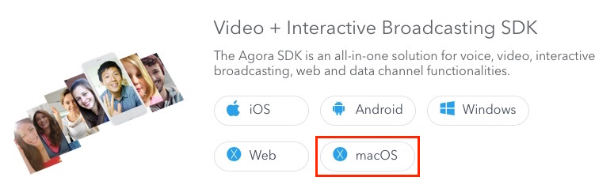
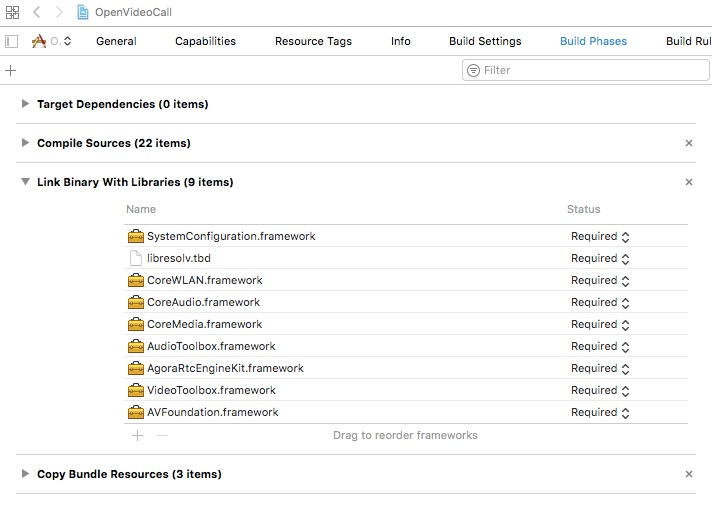
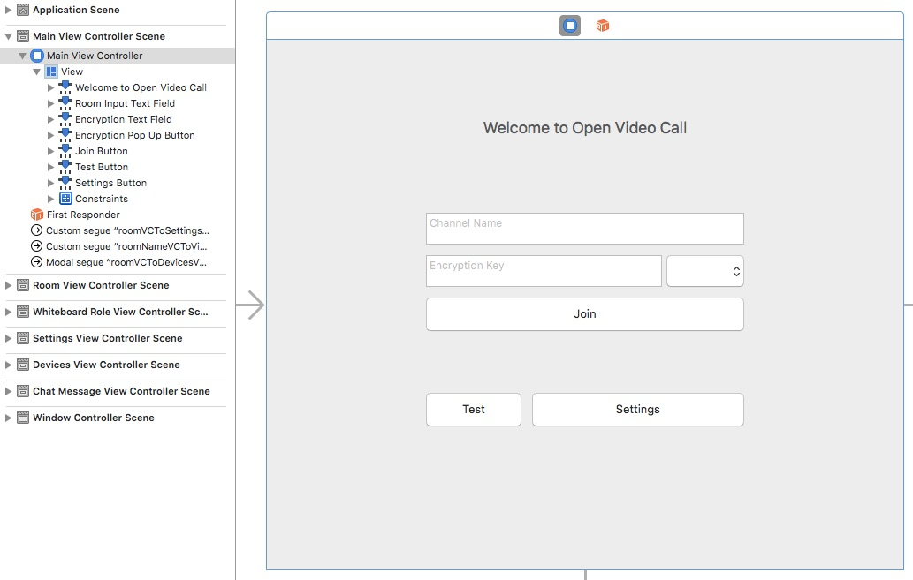
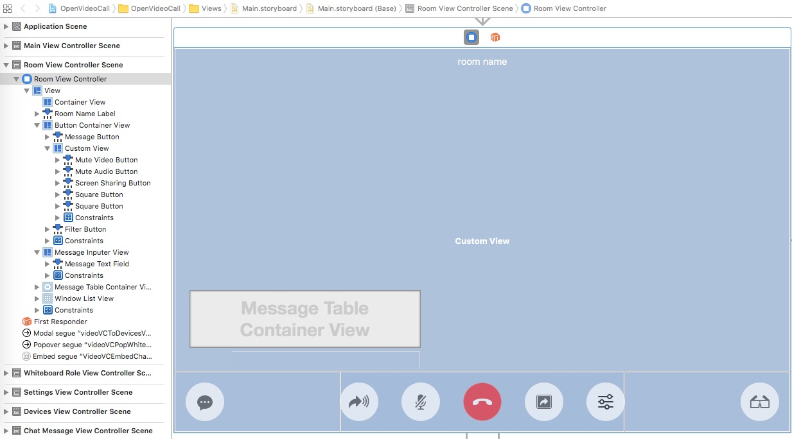
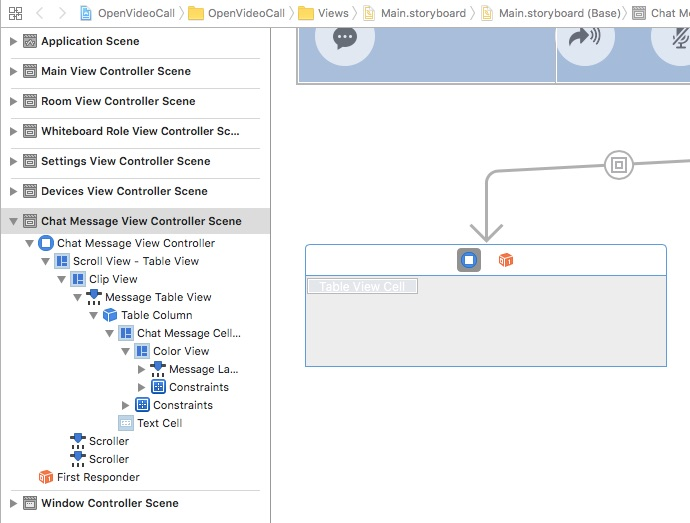
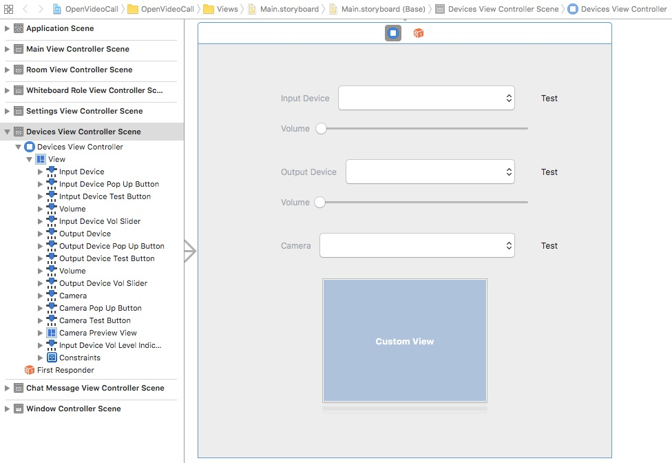

# Open Video Call for MacOS (Swift)

This tutorial describes how to add video chat to your MacOS applications using Swift and the Agora Video SDK.

With this sample app, you can:

- [Join a channel](#create-the-loadagorakit-method)
- [Leave a channel](#create-the-leavechannel-method)
- [Mute/unmute video and audio](#muteunmute-video-and-audio-methods)
- [Enable/disable video](#enabledisable-video)
- [Create input/output devices](#create-inputoutput-device-change-methods)
- [Send a message to a channel](#create-the-send-method)
- [Screen share](#screen-share-and-filter-methods)
- [Set the resolution, the height, and the frame rate](#create-the-remotevideostats-event-listener)
- [Enable encryption](#create-the-loadagorakit-method)

## Prerequisites
- Xcode 8.0+

## Quick Start

This section shows you how to prepare, build, and run the sample application.

- [Create an Account and Obtain an App ID](#create-an-account-and-obtain-an-app-id)
- [Update and Run the Sample Application](#update-and-run-the-sample-application) 


### Create an Account and Obtain an App ID
To build and run the sample application, you must obtain an app ID: 

1. Create a developer account at [agora.io](https://dashboard.agora.io/signin/). Once you finish the sign-up process, you are redirected to the dashboard.
2. Navigate in the dashboard tree on the left to **Projects** > **Project List**.
3. Copy the app ID that you obtained from the dashboard into a text file. You will use this when you launch the application.


### Update and Run the Sample Application 

1. Open `OpenVideoCall.xcodeproj` and edit the [`KeyCenter.swift`](OpenVideoCall/KeyCenter.swift) file. In the `KeyCenter` declaration, update `<#Your App Id#>` with your app ID.

	``` Swift
    static let AppId: String = <#Your App Id#>
	```

2. Download the [Agora Video SDK](https://www.agora.io/en/download/). Unzip the downloaded SDK package and copy the `AgoraRtcEngineKit.framework` file from the SDK `libs` folder into the sample application `OpenVideoCall` folder.

	
		
3. Build and run the project. Ensure a valid provisioning profile is applied or your project will not run. Your application will look like this when it loads.


## Steps to Create the Sample 

- [Add Frameworks and Libraries](#add-frameworks-and-libraries)
- [Design the User Interface](#design-the-user-interface)
- [Create the MainViewController Class](#create-the-mainviewcontroller-class)
- [Create the MainViewController Class Extension](#create-the-mainviewcontroller-class-extension)
- [Create the MainViewController Class Delegates](#create-mainviewcontroller-delegates)
- [Create the RoomViewController Class](#create-the-roomviewcontroller-class)
- [Create RoomViewController Agora Methods and Delegates](#create-roomviewcontroller-agora-methods-and-delegates)
- [Create the ChatMessageViewController Class](#create-the-chatmessageviewcontroller-class)
- [Create the DevicesViewController Class](#create-the-devicesviewcontroller-class)
- [Create the DevicesViewController Class Extensions](#create-the-devicesviewcontroller-class-extensions)
- [Create the SettingsViewController Class](#create-the-settingsviewcontroller-class)

### Add Frameworks and Libraries

Under the **Build Phases** tab, add the following frameworks and libraries to your project:

- `SystemConfiguration.framework`
- `libresolv.tbdroomview- `CoreWLAN.framework`
- `CoreAudio.framework`
- `CoreMedia.framework`
- `AudioToolbox.framework`
- `AgoraRtcEngineKit.framework`
- `VideoToolbox.framework`
- `AVFoundation.framework`



### Design the User Interface

- [Add Assets](#add-assets)
- [Create the MainViewController UI](#create-the-mainviewcontroller-ui)
- [Create the RoomViewController UI and the ChatMessageViewController UI](#create-the-roomviewcontroller-ui-and-the-chatmessageviewcontroller-ui)
- [Create the DevicesViewController UI](#create-the-devicesviewcontroller-ui)
- [Create the SettingsViewController UI](#create-the-settingsviewcontroller-ui)

#### Add Assets

Add the following assets to `Assets.xcassets`.

**Note:** Use Xcode to import assets to `Assets.xcassets`. PDF files are used for these assets, which contain images for each iOS screen resolution.


Asset|Description
------|------
`btn_endcall`|An image of a red telephone for the *hang up* button
`btn_filter` and `btn_filter_blue`|Images of glasses for filtering
`btn_message` and `btn_message_blue`|Images of chat bubbles to initiate a call
`btn_mute` and `btn_mute_blue`|Images of a microphone to mute/unmute audio
`btn_screen_sharing` and `btn_screen_sharing_blue`|Images of an arrow to start/stop screen sharing
`btn_setting`|An image of a cog to open the settings window
`btn_video`|An image of a camera to start video
`btn_voice`|An image of an arrow with sound lines, indicating that audio chat is enabled
`icon_sharing_desktop`|Image of a monitor to share the desktop


#### Create the MainViewController UI

Create the layout for the `MainViewController`.

**Note:** This layout includes navigation `segues` to move from screen to screen.



When the application publishes, the `MainViewController` UI will look like this:


#### Create the RoomViewController UI and the ChatMessageViewController UI

Create the layout for the `RoomViewController` and `ChatMessageViewController`. The `ChatMessageViewController` view is embedded in the `RoomViewController` view.

**Note:** This `RoomViewController` layout includes popover and embed `segues` to display additional UI for the view.






When the application publishes, the `RoomViewController` UI and `ChatViewController` UI combine to look like this:


#### Create the DevicesViewController UI

Create the layout for the `DevicesViewController `.



When the application publishes, the `DevicesViewController` UI will look like this:


#### Create the SettingsViewController UI

Create the layout for the `SettingsViewController`.


When the application publishes, the `SettingsViewController` UI will look like this:


### Create the MainViewController Class

*MainViewController.swift* defines and connects application functionality with the [MainViewController UI](#create-the-mainviewcontroller-ui).

- [Define Global Variables](#define-global-variables)
- [Override the Base Superclass Methods](#override-the-base-superclass-methods)
- [Override the prepare() Segue Method](#override-the-prepare-segue-method)
- [Create the IBAction Methods](#create-the-ibaction-methods)


#### Define Global Variables

The `MainViewController` class has six `IBOutlet` variables. These map to the [MainViewController UI](#create-the-mainviewcontroller-ui) elements.

Variable|Description
----|----
`roomInputTextField`|Maps to the **Channel name** `NSTextField` in the `MainViewController` layout
`encryptionTextField`|Maps to the **Encryption key** `NSTextField` in the `MainViewController` layout
`encryptionPopUpButton`|Maps to the **AES 128** `NSPopUpButton` in the `MainViewController` layout
`testButton`|Maps to the **Test** `NSButton` in the `MainViewController` layout
`joinButton`|Maps to the **Join** `NSButton` in the `MainViewController` layout
`settingsButton`|Maps to the **Settings** `NSButton` in the `MainViewController` layout

``` Swift
import Cocoa

class MainViewController: NSViewController {
    
    @IBOutlet weak var roomInputTextField: NSTextField!
    @IBOutlet weak var encryptionTextField: NSTextField!
    @IBOutlet weak var encryptionPopUpButton: NSPopUpButton!
    @IBOutlet weak var testButton: NSButton!
    @IBOutlet weak var joinButton: NSButton!
    @IBOutlet weak var settingsButton: NSButton!
    
    ...
}
```

The `MainViewController` class has one public variable and two private variables.

- The `videoProfile` variable is initialized with the default Agora video profile using `AgoraVideoProfile.defaultProfile()`.
- The `agoraKit` private variable is declared as an `AgoraRtcEngineKit` object and represents the Agora RTC engine.
- The `encryptionType` private variable is initialized to `EncryptionType.xts128`.

``` Swift    
    var videoProfile = AgoraVideoProfile.defaultProfile()
    fileprivate var agoraKit: AgoraRtcEngineKit!
    fileprivate var encryptionType = EncryptionType.xts128    
```

#### Override the Base Superclass Methods

The `viewDidLoad()` method initializes the `MainViewController`: 

1. Set the view's `wantsLayer` property to `true`.
2. Set the view layer's `backgroundColor` color to `NSColor.white.cgColor`.
3. Load the Agora RTC engine SDK using `loadAgoraKit()`.
4. Load the encryption settings using `loadEncryptionItems()`.

``` Swift
    override func viewDidLoad() {
        super.viewDidLoad()
        
        view.wantsLayer = true
        view.layer?.backgroundColor = NSColor.white.cgColor
        
        loadAgoraKit()
        loadEncryptionItems()
    }
```

The `viewDidAppear()` method is triggered when the view appears on the screen.

Set the keyboard focus to the room's text input field using `roomInputTextField.becomeFirstResponder()`. 

``` Swift
    override func viewDidAppear() {
        super.viewDidAppear()
        roomInputTextField.becomeFirstResponder()
    }
```

#### Override the prepare() Segue Method

Override the `prepare()` segue method to manage the application navigation. 

``` Swift    
    override func prepare(for segue: NSStoryboardSegue, sender: Any?) {
        guard let segueId = segue.identifier , !segueId.isEmpty else {
            return
        }
        
        ...
        
    }    
```

If the `segueId` is `roomVCToSettingsVC`, prepare the settings view through the segue destination `SettingsViewController`:

- Set `settingsVC.videoProfile` to the current `videoProfile`.
- Set `settingsVC.delegate` to `self`.

``` Swift    
        if segueId == "roomVCToSettingsVC" {
            let settingsVC = segue.destinationController as! SettingsViewController
            settingsVC.videoProfile = videoProfile
            settingsVC.delegate = self
        }
```

If the `segueId` is `roomNameVCToVideoVC`, prepare the room view through the segue destination `RoomViewController`:

- Set `roomVC.roomName` to `sender`.
- Set `roomVC.encryptionSecret` to the text entered in the `encryptionTextField`.
- Set `roomVC.encryptionType ` to the current `encryptionType`.
- Set `roomVC.videoProfile ` to the current `videoProfile`.
- Set `roomVC.delegate` to `self`.


``` Swift    
        else if segueId == "roomNameVCToVideoVC" {
            let videoVC = segue.destinationController as! RoomViewController
            if let sender = sender as? String {
                videoVC.roomName = sender
            }
            videoVC.encryptionSecret = encryptionTextField.stringValue
            videoVC.encryptionType = encryptionType
            videoVC.videoProfile = videoProfile
            videoVC.delegate = self
        }
```

If the `segueId` is `roomVCToDevicesVC`, prepare the devices view through the segue destination `DevicesViewController`:

- Set `devicesVC.agoraKit` to `agoraKit`.
- Set `devicesVC.couldTest` to `true`.

``` Swift    
        else if segueId == "roomVCToDevicesVC" {
            let devicesVC = segue.destinationController as! DevicesViewController
            devicesVC.agoraKit = agoraKit
            devicesVC.couldTest = true
        }
```

#### Create the IBAction Methods

The **Encryption** dropdown menu in the `MainViewController` layout invokes the `doEncryptionChanged()` `IBAction` method. This method sets the `encryptionType` value to the selected index of `EncryptionType.allValue`.

``` Swift
    @IBAction func doEncryptionChanged(_ sender: NSPopUpButton) {
        encryptionType = EncryptionType.allValue[sender.indexOfSelectedItem]
    }
```

The **Test** UI Button in the `MainViewController` layout invokes the `doTestClicked()` `IBAction` method. This method opens the [Devices View](#create-the-devicesviewcontroller-ui) using `performSegue()`.

``` Swift
    @IBAction func doTestClicked(_ sender: NSButton) {
        performSegue(withIdentifier: "roomVCToDevicesVC", sender: nil)
    }
```

The **Join** UI Button in the `MainViewController` layout invokes the `doJoinClicked()` `IBAction` method. This method enters the user into the room specified by `roomInputTextField` using `enter()`.

``` Swift    
    @IBAction func doJoinClicked(_ sender: NSButton) {
        enter(roomName: roomInputTextField.stringValue)
    }
```

The **Settings** UI Button in the `MainViewController` layout invokes the `doSettingsClicked()` `IBAction` method. This method opens the [Settings View](#create-the-settingsviewcontroller-ui) using `performSegue()`.

``` Swift
    @IBAction func doSettingsClicked(_ sender: NSButton) {
        performSegue(withIdentifier: "roomVCToSettingsVC", sender: nil)
    }
```

### Create the MainViewController Class Extension

The `MainViewController` extension contains methods to load the Agora RTC engine and manage UI navigation.

``` Swift
private extension MainViewController {

	...
	
}
```

The `loadAgoraKit()` method intializes the Agora RTC engine.
#### Enable/Disable Video
Create `agoraKit` with the `KeyCenter.AppId` using `AgoraRtcEngineKit.sharedEngine()` and enable video using `agoraKit.enableVideo()`.

``` Swift
    func loadAgoraKit() {
        agoraKit = AgoraRtcEngineKit.sharedEngine(withAppId: KeyCenter.AppId, delegate: self)
        agoraKit.enableVideo()
    }
```

The `loadEncryptionItems` method populates the encryption type UI dropdown menu using `encryptionPopUpButton.addItems()`.

Initialize the selection with `encryptionType.description()` using `encryptionPopUpButton.selectItem()`.

``` Swift
    func loadEncryptionItems() {
        encryptionPopUpButton.addItems(withTitles: EncryptionType.allValue.map { type -> String in
            return type.description()
        })
        encryptionPopUpButton.selectItem(withTitle: encryptionType.description())
    }
```

The `enter()` method enters the user into the channel with the name `roomName`.

Ensure `roomName` is valid before navigating from the main view to the room view by applying the identifier `roomNameVCToVideoVC` to `performSegue()`.

``` Swift
    func enter(roomName: String?) {
        guard let roomName = roomName , !roomName.isEmpty else {
            return
        }
        
        performSegue(withIdentifier: "roomNameVCToVideoVC", sender: roomName)
    }
```


### Create MainViewController Delegates

The `MainViewController` delegates implement the required and optional methods for the Agora SDK, UI components, and navigation to/from other views.

- [Create the SettingsVCDelegate](#create-the-settingsvcdelegate)
- [Create the RoomVCDelegate](#create-the-roomvcdelegate)
- [Create the AgoraRtcEngineDelegate](#create-the-agorartcenginedelegate)
- [Create the NSControlTextEditingDelegate](#create-the-nscontroltexteditingdelegate)


#### Create the SettingsVCDelegate

The `settingsVC` method is a delegate method for the `SettingsVCDelegate`.

This method is invoked when the video profile for the `SettingsViewController` changes. It updates the `videoProfile` with `profile`, and sets `settingsVC.view.window?.contentViewController` to `self`.

``` Swift    
extension MainViewController: SettingsVCDelegate {
    func settingsVC(_ settingsVC: SettingsViewController, closeWithProfile profile: AgoraVideoProfile) {
        videoProfile = profile
        settingsVC.view.window?.contentViewController = self
    }
}
```

#### Create the RoomVCDelegate

The `roomVCNeedClose` method is a delegate method for the `RoomVCDelegate`. This method is invoked when the user leaves the room.

Do one of the following:
- If `window` is valid, apply the remaining code.
- If `window` is invalid, invoke  `return`.

``` Swift    
extension MainViewController: RoomVCDelegate {
    func roomVCNeedClose(_ roomVC: RoomViewController) {
        guard let window = roomVC.view.window else {
            return
        }
        
        ...

    }
}

```

1. Invoke `window.toggleFullScreen()` if the window's masking style has a `.fullScreen` option.
2. Add two additional options `.fullSizeContentView` and `.miniaturizable` to the window's masking style array using `window.styleMask.insert()`.
3. Set the window's delegate to `nil`.
4. Initialize the window's collection behavior using `NSWindowCollectionBehavior()`.

``` Swift    
        if window.styleMask.contains(.fullScreen) {
            window.toggleFullScreen(nil)
        }
        
        window.styleMask.insert([.fullSizeContentView, .miniaturizable])
        window.delegate = nil
        window.collectionBehavior = NSWindowCollectionBehavior()
```

Set the content view controller to `self` and set the window to a fixed aspect ratio.

1. Create a local variable `size` using `CGSize()`.
2. Set the `minSize` and the `maxSize` to `size` and set the current size by using `window.setContentSize()`,

``` Swift    
        window.contentViewController = self
        
        let size = CGSize(width: 720, height: 600)
        window.minSize = size
        window.setContentSize(size)
        window.maxSize = size
```

#### Create the AgoraRtcEngineDelegate

The `AgoraRtcEngineDelegate` defines the required callback methods for the Agora SDK.

``` Swift
extension MainViewController: AgoraRtcEngineDelegate {

	...

}
```

The `reportAudioVolumeIndicationOfSpeakers` callback is triggered when the speaker volume indicators change.

Set a name for the `VolumeChangeNotificationKey` notification and the value for the `totalVolume` using `NotificationCenter.default.post()`.

``` Swift
    func rtcEngine(_ engine: AgoraRtcEngineKit, reportAudioVolumeIndicationOfSpeakers speakers: [AgoraRtcAudioVolumeInfo], totalVolume: Int) {
        NotificationCenter.default.post(name: Notification.Name(rawValue: VolumeChangeNotificationKey), object: NSNumber(value: totalVolume as Int))
    }
```

The `device` callback is triggered when the user's device is changed.

Set a name for the `DeviceListChangeNotificationKey` notification and the value for the `deviceType` using `NotificationCenter.default.post()`.

``` Swift
    func rtcEngine(_ engine: AgoraRtcEngineKit, device deviceId: String, type deviceType: AgoraMediaDeviceType, stateChanged state: Int) {
        NotificationCenter.default.post(name: NSNotification.Name(rawValue: DeviceListChangeNotificationKey), object: NSNumber(value: deviceType.rawValue))
    }
```

#### Create the NSControlTextEditingDelegate

The `controlTextDidChange()` method is triggered when the text input field is being edited.

Before formatting the string input, ensure that the field is valid .

1. Format the field's string value using `MediaCharacter.updateToLegalMediaString()`.
2. Set `field.stringValue` to `legalString`, which replaces the field's text with the newly formatted text.

``` Swift
extension MainViewController: NSControlTextEditingDelegate {
    override func controlTextDidChange(_ obj: Notification) {
        guard let field = obj.object as? NSTextField else {
            return
        }
        
        let legalString = MediaCharacter.updateToLegalMediaString(from: field.stringValue)
        field.stringValue = legalString
    }
}
```


### Create the RoomViewController Class

*RoomViewController.swift* defines and connects application functionality with the [RoomViewController UI](#create-the-roomviewcontroller-ui-and-chatmessageviewcontroller-ui).

- [Define the RoomVCDelegate Protocol](#define-the-roomvcdelegate-protocol)
- [Define IBOutlet Variables](#define-iboutlet-variables)
- [Define Global Variables](#define-global-variables)
- [Define Private Class Variables](#define-private-class-variables)
- [Create Superclass Methods](#create-superclass-methods)
- [Create IBAction Methods](#create-ibaction-methods)
- [Create Private and Public Methods](#create-private-and-public-methods)


#### Define the RoomVCDelegate Protocol

The `roomVCNeedClose()` method is used for communication between the `RoomViewController` class and its delegate. The method tells the delegate to close the room.

``` Swift
import Cocoa
import Quartz.ImageKit

protocol RoomVCDelegate: class {
    func roomVCNeedClose(_ roomVC: RoomViewController)
}
```

#### Define IBOutlet Variables

The `RoomViewController` class has `IBOutlet` variables to manage buttons, view containers, and handle other UI elements. The variables map to the [RoomViewController UI](#create-the-roomviewcontroller-ui-and-chatmessageviewcontroller-ui) elements.

Variable|Description
----|----
`roomNameLabel`|Label for the room name in the header of the layout
`buttonContainerView`|Container for the buttons
`containerView`|Container for the videos in the room
`messageTableContainerView`|List of messages
`muteVideoButton`|Button to mute/unmute the video
`muteAudioButton`|Button to mute/unmute the audio
`screenSharingButton`|Button to share/unshare the screen
`windowListView`|List for the windows
`filterButton`|Button for filtering
`messageButton`|Button for messaging
`messageInputerView`|Container for message creation
`messageTextField`|Text field for the message creation

``` Swift
class RoomViewController: NSViewController {

    @IBOutlet weak var roomNameLabel: NSTextField!
    @IBOutlet weak var containerView: NSView!
    @IBOutlet weak var buttonContainerView: NSView!
    @IBOutlet weak var messageTableContainerView: NSView!
    
    @IBOutlet weak var muteVideoButton: NSButton!
    @IBOutlet weak var muteAudioButton: NSButton!
    
    @IBOutlet weak var screenSharingButton: NSButton!
    @IBOutlet weak var windowListView: IKImageBrowserView!
    
    @IBOutlet weak var filterButton: NSButton!
    
    @IBOutlet weak var messageButton: NSButton!
    @IBOutlet weak var messageInputerView: NSView!
    @IBOutlet weak var messageTextField: NSTextField!

    ...
    
}    
```

The remaining code in this section is contained within the `RoomViewController` class declaration.

#### Define Global Variables

The `RoomViewController` class has five public variables. These variables manage the `RoomViewController` settings.

Variable|Description
----|----
`roomName`|The name of the room
`encryptionSecret`|The encryption key for the room
`encryptionType`|The encryption type for the room
`videoProfile`|The video profile for the room
`delegate`|The delegate for the `RoomViewController` class
`AgoraRtcEngineKit`|The Agora RTC engine SDK object

``` Swift    
    var roomName: String!
    var encryptionSecret: String?
    var encryptionType: EncryptionType!
    var videoProfile: AgoraVideoProfile!
    var delegate: RoomVCDelegate?
    
    ...
    
    var agoraKit: AgoraRtcEngineKit!
    
    ...
```

#### Define Private Class Variables

- [UI Management Variables](#ui-management-variables)
- [Video Session Variables](#video-session-variables)
- [Audio and Video Control Variables](#audio-and-video-control-variables)
- [Screen Sharing Control Variables](#screen-sharing-control-variables)
- [Filtering Control Variable](#filtering-control-variable)
- [Chat Message Control Variables](#chat-message-control-variables)

##### UI Management Variables

The `shouldHideFlowViews` variable defaults to `false`. When this variable changes:

1. Set the `isHidden` property of the `buttonContainerView`, `messageTableContainerView`, and `roomNameLabel` to the new value of `shouldHideFlowViews`.
2. If the screen sharing status is `.list` mode, set the `screenSharingStatus` to `.none`.
3. Manage the `messageTextField` and the `messageInputerView` based on `shouldHideFlowViews`.

	- If `shouldHideFlowViews` is `true`, remove the focus from the `messageTextField` using the `resignFirstResponder()` and hide the `messageInputerView` by setting its `isHidden` property to `true`.
	- If `shouldHideFlowViews` is `false`, set the focus to the `messageTextField` using the `becomeFirstResponder()` and show the `messageInputerView` by setting its `isHidden` property to `false`.

``` Swift    
    fileprivate var shouldHideFlowViews = false {
        didSet {
            buttonContainerView?.isHidden = shouldHideFlowViews
            messageTableContainerView?.isHidden = shouldHideFlowViews
            roomNameLabel?.isHidden = shouldHideFlowViews
            
            if screenSharingStatus == .list {
                screenSharingStatus = .none
            }
            
            if shouldHideFlowViews {
                messageTextField?.resignFirstResponder()
                messageInputerView?.isHidden = true
            } else {
                buttonContainerView?.isHidden = false
                if isInputing {
                    messageTextField?.becomeFirstResponder()
                    messageInputerView?.isHidden = false
                }
            }
        }
    }
```

The `shouldCompressSelfView` variable defaults to `false`. When this variable changes, invoke the `updateSelfViewVisiable()` method.

``` Swift    
    fileprivate var shouldCompressSelfView = false {
        didSet {
            updateSelfViewVisiable()
        }
    }    
```

##### Video Session Variables

The `videoSessions` and `doubleClickFullSession` variables handle the video sessions for the room.

Initialize `videoSessions` to an empty array. When `videoSessions` is set, update the interface with the video sessions using `updateInterface()`.

``` Swift
    fileprivate var videoSessions = [VideoSession]() {
        didSet {
            updateInterface(with: videoSessions)
        }
    }
```

Initialize `doubleClickEnabled` to `false`.

When `doubleClickFullSession` is set, update the interface with the video sessions using `updateInterface()` if the number of sessions is `3` or more, and the interface has not already been updated (to avoid duplication).

Initialize the `videoViewLayout` using the `VideoViewLayout()`.

The `dataChannelId` is set to `-1` by default and manages the room channel.

``` Swift
    fileprivate var doubleClickEnabled = false
    fileprivate var doubleClickFullSession: VideoSession? {
        didSet {
            if videoSessions.count >= 3 && doubleClickFullSession != oldValue {
                updateInterface(with: videoSessions)
            }
        }
    }
    fileprivate let videoViewLayout = VideoViewLayout()
    fileprivate var dataChannelId: Int = -1    
```

##### Audio and Video Control Variables

The `audioMuted` and `videoMuted` variables are set to `false` by default, and manage the audio and video streams, respectively.

When `audioMuted` is set, the `muteAudioButton` image is updated, and the audio stream is muted/unmuted using `agoraKit.muteLocalAudioStream()`.

``` Swift
    fileprivate var audioMuted = false {
        didSet {
            muteAudioButton?.image = NSImage(named: audioMuted ? "btn_mute_blue" : "btn_mute")
            agoraKit.muteLocalAudioStream(audioMuted)
        }
    }
```

When `videoMuted` is set:

- The `muteVideoButton` image is updated.
- The video stream is stopped/started using `agoraKit.muteLocalVideoStream()` and `setVideoMuted()`.
- The video view of the current user is set to hidden/not hidden using `updateSelfViewVisiable()`.

``` Swift
    fileprivate var videoMuted = false {
        didSet {
            muteVideoButton?.image = NSImage(named: videoMuted ? "btn_video" : "btn_voice")
            
            agoraKit.muteLocalVideoStream(videoMuted)
            setVideoMuted(videoMuted, forUid: 0)
            
            updateSelfViewVisiable()
        }
    }
```

##### Screen Sharing Control Variables

The `ScreenSharingStatus` enumerates values for `none`, `list`, and `sharing`.

The `nextStatus()` method toggles between active and non-active status states.

- If the current value is `.none`, return `.list`.
- If the current value is `.list`, return `.none`.
- If the current value is `.sharing`, return `.none`.


``` Swift
    enum ScreenSharingStatus {
        case none, list, sharing
        
        func nextStatus() -> ScreenSharingStatus {
            switch self {
            case .none: return .list
            case .list: return .none
            case .sharing: return .none
            }
        }
    }
```

The `screenSharingStatus` variable is set to `ScreenSharingStatus.none` by default, and manages the current status of the screen share.

When the `screenSharingButton` is set:

- The `screenSharingButton` image is updated.
- If the old value is `.sharing`, the screen share stops `stopShareWindow()`.
- if `screenSharingStatus` is equal to `.list`, the window list is shown/hidden.

The `windows` variable is initialized using `WindowList()`.

``` Swift
    fileprivate var screenSharingStatus = ScreenSharingStatus.none {
        didSet {
            screenSharingButton?.image = NSImage(named: (screenSharingStatus == .sharing) ? "btn_screen_sharing_blue" : "btn_screen_sharing")
            
            if oldValue == .sharing {
                stopShareWindow()
            }
            
            showWindowList(screenSharingStatus == .list)
        }
    }
    fileprivate var windows = WindowList()
```

##### Filtering Control Variable

The `isFiltering` variable is set to `false` by default. When this variable is set:

- The creation of `agoraKit` is verified.
- If filtering is enabled, set the video preprocessing using `AGVideoPreProcessing.registerVideoPreprocessing()` and update the `filterButton` with the blue image. 
- If filtering is not enabled, unregister the video preprocessing using `AGVideoPreProcessing.deregisterVideoPreprocessing()` and update the `filterButton` with the white image.

``` Swift
    fileprivate var isFiltering = false {
        didSet {
            guard let agoraKit = agoraKit else {
                return
            }
            
            if isFiltering {
                AGVideoPreProcessing.registerVideoPreprocessing(agoraKit)
                filterButton?.image = NSImage(named: "btn_filter_blue")
            } else {
                AGVideoPreProcessing.deregisterVideoPreprocessing(agoraKit)
                filterButton?.image = NSImage(named: "btn_filter")
            }
        }
    }
```

##### Chat Message Control Variables

The `chatMessageVC` variable manages the chat message list.

The `isInputing` variable is set to `false` as the default. When this is set:

- Based on the current value of `isInputing`
	- The `messageTextField` is activated/deactivated using `becomeFirstResponder()`/`resignFirstResponder()`.
	- The `messageInputerView` is hidden/unhidden.

- The`messageButton` image is updated using `messageButton?.setImage()`.

``` Swift
    fileprivate var chatMessageVC: ChatMessageViewController?
    fileprivate var isInputing = false {
        didSet {
            if isInputing {
                messageTextField?.becomeFirstResponder()
            } else {
                messageTextField?.resignFirstResponder()
            }
            messageInputerView?.isHidden = !isInputing
            messageButton?.image = NSImage(named: isInputing ? "btn_message_blue" : "btn_message")
        }
    }
```

#### Create Superclass Methods

- [Create the View Methods](#create-the-view-methods)
- [Create the `prepare()` Method](#create-the-prepare-method)
- [Create the Image Browser Methods](#create-the-image-browser-methods)

##### Create the View Methods

The `viewDidLoad()` method initializes the `RoomViewController`: 

1. Set the `roomNameLabel` text to `roomName`.
2. Set `messageInputerView.wantsLayer` to `true`.
3. Set the `messageInputerView` layer background color to semi-transparent black and set the `cornerRadius` property to `2`.
4. Invoke `setupWindowListView()`.
5. Load the Agora RTC engine SDK using `loadAgoraKit()`.

``` Swift
    override func viewDidLoad() {
        super.viewDidLoad()
        roomNameLabel.stringValue = roomName
        
        messageInputerView.wantsLayer = true
        messageInputerView.layer?.backgroundColor = NSColor(hex: 0x000000, alpha: 0.75).cgColor
        messageInputerView.layer?.cornerRadius = 2
        
        setupWindowListView()
        loadAgoraKit()
    }
```

The `viewDidAppear()` method is triggered when the view appears on the screen. Set the view's window configuration style using `configStyle()`. 

``` Swift
    override func viewDidAppear() {
        super.viewDidAppear()
        configStyle(of: view.window!)
    }
```

##### Create the `prepare()` Method

The `prepare()` segue method manages the navigation for the `RoomViewController`. If the `segueId` is `VideoVCEmbedChatMessageVC`, set `chatMessageVC` to the `ChatMessageViewController`; otherwise do nothing.

``` Swift
    override func prepare(for segue: UIStoryboardSegue, sender: Any?) {
        guard let segueId = segue.identifier else {
            return
        }
        
        switch segueId {
        case "VideoVCEmbedChatMessageVC":
            chatMessageVC = segue.destination as? ChatMessageViewController
        default:
            break
        }
    }
```

##### Create the Image Browser Methods

The methods in this section manage the methods for the `IKImageBrowserView` class.

``` Swift
extension RoomViewController {
	
	...
	
}

```

The `numberOfItems` method returns the number of items for the image browser. Return the value of `windows.items.count`.

``` Swift
    override func numberOfItems(inImageBrowser aBrowser: IKImageBrowserView!) -> Int {
        return windows.items.count
    }
```

The `itemAt` method returns the item at the specified `index` for the image browser. Return the value of `windows.items[index]`.

``` Swift
    override func imageBrowser(_ aBrowser: IKImageBrowserView!, itemAt index: Int) -> Any! {
        let item = windows.items[index]
        return item
    }
```

The `cellWasDoubleClickedAt` method is triggered when a cell in the image browser is double-clicked.

If `aBrowser` has no selected index or the `index` is less than `windows.items.count`, invoke `return`.

Otherwise, use the `index` to retrieve the `window` from `windows.items` and start sharing the window using `startShareWindow()` and set `screenSharingStatus` to `.sharing`.

``` Swift
    override func imageBrowser(_ aBrowser: IKImageBrowserView!, cellWasDoubleClickedAt index: Int) {
        guard let selected = aBrowser.selectionIndexes() else {
            return
        }
        
        let index = selected.first
        guard index! < windows.items.count else {
            return
        }
        
        let window = windows.items[index!].window
        startShareWindow(window!)
        screenSharingStatus = .sharing
    }
```

#### Create IBAction Methods

These `IBAction` methods map to the UI elements for the `RoomViewController`:

- [Message Methods](#message-methods)
- [Mute/Unmute Video and Audio Methods](#muteunmute-video-and-audio-methods)
- [Screen Share and Filter Methods](#screen-share-and-filter-methods)

##### Message Methods

The `doMessageClicked()` method is invoked by the `messageButton` UI button and updates `isInputing`.

The `doMessageInput()` method is invoked by the `messageTextField` UI text field. If the text field is not empty:

-  Send the `text` using `send()`.
-  Clear the text field by setting the `stringValue` property to an empty string.
    
``` Swift
    @IBAction func doMessageClicked(_ sender: NSButton) {
        isInputing = !isInputing
    }
    
    ...
    
    @IBAction func doMessageInput(_ sender: NSTextField) {
        let text = sender.stringValue
        if !text.isEmpty {
            send(text: text)
            sender.stringValue = ""
        }
    }
```

##### Mute/Unmute Video and Audio Methods

The `doMuteVideoClicked()` method is invoked by the `muteVideoButton` UI button and updates `videoMuted`.

The `doMuteAudioClicked()` method is invoked by the `muteAudioButton` UI button and updates `audioMuted`.


``` Swift
    @IBAction func doMuteVideoClicked(_ sender: NSButton) {
        videoMuted = !videoMuted
    }
    
    @IBAction func doMuteAudioClicked(_ sender: NSButton) {
        audioMuted = !audioMuted
    }
```

##### Screen Share and Filter Methods

The `doShareScreenClicked()` method is invoked by the `screenSharingButton` UI button and updates `screenSharingStatus` to  the value of `screenSharingStatus.nextStatus()`.
    
The `doFilterClicked()` method is invoked by the `filterButton` UI button action and updates `isFiltering`.

``` Swift
    @IBAction func doShareScreenClicked(_ sender: NSButton) {
        screenSharingStatus = screenSharingStatus.nextStatus()
    }
    
    @IBAction func doFilterClicked(_ sender: NSButton) {
        isFiltering = !isFiltering
    }
```

#### Create Private and Public Methods

The private methods for the `RoomViewController` are created as functions in a private extension.

``` Swift
private extension RoomViewController {

	...
	
}
```

- [Create the configStyle() Method](#create-the-configStyle-method)
- [Create the updateInterface() Method](#create-the-updateinterface-method)
- [Create Session Methods](#create-session-methods)
- [Create the UI Control Methods](#create-the-ui-control-methods)


##### Create the configStyle() Method

They `configStyle()` method sets the style of the application window.

1. Set the window `delegate` to `self`.
2. Set the window's `collectionBehavior` property to an array containing `.fullScreenPrimary`.
3. Set the window minimum, maximum, and current size:
	- Set the window's minimum size to `960` x `600` using `CGSize()`.
	- Set the window's maximum size to the largest value possible using `CGFloat.greatestFiniteMagnitude` and `CGSize()`.
	- Set the current size to `minSize` using `window.setContentSize()`.


``` Swift
    func configStyle(of window: NSWindow) {
        window.styleMask.insert([.fullSizeContentView, .miniaturizable])
        window.delegate = self
        window.collectionBehavior = [.fullScreenPrimary]
        
        let minSize = CGSize(width: 960, height: 600)
        window.minSize = minSize
        window.maxSize = CGSize(width: CGFloat.greatestFiniteMagnitude, height: CGFloat.greatestFiniteMagnitude)
        window.setContentSize(minSize)
    }
```

##### Create the updateInterface Method

The `updateInterface()` method handles layout updates for the video session.

Do one of the following:

- If `sessions` is not empty, continue with the remaining code.
- If `sessions` is empty, invoke `return`.

``` Swift
    func updateInterface(with sessions: [VideoSession]) {
        guard !sessions.isEmpty else {
            return
        }
        
        ...
        
    }
```        

Update the `videoViewLayout` properties:

- Initialize a local variable `selfSession` to `sessions.first`.
- Set the `selfView` property to `selfSession.hostingView`.
- Set the `selfSize` property to `selfSession.size`.
- Initialize a local variable `peerVideoViews` to an empty array.
- For each session in `sessions`, append the sessio.n's `hostingView`.
- Set the `videoViews` property to `peerVideoViews`
- Set the `fullView` property to `doubleClickFullSession?.hostingView`.
- Set the `containerView` property to `containerView`.

Update the video views using `videoViewLayout.layoutVideoViews()`.

``` Swift
        let selfSession = sessions.first!
        videoViewLayout.selfView = selfSession.hostingView
        videoViewLayout.selfSize = selfSession.size
        var peerVideoViews = [VideoView]()
        for i in 1..<sessions.count {
            peerVideoViews.append(sessions[i].hostingView)
        }
        videoViewLayout.videoViews = peerVideoViews
        videoViewLayout.fullView = doubleClickFullSession?.hostingView
        videoViewLayout.containerView = containerView
        
        videoViewLayout.layoutVideoViews()
```        

Invoke `updateSelfViewVisiable()`.

If the number of `sessions` is greater than or equal to `3`, set `doubleClickEnabled` to `true`. Otherwise, set `doubleClickEnabled` to `false` and `doubleClickFullSession` to `nil`.

``` Swift
        updateSelfViewVisiable()
        
        if sessions.count >= 3 {
            doubleClickEnabled = true
        } else {
            doubleClickEnabled = false
            doubleClickFullSession = nil
        }
```

##### Create Session Methods

The `fetchSession()` method returns the `VideoSession` for a specified user. Loop through `videoSessions` until the `session.uid` matches the `uid`.

``` Swift    
    func fetchSession(of uid: UInt) -> VideoSession? {
        for session in videoSessions {
            if session.uid == uid {
                return session
            }
        }
        
        return nil
    }
```

The `videoSession()` method returns the `VideoSession` for the user. 

The difference between this method and the `fetchSession()` method is that if no `fetchSession()` exists a new `VideoSession` object is created and appended to `videoSessions`.

``` Swift    
    func videoSession(of uid: UInt) -> VideoSession {
        if let fetchedSession = fetchSession(of: uid) {
            return fetchedSession
        } else {
            let newSession = VideoSession(uid: uid)
            videoSessions.append(newSession)
            return newSession
        }
    }
```

The `setVideoMuted()` method starts/stops the video for a specified user. The `VideoSession` is retrieved using `fetchSession()` to apply `muted` to the `isVideoMuted` property.

``` Swift    
    func setVideoMuted(_ muted: Bool, forUid uid: UInt) {
        fetchSession(of: uid)?.isVideoMuted = muted
    }
```

##### Create the UI Control Methods

The `updateSelfViewVisiable()` method sets the user view to hidden/not hidden. If the number of `videoSessions` is `2`, determine if the view is hidden using `videoMuted` and `shouldCompressSelfView`. Otherwise, hide the view.

``` Swift
    func updateSelfViewVisiable() {
        guard let selfView = videoSessions.first?.hostingView else {
            return
        }
        
        if videoSessions.count == 2 {
            selfView.isHidden = (videoMuted || shouldCompressSelfView)
            
        } else {
            selfView.isHidden = false
        }
    }
```

The `setupWindowListView()` method updates the `windowListView`:

- Allow the width to be resizable using `windowListView.setContentResizingMask()`.
- Set `IKImageBrowserBackgroundColorKey` to semi-transparent white using `windowListView.setValue()`.
- Set the `IKImageBrowserCellsTitleAttributesKey`:
	1. Retrieve the old attributes value using the `windowListView.value()`.
	2. Create a new local variable `attributres` using `oldAttributres.mutableCopy()`.
	3. Set the `NSForegroundColorAttributeName` of `attributres` to white using `attributres.setObject()`.
	4. Set the title attributes using `windowListView.setValue()`.

``` Swift
    func setupWindowListView() {
        windowListView.setContentResizingMask(Int(NSAutoresizingMaskOptions.viewWidthSizable.rawValue))
        windowListView.setValue(NSColor(white: 0, alpha: 0.75), forKey:IKImageBrowserBackgroundColorKey)
        
        let oldAttributres = windowListView.value(forKey: IKImageBrowserCellsTitleAttributesKey) as! NSDictionary
        let attributres = oldAttributres.mutableCopy() as! NSMutableDictionary
        attributres.setObject(NSColor.white, forKey: NSForegroundColorAttributeName as NSCopying)
        windowListView.setValue(attributres, forKey:IKImageBrowserCellsTitleAttributesKey)
    }
```

The `showWindowList()` method shows/hides the `windowListView`.

If `shouldShow` is `true`:

1. Invoke `windows.getList()` and `windowListView?.reloadData()` to update and reload the list data. 
2. Show the `windowListView` by setting the `isHidden` property to `false`.

If `shouldShow` is `false`, hide the `windowListView` by setting the `isHidden` property to `true`.


``` Swift
    func showWindowList(_ shouldShow: Bool) {
        if shouldShow {
            windows.getList()
            windowListView?.reloadData()
            windowListView?.isHidden = false
        } else {
            windowListView?.isHidden = true
        }
    }
```

The `alert()` method appends an alert message to the chat message box using `chatMessageVC?.append()`.

``` Swift
    func alert(string: String) {
        guard !string.isEmpty else {
            return
        }
        chatMessageVC?.append(alert: string)
    }
```

The `windowShouldClose()` is a public method required by `NSWindowDelegate` and is triggered before the window closes.

Invoke `leaveChannel()` and return `false`.

``` Swift
extension RoomViewController: NSWindowDelegate {
    func windowShouldClose(_ sender: Any) -> Bool {
        leaveChannel()
        return false
    }
}
```


### Create RoomViewController Agora Methods and Delegates

The methods applying the Agora SDK are placed within a private extension for the `RoomViewController`.

``` Swift
private extension RoomViewController {
	...
}
```

- [Create the loadAgoraKit() Method](#create-the-loadagorakit-method)
- [Create the addLocalSession() Method](#create-the-addlocalsession-method)
- [Create the leaveChannel() Method](#create-the-leavechannel-method)
- [Create the Screen Share Methods](#create-the-screen-share-methods)
- [Create the send() Method](#create-the-send-method)
- [Create the AgoraRtcEngineDelegate](#create-the-agorartcenginedelegate)


#### Create the loadAgoraKit() Method

The `loadAgoraKit()` method initializes the Agora RTC engine using `AgoraRtcEngineKit.sharedEngine()`:

1. Set the channel profile to `.communication`, enable video using `agoraKit.enableVideo()`, and set the `videoProfile` using `agoraKit.setVideoProfile()`.

2. Invoke `addLocalSession()` and start the preview using `agoraKit.startPreview()`.

3. If `encryptionSecret` is not empty, set the encryption using `agoraKit.setEncryptionMode()` and `agoraKit.setEncryptionSecret()`.

4. Join the channel `roomName` using `agoraKit.joinChannel()`:

- If the `code` is equal to `0`, the channel join is successful. Disable the idle timer using `setIdleTimerActive`.
- If the channel join is not successful, display an error message alert using `self.alert()`.

5. Complete the method with `agoraKit.createDataStream()` to create a data stream for the joined channel.

``` Swift
    func loadAgoraKit() {
        agoraKit = AgoraRtcEngineKit.sharedEngine(withAppId: KeyCenter.AppId, delegate: self)
        agoraKit.setChannelProfile(.communication)
        agoraKit.enableVideo()
        agoraKit.setVideoProfile(videoProfile, swapWidthAndHeight: false)
        
        addLocalSession()
        agoraKit.startPreview()
        
        if let encryptionType = encryptionType, let encryptionSecret = encryptionSecret , !encryptionSecret.isEmpty {
            agoraKit.setEncryptionMode(encryptionType.modeString())
            agoraKit.setEncryptionSecret(encryptionSecret)
        }
        let code = agoraKit.joinChannel(byToken: nil, channelId: roomName, info: nil, uid: 0, joinSuccess: nil)
        if code != 0 {
            DispatchQueue.main.async(execute: {
                self.alert(string: "Join channel failed: \(code)")
            })
        }
        
        agoraKit.createDataStream(&dataChannelId, reliable: true, ordered: true)
    }
```

#### Create the addLocalSession() Method

The `addLocalSession()` method appends the local video session to the `videoSessions` and sets up the local video view using `agoraKit.setupLocalVideo()`.

If `MediaInfo` is available for the `videoProfile`, set the media info property for the local session using `localSession.mediaInfo`.

``` Swift
    func addLocalSession() {
        let localSession = VideoSession.localSession()
        videoSessions.append(localSession)
        agoraKit.setupLocalVideo(localSession.canvas)
        if let mediaInfo = MediaInfo(videoProfile: videoProfile) {
            localSession.mediaInfo = mediaInfo
        }
    }
```

#### Create the leaveChannel() Method

The `leaveChannel()` method enables the user to leave the video session.

1. Clear the local video and leave the channel by applying `nil` as the parameter for `agoraKit.setupLocalVideo()` and `agoraKit.leaveChannel()`.
2. Stop the video preview using `agoraKit.stopPreview()` and set `isFiltering` to `false`.
3. Loop through `videoSessions` and remove its `hostingView` from the superview using `removeFromSuperview()`. 
4. Clear the video sessions array using `videoSessions.removeAll()`.
5. Complete the method by invoking the room to close using `delegate?.roomVCNeedClose()`.

``` Swift
    func leaveChannel() {
        agoraKit.setupLocalVideo(nil)
        agoraKit.leaveChannel(nil)
        agoraKit.stopPreview()
        isFiltering = false
        
        for session in videoSessions {
            session.hostingView.removeFromSuperview()
        }
        videoSessions.removeAll()
        
        delegate?.roomVCNeedClose(self)
    }
```

#### Create the Screen Share Methods

The `startShareWindow()` method starts screen sharing.

Capture the screen specified by the `windowId` using `agoraKit?.startScreenCapture()`.

Turn on screen share for the first item in the `videoSessions` using `hostingView.switchToScreenShare()` if any of the following are `true`:

- `windowId` is equal to `0`
- `window.name` is equal to `Agora Video Call`
- `window.name` is equal to `Full Screen`

``` Swift
    func startShareWindow(_ window: Window) {
        let windowId = window.id
        agoraKit?.startScreenCapture(UInt(windowId), withCaptureFreq: 15, bitRate: 0, andRect: CGRect.zero )
        videoSessions.first?.hostingView.switchToScreenShare(windowId == 0 || window.name == "Agora Video Call" || window.name == "Full Screen")
    }
```

The `stopShareWindow()` method stops screen sharing.

Stop the screen capture the screen specified by using `agoraKit?.stopScreenCapture()` and turn of screen share for the first item in the `videoSessions` using `hostingView.switchToScreenShare()`.

``` Swift
    func stopShareWindow() {
        agoraKit?.stopScreenCapture()
        videoSessions.first?.hostingView.switchToScreenShare(false)
    }
```

#### Create the send() Method

The `send()` method sends a new message to the stream. 

Ensure that the `dataChannelId` is greater than `0` and that the `text.data` is valid before applying the following:

- Send the message to the stream using `agoraKit.sendStreamMessage()`.
- Append the message to the chat message view using `chatMessageVC?.append()`.

``` Swift
    func send(text: String) {
        if dataChannelId > 0, let data = text.data(using: String.Encoding.utf8) {
            agoraKit.sendStreamMessage(dataChannelId, data: data)
            chatMessageVC?.append(chat: text, fromUid: 0)
        }
    }
```

#### Create the AgoraRtcEngineDelegate

The `AgoraRtcEngineDelegate` methods are added through an extension for the `RoomViewController`.

``` Swift
extension RoomViewController: AgoraRtcEngineDelegate {
    
    ...
    
}
```

- [Create the rtcEngine Connection Methods](#create-the-rtcengine-connection-methods)
- [Create the errorCode Event Listener](#create-the-errorcode-event-listener)
- [Create the firstRemoteVideoDecodedOfUid Event Listener](#create-the-firstremotevideodecodedofuid-event-listener)
- [Create the firstLocalVideoFrameWith Event Listener](#create-the-firstlocalvideoframewith-event-listener)
- [Create the didOfflineOfUid Event Listener](#create-the-didofflineofuid-event-listener)
- [Create the didVideoMuted Event Listener](#create-the-didvideomuted-event-listener)
- [Create the remoteVideoStats Event Listener](#create-the-remotevideostats-event-listener)
- [Create the Device Changed Event Listener](#create-the-device-changed-event-listener)
- [Create the receiveStreamMessageFromUid Event Listener](#create-the-receivestreammessagefromuid-event-listener)
- [Create the didOccurStreamMessageErrorFromUid Event Listener](#create-the-didoccurstreammessageerrorfromuid-event-listener)


##### Create the rtcEngine Connection Methods

The `rtcEngineConnectionDidInterrupted()` method displays an alert with the error message `Connection Interrupted`.

The `rtcEngineConnectionDidLost()` method displays an alert with the error message `Connection Lost`.

``` Swift
    func rtcEngineConnectionDidInterrupted(_ engine: AgoraRtcEngineKit) {
        alert(string: "Connection Interrupted")
    }
    
    func rtcEngineConnectionDidLost(_ engine: AgoraRtcEngineKit) {
        alert(string: "Connection Lost")
    }
```

##### Create the errorCode Event Listener

The `didOccurError` event listener is triggered when the Agora RTC engine generates an error.  

Display an alert with the error code value `errorCode.rawValue`.

``` Swift
    func rtcEngine(_ engine: AgoraRtcEngineKit, didOccurError errorCode: AgoraErrorCode) {
        alert(string: "errorCode \(errorCode.rawValue)")
    }
```

##### Create the firstRemoteVideoDecodedOfUid Event Listener

The `firstRemoteVideoDecodedOfUid` event listener is triggered when the first remote video is decoded.

1. Retrieve the video session of the user using the `videoSession()`.

2. Set the session dimensions using the `userSession.size` and update the media info using the `userSession.updateMediaInfo()`.

3. Complete the method by setting up the remote video using `agoraKit.setupRemoteVideo()`.

``` Swift
    func rtcEngine(_ engine: AgoraRtcEngineKit, firstRemoteVideoDecodedOfUid uid: UInt, size: CGSize, elapsed: Int) {
        let userSession = videoSession(of: uid)
        let sie = size.fixedSize()
        userSession.size = sie
        userSession.updateMediaInfo(resolution: size)
        agoraKit.setupRemoteVideo(userSession.canvas)
    }
```

##### Create the firstLocalVideoFrameWith Event Listener

The `firstLocalVideoFrameWith` event listener is triggered when the first local video frame has `elapsed`.

Ensure that `selfSession` is the first item in the `videoSessions` before applying the following:

- Set the dimensions of the video session using `selfSession.size`.
- Update the video interface using `updateInterface()`.

``` Swift
    // first local video frame
    func rtcEngine(_ engine: AgoraRtcEngineKit, firstLocalVideoFrameWith size: CGSize, elapsed: Int) {
        if let selfSession = videoSessions.first {
            selfSession.size = size.fixedSize()
            updateInterface(with: videoSessions)
        }
    }
```

##### Create the didOfflineOfUid Event Listener

The `didOfflineOfUid` is triggered when a user goes offline.

Loop through the `videoSessions` to retrieve the video session of the offline user:

- If the video session is found, remove the session `hostingView` from the superview using `removeFromSuperview()`..
- If the offline user session is `doubleClickFullSession`, set `doubleClickFullSession` to `nil`. 

``` Swift
    // user offline
    func rtcEngine(_ engine: AgoraRtcEngineKit, didOfflineOfUid uid: UInt, reason: AgoraUserOfflineReason) {
        var indexToDelete: Int?
        for (index, session) in videoSessions.enumerated() {
            if session.uid == uid {
                indexToDelete = index
            }
        }
        
        if let indexToDelete = indexToDelete {
            let deletedSession = videoSessions.remove(at: indexToDelete)
            deletedSession.hostingView.removeFromSuperview()
            if let doubleClickFullSession = doubleClickFullSession , doubleClickFullSession == deletedSession {
                self.doubleClickFullSession = nil
            }
        }
    }
```

##### Create the didVideoMuted Event Listener

The `didVideoMuted` is triggered when a user turns off video.

Set the video to `off` using `setVideoMuted()`.

``` Swift
    // video muted
    func rtcEngine(_ engine: AgoraRtcEngineKit, didVideoMuted muted: Bool, byUid uid: UInt) {
        setVideoMuted(muted, forUid: uid)
    }
```

##### Create the remoteVideoStats Event Listener

The `remoteVideoStats` event is triggered when a metric changes for the Agora RTC engine.

Retrieve the video session for the user using `fetchSession()` and update the `resolution`, `height`, and `fps` using `session.updateMediaInfo()`.

``` Swift
    //remote stat
    func rtcEngine(_ engine: AgoraRtcEngineKit, remoteVideoStats stats: AgoraRtcRemoteVideoStats) {
        if let session = fetchSession(of: stats.uid) {
            session.updateMediaInfo(resolution: CGSize(width: CGFloat(stats.width), height: CGFloat(stats.height)), bitRate: Int(stats.receivedBitrate), fps: Int(stats.receivedFrameRate))
        }
    }
```


##### Create the Device Changed Event Listener

The device changed event listener is triggered when the device changes.

Set a device notification with the `DeviceListChangeNotificationKey` and the device type using the `NotificationCenter.default.post()`. 

```
    func rtcEngine(_ engine: AgoraRtcEngineKit, device deviceId: String, type deviceType: AgoraMediaDeviceType, stateChanged state: Int) {
        NotificationCenter.default.post(name: NSNotification.Name(rawValue: DeviceListChangeNotificationKey), object: NSNumber(value: deviceType.rawValue))
    }
```

##### Create the receiveStreamMessageFromUid Event Listener

The `receiveStreamMessageFromUid` is triggered when a message is received from a user.

The method checks that the message `string` is not empty before appending it to the chat message view using `chatMessageVC?.append()`.

``` Swift
    //data channel
    func rtcEngine(_ engine: AgoraRtcEngineKit, receiveStreamMessageFromUid uid: UInt, streamId: Int, data: Data) {
        guard let string = String(data: data, encoding: String.Encoding.utf8) , !string.isEmpty else {
            return
        }
        chatMessageVC?.append(chat: string, fromUid: Int64(uid))
    }
```

##### Create the didOccurStreamMessageErrorFromUid Event Listener

The `didOccurStreamMessageErrorFromUid` is triggered when a user message error occurs and then displays the error using `chatMessageVC?.append()`.

``` Swift
    func rtcEngine(_ engine: AgoraRtcEngineKit, didOccurStreamMessageErrorFromUid uid: UInt, streamId: Int, error: Int, missed: Int, cached: Int) {
        chatMessageVC?.append(alert: "Data channel error: \(error)")
    }
```

### Create the ChatMessageViewController Class

*ChatMessageViewController.swift* defines and connects application functionality with the [ChatMessageViewController UI](#create-the-roomviewcontroller-ui-and-the-chatmessageviewcontroller-ui).

- [Add Global Variables and Superclass Overrides](#add-global-variables-and-superclass-overrides)
- [Create append() Methods](#create-append-methods)
- [Create the UITableViewDataSource Object](#create-the-uitableviewdatasource-object)

#### Add Global Variables and Superclass Overrides

The `ChatMessageViewController` defines the `IBOutlet` variable `messageTableView`, which maps to the table created in the [ChatMessageViewController UI](#create-the-roomviewcontroller-ui-and-the-chatmessageviewcontroller-ui).

Initialize the private variable `messageList` to manage the array of messages for the chat.


``` Swift
import Cocoa

class ChatMessageViewController: NSViewController {
    
    @IBOutlet weak var messageTableView: NSTableView!
    
    fileprivate var messageList = [Message]()
    
    ...
    
}
```

#### Create `append()` Methods

The `append()` methods are used to add messages and alerts to the message window.

- The `append()` method for a `chat` creates a new `Message` object of type `.chat` and invokes the `append()` method for the `message`.

- The `append()` method for an `alert ` creates a new `Message` object of type `.alert` and invokes the `append()` method for `message`.

``` Swift
    func append(chat text: String, fromUid uid: Int64) {
        let message = Message(text: text, type: .chat)
        append(message: message)
    }
    
    func append(alert text: String) {
        let message = Message(text: text, type: .alert)
        append(message: message)
    }
```

The `append()` method for a `message` is created in an extension for the `ChatMessageViewController`.

The `message` is added to the `messageList`.

When the `messageList` contains more than `20` messages, delete the first message in the array using `updateMessageTable()`.

``` Swift
private extension ChatMessageViewController {
    func append(message: Message) {
        messageList.append(message)
        
        var deleted: Message?
        if messageList.count > 20 {
            deleted = messageList.removeFirst()
        }
        
        updateMessageTable(withDeleted: deleted)
    }
    
    ...
    
}
```

The `updateMessageTable()` method is a helper method to handle messages for the chat view.

1. Check that the `messageTableView` exists. If it does not exist, stop the method using `return`.

2. If `deleted` is equal to `nil`, remove the first message using `tableView.removeRows()`.

3. Retrieve the `IndexSet` for the last message by using `messageList.count - 1`.

4. Add the new message to the table using `tableView.insertRows()`.

5. Display the last message on the screen using `tableView.scrollRowToVisible()`.

``` Swift
    func updateMessageTable(withDeleted deleted: Message?) {
        guard let tableView = messageTableView else {
            return
        }
        
        if deleted != nil {
            tableView.removeRows(at: IndexSet(integer: 0), withAnimation: NSTableViewAnimationOptions())
        }
        
        let lastRow = messageList.count - 1
        tableView.insertRows(at: IndexSet(integer: lastRow), withAnimation: NSTableViewAnimationOptions())
        tableView.scrollRowToVisible(lastRow)
    }
```

#### Create the UITableViewDataSource Object

The `tableView` data source method is defined in an extension to the `ChatMessageViewController`. 

Return a `messageList.count` as the number of rows in the table section.

``` Swift
extension ChatMessageViewController: NSTableViewDataSource {
    func numberOfRows(in tableView: NSTableView) -> Int {
        return messageList.count
    }
}
```

The `tableView` delegate methods are defined in an extension to the `ChatMessageViewController`. 

Retrieve each cell for the table:

1. Create the table cell using `tableView.make()`.

2. Set the cell `message` using `cell.set` and return the resulting cell.

``` Swift
extension ChatMessageViewController: NSTableViewDelegate {
    func tableView(_ tableView: NSTableView, viewFor tableColumn: NSTableColumn?, row: Int) -> NSView? {
        let cell = tableView.make(withIdentifier: "messageCell", owner: self) as! ChatMessageCellView
        let message = messageList[row]
        cell.set(with: message)
        return cell
    }
    
    ...
    
}
```

Set the height for each cell in the table:

1. Initialize a local `defaultHeight` variable to `24`.
2. Retrieve the text for the current row using `messageList[row].text`.
3. Retrieve the first column of the table using `tableView.tableColumns.first`.
4. Initialize a local `width` variable to `column.width - 24`.
5. Create a bounding rectangle for the text using `string.boundingRect()`.
6. Set the text height using `textRect.height + 6` and ensure that the result is at least `defaultHeight`.
7. Return the resulting `textHeight`.

``` Swift
    func tableView(_ tableView: NSTableView, heightOfRow row: Int) -> CGFloat {
        let defaultHeight: CGFloat = 24
        let string: NSString = messageList[row].text as NSString
        
        let column = tableView.tableColumns.first!
        let width = column.width - 24
        let textRect = string.boundingRect(with: NSMakeSize(width, 0), options: [.usesLineFragmentOrigin], attributes: [NSFontAttributeName: NSFont.systemFont(ofSize: 12)])
        
        var textHeight = textRect.height + 6
        
        if textHeight < defaultHeight {
            textHeight = defaultHeight;
        }
        return textHeight;
    }
```


### Create the DevicesViewController Class

*DevicesViewController.swift* defines and connects application functionality with the [DevicesViewController UI](#create-the-devicesviewcontroller-ui).

The `DevicesViewController` class has two global variables that serve as notification key constants.

The remaining code in this section is contained within the `NSViewController` declaration.

``` Swift
import Cocoa

let DeviceListChangeNotificationKey = "io.agora.deviceListChangeNotification"
let VolumeChangeNotificationKey = "io.agora.volumeChangeNotification"

class DevicesViewController: NSViewController {

	...
	
}
```

- [Define IBOutlet Variables](#define-iboutlet-variables)
- [Define Public and Private Variables](#define-public-and-private-variables)
- [Create Superclass Override Methods](#create-superclass-override-methods)
- [Create IBAction Methods](#create-ibaction-methods)

#### Define IBOutlet Variables

The `DevicesViewController` class defines a set of UI elements for input device, output device, and camera controls using `IBOutlet` variables.

Input Device Variable|Description
---|---
`inputDevicePopUpButton`|Dropdown menu for the list of available input devices
`inputDeviceVolSlider`|Volume control for the selected input device
`intputDeviceTestButton`|Button to test the selected input device
`inputDeviceVolLevelIndicator`|Volume level indicator for the selected input device


``` Swift
    @IBOutlet weak var inputDevicePopUpButton: NSPopUpButton!
    @IBOutlet weak var inputDeviceVolSlider: NSSlider!
    @IBOutlet weak var intputDeviceTestButton: NSButton!
    @IBOutlet weak var inputDeviceVolLevelIndicator: NSLevelIndicator!
```

Output Device Variable|Description
---|---
`outputDevicePopUpButton`|Dropdown menu for the list of available output devices
`outputDeviceVolSlider`|Volume control for the selected output device
`outputDeviceTestButton`|Button to test the selected output device


``` Swift
    @IBOutlet weak var outputDevicePopUpButton: NSPopUpButton!
    @IBOutlet weak var outputDeviceVolSlider: NSSlider!
    @IBOutlet weak var outputDeviceTestButton: NSButton!
```

Output Device Variable|Description
---|---
`cameraPopUpButton`|Dropdown menu for the list of available camera devices
`cameraTestButton`|Button to test the selected camera device
`cameraPreviewView`|View to display the video from the selected camera device


``` Swift
    @IBOutlet weak var cameraPopUpButton: NSPopUpButton!
    @IBOutlet weak var cameraTestButton: NSButton!
    @IBOutlet weak var cameraPreviewView: NSView!
```

#### Define Public and Private Variables

The `DevicesViewController` class has two public variables and many private variables.

- The `agoraKit` variable is the Agora RTC engine, which connects the sample application to the Agora SDK.

- The `couldTest` variable is set to `true` as a default and acts as the indicator if the device can be tested.

``` Swift
    var agoraKit: AgoraRtcEngineKit!
    var couldTest = true
```

Declare a set of private variables for the recording, playout, and capture devices.

Variable|Description
---|---
`recordingDeviceId`|ID of the current recording device
`recordingDevices`|Array of recording devices
`playoutDeviceId`|ID of the current playout device
`playoutDevices`|Array of playout devices
`captureDeviceId`|ID of the current capture device
`captureDevices`|Array of capture devices


``` Swift
    fileprivate var recordingDeviceId: String?
    fileprivate var recordingDevices = [AgoraRtcDeviceInfo]()
    fileprivate var playoutDeviceId: String?
    fileprivate var playoutDevices = [AgoraRtcDeviceInfo]()
    fileprivate var captureDeviceId: String?
    fileprivate var captureDevices = [AgoraRtcDeviceInfo]()
```

Declare a set of private variables that apply changes to the sample application using `didSet`.

The `isInputTesting` variable is set to `false` as a default. When the value changes:

1. Change the configuration of `intputDeviceTestButton` using `config()`.
2. If `isInputTesting` is `true`, start the recording device test using `agoraKit?.startRecordingDeviceTest()`, Otherwise, stop the test using `agoraKit?.stopRecordingDeviceTest()`.
3. Display/hide `inputDeviceVolLevelIndicator` by applying `isInputTesting` to the `isHidden` property.

``` Swift
    fileprivate var isInputTesting = false {
        didSet {
            config(button: intputDeviceTestButton, isTesting: isInputTesting)
            if isInputTesting {
                agoraKit?.startRecordingDeviceTest(200)
            } else {
                agoraKit?.stopRecordingDeviceTest()
            }
            inputDeviceVolLevelIndicator?.isHidden = !isInputTesting
        }
    }
```

The `isOutputTesting` variable is set to `false` as a default. When the value changes:

1. Change the configuration of the `outputDeviceTestButton` using `config()`.

2. If `isOutputTesting` is `true`, start the playback device test using `agoraKit?.startPlaybackDeviceTest()`. Otherwise, stop the test using `agoraKit?.stopPlaybackDeviceTest().`

	**Note:** Ensure that the `path` for the test audio asset is valid before invoking the `agoraKit?.startPlaybackDeviceTest()`.

3. Display/hide the `inputDeviceVolLevelIndicator` by applying `isInputTesting` to the `isHidden` property.


``` Swift
    fileprivate var isOutputTesting = false {
        didSet {
            config(button: outputDeviceTestButton, isTesting: isOutputTesting)
            if isOutputTesting {
                if let path = Bundle.main.path(forResource: "test", ofType: "wav") {
                    agoraKit?.startPlaybackDeviceTest(path)
                }
            } else {
                agoraKit?.stopPlaybackDeviceTest()
            }
        }
    }
```

The `isCameraputTesting` variable is set to `false` as a default. When the value changes:

1. Change the configuration of the `cameraTestButton` using `config()`.

2. If `isCameraputTesting` is `true`, ensure that the `view` for the video preview is valid and start the playback device test using `agoraKit?.startCaptureDeviceTest()`. Otherwise, stop the test using `agoraKit?.stopCaptureDeviceTest()`.


``` Swift
    fileprivate var isCameraputTesting = false {
        didSet {
            config(button: cameraTestButton, isTesting: isCameraputTesting)
            if isCameraputTesting {
                if let view = cameraPreviewView {
                    agoraKit?.startCaptureDeviceTest(view)
                }
            } else {
                agoraKit?.stopCaptureDeviceTest()
            }
        }
    }
```

The `deviceVolume` variable is set to `0` as a default. When the value changes, set the `inputDeviceVolLevelIndicator?.integerValue` to `deviceVolume`.


``` Swift
    fileprivate var deviceVolume = 0 {
        didSet {
            inputDeviceVolLevelIndicator?.integerValue = deviceVolume
        }
    }
```

#### Create Superclass Override Methods

The methods in this section override the `NSViewController` superclass methods that are invoked when changes to the view occur.

The `viewDidLoad()` method is triggered when the view loads into the sample application.

1. Update the `wantsLayer` property of the `view` to `true` and the layer's `backgroundColor` property to white.
2. Update the `wantsLayer` property of the `cameraPreviewView` to `true` and the layer's `backgroundColor` property to black.
3. Update the button style configurations using `configButtonStyle()`.
4. Load the devices using `loadDevices()`.

``` Swift
    override func viewDidLoad() {
        super.viewDidLoad()
        
        view.wantsLayer = true
        view.layer?.backgroundColor = NSColor.white.cgColor
        cameraPreviewView.wantsLayer = true
        cameraPreviewView.layer?.backgroundColor = NSColor.black.cgColor
        
        configButtonStyle()
        
        loadDevices()
    }
```

The `viewWillAppear()` method is triggered when the view appears on the screen.

Set the configuration style of `view.window` using `configStyle()`.

``` Swift
    override func viewWillAppear() {
        super.viewWillAppear()
        configStyle(of: view.window!)
    }
```

The `viewWillDisappear()` method is triggered the view is hidden from the screen.

If `couldTest` is `true`:

- Set `isInputTesting` to `false` if `isInputTesting` is valid.
- Set `isOutputTesting` to `false` if `isOutputTesting` is valid.
- Set `isCameraputTesting` to `false` if `isCameraputTesting` is valid.

``` Swift
    override func viewWillDisappear() {
        super.viewWillDisappear()
        
        if couldTest {
            if isInputTesting {
                isInputTesting = false
            }
            if isOutputTesting {
                isOutputTesting = false
            }
            if isCameraputTesting {
                isCameraputTesting = false
            }
        }
    }
```

#### Create IBAction Methods

- [Create Input/Output Device Change Methods](#create-inputoutput-device-change-methods)
- [Create Input/Output Test Methods](#create-input-output-test-methods)
- [Create Input/Output Volume Change Methods](#create-input-output-volume-change-methods)
- [Create Camera Methods](#create-camera-methods)


##### Create Input/Output Device Change Methods

The `doInputDeviceChanged()` method is applied to the input device dropdown menu created in the [DevicesViewController UI](#create-the-devicesviewcontroller-ui).

- If `isInputTesting` is `true`, set the value to `false`.
- Retrieve the `deviceId` using the `indexOfSelectedItem` property of the `recordingDevices` dropdown menu and set the selected device using `agoraKit.setDevice()`.

``` Swift
    @IBAction func doInputDeviceChanged(_ sender: NSPopUpButton) {
        if isInputTesting {
            isInputTesting = false
        }
        if let deviceId = recordingDevices[sender.indexOfSelectedItem].deviceId {
            agoraKit.setDevice(.audioRecording, deviceId: deviceId)
        }
    }
```

The `doOutputDeviceChanged()` method is applied to the output device dropdown menu created in the [DevicesViewController UI](#create-the-devicesviewcontroller-ui).

- If `isOutputTesting` is `true`, set the value to `false`.
- Retrieve the `deviceId` using the `indexOfSelectedItem` property of the `playoutDevices` dropdown menu and set the selected device using `agoraKit.setDevice()`.


``` Swift
    @IBAction func doOutputDeviceChanged(_ sender: NSPopUpButton) {
        if isOutputTesting {
            isOutputTesting = false
        }
        if let deviceId = playoutDevices[sender.indexOfSelectedItem].deviceId {
            agoraKit.setDevice(.audioPlayout, deviceId: deviceId)
        }
    }
```

##### Create Input/Output Test Methods

The `doInputDeviceChanged()` method is applied to the input device **Test** button created in the [DevicesViewController UI](#create-the-devicesviewcontroller-ui).

Update the value of `isInputTesting`.

``` Swift    
    @IBAction func doInputDeviceTestClicked(_ sender: NSButton) {
        isInputTesting = !isInputTesting
    }
```

The `doInputDeviceChanged()` method is applied to the output device **Test** button created in the [DevicesViewController UI](#create-the-devicesviewcontroller-ui).

Update the value of `isOutputTesting`.

``` Swift
    @IBAction func doOutputDeviceTestClicked(_ sender: NSButton) {
        isOutputTesting = !isOutputTesting
    }
```

##### Create Input/Output Volume Change Methods

The `doInputDeviceChanged()` method is applied to the input device **Volume** slider created in the [DevicesViewController UI](#create-the-devicesviewcontroller-ui).

Retrieve the input volume using the `sender.intValue` and set the device volume using `agoraKit.setDeviceVolume()`.


``` Swift
    @IBAction func doInputVolSliderChanged(_ sender: NSSlider) {
        let vol = sender.intValue
        agoraKit.setDeviceVolume(.audioRecording, volume: vol)
    }
```

The `doOutputVolSliderChanged()` method is applied to the output device **Volume** slider created in the [DevicesViewController UI](#create-the-devicesviewcontroller-ui).

Retrieve the output volume using the `sender.intValue` and set the device volume using `agoraKit.setDeviceVolume()`.

``` Swift
    @IBAction func doOutputVolSliderChanged(_ sender: NSSlider) {
        let vol = sender.intValue
        agoraKit.setDeviceVolume(.audioPlayout, volume: vol)
    }
```

##### Create Camera Methods

The `doCameraChanged()` method is applied to the camera device dropdown menu created in the [DevicesViewController UI](#create-the-devicesviewcontroller-ui).

- If `isCameraputTesting` is `true`, set the value to `false`.
- Retrieve the `deviceId` using the `indexOfSelectedItem` property of the `captureDevices` dropdown menu and set the selected device using `agoraKit.setDevice()`.

``` Swift
    @IBAction func doCameraChanged(_ sender: NSPopUpButton) {
        if isCameraputTesting {
            isCameraputTesting = false
        }
        if let deviceId = captureDevices[sender.indexOfSelectedItem].deviceId {
            agoraKit.setDevice(.videoCapture, deviceId: deviceId)
        }
    }
```

The `doCameraTestClicked()` method is applied to the camera device **Test** button created in the [DevicesViewController UI](#create-the-devicesviewcontroller-ui).

Update the value of `isCameraputTesting`.


``` Swift
    @IBAction func doCameraTestClicked(_ sender: NSButton) {
        isCameraputTesting = !isCameraputTesting
    }
```

### Create the DevicesViewController Class Extensions

The configuration private methods for `DevicesViewController` are contained within two sets of extensions.

``` Swift
private extension DevicesViewController {
	...
}

private extension DevicesViewController {
	...
}
```

- [Define Configuration Private Methods](#define-configuration-private-methods)
- [Define Load and Update Methods](#define-load-and-update-methods)


#### Define Configuration Private Methods

The first extension contains methods that set the configuration and styles of the UI elements.

The `configStyle()` method configures the style of the `window`.

Insert the full-sized content view to the style mask using `styleMask.insert()`.

Configure the `window` properties.

`window` Property|Value|Description
---|---|---
`titlebarAppearsTransparent`|`true`|Makes the window's title bar transparent
`isMovableByWindowBackground`|`true`|Enables the window to move by dragging on its background
`minSize`|`CGSize(width: 600, height: 600)`|Minimum size of the window
`maxSize`|`CGSize(width: 600, height: 600)`|Maximum size of the window

``` Swift
    func configStyle(of window: NSWindow) {
        window.styleMask.insert(.fullSizeContentView)
        window.titlebarAppearsTransparent = true
        window.isMovableByWindowBackground = true
        
        window.minSize = CGSize(width: 600, height: 600)
        window.maxSize = CGSize(width: 600, height: 600)
    }
```

The `configButtonStyle()` method configures the style of the buttons.

- Set the `intputDeviceTestButton`, `outputDeviceTestButton`, and `cameraTestButton` buttons to non-testing mode using `config()`.
- Set the `intputDeviceTestButton`, `outputDeviceTestButton`, and `cameraTestButton` buttons to hidden/not hidden using the `isHidden` property.

``` Swift
    func configButtonStyle() {
        config(button: intputDeviceTestButton, isTesting: false)
        config(button: outputDeviceTestButton, isTesting: false)
        config(button: cameraTestButton, isTesting: false)
        
        intputDeviceTestButton.isHidden = !couldTest
        outputDeviceTestButton.isHidden = !couldTest
        cameraTestButton.isHidden = !couldTest
    }
```

The `config()` method configures the title of a button using the `title` property.

If `isTesting` is `true`, set the `title` to `Stop Test`. Otherwise, set it to `Test`.

``` Swift
    func config(button: NSButton, isTesting: Bool) {
        button.title = isTesting ? "Stop Test" : "Test"
    }
```

#### Define Load and Update Methods

The second extension contains methods that load and update the UI elements.

The `loadDevices()` method loads the selected devices for testing.

Load the playout, recording, and video capture devices using `loadDevice()`.

Create a notification observer for the `DeviceListChangeNotificationKey` using `NotificationCenter.default.addObserver()`. When the event listener is triggered, verify that the `notify.object` is a number and that its `type` is valid before loading the device using `self?.loadDevice()`.

If `couldTest` is `true`, create a notification observer for the `VolumeChangeNotificationKey` using `NotificationCenter.default.addObserver()`. When the event listener is triggered, verify that the `notify.object` is a number and set the device volume using `self?.deviceVolume`.

``` Swift
    func loadDevices() {
        loadDevice(of: .audioPlayout)
        loadDevice(of: .audioRecording)
        loadDevice(of: .videoCapture)
        
        NotificationCenter.default.addObserver(forName: NSNotification.Name(rawValue: DeviceListChangeNotificationKey), object: nil, queue: nil) { [weak self] (notify) in
            if let obj = notify.object as? NSNumber, let type = AgoraMediaDeviceType(rawValue: obj.intValue) {
                self?.loadDevice(of: type)
            }
        }
        
        if couldTest {
            NotificationCenter.default.addObserver(forName: NSNotification.Name(rawValue: VolumeChangeNotificationKey), object: nil, queue: nil, using: { [weak self] (notify) in
                if let obj = notify.object as? NSNumber {
                    self?.deviceVolume = obj.intValue
                }
            })
        }
    }
```

The `loadDevice()` method loads a selected device.

Ensure that the device `type` is a valid device type before continuing with the remaining actions in the method.

Retrieve the device ID from the `type` using the `agoraKit.getDeviceId()` and apply changes to one of the following device types based on the value of `type`:

Value|Description
---|---
`.audioRecording`|Recording device
`.audioPlayout`|Playout device
`.videoCapture`|video capture device

- Set the devices array with the value of `devices`.
- Set the device ID with the value of `deviceId`.
- Update the dropdown menu for the device using `updatePopUpButton()`.

Complete the method by updating the volume using `updateVolume()`.

``` Swift
    func loadDevice(of type: AgoraMediaDeviceType) {
        guard let devices = agoraKit.enumerateDevices(type)! as NSArray as? [AgoraRtcDeviceInfo] else {
            return
        }
        
        let deviceId = agoraKit.getDeviceId(type)
        switch type {
        case .audioRecording:
            recordingDevices = devices
            recordingDeviceId = deviceId
            updatePopUpButton(inputDevicePopUpButton, withValue: deviceId, inValueList: devices)
        case .audioPlayout:
            playoutDevices = devices
            playoutDeviceId = deviceId
            updatePopUpButton(outputDevicePopUpButton, withValue: deviceId, inValueList: devices)
        case .videoCapture:
            captureDevices = devices
            captureDeviceId = deviceId
            updatePopUpButton(cameraPopUpButton, withValue: deviceId, inValueList: devices)
        default:
            break
        }
        
        updateVolume(of: type)
    }
```

The `updatePopUpButton()` method updates the contents of the popup button.

1. Clear the contents of the button using `button.removeAllItems()`.
2. Iterate through the supplied `AgoraRtcDeviceInfo` array using `list.map()` and add each `info.deviceName` using `button.addItems()`.
3. Iterate through the `list` and add each `info.deviceId` to `deviceIds`.
4. Verify that the `value` is not null and that the `deviceIds.index()` is valid, then set the selected item with the `index` using the `button.selectItem ()`.

``` Swift
    func updatePopUpButton(_ button: NSPopUpButton, withValue value: String?, inValueList list: [AgoraRtcDeviceInfo]) {
        button.removeAllItems()
        button.addItems(withTitles: list.map({ (info) -> String in
            return info.deviceName!
        }))
        
        let deviceIds = list.map { (info) -> String in
            return info.deviceId!
        }
        if let value = value, let index = deviceIds.index(of: value) {
            button.selectItem(at: index)
        }
    }
```

The `updateVolume()` method updates the volume of one of the following devices, based on the value of the `type`:

Type|UI Element name
---|---
`.audioRecording`|`inputDeviceVolSlider`
`.audioPlayout`|`outputDeviceVolSlider`

Retrieve the volume using `agoraKit.getDeviceVolume()` and set the volume level to `vol` using the `intValue` property.

``` Swift
    func updateVolume(of type: AgoraMediaDeviceType) {
        switch type {
        case .audioRecording:
            let vol = agoraKit.getDeviceVolume(type)
            inputDeviceVolSlider.intValue = vol
        case .audioPlayout:
            let vol = agoraKit.getDeviceVolume(type)
            outputDeviceVolSlider.intValue = vol
        default:
            return
        }
    }
```


### Create the SettingsViewController Class

*SettingsViewController.swift* defines and connects application functionality with the [SettingsViewController UI](#create-the-settingsviewcontroller-ui).

- [Create Variables, Protocols, and IBAction Methods](#create-variables-protocols-and-ibaction-methods)
- [Create Methods and Extensions](#create-methods-and-extensions)

#### Create Variables, Protocols, and IBAction Methods

The `settingsVC()` protocol method is used by external classes to update the video profile.

``` Swift
import Cocoa

protocol SettingsVCDelegate: class {
    func settingsVC(_ settingsVC: SettingsViewController, closeWithProfile videoProfile: AgoraVideoProfile)
}
```

Variable|Description
---|---
`profilePopUpButton`|`IBOutlet` variable. Maps to the profile popup button created in the [SettingsViewController UI](#create-the-settingsviewcontroller-ui).
`videoProfile`|Agora video profile 
`delegate`|Optional `SettingsVCDelegate` object

``` Swift
class SettingsViewController: NSViewController {
    
    @IBOutlet weak var profilePopUpButton: NSPopUpButton!

    var videoProfile: AgoraVideoProfile!
    var delegate: SettingsVCDelegate?
    
    ...
    
}
```

#### Create Methods and Extensions

The `viewDidLoad()` method is invoked when the application loads the view.

Set `view.wantsLayer` to `true` and the view layer background color to `NSColor.white.cgColor`.

``` Swift
    override func viewDidLoad() {
        super.viewDidLoad()
        
        view.wantsLayer = true
        view.layer?.backgroundColor = NSColor.white.cgColor
        
        loadProfileItems()
    }
```

The private `doProfileChanged()` method sets the `videoProfile` with `AgoraVideoProfile` objects and is initialized with `AgoraVideoProfile.validProfileList()`.

``` Swift
    @IBAction func doProfileChanged(_ sender: NSPopUpButton) {
        let profile = AgoraVideoProfile.validProfileList()[sender.indexOfSelectedItem]
        videoProfile = profile
    }
```

The `doConfirmClicked()` `IBAction` method is invoked by the **Confirm** button in the UI layout. This method updates the video profile by invoking `delegate?.settingsVC()`.

``` Swift
    @IBAction func doConfirmClicked(_ sender: NSButton) {
        delegate?.settingsVC(self, closeWithProfile: videoProfile)
    }
```

The `loadProfileItems()` method is set within a private extension and populates the `profilePopUpButton` UI object with an array of `AgoraVideoProfile` objects.

Loop through the items in the `AgoraVideoProfile.validProfileList()` and add items to the UI using `profilePopUpButton.addItems()`.

Select a default item using `profilePopUpButton.selectItem()`.

``` Swift
private extension SettingsViewController {
    func loadProfileItems() {
        profilePopUpButton.addItems(withTitles: AgoraVideoProfile.validProfileList().map { (res) -> String in
            return res.description()
        })
        profilePopUpButton.selectItem(withTitle: videoProfile.description())
    }
}
```

## Resources
- Find full [API documentation in the Developer Center](https://docs.agora.io/en/). 
- [File bugs about this sample](https://github.com/AgoraIO/OpenVideoCall-macOS/issues).

## Learn More
- [1 to 1 Video Tutorial for MacOS/Swift](https://github.com/AgoraIO/Agora-macOS-Tutorial-Swift-1to1)
- Agora Video SDK samples are also available for the following platforms:
	- OpenVideoCall for [iOS (Swift)](https://github.com/AgoraIO/OpenVideoCall-iOS)
	- OpenVideoCall for [iOS (Objective-C)](https://github.com/AgoraIO/OpenVideoCall-iOS-Objective-C)
	- OpenVideoCall for [Android](https://github.com/AgoraIO/OpenVideoCall-Android)
	- OpenVideoCall for [Windows](https://github.com/AgoraIO/OpenVideoCall-Windows)
	- OpenVideoCall for [MacOS](https://github.com/AgoraIO/OpenVideoCall-macOS)


## License
This software is licensed under the MIT License (MIT). [View the license](LICENSE.md).