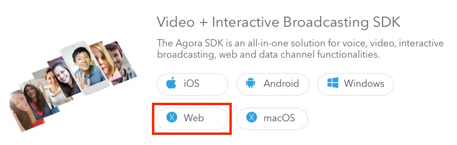

# Agora 1-to-1 Tutorial for Web

*Read this in other languages: [中文](README.zh.md)*

This tutorial enables you to quickly get started with creating an Agora account, downloading the SDK, and using the Agora sample app to give you an overview on how to develop requests to the [Agora API](https://docs.agora.io/en/2.2/product/Voice/API%20Reference/communication_web_audio#voice-call-api):

- Join / Leave calls
- Publish / Unpublish streams
- Enable / Disable audio
- Enable / Disable video

## Prerequisites
- Agora.io Developer Account
- Web server that supports SSL (https)

## Quick Start
This section shows you how to prepare, build, and run the sample application.

### Create an Account and Obtain an App ID
In order to build and run the sample application you must obtain an App ID: 

1. Create a developer account at [agora.io](https://dashboard.agora.io/signin/). Once you finish the signup process, you will be redirected to the Dashboard.
2. Navigate in the Dashboard tree on the left to **Projects** > **Project List**.
3. Copy the App ID that you obtained from the Dashboard into a text file. You will use this when you launch the app.

### Integrate the Agora Video SDK into the sample project
The SDK must be integrated into the sample project before it can run.

1. Download the Agora Video SDK from [Agora.io SDK](https://www.agora.io/en/download/). Under the **Video + Interactive Broadcasting SDK** heading, choose the **Web** download.
2. Unzip the downloaded SDK package.

	

3. Copy the `AgoraRTCSDK` js file into the root of your GitHub project folder. The file will have a sample name similar to `AgoraRTCSDK-2.2.0.js`. 

	**Note:** `2.2.0` is a placeholder for the version number of the SDK js file you downloaded.


### Update and Run the Sample Application 

1. Open the `index.html` file in a code editor.
2. At the top of the file, in the `<head>` section, make sure the JavaScript file source is changed to `AgoraRTCSDK-2.2.0.js`. Ensure the `2.2.0` placeholder is the version number of the SDK js file you downloaded.

	**Before**

	``` JavaScript
	<script src="build/AgoraRTC-development.js"></script>
	```

	**After**

	``` JavaScript
	<script src="build/AgoraRTC-2.2.0.js"></script>
	```
	
3. Deploy the project on a web server. Make sure you access the page through an SSL (https) connection. The Agora SDK requires a secure connection to use the audio and video devices connected to the browser.
4. Use your browser to navigate to the index.html file. Once you have loaded the sample app, your browser will look like this:

	

5. In your browser window, paste the AppID into the `Key` UI text field.

	

6. Press the `Join` UI button to join the call. As soon as someone else joins the call, the call will be started and you will see each other in the browser window.

	**Note:** If your sample app must be accessible using mobile browsers, ensure the [`createClient`](https://docs.agora.io/en/2.2/product/Voice/API%20Reference/communication_web_audio#voice-call-api) method is called with the proper `mode` (See section *Create the Client*). For more information, see the [Agora API documentation](https://docs.agora.io/en/).

## Resources
* A detailed code walkthrough for this sample is available in [Steps to Create this Sample](./guide.md).
* Complete API documentation is available at the [Document Center](https://docs.agora.io/en/).
* You can file bugs about this sample [here](https://github.com/AgoraIO/Basic-Video-Call/issues).


## License
This software is under the MIT License (MIT). [View the license](LICENSE.md).

