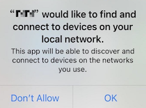

# iOS 1-to-1 Tutorial for Swift

*English | [中文](README.zh.md)*

This tutorial enables you to quickly get started in your development efforts to create an iOS app with real-time video calls, voice calls, and interactive broadcasting. 

With this sample app you can:

- Start and end audio/visual communication between two users.
- Join a communication channel.
- Mute and unmute audio.
- Enable and disable video.
- Switch between the front and rear cameras.

## Problem
After users upgrade their iOS devices to iOS 14.0, and use an app that integrates the Agora RTC SDK for iOS for the first time, users see a prompt for finding local network devices. The following picture shows the pop-up prompt:



[Solution](https://docs.agora.io/en/faq/local_network_privacy)

## Prerequisites

- Xcode 10.0+
- Physical iOS device (iPhone or iPad)
- iOS simulator is NOT supported

## Quick Start

This section shows you how to prepare, build, and run the sample application.

### Obtain an App Id

To build and run the sample application, get an App Id:

1. Create a developer account at [agora.io](https://dashboard.agora.io/signin/). Once you finish the signup process, you will be redirected to the Dashboard.
2. Navigate in the Dashboard tree on the left to **Projects** > **Project List**.
3. Save the **App Id** from the Dashboard for later use.
4. Generate a temp **Access Token** (valid for 24 hours) from dashboard page with given channel name, save for later use.

5. Open `Agora iOS Tutorial.xcodeproj` and edit the `AppID.swift` file. In the `agoraKit` declaration, update `<#Your App Id#>` with your App Id, and assign the token variable with the temp Access Token generated from dashboard.

    ``` Swift
    let AppID: String = <#Your App Id#>
    // assign Token to nil if you have not enabled app certificate
    let Token: String? = <#Temp Token#>
    ```

### Integrate the Agora Video SDK

1. Download the [Agora Video SDK](https://www.agora.io/en/download/). Unzip the downloaded SDK package and copy the following files from the SDK `libs` folder into the sample application `Agora iOS Tutorial` folder.

    - `AograRtcEngineKit.framework`
    - `AgoraRtcCryptoLoader.framework`
  
2. Connect your iPhone or iPad device and run the project. Ensure a valid provisioning profile is applied or your project will not run.

## Contact Us

- For potential issues, take a look at our [FAQ](https://docs.agora.io/en/faq) first
- Dive into [Agora SDK Samples](https://github.com/AgoraIO) to see more tutorials
- Take a look at [Agora Use Case](https://github.com/AgoraIO-usecase) for more complicated real use case
- Repositories managed by developer communities can be found at [Agora Community](https://github.com/AgoraIO-Community)
- You can find full API documentation at [Document Center](https://docs.agora.io/en/)
- If you encounter problems during integration, you can ask question in [Stack Overflow](https://stackoverflow.com/questions/tagged/agora.io)
- You can file bugs about this sample at [issue](https://github.com/AgoraIO/Basic-Video-Call/issues)

## License

The MIT License (MIT)
