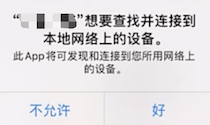

# iOS Tutorial for Swift - 1to1

*[English](README.md) | 中文*

这个开源示例项目演示了如何快速集成Agora视频SDK，实现1对1视频通话。

在这个示例项目中包含了以下功能：

- 加入通话和离开通话；
- 静音和解除静音；
- 关闭摄像头和开启摄像头；
- 切换前置摄像头和后置摄像头；

## 问题描述
iOS 系统版本升级至 14.0 版本后，用户首次使用集成了声网 iOS 语音或视频 SDK 的 app 时会看到查找本地网络设备的弹窗提示。默认弹窗界面如下图所示：



[解决方案](https://docs.agora.io/cn/faq/local_network_privacy)

## 环境准备

- XCode 10.0 +
- iOS 真机设备
- 不支持模拟器

## 运行示例程序

这个段落主要讲解了如何编译和运行实例程序。

### 创建Agora账号并获取AppId

在编译和启动实例程序前，您需要首先获取一个可用的App Id:

1. 在[agora.io](https://dashboard.agora.io/signin/)创建一个开发者账号
2. 前往后台页面，点击左部导航栏的 **项目 > 项目列表** 菜单
3. 复制后台的 **App Id** 并备注，稍后启动应用时会用到它
4. 在项目页面生成临时 **Access Token** (24小时内有效)并备注，注意生成的Token只能适用于对应的频道名。

5. 将 AppID 和 Token 填写进 AppID.swift

    ```
    let AppID: String = <#Your App Id#>
    // 如果你没有打开Token功能，token可以直接给nil
    let Token: String? = <#Temp Token#>
    ```

### 集成 Agora 视频 SDK

1. 在 [Agora.io SDK](https://www.agora.io/cn/blog/download/) 下载 **视频通话 + 直播 SDK**，解压后将其中**libs**文件夹中的下列文件拷贝到本项目的 Agora iOS Tutorial 文件夹下。

  - AgoraRtcEngineKit.framework
  - AgoraRtcCryptoLoader.framework

2. 最后使用 Xcode 打开 Agora iOS Tutorial.xcodeproj，连接 iPhone／iPad 测试设备，设置有效的开发者签名后即可运行。

## 联系我们

- 如果你遇到了困难，可以先参阅 [常见问题](https://docs.agora.io/cn/faq)
- 如果你想了解更多官方示例，可以参考 [官方SDK示例](https://github.com/AgoraIO)
- 如果你想了解声网SDK在复杂场景下的应用，可以参考 [官方场景案例](https://github.com/AgoraIO-usecase)
- 如果你想了解声网的一些社区开发者维护的项目，可以查看 [社区](https://github.com/AgoraIO-Community)
- 完整的 API 文档见 [文档中心](https://docs.agora.io/cn/)
- 若遇到问题需要开发者帮助，你可以到 [开发者社区](https://rtcdeveloper.com/) 提问
- 如果需要售后技术支持, 你可以在 [Agora Dashboard](https://dashboard.agora.io) 提交工单
- 如果发现了示例代码的 bug，欢迎提交 [issue](https://github.com/AgoraIO/Basic-Video-Call/issues)

## 代码许可

The MIT License (MIT)
