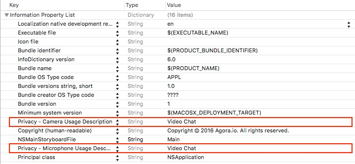
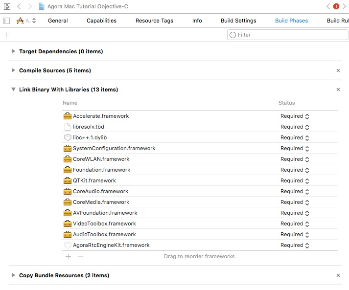
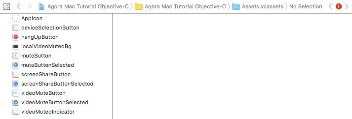
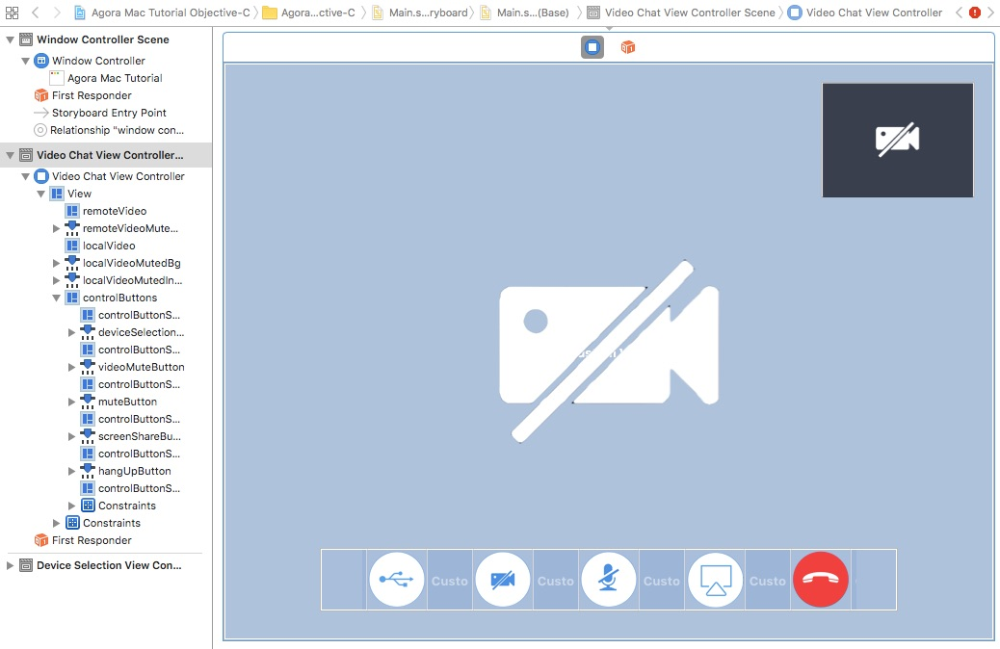
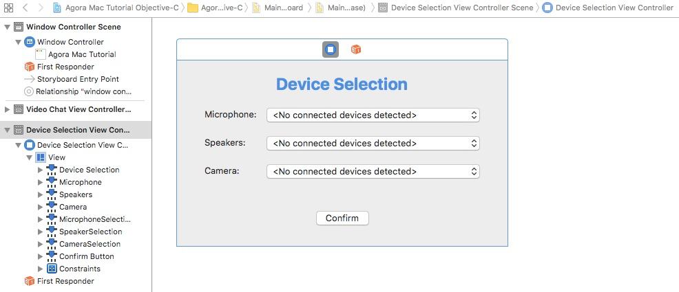

# Agora MacOS 1-to-1 Tutorial for Objective-C

This tutorial enables you to quickly get started in your development efforts to add video chat to a MacOS app using the Agora Video SDK.

With this sample app you can:

- [Join and leave a channel](#add-join-leave-channel-methods)
- [Mute and unmute audio](#add-ibaction-methods)
- [Enable and disable video](#add-ibaction-methods)
- [Select devices](#add-ibaction-methods)
- [Screen-share](#add-ibaction-methods)

## Prerequisites

- Xcode 8.0+


## Quick Start
This section shows you how to prepare, build, and run the sample application.

- [Create an Account and Obtain an App ID](#create-an-account-and-obtain-an-app-id)
- [Update and Run the Sample Application](#update-and-run-the-sample-application) 

### Create an Account and Obtain an App ID

To build and run the sample application, you must obtain an app ID: 

1. Create a developer account at [agora.io](https://dashboard.agora.io/signin/). When you finish the sign-up process, you are redirected to the dashboard.
2. In the dashboard tree on the left, navigate to **Projects** > **Project List**.
3. Copy the app ID that you obtained from the dashboard into a text file. You will use this when you launch the app.

### Update and Run the Sample Application 

1. Open `Agora Mac Tutorial Objective-C.xcodeproj` and edit the `AppID.m` file. In the `agoraKit` declaration, update `<#Your App ID#>` with your App ID.

	``` Swift
	NSString *const AppID = <#Your App ID#>;
	```

2. Download the [Agora Video SDK](https://www.agora.io/en/download/). Unzip the downloaded SDK package and copy the `libs` folder from the SDK `libs` into the sample application's project folder.
		
3. Ensure a valid provisioning profile is applied and run the project.

## Steps to Create the Sample 

This workflow was used to develop the 1-to-1 sample application:

- [Set Permissions and Add Frameworks and Libraries](#set-permissions-and-add-frameworks-and-libraries)
- [Design the User Interface](#design-the-user-interface)
- [Create the VideoChatViewController Class](#create-the-videochatviewcontroller-class)
- [Create the DeviceSelectionViewController Class](#create-the-deviceselectionviewcontroller-class)

### Set Permissions and Add Frameworks and Libraries

Open the `info.plist` file. Enable the following:

- Camera privacy settings
- Microphone privacy settings



Under the **Build Phases** tab, add the following frameworks and libraries to your project:

- `Accelerate.framework`
- `libresolv.tbd`
- `libc++.tbd`
- `SystemConfiguration.framework`
- `CoreWLAN.framework`
- `Foundation.framework`
- `QTKit.framework`
- `CoreAudio.framework`
- `CoreMedia.framework`
- `AVFoundation.framework`
- `VideoToolbox.framework`
- `AudioToolbox.framework`
- `AgoraRtcEngineKit.framework`



### Design the User Interface

#### Add Assets

Add the following assets to `Assets.xcassets`.

**Note:** Use Xcode to import assets to `Assets.xcassets`. PDF files are used for these assets, which contain images for each iOS screen resolution.



Asset|Description
------|------
`deviceSelectionButton`|An image representing a device selection button.
`hangUpButton`|An image of a red telephone to disconnect the call.
`localVideoMutedBg`|The background image for a video mute button.
`muteButton` and `muteButtonSelected`|A picture of a microphone to mute/unmute audio.
`screenshareCameraButton` and `screenshareCameraButtonSelected`|A picture of a computer to turn on/off screenshare.
`videoMuteButton` and `videoMuteButtonSelected`|A picture of a camera to enable/disable video.
`videoMuteButtonIndicator`|A picture of a crossed-out camera, to indicate the camera is off.

#### Create the VideoChatViewController UI

Create the layout for the `VideoChatViewController`.



Below are the key aspects of the `VideoChatViewController` UI:

Component|Description
---|---
`remoteVideo`|A view for the incoming remote video feed. This is the video the user will see.
`remoteVideoMutedIndicator`|An icon to indicate that the remote video is disabled
`localVideo`|A small view for the local video feed
`localVideoMutedBg`|A gray background image to indicate that the local video is disabled
`localVideoMutedIndicator`|An icon overlay for `localVideoMutedBg` to indicate that local video is disabled.
`controlButtons`|A container for the following four control buttons: **Device Manager**, **Video Off**, **Audio Mute**, **Screenshare On**, and **Hang Up**.

#### Create the DeviceSelectionViewController UI

Create the layout for the `DeviceSelectionViewController`.



Below are the key aspects of the `DeviceSelectionViewController` UI:

Component|Description
---|---
`microphoneSelection`|Dropdown menu to select the microphone.
`speakerSelection`|Dropdown menu to select the audio speakers.
`cameraSelection`|Dropdown menu to select the video camera.
`confirmButton`|Button to confirm device selections.

### Create the VideoChatViewController Class

The `VideoChatViewController` class connects the application functionality with the [VideoChatViewController UI](#create-the-videochatviewcontroller-ui).

- [Define Global Variables](#define-global-variables)
- [Initialize Application](#initialize-application)
- [Add Agora Engine Methods](#add-agora-engine-methods)
- [Add Video Setup Methods](#add-video-setup-methods)
- [Add Join/Leave Channel Methods](#add-join-leave-channel-methods)
- [Add UI Handler Methods](#add-ui-handler-methods)
- [Add Add IBAction Methods](#add-ibaction-methods)

#### Define Global Variables

The `VideoChatViewController` class defines the global `IBOutlet` variables and a global `AgoraRtcEngineKit` variable. The `IBOutlet` variables map to the [VideoChatViewController UI](#create-the-videochatviewcontroller-ui) elements.

Variable|Description
----|----
`agoraKit`|`AgoraRtcEngineKit` object for the Agora RTC engine SDK
`localVideo`|`UIView` for the local video
`remoteVideo`|`UIView` for the remote video
`controlButtons`|`UIView` to contain the button controls
`remoteVideoMutedIndicator`|`UIImageView` to indicate if the remote video is muted
`localVideoMutedBg`|`UIImageView` for the local video indicator background
`localVideoMutedIndicator`|`UIImageView` to indicate if the remote video is muted
`muteAudio`|Boolean value to determine if audio is muted
`muteVideo`|Boolean value to determine if audio is disabled
`screenShare`|Boolean value to determine if audio is enabled

``` Objective-C
#import "VideoChatViewController.h"

@interface VideoChatViewController ()

@property (strong, nonatomic) AgoraRtcEngineKit *agoraKit;
@property (weak) IBOutlet NSView *localVideo;
@property (weak) IBOutlet NSView *remoteVideo;
@property (weak) IBOutlet NSView *controlButtons;
@property (weak) IBOutlet NSImageView *remoteVideoMutedIndicator;
@property (weak) IBOutlet NSImageView *localVideoMutedBg;
@property (weak) IBOutlet NSImageView *localVideoMutedIndicator;

@property (nonatomic) BOOL muteAudio;
@property (nonatomic) BOOL muteVideo;
@property (nonatomic) BOOL screenShare;

@end
```

#### Initialize Application

Initialize the application using the `viewDidLoad` method.

1. Allow `self.view`, `self.remoteVideo`, and `self.localVideo` to use a CALayer object to manage its rendered content, by setting the `wantsLayer` properties to `YES`.
2. Initialize the UI layout using the `setupButtons` and `hideVideoMuted` methods.
3. Initialize the Agora RTC engine using `initializeAgoraEngine`.
4. Set up the video streams using `setupVideo` and `setupLocalVideo`.
5. Join the channel using `joinChannel`.

``` Objective-C
@implementation VideoChatViewController

- (void)viewDidLoad {
    [super viewDidLoad];
    
    self.view.wantsLayer = YES;
    self.remoteVideo.wantsLayer = YES;
    self.localVideo.wantsLayer = YES;
    
    [self setupButtons];
    [self hideVideoMuted];
    [self initializeAgoraEngine];
    [self setupVideo];
    [self setupLocalVideo];
    [self joinChannel];
}

...

@end
```

The `viewWillAppear` invokes when the view appears. Set the background color of `self.view.layer` to `blackColor`, and `self.remoteVideo.layer` and `self.localVideo.layer` to `clearColor`.

``` Objective-C
- (void)viewWillAppear {
    [super viewWillAppear];
    
    self.view.layer.backgroundColor = [NSColor blackColor].CGColor;
    self.remoteVideo.layer.backgroundColor = [NSColor clearColor].CGColor;
    self.localVideo.layer.backgroundColor = [NSColor clearColor].CGColor;
}
```

The `hideVideoMuted` method hides `remoteVideoMutedIndicator`, `localVideoMutedBg`, and `localVideoMutedIndicator` by setting the `hidden` properties to `true`.

``` Objective-C
- (void)hideVideoMuted {
    self.remoteVideoMutedIndicator.hidden = true;
    self.localVideoMutedBg.hidden = true;
    self.localVideoMutedIndicator.hidden = true;
}
```

#### Add Agora Engine Methods

The `initializeAgoraEngine` method initializes the Agora RTC engine. Pass `AppID` into the Agora SDK's `sharedEngineWithAppId` method, to initialize the engine.

``` Objective-C
- (void)initializeAgoraEngine {
    self.agoraKit = [AgoraRtcEngineKit sharedEngineWithAppId:AppID delegate:self];
}
```

When the engine decodes the first remote video frame from a user, apply the following:

1. If `remoteVideo` is hidden, display `self.remoteVideo` by setting its `hidden` property to `false`.
2. Initialize a new `AgoraRtcVideoCanvas` object and set the following properties:
	- `uid`: User ID. The value of `0` allows Agora to choose a random `uid` for the stream.
	- `view`: Where the video will display. The `self.remoteVideo` value is the view created in the storyboard.
	- `renderMode`: How the video will render. The `AgoraVideoRenderModeAdaptive` value ensures the video is resized proportionally to fit the display window.

3. Pass `videoCanvas` to the SDK using `setupRemoteVideo` to bind the video stream to the UI view.

``` Objective-C
- (void)rtcEngine:(AgoraRtcEngineKit *)engine firstRemoteVideoDecodedOfUid:(NSUInteger)uid size: (CGSize)size elapsed:(NSInteger)elapsed {
    if (self.remoteVideo.hidden)
        self.remoteVideo.hidden = false;
    AgoraRtcVideoCanvas *videoCanvas = [[AgoraRtcVideoCanvas alloc] init];
    videoCanvas.uid = uid;
    // Since we are making a simple 1:1 video chat app, for simplicity sake, we are not storing the UIDs. You could use a mechanism such as an array to store the UIDs in a channel.
    
    videoCanvas.view = self.remoteVideo;
    videoCanvas.renderMode = AgoraVideoRenderModeAdaptive;
    [self.agoraKit setupRemoteVideo:videoCanvas];
    // Bind remote video stream to view
}
```

When a user goes offline, hide `self.remoteVideo` by setting the `hidden` property to `true`.

``` Objective-C
- (void)rtcEngine:(AgoraRtcEngineKit *)engine didOfflineOfUid:(NSUInteger)uid reason:(AgoraUserOfflineReason)reason {
    self.remoteVideo.hidden = true;
}
```

When a user's video is muted or unmuted, hide or unhide `self.remoteVideo` and `self.remoteVideoMutedIndicator` by updating the `hidden` property.

``` Objective-C
- (void)rtcEngine:(AgoraRtcEngineKit *)engine didVideoMuted:(BOOL)muted byUid:(NSUInteger)uid {
    self.remoteVideo.hidden = muted;
    self.remoteVideoMutedIndicator.hidden = !muted;
}
```

#### Add Video Setup Methods

The `setupVideo` method enables video and sets the video encoder configuration for the Agora SDK.

1. Enable video using `enableVideo`.
2. Set the video profile using `AgoraKit.setVideoProfile` with the following properties:

Property Value|Description
---|---
`AgoraVideoProfileLandscape720P`|Sets the video to landscape mode with a 720p resolution.
`false`|`swapWidthAndHeight` value disabling orientation switching.

``` Objective-C
- (void)setupVideo {
    [self.agoraKit enableVideo];
    // Default mode is disableVideo
    
    [self.agoraKit setVideoProfile:AgoraVideoProfileLandscape720P swapWidthAndHeight:false];
    // Default video profile is 360P
}
```

The `setupLocalVideo` method sets the local video for the Agora SDK.

1. Initialize an `AgoraRtcVideoCanvas` object.
2. Set the following properties for `videoCanvas`:
	- `uid`: User ID. A value of `0` allows Agora to choose a random ID for the stream.
	- `view`: UI view where the video will display. The `self.localVideo` value is the view created in the storyboard.
	- `rendermode`: How the video will render. The `AgoraVideoRenderModeAdaptive` value ensures the video is resized proportionally to fit the display window.
3. Bind the local video stream to the view using the Agora SDK's `setupLocalVideo` method.

``` Objective-C
- (void)setupLocalVideo {
    AgoraRtcVideoCanvas *videoCanvas = [[AgoraRtcVideoCanvas alloc] init];
    videoCanvas.uid = 0;
    // UID = 0 means we let Agora pick a UID for us
    
    videoCanvas.view = self.localVideo;
    videoCanvas.renderMode = AgoraVideoRenderModeAdaptive;
    [self.agoraKit setupLocalVideo:videoCanvas];
    // Bind local video stream to view
}
```

#### Add Join/Leave Channel Methods

The `joinChannel` method joins the user to the channel using `AgoraKit.joinChannel` and passing `demoChannel1` as the `channelId` and `0` as the `uid`.

**Note:** 
- Using `0` for the `uid` allows Agora to choose a random ID for the channel ID.
- To allow users to talk to each other, they must be in the same channel and use the same App ID.

``` Objective-C
- (void)joinChannel {
    [self.agoraKit joinChannelByToken:nil channelId:@"demoChannel1" info:nil uid:0 joinSuccess:^(NSString * _Nonnull channel, NSUInteger uid, NSInteger elapsed) {
        // Join channel "demoChannel1"
    }];
    // The UID database is maintained by your app to track which users joined which channels. If not assigned (or set to 0), the SDK will allocate one and returns it in joinSuccessBlock callback. The App needs to record and maintain the returned value as the SDK does not maintain it.
}
```

The `didClickHangUpButton` method exits the user from the channel using `leaveChannel`. This method is applied to the hang up button UI created in [Design the User Interface](#design-the-user-interface).

``` Objective-C
- (IBAction)didClickHangUpButton:(NSButton *)sender {
    [self leaveChannel];
}
```

The `leaveChannel` method exits the user from the channel: 

1. Leave the channel using the Agora SDK method `leaveChannel`.
2. Remove the local video from the SDK engine using `setupLocalVideo`.
3. Remove `self.remoteVideo` and `self.localVideo` from the screen using `removeFromSuperview`.
5. Nullify the SDK engine by setting `self.agoraKit` to `nil`.
6. Close `self.view.window` using `close`.

``` Objective-C
- (void)leaveChannel {
    [self.agoraKit leaveChannel:nil];
    [self.agoraKit setupLocalVideo:nil];
    [self.remoteVideo removeFromSuperview];
    [self.localVideo removeFromSuperview];
    self.agoraKit = nil;
    [self.view.window close];
}
```

#### Add UI Handler Methods

The `setupButtons` method initializes the UI layout and adds event listeners to the UI objects.

1. Hide the control buttons after a `3` second delay by invoking `hideControlButtons` through `performSelector `.
2. Initialize a `NSTrackingArea` object for the remote video with the `NSTrackingMouseMoved`, `NSTrackingActiveInActiveApp`, and `NSTrackingInVisibleRect` options. Apply this `NSTrackingArea` to the remote video using using `addTrackingArea`.
3. Initialize a `NSTrackingArea` object for the control buttons with the `NSTrackingMouseEnteredAndExited`, `NSTrackingActiveInActiveApp`, and `NSTrackingInVisibleRect` options. Apply this `NSTrackingArea` to the control buttons using using `addTrackingArea`.

``` Objective-C
- (void)setupButtons {
    [self performSelector:@selector(hideControlButtons) withObject:nil afterDelay:3];
    
    [self.remoteVideo addTrackingArea:[[NSTrackingArea alloc] initWithRect:self.remoteVideo.bounds
                                                                            options:NSTrackingMouseMoved | NSTrackingActiveInActiveApp | NSTrackingInVisibleRect
                                                                              owner:self
                                                                           userInfo:nil]];
    
    [self.controlButtons addTrackingArea:[[NSTrackingArea alloc] initWithRect:self.controlButtons.bounds
                                                                    options:NSTrackingMouseEnteredAndExited | NSTrackingActiveInActiveApp | NSTrackingInVisibleRect
                                                                      owner:self
                                                                   userInfo:nil]];
}
```

The `hideControlButtons` method hides `self.controlButtons` by setting the `hidden` property to `true`.

``` Objective-C
- (void)hideControlButtons {
    self.controlButtons.hidden = YES;
}
```

The `mouseMoved` method tracks mouse movement events.

If `self.controlButtons` is hidden:

- Display `self.controlButtons` by setting the `hidden` property to `NO`.
- Hide the control buttons after a `3` second delay by invoking `hideControlButtons` through `performSelector`. 

``` Objective-C
- (void)mouseMoved:(NSEvent *)theEvent {
    if (self.controlButtons.hidden) {
        self.controlButtons.hidden = NO;
        [self performSelector:@selector(hideControlButtons) withObject:nil afterDelay:3];
    }
}
```

The `mouseEntered` method tracks when the mouse enters the specified object and cancels previous requests using `cancelPreviousPerformRequestsWithTarget`.

``` Objective-C
- (void)mouseEntered:(NSEvent *)theEvent {
    [VideoChatViewController cancelPreviousPerformRequestsWithTarget:self];
}
```

The `mouseExited` method tracks when the mouse exits the specified object and hides the control buttons after a `3` second delay by invoking `hideControlButtons` through `performSelector`. 

``` Objective-C
- (void)mouseExited:(NSEvent *)theEvent {
    [self performSelector:@selector(hideControlButtons) withObject:nil afterDelay:3];
}
```

#### Add IBAction Methods

The `didClickMuteButton` method is applied to the mute button UI created in [Design the User Interface](#design-the-user-interface).

1. Update `self.muteAudio`.
2. Mute/unmute the local audio stream using the Agora SDK's `muteLocalAudioStream` method.
3. Update the button's image using `setImage`.

``` Objective-C
- (IBAction)didClickMuteButton:(NSButton *)sender {
    self.muteAudio = !self.muteAudio;
    [self.agoraKit muteLocalAudioStream:self.muteAudio];
    
    if (self.muteAudio) {
        [sender setImage:[NSImage imageNamed:@"muteButtonSelected"]];
    } else {
        [sender setImage:[NSImage imageNamed:@"muteButton"]];
    }
}
```

The `didClickVideoMuteButton` method is applied to the video mute button UI created in [Design the User Interface](#design-the-user-interface).

1. Update `self.muteVideo`.
2. Mute/unmute the local video stream using the Agora SDK method `muteLocalVideoStream`.
3. Update the button's image using `setImage`.
4. Hide/unhide the local video using `self.localVideo.hidden`.
5. Hide/unhide the local video muted background image using the `self.localVideoMutedBg.hidden`.
6. Hide/unhide the local video muted indicator image using the `self.localVideoMutedIndicator.hidden`.

``` Objective-C
- (IBAction)didClickVideoMuteButton:(NSButton *)sender {
    self.muteVideo = !self.muteVideo;
    [self.agoraKit muteLocalVideoStream:self.muteVideo];
    
    if (self.muteVideo) {
        [sender setImage:[NSImage imageNamed:@"videoMuteButtonSelected"]];
    } else {
        [sender setImage:[NSImage imageNamed:@"videoMuteButton"]];
    }
    self.localVideo.hidden = self.muteVideo;
    self.localVideoMutedBg.hidden = !(self.muteVideo);
    self.localVideoMutedIndicator.hidden = !(self.muteVideo);
}
```

The `didClickDeviceSelectionButton` method opens the device selection view.

1. Initialize a new `DeviceSelectionViewController` object with the `DeviceSelectionViewController` layout created in the storyboard.
2. Display the `deviceSelectionViewController` view using `presentViewControllerAsSheet`.

``` Objective-C
- (IBAction)didClickDeviceSelectionButton:(NSButton *)sender {
    DeviceSelectionViewController *deviceSelectionViewController = [self.storyboard instantiateControllerWithIdentifier:@"DeviceSelectionViewController"];
    deviceSelectionViewController.agoraKit = self.agoraKit;
    // Pass in AgoraRtcEngineKit
    [self presentViewControllerAsSheet:deviceSelectionViewController];
    // Segue to sheet view controller DeviceSelectionViewController
}
```

The `didClickScreenShareButton` method begins screen-sharing.

Update `screenShare`.

- If `self.screenShare` is `true`, update the button's image using `setImage` and start the screen capture using the Agora SDK method `startScreenCapture`.
- If `self.screenShare` is `false`, update the button's image using `setImage` and stop the screen capture using the Agora SDK method `stopScreenCapture`.

``` Objective-C
- (IBAction)didClickScreenShareButton:(NSButton *)sender {
    self.screenShare = !self.screenShare;
    if (self.screenShare) {
        [sender setImage:[NSImage imageNamed:@"screenShareButtonSelected"]];
        [self.agoraKit startScreenCapture:0 withCaptureFreq:15 bitRate:0 andRect:CGRectZero];
    } else {
        [sender setImage:[NSImage imageNamed:@"screenShareButton"]];
        [self.agoraKit stopScreenCapture];
    }
}
```

### Create the DeviceSelectionViewController Class

The `DeviceSelectionViewController` class connects the application functionality with the [DeviceSelectionViewController UI](#create-the-deviceselectionviewcontroller-ui).

- [Define Global Variables and Initialize the Application](#define-global-variables-and-initialize-the-application)
- [Initialize the Dropdown Menus](#initialize-the-dropdown-menus)
- [Create the Confirm IBAction Method](#create-the-confirm-ibaction-method)
- [Add the Agora Engine Delegate Method](#add-the-agora-engine-delegate-method)

#### Define Global Variables and Initialize the Application

The `DeviceSelectionViewController` class defines the global `IBOutlet` variables and global device arrays. The `IBOutlet` variables map to the [DeviceSelectionViewController UI](#create-the-deviceselectionviewcontroller-ui) elements.

Variable|Description
----|----
`microphoneSelection`|Dropdown menu for the microphone options
`speakerSelection`|Dropdown menu for the audio speakers options
`cameraSelection`|Dropdown menu for the camera options
`connectedRecordingDevices`|Array for the audio input options
`connectedPlaybackDevices`|Array for the audio output options
`connectedVideoCaptureDevices`|Array for the video camera options

``` Objective-C
#import "DeviceSelectionViewController.h"

@interface DeviceSelectionViewController ()

@property (weak) IBOutlet NSPopUpButton *microphoneSelection;
@property (weak) IBOutlet NSPopUpButton *speakerSelection;
@property (weak) IBOutlet NSPopUpButton *cameraSelection;

@property (strong, nonatomic) NSArray* connectedRecordingDevices;
@property (strong, nonatomic) NSArray* connectedPlaybackDevices;
@property (strong, nonatomic) NSArray* connectedVideoCaptureDevices;

@end
```

Initialize the application using the `viewDidLoad` method.

1. Set the preferred content size to `500` pixels wide and `250` pixels tall using `self.preferredContentSize`.
2. Load the dropdown menu options using `loadDevicesInPopUpButtons`.

``` Objective-C
@implementation DeviceSelectionViewController

- (void)viewDidLoad {
    [super viewDidLoad];
    
    self.preferredContentSize = NSMakeSize(500, 250);
    [self loadDevicesInPopUpButtons];
}

...

@end

```

#### Initialize the Dropdown Menus

The `loadDevicesInPopUpButtons` method populates the dropdown menus with the available devices.

1. Clear any existing options for `self.microphoneSelection`, `self.speakerSelection`, and `self.cameraSelection` using `removeAllItems`.
2. Populate the `self.connectedRecordingDevices`, `self.connectedPlaybackDevices`, and `self.connectedVideoCaptureDevices` arrays using the device information retrieved from the Agora SDK method `enumerateDevices` and add each item to their respective dropdown menus using `addItemWithTitle`.

``` Objective-C
- (void)loadDevicesInPopUpButtons {
    [self.microphoneSelection removeAllItems];
    [self.speakerSelection removeAllItems];
    [self.cameraSelection removeAllItems];

    self.connectedRecordingDevices = [self.agoraKit enumerateDevices:0];
    for (id device in self.connectedRecordingDevices) {
        [self.microphoneSelection addItemWithTitle:([device deviceName])];
    }
    
    self.connectedPlaybackDevices = [self.agoraKit enumerateDevices:1];
    for (id device in self.connectedPlaybackDevices) {
        [self.speakerSelection addItemWithTitle:([device deviceName])];
    }
    
    self.connectedVideoCaptureDevices = [self.agoraKit enumerateDevices:3];
    for (id device in self.connectedVideoCaptureDevices) {
        [self.cameraSelection addItemWithTitle:([device deviceName])];
    // Populate the NSPopUpButtons with the enumerated device list
    }
}
```

#### Create the Confirm IBAction Method

The `didClickConfirmButton` method sets the new device settings.

For each `self.connectedRecordingDevices`, `self.connectedPlaybackDevices`, `self.connectedVideoCaptureDevices` array:

1. Find the selected device by using the index of the respective dropdown menu using `indexOfSelectedItem`.
2. Set the new device using the Agora SDK method `setDevice`.

Close the device selection view using `self.dismiss`.

``` Objective-C
- (IBAction)didClickConfirmButton:(NSButton *)button {
    [self.agoraKit setDevice:0 deviceId:[self.connectedRecordingDevices[self.microphoneSelection.indexOfSelectedItem] deviceId]];
    [self.agoraKit setDevice:1 deviceId:[self.connectedPlaybackDevices[self.speakerSelection.indexOfSelectedItem] deviceId]];
    [self.agoraKit setDevice:3 deviceId:[self.connectedVideoCaptureDevices[self.cameraSelection.indexOfSelectedItem] deviceId]];
    // Set the devices
    [self dismissViewController:self];
}
```

#### Add the Agora Engine Delegate Method

The Agora engine delegate method is enclosed within a separate class extension.

When a user's device changes, load the devices into the dropdown menus using `loadDevicesInPopUpButtons`.

``` Objective-C
- (void)rtcEngine:(AgoraRtcEngineKit *)engine device:(NSString*) deviceId type:(AgoraMediaDeviceType) deviceType stateChanged:(NSInteger) state {
    [self loadDevicesInPopUpButtons];
    // Repopulate NSPopUpButtons if a device is plugged in or removed
}
```

## Resources
- For full API documentation, see the [Document Center](https://docs.agora.io/en/)
- To file bugs about this demo, click [here](https://github.com/AgoraIO/Agora-macOS-Tutorial-Swift-1to1/issues)


## Learn More
- [1 to 1 Video Tutorial for MacOS/Swift](https://github.com/AgoraIO/Agora-macOS-Tutorial-Swift-1to1)
- A more complete demo for MacOS (Objective-C) can be found [here](https://github.com/AgoraIO/OpenVideoCall-macOS)
- Agora Video SDK samples are also available for the following platforms:
	- 1 to 1 Video Tutorial for [iOS/Swift](https://github.com/AgoraIO/Agora-iOS-Tutorial-Swift-1to1)
	- 1 to 1 Video Tutorial for [iOS/Objective-C](https://github.com/AgoraIO/Agora-iOS-Tutorial-Objective-C-1to1)
	- 1 to 1 Video Tutorial for [Android](https://github.com/AgoraIO/Agora-Android-Tutorial-1to1)
	- 1 to 1 Video Tutorial for [Windows](https://github.com/AgoraIO/Agora-Windows-Tutorial-1to1)

## License
This software is licensed under the MIT License (MIT). [View the license](LICENSE.md).

