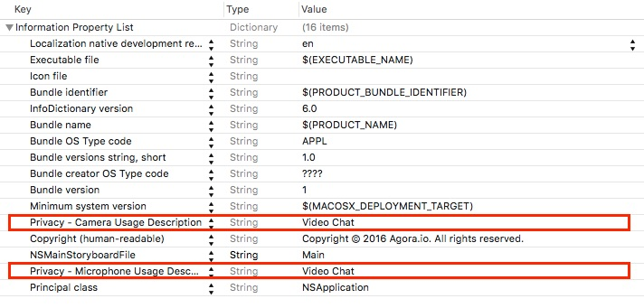
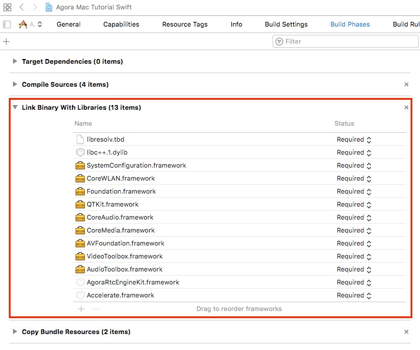
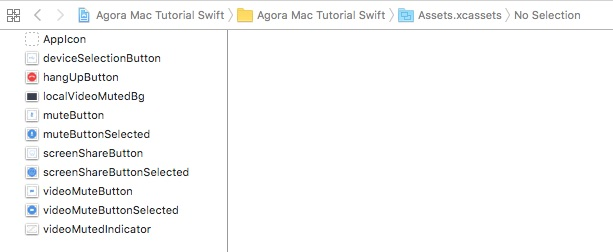
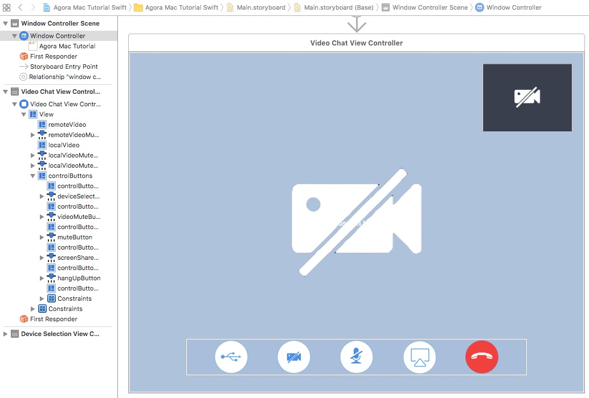
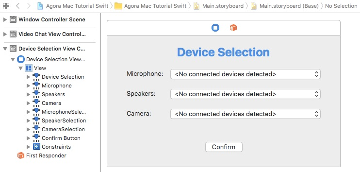

# Agora MacOS 1-to-1 Tutorial for Swift

This tutorial enables you to quickly get started in your development efforts to add video chat to a MacOS app.

With this sample app you can:

- [Join and leave a channel](#add-join-leave-channel-methods)
- [Mute and unmute audio](#add-ibaction-methods)
- [Enable and disable video](#add-ibaction-methods)
- [Select devices](#add-ibaction-methods)
- [Screen-share](#add-ibaction-methods)

## Prerequisites

- Xcode 8.0+

## Quick Start
This section shows you how to prepare, build, and run the sample application.

- [Create an Account and Obtain an App ID](#create-an-account-and-obtain-an-app-id)
- [Update and Run the Sample Application](#update-and-run-the-sample-application) 

### Create an Account and Obtain an App ID

To build and run the sample application, you must obtain an app ID: 

1. Create a developer account at [agora.io](https://dashboard.agora.io/signin/). When you finish the sign-up process, you are redirected to the dashboard.
2. In the dashboard tree on the left, navigate to **Projects** > **Project List**.
3. Copy the app ID that you obtained from the dashboard into a text file. You will use this when you launch the app.

### Update and Run the Sample Application 

1. Open `Agora Mac Tutorial Swift.xcodeproj` and edit the `AppID.swift` file. In the `agoraKit` declaration, update `<#Your App ID#>` with your App ID.

	``` Swift
	let AppID: String = <#Your App ID#>
	```

2. Download the [Agora Video SDK](https://www.agora.io/en/download/). Unzip the downloaded SDK package and copy the `libs` folder from the SDK `libs` into the sample application's `Agora Mac Tutorial Swift` folder.
		
3. Ensure a valid provisioning profile is applied and run the project.

## Steps to Create the Sample 

This workflow was used to develop the 1-to-1 sample application:

- [Set Permissions and Add Frameworks and Libraries](#set-permissions-and-add-frameworks-and-libraries)
- [Design the User Interface](#design-the-user-interface)
- [Create the VideoChatViewController Class](#create-the-videochatviewcontroller-class)
- [Create the DeviceSelectionViewController Class](#create-the-deviceselectionviewcontroller-class)

### Set Permissions and Add Frameworks and Libraries

Open the `info.plist` file. Enable the following:

- Camera privacy settings
- Microphone privacy settings



Under the **Build Phases** tab, add the following frameworks and libraries to your project:

- `libresolv.tbd`
- `libc++.tbd`
- `SystemConfiguration.framework`
- `CoreWLAN.framework`
- `Foundation.framework`
- `QTKit.framework`
- `CoreAudio.framework`
- `CoreMedia.framework`
- `AVFoundation.framework`
- `VideoToolbox.framework`
- `AudioToolbox.framework`
- `AgoraRtcEngineKit.framework`
- `Accelerate.framework`



### Design the User Interface

#### Add Assets

Add the following assets to `Assets.xcassets`.

**Note:** Use Xcode to import assets to `Assets.xcassets`. PDF files are used for these assets, which contain images for each iOS screen resolution.



Asset|Description
------|------
`deviceSelectionButton`|An image representing a device selection button.
`hangUpButton`|An image of a red telephone to disconnect the call.
`localVideoMutedBg`|The background image for a video mute button.
`muteButton` and `muteButtonSelected`|A picture of a microphone to mute or unmute audio.
`screenshareCameraButton` and `screenshareCameraButtonSelected`|A picture of a computer to start or stop screensharing.
`videoMuteButton` and `videoMuteButtonSelected`|A picture of a camera to enable or disable video.
`videoMuteButtonIndicator`|A picture of a crossed-out camera, to indicate the camera is off.

#### Create the VideoChatViewController UI

Create the layout for the `VideoChatViewController`.



Below are the key aspects of the `VideoChatViewController` UI:

Component|Description
---|---
`remoteVideo`|A view for the incoming remote video feed. This is the video the user will see.
`remoteVideoMutedIndicator`|An icon that indicates whether the remote video is enabled or disabled.
`localVideo`|A small view for the local video feed.
`localVideoMutedBg`|A gray background image that indicates whether the local video is enabled or disabled.
`localVideoMutedIndicator`|An icon overlay for `localVideoMutedBg` that indicates whether the local video is disabled.
`controlButtons`|A container for the following four control buttons: **Device Manager**, **Video Off**, **Audio Mute**, **Screenshare On**, and **Hang Up**.

#### Create the DeviceSelectionViewController UI

Create the layout for the `DeviceSelectionViewController`.



Below are the key aspects of the `DeviceSelectionViewController` UI:

Component|Description
---|---
`microphoneSelection`|Dropdown menu to select the microphone.
`speakerSelection`|Dropdown menu to select the audio speakers.
`cameraSelection`|Dropdown menu to select the video camera.
`confirmButton`|Button to confirm device selections.

### Create the VideoChatViewController Class

The `VideoChatViewController` class connects the application functionality with the [VideoChatViewController UI](#create-the-videochatviewcontroller-ui).

- [Define Global Variables](#define-global-variables)
- [Initialize Application](#initialize-application)
- [Add Agora Engine Methods](#add-agora-engine-methods)
- [Add Video Setup Methods](#add-video-setup-methods)
- [Add Join or Leave Channel Methods](#add-join-or-leave-channel-methods)
- [Add UI Handler Methods](#add-ui-handler-methods)
- [Add Add IBAction Methods](#add-ibaction-methods)

#### Define Global Variables

``` Swift
import Cocoa

protocol VideoChatDelegate: NSObjectProtocol {
    func VideoChatNeedClose(_ VideoChat: VideoChatViewController)
}
```

The `VideoChatViewController` class defines the global `IBOutlet` variables and a global `AgoraRtcEngineKit` variable. The `IBOutlet` variables map to the [VideoChatViewController UI](#create-the-videochatviewcontroller-ui) elements.

Variable|Description
----|----
`localVideo`|`UIView` for the local video.
`remoteVideo`|`UIView` for the remote video.
`controlButtons`|`UIView` to contain the button controls.
`remoteVideoMutedIndicator`|`UIImageView` to indicate if the remote video is muted.
`localVideoMutedBg`|`UIImageView` for the local video indicator background.
`localVideoMutedIndicator`|`UIImageView` to indicate if the remote video is muted.
`agoraKit`|`AgoraRtcEngineKit` object for the Agora RTC engine SDK.

``` Swift
var AgoraKit: AgoraRtcEngineKit!
weak var delegate: VideoChatDelegate?

class VideoChatViewController: NSViewController {
    @IBOutlet weak var localVideo: NSView!
    @IBOutlet weak var remoteVideo: NSView!
    @IBOutlet weak var controlButtons: NSView!
    @IBOutlet weak var remoteVideoMutedIndicator: NSImageView!
    @IBOutlet weak var localVideoMutedBg: NSImageView!
    @IBOutlet weak var localVideoMutedIndicator: NSImageView!
    
    lazy var muteAudio: Bool = false
    lazy var muteVideo: Bool = false
    lazy var screenShare: Bool = false

	...
	
}
```

#### Initialize Application

Initialize the application using the `viewDidLoad()` method.

1. Allow `self.view`, `self.remoteVideo`, and `self.localVideo` to use a CALayer object to manage its rendered content by setting the `wantsLayer` properties to `true`.
2. Initialize the UI layout using the `setupButtons()` and `hideVideoMuted()` methods.
3. Initialize the Agora RTC engine using `initializeAgoraEngine()`.
4. Set up the video streams using `setupVideo()` and `setupLocalVideo()`.
5. Join the channel using `joinChannel()`.

``` Swift
    override func viewDidLoad() {
        super.viewDidLoad()

        self.view.wantsLayer = true
        self.remoteVideo.wantsLayer = true
        self.localVideo.wantsLayer = true
        
        setupButtons()
        hideVideoMuted()
        initializeAgoraEngine()
        setupVideo()
        setupLocalVideo()
        joinChannel()
    }
```

The `viewWillAppear()` invokes when the view appears. Set the background color of `view.layer` to `black`, and `remoteVideo.layer` and `localVideo.layer` to `clear`.

``` Swift
    override func viewWillAppear() {
        super.viewWillAppear()
        
        view.layer?.backgroundColor = NSColor.black.cgColor
        remoteVideo.layer?.backgroundColor = NSColor.clear.cgColor
        localVideo.layer?.backgroundColor = NSColor.clear.cgColor
    }    
```

The `hideVideoMuted()` method hides `remoteVideoMutedIndicator`, `localVideoMutedBg`, and `localVideoMutedIndicator` by setting the `isHidden` properties to `true`.

``` Swift
    func hideVideoMuted() {
        remoteVideoMutedIndicator.isHidden = true
        localVideoMutedBg.isHidden = true
        localVideoMutedIndicator.isHidden = true
    }
```

#### Add Agora Engine Methods

The `initializeAgoraEngine()` method initializes the Agora RTC engine. Pass `AppID` into `AgoraRtcEngineKit.sharedEngine()` to initialize the engine using the Agora SDK.

``` Swift
    func initializeAgoraEngine() {
        AgoraKit = AgoraRtcEngineKit.sharedEngine(withAppId: AppID, delegate: self)
    }
```

The Agora engine delegate methods are contained within an `AgoraRtcEngineDelegate` extension.

``` Swift
extension VideoChatViewController: AgoraRtcEngineDelegate {
	...
}
```

When the engine decodes the first remote video frame from a user, apply the following:

1. If `remoteVideo` is hidden, display `self.remoteVideo` using `isHidden`.
2. Initialize a new `AgoraRtcVideoCanvas` object and set the following properties:
	- `uid`: User ID. The value of `0` allows Agora to choose a random `uid` for the stream.
	- `view`: Where the video will display. The `remoteVideo` value is the view created in the storyboard.
	- `renderMode`: How the video will render. The `.adaptive` value ensures the video is resized proportionally to fit the display window.

3. Pass `videoCanvas` to the SDK using `agoraKit.setupRemoteVideo()` to bind the video stream to the UI view.

``` Swift
    func rtcEngine(_ engine: AgoraRtcEngineKit, firstRemoteVideoDecodedOfUid uid:UInt, size:CGSize, elapsed:Int) {
        if (remoteVideo.isHidden) {
            remoteVideo.isHidden = false
        }
        let videoCanvas = AgoraRtcVideoCanvas()
        videoCanvas.uid = uid
        videoCanvas.view = remoteVideo
        videoCanvas.renderMode = .adaptive
        AgoraKit.setupRemoteVideo(videoCanvas)
    }
```

When a user goes offline, hide `self.remoteVideo` by setting the `isHidden` property to `true`.

``` Swift
    func rtcEngine(_ engine: AgoraRtcEngineKit, didOfflineOfUid uid:UInt, reason:AgoraUserOfflineReason) {
        self.remoteVideo.isHidden = true
    }
```

When a user's video is muted or unmuted, hide or unhide `self.remoteVideo` and `self.remoteVideoMutedIndicator` by updating the `isHidden` property.

``` Swift
    func rtcEngine(_ engine: AgoraRtcEngineKit, didVideoMuted muted:Bool, byUid:UInt) {
        remoteVideo.isHidden = muted
        remoteVideoMutedIndicator.isHidden = !muted
    }
```

#### Add Video Setup Methods

The `setupVideo()` method enables video and sets the video encoder configuration for the Agora SDK.

1. Enable video using `enableVideo()`.
2. Set the video profile using `AgoraKit.setVideoProfile()` with the following properties:

Property Value|Description
---|---
`.landscape720P`|Sets the video to landscape mode with a 720p resolution.
`false`|`swapWidthAndHeight` value disabling orientation switching.

``` Swift
    func setupVideo() {
        AgoraKit.enableVideo()  // Default mode is disableVideo
        AgoraKit.setVideoProfile(.landscape720P, swapWidthAndHeight: false)
    }
```

The `setupLocalVideo` method sets the local video for the Agora SDK.

1. Initialize an `AgoraRtcVideoCanvas` object.
2. Set the following properties for `videoCanvas`:
	- `uid`: User ID. A value of `0` allows Agora to choose a random ID for the stream.
	- `view`: UI view where the video will display. The `localVideo` value is the view created in the storyboard.
	- `rendermode`: How the video will render. The `.adaptive` value ensures the video is resized proportionally to fit the display window.
3. Bind the local video stream to the view using `setupLocalVideo()`.

``` Swift
    func setupLocalVideo() {
        let videoCanvas = AgoraRtcVideoCanvas()
        videoCanvas.uid = 0
        videoCanvas.view = localVideo
        videoCanvas.renderMode = .adaptive
        AgoraKit.setupLocalVideo(videoCanvas)
    }
```

#### Add Join or Leave Channel Methods

The `joinChannel()` method joins the user to the channel using `AgoraKit.joinChannel()` and passing `demoChannel1` as the `channelId` and `0` as the `uid`.

**Note:** 
- Using `0` for the `uid` allows Agora to choose a random ID for the channel ID.
- For users to talk to each other, they must be in the same channel and use the same App ID.

``` Swift
    func joinChannel() {
        AgoraKit.joinChannel(byToken: nil, channelId: "demoChannel1", info:nil, uid:0) { (sid, uid, elapsed) -> Void in
            // Join channel "demoChannel1"
        }
    }
```

The `didClickHangUpButton()` method exits the user from the channel using `leaveChannel()`. This method is applied to the hang up button UI created in [Design the User Interface](#design-the-user-interface).

``` Swift
    @IBAction func didClickHangUpButton(_ sender: NSButton) {
        leaveChannel()
    }
```

The `leaveChannel()` method exits the user from the channel: 

1. Leave the channel using the Agora SDK method `AgoraKit.leaveChannel()`.
2. Remove the local video from the SDK engine using `AgoraKit.setupLocalVideo`.
3. Remove `remoteVideo` and `localVideo` from the screen using `removeFromSuperview()`.
4. Invoke `delegate?.VideoChatNeedClose()` to initiate the remaining actions needed to close the video chat.
5. Nullify the SDK engine by setting `AgoraKit` to `nil`.
6. Close the window using `view.window!.close()`.

``` Swift
    func leaveChannel() {
        AgoraKit.leaveChannel(nil)
        AgoraKit.setupLocalVideo(nil)
        remoteVideo.removeFromSuperview()
        localVideo.removeFromSuperview()
        delegate?.VideoChatNeedClose(self)
        AgoraKit = nil
        view.window!.close()
    }
```

#### Add UI Handler Methods

The `setupButtons()` method initializes the UI layout and adds event listeners to the UI objects.

1. Hide the control buttons after a `3` second delay by invoking `hideControlButtons` through `perform()`.
2. Initialize a `NSTrackingArea` object for the remote video with the `NSTrackingAreaOptions.mouseMoved`, `NSTrackingAreaOptions.activeInActiveApp`, and `NSTrackingAreaOptions.inVisibleRect` options.
3. Apply `remoteVideoTrackingArea` to the remote video using using `remoteVideo.addTrackingArea()`.
4. Initialize a `NSTrackingArea` object for the control buttons with the `NSTrackingAreaOptions.mouseEnteredAndExited`, `NSTrackingAreaOptions.activeInActiveApp`, and `NSTrackingAreaOptions.inVisibleRect` options.
5. Apply `controlButtonsTrackingArea` to the control buttons using using `controlButtons.addTrackingArea()`.

``` Swift
    func setupButtons() {
        perform(#selector(hideControlButtons), with:nil, afterDelay:3)
        
        let remoteVideoTrackingArea = NSTrackingArea(rect: remoteVideo.bounds,
                                                  options: [NSTrackingAreaOptions.mouseMoved, NSTrackingAreaOptions.activeInActiveApp, NSTrackingAreaOptions.inVisibleRect],
                                                    owner: self,
                                                 userInfo: nil)
        remoteVideo.addTrackingArea(remoteVideoTrackingArea)
    
        let controlButtonsTrackingArea = NSTrackingArea(rect: controlButtons.bounds,
                                                     options: [NSTrackingAreaOptions.mouseEnteredAndExited, NSTrackingAreaOptions.activeInActiveApp, NSTrackingAreaOptions.inVisibleRect],
                                                     owner: self,
                                                     userInfo: nil)
        controlButtons.addTrackingArea(controlButtonsTrackingArea)
    }
```

The `hideControlButtons()` method hides `controlButtons` by setting the `isHidden` property to `true`.

``` Swift
    func hideControlButtons() {
        controlButtons.isHidden = true
    }
```

The `mouseMoved()` method tracks mouse movement events.

If `controlButtons` is hidden:

- Display `controlButtons` by setting the `isHidden` property to `false`.
- Hide the control buttons after a `3` second delay by invoking `hideControlButtons` through `perform()`. 

``` Swift
    override func mouseMoved(with theEvent : NSEvent) {
        if (controlButtons.isHidden) {
            controlButtons.isHidden = false
            perform(#selector(hideControlButtons), with:nil, afterDelay:3)
        }
    }
```

The `mouseEntered()` method tracks when the mouse enters the specified object and cancels previous requests using `VideoChatViewController.cancelPreviousPerformRequests()`.

``` Swift
    override func mouseEntered(with theEvent : NSEvent) {
        VideoChatViewController.cancelPreviousPerformRequests(withTarget: self)
    }
```

The `mouseExited()` method tracks when the mouse exits the specified object and hides the control buttons after a `3` second delay by invoking `hideControlButtons` through `perform()`. 

``` Swift
     override func mouseExited(with theEvent : NSEvent) {
        perform(#selector(hideControlButtons), with:nil, afterDelay:3)
    }
```

#### Add IBAction Methods

The `didClickMuteButton()` method is applied to the mute button UI created in [Design the User Interface](#design-the-user-interface).

1. Update `muteAudio`.
2. Mute or unmute the local audio stream using `AgoraKit.muteLocalAudioStream()`.
3. Update the button's `image` property.

``` Swift
    @IBAction func didClickMuteButton(_ sender: NSButton) {
        muteAudio = !muteAudio
        AgoraKit.muteLocalAudioStream(muteAudio)
    
        if (muteAudio) {
            sender.image = NSImage(named:"muteButtonSelected")
        } else {
            sender.image = NSImage(named:"muteButton")
        }
    }
```

The `didClickVideoMuteButton()` method is applied to the video mute button UI created in [Design the User Interface](#design-the-user-interface).

1. Update `muteVideo `.
2. Mute or unmute the local video stream using `AgoraKit.muteLocalVideoStream()`.
3. Update the button's `image` property.
4. Hide or unhide the local video using `localVideo.isHidden`.
5. Hide or unhide the local video muted background image using the `localVideoMutedBg.isHidden`.
6. Hide or unhide the local video muted indicator image using the `localVideoMutedIndicator.isHidden`.

``` Swift
    @IBAction func didClickVideoMuteButton(_ sender: NSButton) {
        muteVideo = !muteVideo
        AgoraKit.muteLocalVideoStream(muteVideo)
    
        if (muteVideo) {
            sender.image = NSImage(named:"videoMuteButtonSelected")
        } else {
            sender.image = NSImage(named:"videoMuteButton")
        }
        localVideo.isHidden = muteVideo
        localVideoMutedBg.isHidden = !(muteVideo)
        localVideoMutedIndicator.isHidden = !(muteVideo)
    }
```

The `didClickDeviceSelectionButton()` method opens the device selection view.

1. Initialize a new `NSViewController` object with the `DeviceSelectionViewController` layout created in the storyboard.
2. Display the `deviceSelectionViewController` view using `self.presentViewControllerAsSheet()`.

``` Swift
    @IBAction func didClickDeviceSelectionButton(_ sender: NSButton) {
        let deviceSelectionViewController: NSViewController = {
            return self.storyboard!.instantiateController(withIdentifier: "DeviceSelectionViewController")
                as! NSViewController
        }()
        self.presentViewControllerAsSheet(deviceSelectionViewController)
        // Segue to sheet view controller DeviceSelectionViewController
    }
```

The `didClickScreenShareButton()` method begins screen-sharing.

Update `screenShare`

- If `screenShare` is `true`, update the button's image and start the screen capture using `AgoraKit.startScreenCapture()`.
- If `screenShare` is `false`, update the button's image and stop the screen capture using `AgoraKit.stopScreenCapture()`.

``` Swift
    @IBAction func didClickScreenShareButton(_ sender: NSButton) {
        screenShare = !screenShare
        if (screenShare) {
            sender.image = NSImage(named:"screenShareButtonSelected")
            AgoraKit.startScreenCapture(0, withCaptureFreq: 15, bitRate: 0, andRect: CGRect.zero)
        } else {
            sender.image = NSImage(named:"screenShareButton")
            AgoraKit.stopScreenCapture()
        }
    }
```

### Create the DeviceSelectionViewController Class

The `DeviceSelectionViewController` class connects the application functionality with the [DeviceSelectionViewController UI](#create-the-deviceselectionviewcontroller-ui).

- [Define Global Variables and Initialize the Application](#define-global-variables-and-initialize-the-application)
- [Initialize the Dropdown Menus](#initialize-the-dropdown-menus)
- [Create the Confirm IBAction Method](#create-the-confirm-ibaction-method)
- [Add the Agora Engine Delegate Method](#add-the-agora-engine-delegate-method)

#### Define Global Variables and Initialize the Application

The `DeviceSelectionViewController` class defines the global `IBOutlet` variables and global device arrays. The `IBOutlet` variables map to the [DeviceSelectionViewController UI](#create-the-deviceselectionviewcontroller-ui) elements.

Variable|Description
----|----
`microphoneSelection`|Dropdown menu for the microphone options
`speakerSelection`|Dropdown menu for the audio speakers options
`cameraSelection`|Dropdown menu for the camera options
`connectedRecordingDevices`|Array for the audio input options
`connectedPlaybackDevices`|Array for the audio output options
`connectedVideoCaptureDevices`|Array for the video camera options

``` Swift
import Cocoa

protocol DeviceSelectionDelegate: NSObjectProtocol {
}

class DeviceSelectionViewController: NSViewController {
    @IBOutlet weak var microphoneSelection: NSPopUpButton!
    @IBOutlet weak var speakerSelection: NSPopUpButton!
    @IBOutlet weak var cameraSelection: NSPopUpButton!
    
    var connectedRecordingDevices: NSArray!
    var connectedPlaybackDevices: NSArray!
    var connectedVideoCaptureDevices: NSArray!
	
	...
	
}    
```

Initialize the application using the `viewDidLoad()` method.

1. Set the preferred content size to `500` pixels wide and `250` pixels tall using `self.preferredContentSize`.
2. Load the dropdown menu options using `loadDevicesInPopUpButtons()`.

``` Swift
    override func viewDidLoad() {
        super.viewDidLoad()
        
        self.preferredContentSize = NSMakeSize(500, 250)
        loadDevicesInPopUpButtons()
    }
```

#### Initialize the Dropdown Menus

The `loadDevicesInPopUpButtons()` populates the dropdown menus with the available devices.

1. Clear any existing options for `microphoneSelection`, `speakerSelection`, and `cameraSelection` using `removeAllItems()`.
2. Populate the `connectedRecordingDevices`, `connectedPlaybackDevices`, and `connectedVideoCaptureDevices` arrays using the device information retrieved from `AgoraKit.enumerateDevices()` and add each item to their respective dropdown menus using `addItem()`.

``` Swift
    func loadDevicesInPopUpButtons() {
        microphoneSelection.removeAllItems()
        speakerSelection.removeAllItems()
        cameraSelection.removeAllItems()
    
        connectedRecordingDevices = AgoraKit.enumerateDevices(.audioRecording) as NSArray!
        for device in connectedRecordingDevices {
            if let title = (device as AnyObject).deviceName as? String {
                microphoneSelection.addItem(withTitle: title)
            }
        }
    
        connectedPlaybackDevices = AgoraKit.enumerateDevices(.audioPlayout) as NSArray!
        for device in connectedPlaybackDevices {
            if let title = (device as AnyObject).deviceName as? String {
                speakerSelection.addItem(withTitle: title)
            }
        }
        
        connectedVideoCaptureDevices = AgoraKit.enumerateDevices(.videoCapture) as NSArray!
        for device in connectedVideoCaptureDevices {
            if let title = (device as AnyObject).deviceName as? String {
                cameraSelection.addItem(withTitle: title)
            }
        }
        // Populate the NSPopUpButtons with the enumerated device list
    }
```

#### Create the Confirm IBAction Method

The `didClickConfirmButton()` method sets the new device settings.

For each `connectedRecordingDevices`, `connectedPlaybackDevices`, `connectedVideoCaptureDevices` array:

1. Find the selected device by using the index of the respective dropdown menu using `indexOfSelectedItem`.
2. Set the new device device using `AgoraKit.setDevice()`.

Close the device selection view using `self.dismiss()`.

``` Swift
    @IBAction func didClickConfirmButton(_ sender: NSButton) {
        if let deviceId = (connectedRecordingDevices[microphoneSelection.indexOfSelectedItem] as AnyObject).deviceId as? String {
            AgoraKit.setDevice(.audioRecording, deviceId: deviceId)
        }
        if let deviceId = (connectedPlaybackDevices[speakerSelection.indexOfSelectedItem] as AnyObject).deviceId as? String {
            AgoraKit.setDevice(.audioPlayout, deviceId: deviceId)
        }
        if let deviceId = (connectedVideoCaptureDevices[cameraSelection.indexOfSelectedItem] as AnyObject).deviceId as? String {
            AgoraKit.setDevice(.videoCapture, deviceId: deviceId)
        }
        // Set the devices
        self.dismiss(self)
    }
```

#### Add the Agora Engine Delegate Method

The Agora engine delegate method is enclosed within a separate class extension.

When a user's device changes, load the devices into the dropdown menus using `loadDevicesInPopUpButtons()`.

``` Swift
extension DeviceSelectionViewController: AgoraRtcEngineDelegate {
    @objc(rtcEngine:device:type:stateChanged:) func rtcEngine(_ engine: AgoraRtcEngineKit, device deviceId: String, type deviceType: AgoraMediaDeviceType, stateChanged state: Int) {
        loadDevicesInPopUpButtons()
        // Repopulate NSPopUpButtons if a device is plugged in or removed
    }
}
```

## Resources
- For full API documentation, see the [Document Center](https://docs.agora.io/en/)
- To file bugs about this demo, click [here](https://github.com/AgoraIO/Agora-macOS-Tutorial-Swift-1to1/issues)


## Learn More
- [1 to 1 Video Tutorial for MacOS/Objective-C](https://github.com/AgoraIO/Agora-macOS-Tutorial-Objective-C-1to1)
- A more complete demo for MacOS (Objective-C) can be found [here](https://github.com/AgoraIO/OpenVideoCall-macOS)
- Agora Video SDK samples are also available for the following platforms:
	- 1 to 1 Video Tutorial for [iOS/Swift](https://github.com/AgoraIO/Agora-iOS-Tutorial-Swift-1to1)
	- 1 to 1 Video Tutorial for [iOS/Objective-C](https://github.com/AgoraIO/Agora-iOS-Tutorial-Objective-C-1to1)
	- 1 to 1 Video Tutorial for [Android](https://github.com/AgoraIO/Agora-Android-Tutorial-1to1)
	- 1 to 1 Video Tutorial for [Windows](https://github.com/AgoraIO/Agora-Windows-Tutorial-1to1)

## License
This software is licensed under the MIT License (MIT). [View the license](LICENSE.md).
